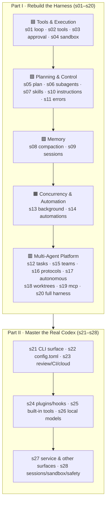

[English](./README.en.md) | [中文](./README.md)

[](https://github.com/moonaiai/learn-codex/actions/workflows/ci.yml)
[](https://moonaiai.github.io/learn-codex/)
[](#learning-path)
[](LICENSE)

# Learn Codex — Rebuild the Codex Harness, One Mechanism at a Time

### 📖 [**Read online → moonaiai.github.io/learn-codex**](https://moonaiai.github.io/learn-codex/)

> A course on rebuilding a Codex-style coding-agent harness in **TypeScript**: **Part I (s01–s20)** progresses from a 30-line Agent Loop to a multi-agent platform; **Part II (s21–s28)** goes deep on the real Codex product surface — the CLI, `config.toml`, plugins, built-in multimodal tools, local models, the service forms, the safety model, and Review/CI/Cloud.
>
> Bilingual (zh/en) · every chapter runnable · built-in offline demo model · interactive docs site

---

## Agency Comes from the Model. An Agent Product = Model + Harness.

Before writing any code, one thing has to be clear.

**Agency — the capacity to perceive, reason, and act — comes from model training, not from external code orchestration.** But a working agent product needs both the model and the harness. The model is the driver. The harness is the vehicle. This repository teaches you to build the vehicle.

Many people think "building an agent" means dragging workflow nodes around, chaining prompts, and stacking if-else routing. That isn't an agent — it's wedging an LLM into a Rube Goldberg machine as a glorified completion node. Intelligence can't be assembled from glue code; it can only be trained. What we *can* do — and what actually determines whether the product is good — is the **harness**: giving the model hands, eyes, a workspace, and a set of boundaries.

```
Harness = Tools + Knowledge + Context + Action Interfaces + Permissions

    Tools:       shell, read/write files, apply_patch, search, browser, MCP
    Knowledge:   AGENTS.md, skills, project docs, API specs
    Context:     compaction, memory, subagent isolation, task systems
    Action:      CLI commands, API calls, UI interactions, scheduled tasks
    Permissions: sandbox isolation, approval policies, trust boundaries, feature flags
```

The model decides; the harness executes. The goal here is not to "clone Codex" — it's to make you genuinely understand **how a tool like Codex is built**, by taking the vehicle apart to the screws and putting it back together. These design patterns generalize to any domain.

### Why Codex

Because Codex is one of the most restrained, most complete agent harness implementations available. Its cleverness comes not from any trick but from what it *doesn't* do: it doesn't try to think for the model, it doesn't impose rigid workflows — it gives the model tools, context management, and permission boundaries, then gets out of the way. Stripped down, Codex is:

```
Codex = one agent loop (the Responses API)
      + a set of tools (shell, apply_patch, web_search, view_image, browser_use…)
      + the approval_policy × sandbox_mode safety model
      + runtime configuration via AGENTS.md and config.toml
      + update_plan, skills, context compaction, session rollouts
      + subagents, a task system, worktree isolation, an MCP bridge
      + plugins, local models, service forms, cloud tasks…
```

The agent itself? A GPT-series model, trained by OpenAI. The harness didn't make the model smart — it already was; the harness just gave it hands and eyes. **The best agent products come from engineers who understand that their job is the harness, not the intelligence.**

---

## The Core Pattern

```
                        THE AGENT LOOP (Responses API)
                        ==============================

    User --> input[] --> Model --> output items
                                        |
                              any function_call ?
                               /                    \
                            yes                       no
                            |                          |
                run the tool → feed a          print the final text
                function_call_output back      exit the loop
                            └────────── loop continues ──────────┘

    The model decides when to call tools and when to stop;
    the harness just executes and feeds results back.
    This repo teaches you to build everything around this loop.
```

```ts
// s01's minimal kernel — every later chapter layers exactly one mechanism on top
async function agentLoop(input: unknown[]): Promise<void> {
  for (;;) {
    const output = await callModel(input);          // Responses API
    input.push(...output);
    const calls = output.filter((i) => i.type === "function_call");
    if (calls.length === 0) return;                  // no more tool calls → done
    for (const call of calls) {
      const result = runTool(call);                  // the harness executes
      input.push({ type: "function_call_output", call_id: call.call_id, output: result });
    }
  }
}
```

---

## Learning Path



## All Chapters

**Part I · Rebuild the Harness (s01–s20)** — one mechanism per chapter, compounding.

| Ch | Topic | What you build | Layer |
|----|-------|----------------|-------|
| [s01](s01_agent_loop/) | Agent Loop | the minimal loop driving the Responses API | 🟦 |
| [s02](s02_tool_use/) | Tool Use | a tool registry + Codex's apply_patch format | 🟦 |
| [s03](s03_approval/) | Approval | the `approval_policy` gate | 🟦 |
| [s04](s04_sandbox/) | Sandbox | `sandbox_mode` + Seatbelt/Landlock isolation | 🟦 |
| [s05](s05_plan_tool/) | Plan Tool | a live `update_plan` checklist | 🟩 |
| [s06](s06_subagents/) | Subagents | clean-context subtask delegation | 🟩 |
| [s07](s07_skills/) | Skills | on-demand skill loading | 🟩 |
| [s08](s08_context_compact/) | Context Compaction | automatic context compaction | 🟪 |
| [s09](s09_memory_sessions/) | Memory & Sessions | rollout persistence + the resume/fork/archive lifecycle | 🟪 |
| [s10](s10_instructions/) | Instructions | runtime assembly from `AGENTS.md` + `config.toml` | 🟩 |
| [s11](s11_error_recovery/) | Error Recovery | a classified retry strategy | 🟩 |
| [s12](s12_task_system/) | Task System | a shared task board | 🟥 |
| [s13](s13_background_tasks/) | Background Tasks | async background execution | 🟧 |
| [s14](s14_automations/) | Automations | scheduled / triggered runs | 🟧 |
| [s15](s15_agent_teams/) | Agent Teams | teammate mailboxes | 🟥 |
| [s16](s16_team_protocols/) | Team Protocols | coordination message contracts | 🟥 |
| [s17](s17_autonomous_agents/) | Autonomous Agents | self-claiming workers | 🟥 |
| [s18](s18_worktree_isolation/) | Worktree Isolation | git worktree isolation (the Codex Cloud model) | 🟥 |
| [s19](s19_mcp_servers/) | MCP Servers | an MCP tool bridge | 🟥 |
| [s20](s20_full_harness/) | The Full Harness | every mechanism integrated into one loop | 🟥 |

**Part II · Master the Real Codex (s21–s28)** — every shipping surface, verified against the real `codex` CLI.

| Ch | Topic | What you master |
|----|-------|-----------------|
| [s21](s21_codex_cli/) | The Codex CLI Surface | subcommands, slash commands, prompts, reasoning effort, search/image, auth |
| [s22](s22_config_toml/) | config.toml in Depth | providers, wire_api, sandbox_workspace_write, profiles, mcp_servers & precedence |
| [s23](s23_review_ci_cloud/) | Review, CI & Cloud | `codex review`, headless `codex exec --json`, codex-action, Codex Cloud |
| [s24](s24_plugins_apps_hooks/) | Plugins, Apps & Hooks | the plugin marketplace, apps, lifecycle hooks, Codex-as-MCP-server |
| [s25](s25_builtin_tools/) | Tools Beyond the Shell | `web_search`, image input, `image_generation`, `browser_use`, `computer_use` |
| [s26](s26_local_models_providers/) | Local Models & Custom Providers | `--oss`, ollama/lmstudio, `model_providers` & `wire_api` |
| [s27](s27_codex_service_surfaces/) | Codex as a Service & Other Surfaces | `mcp-server`, `app-server`, remote TUI, desktop app, IDE, ChatGPT/GitHub |
| [s28](s28_sessions_sandbox_safety/) | Sessions, Sandbox & Safety in Depth | resume/fork/archive, `codex sandbox`, `--add-dir`, bypass modes, guardian, trusted projects, feature flags |

> Every Part II command, flag, config key and feature flag is verified against a real local `codex` CLI (`--help` / `codex features list`); experimental features are marked as such.

---

## How to Read

- **To understand the principles** → read from s01 in order: each chapter's `## The Problem` and `## The Solution` first, then run the offline demo, then `## Into the Codex source` to compare with the real implementation.
- **To look up one mechanism** → jump straight to that chapter; each is self-contained.
- **To use the real Codex** → start with s21 (the CLI) and s22 (config) in Part II.
- **中文读者** → each chapter has a Chinese `README.md`; the docs site has a zh/en toggle in the header.

## Quick Start

**Requirements**: Node.js ≥ 18 (20/22 recommended).

```sh
npm install
```

**Run any chapter** (no API key needed — a built-in offline demo model shows you the full loop):

```sh
npx tsx s01_agent_loop/code.ts
npx tsx s24_plugins_apps_hooks/code.ts
# …any sNN_*/code.ts
```

**Run against a real model** (optional): `cp .env.example .env` and fill in `OPENAI_API_KEY`, or inject it inline:

```sh
OPENAI_API_KEY=sk-... npx tsx s01_agent_loop/code.ts
```

**Offline smoke-test every chapter**:

```sh
npm test          # runs all 28 chapters, same as CI
```

## The Docs Site

**🔗 [https://moonaiai.github.io/learn-codex/](https://moonaiai.github.io/learn-codex/)** — open and read, nothing to install.

The docs site is a static Next.js app. At build time a script extracts the root chapters into JSON and renders them, with **per-chapter architecture diagrams, an interactive Agent-Loop simulator, a code viewer, per-chapter diffs, and layer/timeline views**.

Run it locally:

```sh
cd web
npm install
npm run dev      # → http://localhost:3000 (redirects to /en)
npm run build    # static export to web/out
```

## Project Structure

```
learn-codex/
├── s01_agent_loop/  …  s28_sessions_sandbox_safety/
│       # 28 chapters: README.md (zh) + README.en.md + code.ts + images/*.svg
├── web/                                   # Next.js interactive docs site
│   └── scripts/extract-content.ts         # build-time chapter → JSON extractor
├── scripts/run-all.ts                     # offline smoke test for all chapters
├── spec/TEMPLATE.md                       # chapter authoring spec (read before contributing)
└── .github/workflows/
    ├── ci.yml                             # typecheck + chapter smoke + site build
    └── deploy.yml                         # deploy the docs site to GitHub Pages
```

## What Makes It Different

- **Runnable, not screenshots**: every `code.ts` runs standalone, with a built-in **offline scripted model** — you can watch the full "call → execute → feed back" loop with no API key, and all 28 chapters are green in CI.
- **Faithful to the real Codex**: mechanisms are grounded in the open-source [`openai/codex`](https://github.com/openai/codex) (`codex-rs`), and the product surface in a real local CLI — nothing invented.
- **Two tracks — rebuild & master**: Part I teaches you to *build* it, Part II to *use*, *configure* and *extend* it.
- **Bilingual**: content and docs site in Chinese and English.

## Acknowledgements

This project's organization and presentation are heavily inspired by [`shareAI-lab/learn-claude-code`](https://github.com/shareAI-lab/learn-claude-code), which pioneered teaching the agent harness through "progressive reimplementation + runnable code + an interactive site"; this repo brings the same method to the Codex ecosystem. All Codex concepts are grounded in OpenAI's official open-source [`openai/codex`](https://github.com/openai/codex) and the real CLI.

## Contributing

PRs welcome. Before adding or changing a chapter, read [`spec/TEMPLATE.md`](spec/TEMPLATE.md) and make sure `npx tsc --noEmit`, `npm test`, and `cd web && npm run build` all pass.

## License

[MIT](LICENSE)
