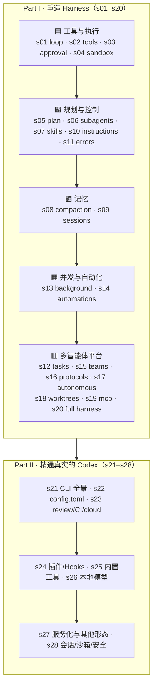

[English](./README.en.md) | [中文](./README.md)

[](https://github.com/moonaiai/learn-codex/actions/workflows/ci.yml)
[](https://moonaiai.github.io/learn-codex/)
[](#%E5%AD%A6%E4%B9%A0%E8%B7%AF%E5%BE%84)
[](LICENSE)

# Learn Codex —— 把 Codex 的 Harness 一个机制一个机制地造出来

> 一门用 **TypeScript** 重造 Codex 风格编码 agent harness 的课程：**Part I（s01–s20）** 从 30 行的 Agent Loop 递进到一个多智能体平台；**Part II（s21–s28）** 把真实 Codex 的产品面（CLI、`config.toml`、插件、多模态工具、本地模型、服务化、安全模型、Review/CI/Cloud）逐一讲透。
>
> 双语（中/英）· 每章可运行 · 内置离线演示模型 · 交互式文档站

---

## 智能来自模型，而 Agent 产品 = 模型 + Harness

动手之前，有一件事必须先说清楚。

**「智能体能力」（agency）——感知、推理、行动的能力——来自模型训练，不来自外围代码的编排。** 但一个能用的 agent 产品，需要模型，也需要 harness。模型是司机，harness 是车。本仓库教你造的是那辆车。

很多人把「做 agent」理解成拖拽工作流、拼接 prompt 链、堆 if-else 路由——那不是 agent，那是把 LLM 当高级补全节点塞进鲁布·戈德堡机械。智能堆不出来，只能靠训练；我们能做的、也是真正决定产品好坏的，是 **harness**：给模型一双手、一双眼睛、一个工作区，和一套边界。

```
Harness = 工具 + 知识 + 上下文 + 行动接口 + 权限

    工具:      shell、读写文件、apply_patch、搜索、浏览器、MCP
    知识:      AGENTS.md、技能、项目文档、API 规范
    上下文:    压缩、记忆、子代理隔离、任务系统
    行动:      CLI 命令、API 调用、UI 操作、定时任务
    权限:      沙箱隔离、审批策略、信任边界、feature flags
```

模型负责决策，harness 负责执行。本仓库的目标不是「复刻一个 Codex」，而是让你**真正理解 Codex 这样的工具是怎么造出来的**——把这辆车拆到螺丝，再一颗颗装回去。这套设计模式同样适用于任何领域的 agent。

### 为什么是 Codex

因为 Codex 是目前最克制、最完整的 agent harness 实现之一。它的聪明不来自任何奇技淫巧，而来自它**不做什么**：它不试图代替模型思考，不强行规定工作流，而是给模型工具、上下文管理、权限边界——然后让开。剥到底，Codex 就是：

```
Codex = 一个 agent loop（Responses API）
      + 一组工具（shell、apply_patch、web_search、view_image、browser_use…）
      + approval_policy × sandbox_mode 的安全模型
      + AGENTS.md 与 config.toml 的运行时配置
      + update_plan、技能、上下文压缩、会话 rollout
      + 子代理、任务系统、worktree 隔离、MCP 桥接
      + 插件、本地模型、服务化、云任务…
```

agent 本身？是 GPT 系列模型，由 OpenAI 训练。harness 没有让模型变聪明——模型本来就聪明；harness 只是给了它手和眼睛。**最好的 agent 产品，来自那些清楚「自己的活是 harness，不是智能」的工程师。**

---

## 核心模式

```
                        THE AGENT LOOP（Responses API）
                        ==============================

    User --> input[] --> Model --> output items
                                        |
                              有没有 function_call ?
                               /                    \
                            有                        没有
                            |                          |
                     执行工具 → 以 function_call_output    打印最终文本
                     喂回 input[]                        退出循环
                            └────────── 循环继续 ──────────┘

    模型决定何时调工具、何时停；harness 只负责执行并喂回结果。
    本仓库教你围绕这个 loop，逐层造出支撑它的全部机制。
```

```ts
// s01 的最小内核 —— 后面每一章都在它之上叠加恰好一个机制
async function agentLoop(input: unknown[]): Promise<void> {
  for (;;) {
    const output = await callModel(input);          // Responses API
    input.push(...output);
    const calls = output.filter((i) => i.type === "function_call");
    if (calls.length === 0) return;                  // 模型不再调工具 → 完成
    for (const call of calls) {
      const result = runTool(call);                  // harness 执行
      input.push({ type: "function_call_output", call_id: call.call_id, output: result });
    }
  }
}
```

---

## 学习路径



## 全部章节

**Part I · 重造 Harness（s01–s20）** — 每章一个机制，层层叠加。

| 章 | 主题 | 你会造出什么 | 层 |
|----|------|--------------|----|
| [s01](s01_agent_loop/) | Agent Loop | 驱动 Responses API 的最小循环 | 🟦 |
| [s02](s02_tool_use/) | Tool Use | 工具注册表 + Codex 的 apply_patch 补丁格式 | 🟦 |
| [s03](s03_approval/) | Approval | `approval_policy` 审批门 | 🟦 |
| [s04](s04_sandbox/) | Sandbox | `sandbox_mode` + Seatbelt/Landlock 隔离 | 🟦 |
| [s05](s05_plan_tool/) | Plan Tool | `update_plan` 实时计划清单 | 🟩 |
| [s06](s06_subagents/) | Subagents | 干净上下文的子任务委派 | 🟩 |
| [s07](s07_skills/) | Skills | 按需加载的技能系统 | 🟩 |
| [s08](s08_context_compact/) | Context Compaction | 上下文自动压缩 | 🟪 |
| [s09](s09_memory_sessions/) | Memory & Sessions | rollout 持久化 + resume/fork/archive 全生命周期 | 🟪 |
| [s10](s10_instructions/) | Instructions | `AGENTS.md` + `config.toml` 运行时组装 | 🟩 |
| [s11](s11_error_recovery/) | Error Recovery | 分类重试策略 | 🟩 |
| [s12](s12_task_system/) | Task System | 共享任务板 | 🟥 |
| [s13](s13_background_tasks/) | Background Tasks | 后台异步执行 | 🟧 |
| [s14](s14_automations/) | Automations | 定时/触发型任务 | 🟧 |
| [s15](s15_agent_teams/) | Agent Teams | 队友信箱 | 🟥 |
| [s16](s16_team_protocols/) | Team Protocols | 协作消息契约 | 🟥 |
| [s17](s17_autonomous_agents/) | Autonomous Agents | 自主认领任务 | 🟥 |
| [s18](s18_worktree_isolation/) | Worktree Isolation | git worktree 隔离（Codex Cloud 模式） | 🟥 |
| [s19](s19_mcp_servers/) | MCP Servers | MCP 工具桥接 | 🟥 |
| [s20](s20_full_harness/) | The Full Harness | 所有机制集成进一个循环 | 🟥 |

**Part II · 精通真实的 Codex（s21–s28）** — 对照真实 `codex` CLI 讲清每个已发布的形态。

| 章 | 主题 | 你会吃透什么 |
|----|------|--------------|
| [s21](s21_codex_cli/) | Codex CLI 全景 | 子命令、斜杠命令、prompts、推理档位、联网/图片、登录鉴权 |
| [s22](s22_config_toml/) | config.toml 完全指南 | providers、wire_api、sandbox_workspace_write、profiles、mcp_servers 与优先级解析 |
| [s23](s23_review_ci_cloud/) | Review、CI 与 Cloud | `codex review`、无头 `codex exec --json`、codex-action、Codex Cloud |
| [s24](s24_plugins_apps_hooks/) | 插件、Apps 与 Hooks | 插件市场、apps、生命周期 hooks、Codex-as-MCP-server |
| [s25](s25_builtin_tools/) | Shell 之外的内置工具 | `web_search`、图片输入、`image_generation`、`browser_use`、`computer_use` |
| [s26](s26_local_models_providers/) | 本地模型与自定义 Provider | `--oss`、ollama/lmstudio、`model_providers` 与 `wire_api` |
| [s27](s27_codex_service_surfaces/) | 服务化与其他形态 | `mcp-server`、`app-server`、远程 TUI、桌面 App、IDE、ChatGPT/GitHub 集成 |
| [s28](s28_sessions_sandbox_safety/) | 会话、沙箱与安全进阶 | resume/fork/archive、`codex sandbox`、`--add-dir`、bypass 模式、guardian、trusted projects、feature flags |

> 每个 Part II 章节的命令、flag、配置项、特性开关，都对照本机真实 `codex` CLI（`--help` / `codex features list`）核实过；实验性特性会明确标注。

---

## 怎么读

- **想搞懂原理** → 从 s01 顺着读，每章先读 `## 问题` 和 `## 解决方案`，再跑一遍离线 demo，最后看 `## 深入 Codex 源码` 对照真实实现。
- **想查某个机制** → 直接跳到对应章节；每章自包含，可独立阅读。
- **想用真实 Codex** → 从 Part II 的 s21（CLI）和 s22（config）入手。
- **英语读者** → 每章都有 `README.en.md`；文档站右上角可切中/英。

## 快速开始

**环境**：Node.js ≥ 18（推荐 20/22）。

```sh
npm install
```

**运行任意章节**（无需 API key，走内置离线演示模型，能看清整个 loop）：

```sh
npx tsx s01_agent_loop/code.ts
npx tsx s24_plugins_apps_hooks/code.ts
# …任意 sNN_*/code.ts
```

**用真实模型跑**（可选）：`cp .env.example .env` 填入 `OPENAI_API_KEY`，或命令行注入：

```sh
OPENAI_API_KEY=sk-... npx tsx s01_agent_loop/code.ts
```

**离线冒烟测试全部章节**：

```sh
npm test          # 28 章全跑一遍，CI 同款
```

## 在线文档站

文档站是一个 Next.js 静态站，构建时用脚本把根目录章节抽成 JSON 再渲染，包含：**每章的架构图、可交互的 Agent Loop 模拟器、代码查看器、章节间 diff 对比、分层/时间线视图**。

```sh
cd web
npm install
npm run dev      # → http://localhost:3000（重定向到 /en）
npm run build    # 静态导出到 web/out
```

## 项目结构

```
learn-codex/
├── s01_agent_loop/  …  s28_sessions_sandbox_safety/
│       # 28 个章节：README.md（中文）+ README.en.md + code.ts + images/*.svg
├── web/                                   # Next.js 交互式文档站
│   └── scripts/extract-content.ts         # 构建期把章节抽成 JSON
├── scripts/run-all.ts                     # 全章节离线冒烟测试
├── spec/TEMPLATE.md                       # 章节作者规范（贡献前必读）
└── .github/workflows/
    ├── ci.yml                             # 类型检查 + 章节冒烟 + 站点构建
    └── deploy.yml                         # 部署文档站到 GitHub Pages
```

## 它有何不同

- **可运行，不是截图**：每章 `code.ts` 独立可跑，且内置**离线脚本化模型**——没有 API key 也能看到完整的「调用→执行→喂回」循环，CI 里 28 章全绿。
- **忠于真实 Codex**：机制对照开源的 [`openai/codex`](https://github.com/openai/codex)（`codex-rs`），产品面对照本机真实 CLI，不臆造。
- **重造 + 精通双线**：Part I 让你会**造**，Part II 让你会**用**、会**配**、会**扩展**。
- **中英双语**：内容与文档站均双语。

## 致谢

本项目在组织形式与呈现方式上深受 [`shareAI-lab/learn-claude-code`](https://github.com/shareAI-lab/learn-claude-code) 启发——它率先用「渐进重造 + 可运行代码 + 交互站点」讲清了 agent harness；本仓库把同样的方法带到了 Codex 生态。所有 Codex 概念以 OpenAI 官方开源的 [`openai/codex`](https://github.com/openai/codex) 与真实 CLI 为准。

## 贡献

欢迎 PR。新增或修改章节前请阅读 [`spec/TEMPLATE.md`](spec/TEMPLATE.md)，并确保 `npx tsc --noEmit`、`npm test`、`cd web && npm run build` 全部通过。

## License

[MIT](LICENSE)
