# Harness 工程：把模型的一次决定变成世界上的一个动作

这是一份 harness 工程的长文笔记：**agent = model + harness**，model 只负责生成一个决定，剩下的一切——感知、行动、执行、验证、约束——全部是 harness 的工作。读完之后，你应该能在任何一个陌生的 agent 系统里，指出这五件事分别是怎么做的、为什么必须这么做，以及做错了会在哪里出事。Codex 是本文引用最多的工业样本，具体键名和版本对照见文末说明。

---

## 开篇 · 一个决定如何变成一个动作

### 落差与分工

大模型的输出只有一种形态：一段文本。哪怕它说"我现在要运行 `npm test`"，说完也就结束了——它不会真的去跑，看不到输出，更没法基于输出继续推理。你可以手动把命令粘进终端，再把结果粘回对话框，让它接着干；下一条命令出来，你再跑一遍，再粘一遍。

这中间的每一个来回，都是一个人在当胶水层。把这层胶水自动化，就是 harness 的全部工作：模型决定做什么，harness 去执行，把结果喂回去，重复，直到模型不再要求做任何事。

写成一行代码大概三十行就够了。但这三十行跑在真实的机器上、真实的代码仓库里、真实的一个小时长的任务上时，会在每一个方向上碎掉：命令会毁掉不该毁的文件，上下文会在第四十轮塞满，进程崩了一小时的工作没有任何记录，API 返回 429 整个循环退出，`npm install` 跑了三分钟模型在按秒计费地空转，两个并行的任务改同一个文件互相覆盖，模型在第三步忘了第一步说过"不要动 lock 文件"。

harness 工程要做的，就是把这些逐一变成设计好的、可解释的行为。它不是 prompt 工程——提示词写得再好，也不能阻止一条被批准的命令删掉磁盘。它也不是"把一堆工具函数堆进聊天机器人"——那解决的是能力问题，不是运行时问题。它是一套运行时：**在模型的一次决定和世界上真实发生的一个动作之间，插入一层可恢复、可审计、可限权的机制。**

责任的分工是干净的：**model 只产出决定，不具备任何执行力、记忆力或权威性；harness 拥有全部的执行力、记忆力和裁决权，但不产出任何决定。**后面每一次看到"这件事该让模型做还是让 harness 做"的问题，答案都能从这条分工线上直接推出来。

### 三条贯穿始终的约束

后面所有的设计，都在这三条之下。它们不是格言，是可以用来否决方案的判据。

**循环不改形状。** 加一个新机制，是在既有的固定位置上挂一个钩子，不是另写一套控制流。判断标准很硬：如果新需求让你想在主循环里加一个 `if`，八成是挂错了地方。这条约束的价值在扩张期才显现——加第二个机制和加第二十个机制的难度应该差不多。

**决策权和执行权分离。** 模型产出的是结构化的意图信号；harness 负责执行、拦截、记录。模型对自己动作的风险评估不具备任何权威性——它会误判，会被读进来的内容带偏，会对含糊指令做激进解读。所以"这次能不能做"这个问题，必须由 harness 回答，而且回答的依据不能是模型的自我申报。

**看见不等于强制。** 这条最容易被忽略。让 harness"知道"模型的计划，和让 harness"能拒绝"模型的非法动作，是两种完全不同的能力，需要两套完全不同的机制。把可见性机制当成约束机制用，是 agent 系统里最常见的一类安全错觉。

### 五个环节

把 harness 要做的"剩下的一切"拆开，会发现它总是在完成同一个动作生命周期里的五件事。一个决定从产生到落地，必经这五关：模型先要**感知**到点什么才能形成决定；决定要采取什么**行动**，这个决定要先变成一个可判定的结构化请求；请求要在真实世界里被**执行**出来，而现实世界是异步的、会失败的，执行必须扛住这些意外并且失败了能续上；执行之前或之中，要有**验证**判断这个动作该不该发生，因为模型自己对此不具备权威判断；即使验证出了错或者被绕过，也要有硬**约束**兜住损失、限定波及范围。

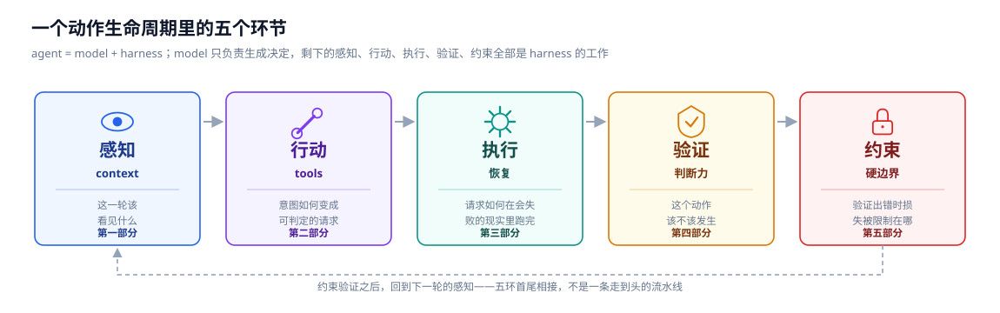

| 环节 | 机制 | 回答的问题 | 对应部分 |
|---|---|---|---|
| 感知 | context | 模型这一轮该看见什么 | 第一部分 |
| 行动 | tools | 意图如何变成可判定的请求 | 第二部分 |
| 执行 | 恢复 | 请求如何在会失败的现实里跑完 | 第三部分 |
| 验证 | 判断力 | 这个动作该不该发生 | 第四部分 |
| 约束 | 硬边界 | 验证出错或被绕过时，损失被限制在哪 | 第五部分 |

这五件事不是五个独立的模块，是同一个动作生命周期里的五个必经关卡——少了任何一关，系统就会在那个位置上失守。它们全都长在同一个循环上：

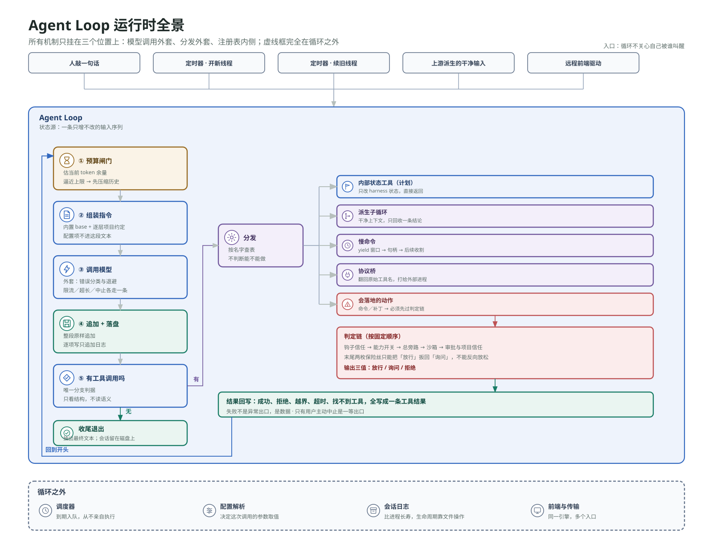

一次运行的入口可以是人敲的一句话，可以是定时器到点新开的一条空白线程，可以是定时器追加回一条旧线程，也可以是某个执行者派生出来的一份干净输入——循环本身不关心自己是被谁叫醒的。进循环之后，先估算上下文余量、组装指令、调模型；返回结果原样追加进那条唯一的输入序列；再看这一轮有没有工具调用——没有就收尾退出，有就按工具身份分流，会碰到真实世界的那些要先过一条判定链才允许落地；任何一层说"不"都写成一条普通的工具结果喂回去，循环继续，只有用户主动中止是一等的出口。

这张图是全文的骨架索引，细节在接下来五个部分逐一展开。

---

## 第一部分 · 感知——决定模型这一轮该看见什么

上下文窗口有限，这件事会用好几种完全不同的方式咬你：计划只存在模型脑子里，做着做着跑偏；一条支线的几十轮中间过程淹没了主线；项目规范一次性塞进系统提示，每轮都在烧无关 token；历史只增不减，直到 API 拒绝下一轮请求；进程一关，这一切又全部消失，明天没法接着干。

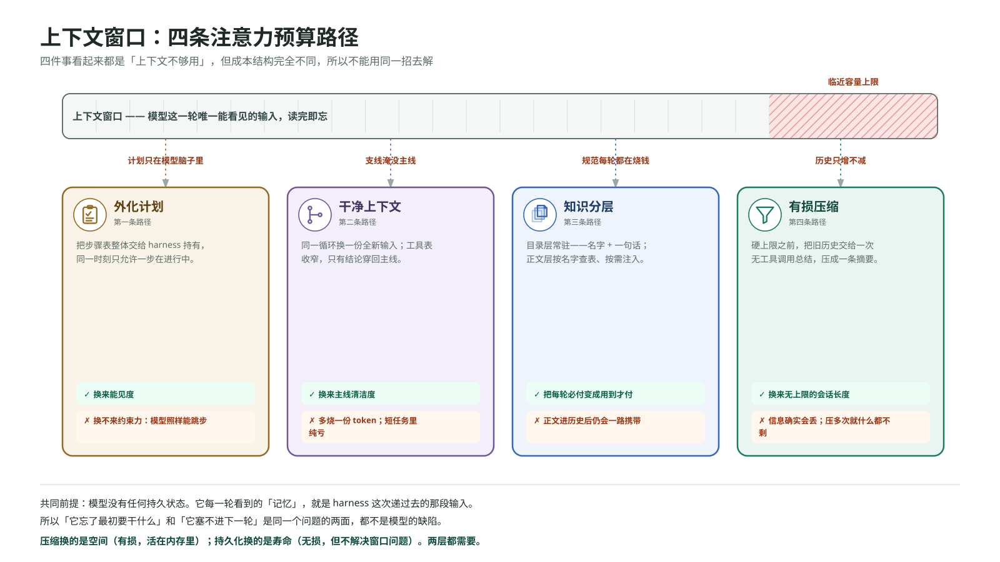

这些事看起来都是"上下文不够用"，但成本结构完全不同：有的是可见性问题，有的是隔离问题，有的是有损压缩问题，有的根本不是本轮窗口的问题，而是"这一轮结束后，什么该被记下来供未来的自己看见"——这把会话的持久化也并进了感知的范畴，因为会话就是未来那一轮的感知输入。用同一招去解这几件事，只会把真正有效的指令稀释在噪音里。

### 提示词与配置：两条分离的路径

硬编码一行系统提示在最小实现里够用。agent 长大之后会撞上三件事：换个项目要重写整段提示，不知道哪些该改哪些该留；模型、推理档位、审批策略、沙箱模式全写死在源码里，想换个模型得改代码；项目自己的约定（提交信息用祈使句、收尾前先跑状态检查）没地方放，只能塞进 harness，一换项目就错。

问题不在提示词写得不好，在于 **harness 把"一段字符串"和"一组配置"混成了一件事**。它们是两条独立的路径，处理方式完全不同：

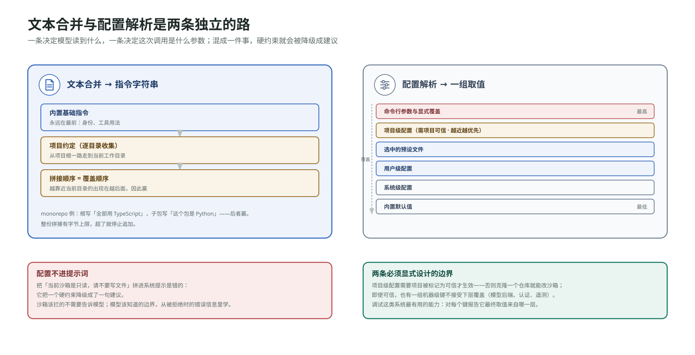

**文本合并**决定模型读到什么。内置的基础指令永远在最前面，声明身份和工具用法；项目级的约定文件存在就追加在后面。这条路的产物是一个字符串，直接进请求的指令字段。

**配置解析**决定这次调用是什么参数。用哪个模型、推理多深、审批档位、沙箱档位、后端指向谁。这条路的产物是一组取值，**它们不进提示词**。

把这两条路混在一起的典型症状，是有人把配置项的内容拼进系统提示——"当前沙箱模式是只读，请不要尝试写文件"。这句话是错的，不是因为它没用，而是因为它把一个硬约束降级成了一句建议。沙箱该拦的东西不需要告诉模型，模型该知道的边界应该通过工具调用被拒绝时的错误信息学到。**配置约束的执行不该依赖模型读懂了配置。**

文本合并这条路有一个细节值得看：Codex 的项目级指令是逐目录收集的，从项目根一路走到当前工作目录，每一层最多取一个文件，然后从根往下依次拼接。**越靠近当前目录的约定出现在越后面，因此覆盖更上层的**——一个 monorepo 里根目录写"所有代码用 TypeScript"，某个子包写"这个包是 Python 的"，后者会赢。全局层还有一个优先级更高的覆盖文件名，存在就用它、不存在才用常规名，这是给"我想临时改掉全局约定又不想丢掉原文件"准备的。

配置解析这条路的核心是一条固定的优先级链：命令行参数和显式覆盖，项目级配置（仅限被标记为可信的项目），选中的预设文件，用户级配置，系统级配置，内置默认值。这条链有几处值得学：**项目级配置需要项目可信才生效**（否则一个克隆下来的仓库就能把沙箱调到全放开）；**项目级配置有一个不能覆盖的键集合**（模型后端指向、认证方式、遥测设置——我信任这个仓库调整它自己的构建命令，不代表我信任它把我的 API 流量导去别处）；调试这类系统最有用的能力是**对每个键报告它最终取值来自哪一层**，这不是锦上添花，应该和解析器一起设计。

预设（profile）这一层的存储形态本身也漂移过：Codex 早期是主配置文件里的一个内联表，现在是独立文件，顶层的预设选择器也被去掉了。改动的理由不难推测——内联表会让主配置文件随预设数量膨胀，而且预设和根配置挤在同一个文件里，"这个键到底来自哪一层"的排查会变困难；拆成独立文件之后，每个预设自己是一份完整可读的配置。

### 知识分层：目录与正文

项目里有一套组件规范、一份 SQL 风格指南、一套提交信息格式，最直接的做法是全部拼进系统提示——四千行系统提示，每一轮调用都带着，改一个 CSS 颜色也要带着 SQL 风格指南。人和文档打交道不是这样的：你不会把整个 wiki 背下来，你只知道"有这么一份规范"，用到的时候去翻。

把这个模式做成机制，需要把知识拆成两层。**目录层**是每份知识的名字和一句话描述，常驻在系统提示里，每份知识几个 token，让模型知道"存在这么一份东西，什么情况下该用"。**正文层**是完整内容，几千 token，不在系统提示里，而是在模型判断任务匹配时通过一次工具调用注入进来，作为一条普通的工具结果进入历史。

这个设计的核心是**把一份成本从"每轮必付"变成了"用到才付"**。几个实现细节值得记：加载走注册表按名字查找，不走文件路径——给模型一个"读取这个路径的知识文件"的工具，等于开了一个路径遍历的口子；正文注入之后就是历史里的一条普通项，会跟着对话一路携带，直到被压缩掉或者会话结束，这意味着按需加载省的是"不需要它的那些会话"的钱，不是"需要它的那次会话之后"的钱。

这一层和"项目常驻指令"是互补关系：**永远适用的东西走常驻层**（这个项目怎么构建），**某类任务才用得上的东西走按需层**（怎么做代码审查）。把按需知识焊进常驻层，就是回到四千行系统提示；把常驻约定做成按需加载，模型会在没意识到该加载的时候违反它们。

### 外化计划：只换能见度

给 agent 一个十步的重构任务，它做到第三步就开始即兴发挥——因为第四到第十步早就被前三步产生的工具输出挤出了注意力。问题不在模型不会拆任务，在于**拆解的结果只存在于模型内部**，harness 看不见它，跑偏的时候没有任何抓手。

解法是给模型一个专门用来声明计划的工具，它不做任何实际工作，唯一的作用是把计划从模型内部搬到 harness 里。几个具体设计决定：**整体替换，不做增量合并**——模型每次发完整列表，harness 整体替换掉旧的，用一点冗余换掉一整类状态同步 bug，在 agent 系统里几乎总是划算的；**状态只有三个，同一时刻只允许一步进行中**——这逼着模型在每一步开始前做一次显式的、对 harness 可见的选择；**它走 harness 内部路径，不进沙箱也不过审批**，因为它不碰任何外部世界。

这一节真正的价值在于一个区分：**这个机制增加的是可见性，不是约束力。**模型完全可以声明一份漂亮的计划，然后跳过第三步直接做第五步——计划工具不会拒绝它，因为它压根没有拒绝的能力。要真正强制顺序，需要一个能说"不"的东西，那是另一套机制（第三部分会讲到它在多执行者场景下的形态）。**在任何 agent 系统里，看到一个"让 harness 知道模型意图"的机制时，都该追问一句：它有拒绝权吗？**

### 干净上下文：支线隔离

agent 在修一个 bug，为了搞清楚一个函数被谁调用，读了三十个文件、跑了二十条搜索命令。这些中间过程和"修好这个 bug"这个目标基本无关，但全都躺在主线程里占着位置。人遇到这种情况的做法是另开一个终端去追，追完了只把结论记下来，回到原来的地方接着干。

实现上比听起来简单得多：**同一个循环，用一份全新的输入再进一次。**父循环调用一个委派工具，harness 构造一个只含"请完成这件事"的干净输入，跑同一套循环逻辑，跑完之后只把最终的结论文本作为工具结果交回父循环，中间那几十轮对话历史整份丢弃。

几个点需要明确：**子执行者不是另一种 agent**，它跑的是同一套循环代码，价值百分之百来自上下文边界，不来自"多了一个智能体"——为了"让专门的 agent 做专门的事"而拆分，通常只是在增加成本；**丢掉的只是对话历史，不是副作用**，子执行者在文件系统上做的事全都留在工作目录里；**过境的东西必须被显式说出来**，只有那段结论文本会穿过边界,子执行者看到的一切细节父执行者一概不知道，所以任务描述里"我需要你回答什么"必须写清楚。

代价也要说清楚：每个执行者独立烧 token，委派一次的总成本高于不委派，它换来的是主线程的清洁度，这个清洁度只有在任务足够长的时候才值回票价，短任务里委派是纯亏损。这里只讨论"给一份干净的感知输入"这一个动作本身；如果这个支线需要跟主线并行、持续存在、中途互传信息，那就不再是一次性委派，而是第三部分要讲的协作原语。

### 上下文压缩：切分点与代价

长会话的失败方式很固定：agent 读过几个大文件、跑过几十条命令，某一轮突然收到"输入超过最大上下文长度"，任务停在那里。责任要归对位置：模型本身没有任何持久状态，它每一轮看到的"记忆"就是 harness 这次递过去的那段输入，所以"agent 忘了最初要干什么"和"agent 塞不进下一轮"是同一个问题的两面，都不是模型的缺陷，而是 harness 默认把"记住一切"当成了免费。

腾地方有四种想得到的做法。**直接截断最早的若干轮**：任务目标通常就在最早那几轮里，截断把最重要的信息排在最先被删的位置，方向是反的。**换一个更大窗口的模型**：这不是解法，是把触发点往后推，而且长输入本身会降低模型对中段内容的利用率。**把历史写进外部存储按需检索**：对 coding agent 是错的匹配——上下文里绝大部分是彼此高度相关、时序敏感的工具输出，检索出来的零散片段拼不成一个能接续工作的状态。**有损摘要**：把旧历史交给模型总结成一小段替换原文，承认信息会丢，但丢的方式可控——当前目标、动过哪些文件、还有什么没做完，这几样恰好能压进几百个 token。这是唯一在成本和保真度之间做出合理取舍的做法，也是主流实现的共同选择。

选定摘要之后，三个细节任何一个定错都会出问题。**一、什么时候压。**闸门放在每次调用模型之前，而不是收到超长错误之后——总结本身也是一次模型调用，它的输入是那一大段旧历史，也要装进同一个窗口，等窗口已经满了再压，这次总结请求也发不出去，agent 就彻底卡死了。判断"逼近上限"最好用 API 真实返回的用量而不是估算，**估算和精确计数的差别不在精度本身，在于它允许你把安全边际压到多小。**

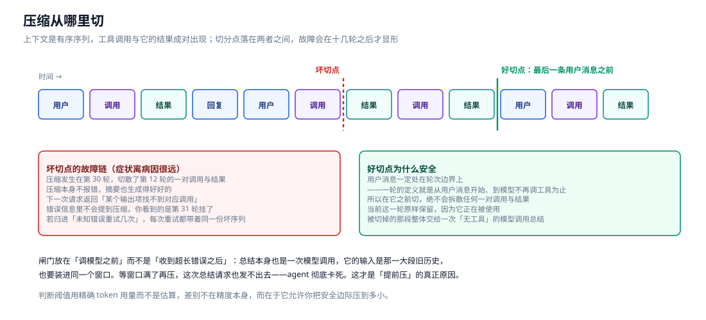

**二、从哪里切。**上下文是有序序列，工具调用和它的返回结果成对出现，切分点落在两者中间，模型会看到一个没有对应调用的悬空结果。这个故障的典型性在于"症状离病因很远"：压缩发生在第三十轮切散了第十二轮的一对调用与结果，压缩本身不报错，摘要也生成得好好的，下一次请求才报"某个输出项找不到对应的调用"，错误信息里完全不提压缩。稳妥的切法是从后往前找最后一条用户消息，在它前面切——用户消息一定处在轮次边界上，这样切绝不会拆散任何一对调用与结果。

**三、摘要怎么生成。**它是另一次不带工具的模型调用，否则模型会在总结的时候开始干活。压缩是一次性支出（贵的是要再读一遍的旧历史），换来的是之后每一轮都不用再传那一大段原文，会话越长越划算，短会话里纯属浪费。Codex 的触发阈值是可配置的 token 数，还提供手动触发命令走同一条路径，压缩前后的生命周期钩子带一个标记区分自动还是手动——这说明"自动和手动是同一条路"这件事被认真对待了。

最后要区分压缩和持久化的分工：**压缩换的是窗口空间，代价是信息有损，产物活在内存里；持久化换的是寿命，记录精确无损，但不解决窗口问题。两层都需要。**

### 会话：持久化的记忆载体

到这里为止，那条输入序列一直只活在内存里，进程一关会话就没了。跑了一小时的长任务不能明天接着干，想回顾改过哪些文件没有记录，想从中间岔一条分支做不到。责任还是在 harness——模型没有持久状态，所有记忆都在上下文里，上下文在内存里，内存随进程消失。

写到哪里、以什么形式写，有三种候选。**一个大 JSON 数组，每次整文件重写**：写入成本随历史长度线性增长，更要命的是崩溃安全性——写到一半进程挂了整份文件解析不出来，丢的不是最后一条消息，是全部。**关系数据库**：有事务、有索引，但本机单人场景要求先跑一个数据库进程、管账号、做迁移，会话日志里常有源代码和密钥，接一个远程库等于让这些东西默认出本机。**只追加的行分隔日志**：每产生一项就序列化成一行追加到文件末尾。

第三种是对的，理由是**这个场景的操作几乎只有五种——追加一行、整段按顺序读回、复制、移动、删除，全都是文件系统的原生操作**，数据库提供的事务、并发写、跨用户 JOIN 一个都没被用到。这是一个可迁移的判断框架：**先列出实际的访问模式，再看哪种存储的原生操作和它对得上，不要从存储技术的能力表倒着选。**什么时候该换？当访问模式变了——多租户、跨机共享、要按人/按时间检索的时候。

写入时机上有一个决定：**项一产生就落盘，不等这一轮结束**，因为崩溃可以发生在任意时刻，逐项写入让磁盘记录始终完整到最后一刻。日志第一行通常是一个头，记录会话 id、工作目录、启动时间，这让恢复时能精确重建会话环境，而不是从对话内容里去猜。Codex 的这些文件放在配置目录下按日期分层的会话目录里，文件名带时间戳和会话 id，归档的会话挪到另一个目录——这个布局本身也在说明前面那条判断：生命周期管理用的是目录操作。

### 会话生命周期：继续、分叉、归档、删除

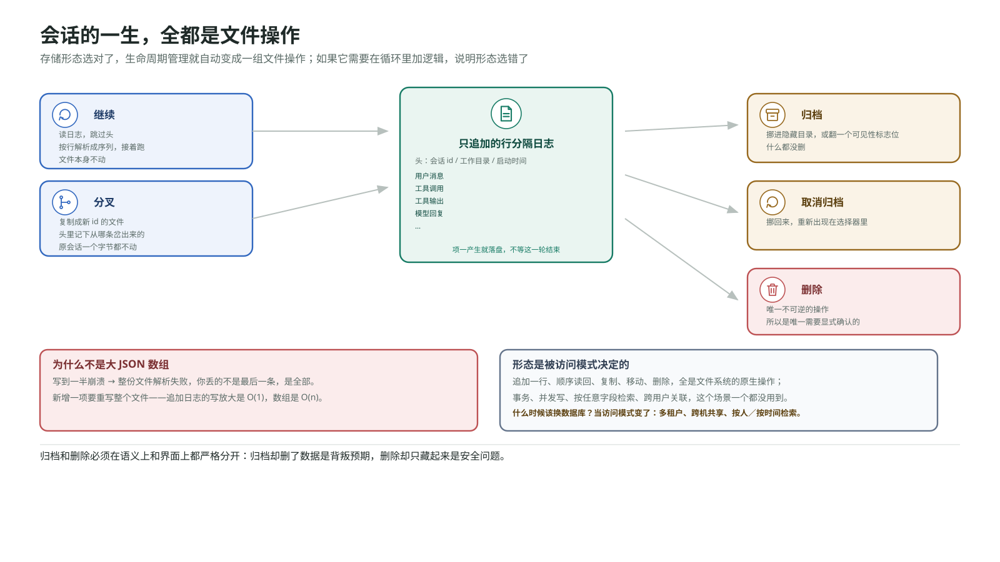

会话能落盘之后立刻出现新问题：会话会越攒越多。需要一个清晰的生命周期模型，而一旦存储形态选对了，这个模型里的每个操作都变成了一次文件操作。**继续**：读日志跳过头，按行解析成序列接着跑，文件本身不动。**分叉**：复制成一个新 id 的文件，头里记下从哪条会话岔出来的，**原会话一个字节都不动**——这是分叉和继续的核心区别，不是"从中间截断走另一条路"，是"复制一份，两条各自演化"。**归档**：挪进隐藏目录或者翻一个可见性标志位，**什么都没删**。**取消归档**：挪回来。**删除**：唯一不可逆的操作，所以是唯一需要显式确认的。

这五个操作没有一个需要改动循环。**一个设计得好的持久化层，会让生命周期管理自动变成一组文件操作；如果生命周期管理需要在循环里加逻辑，说明存储形态选错了。**归档和删除必须在语义上和界面上都严格分开：归档却删了数据是背叛预期，删除却只藏起来是安全问题。

**感知层小结：** 这七个机制解决的都是"上下文不够用"，但成本结构互不相同——目录/正文分层省的是常驻开销，外化计划和干净上下文换的是能见度和清洁度，压缩省的是窗口空间且有损，持久化换的是寿命且无损。它们组合起来才是完整的答案，任何单独一招都堵不住剩下的漏洞。

---

## 第二部分 · 行动——决定意图如何变成可判定的请求

模型的决定要落地，先要经过一次翻译：从"我想做什么"变成一个 harness 能识别、能判定、能执行的结构化请求。这一部分处理的是这次翻译怎么设计，以及这套翻译系统的边界能扩张到哪里。

### 工具契约：从自由文本到类型化 schema

只给模型一个 `shell`，它理论上什么都能干：读文件拼 `cat`，写文件拼重定向，改一行拼 `sed -i`。看起来一个工具解决所有问题，实际上这一层翻译是纯亏损。模型脑子里的意图是"读某个文件的前一百行"，它必须先把这个意图编码成一个 shell 字符串——这一步会出错，引号嵌套、路径空格、特殊字符转义，全是经典坑，还费 token。harness 收到的是一团不透明的字符串，没办法做类型校验，也没办法知道这条命令会碰哪些路径——后面想加审批、加沙箱，第一步就卡住了：你连"这条命令要写哪个文件"都不知道，怎么判断它越没越界？输出也是自由文本，格式随平台变。模型一轮里想做几件互相独立的事，被迫串成几条命令，失去了并行的可能。

解法是让每一种能力本身成为一份结构化契约：给模型的清单上，每个工具是一条带类型参数的 schema，模型填参数而不是拼字符串。`shell` 本身不该被删掉，它是逃生舱——总有一些事情没有对应的专用工具，但它从"唯一的工具"变成"兜底的工具"，这个地位变化很关键。

### 注册表与分发：和权限判断解耦

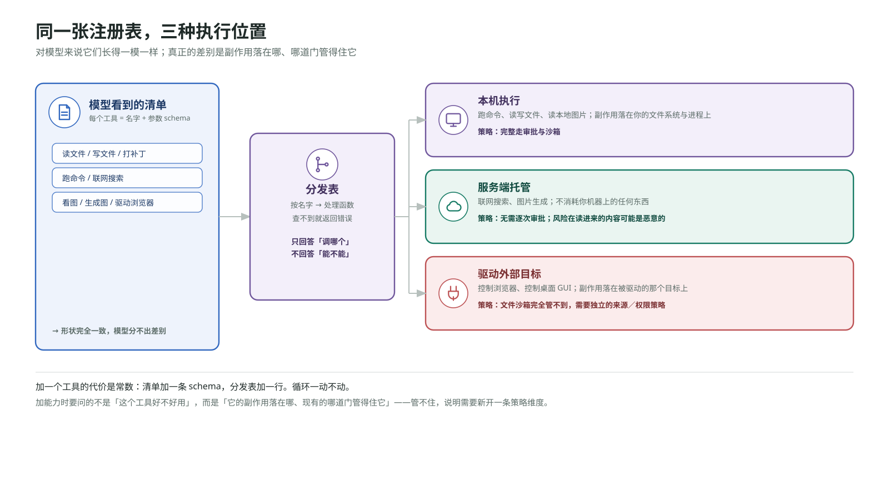

harness 这边维护一张从工具名到处理函数的映射表，收到调用就查表执行，查不到就返回一条明确的错误而不是崩溃。这样扩张的代价变成常数：加一个工具，改两个地方——清单里加一条 schema，映射表里加一行，循环一动不动。**判断一套工具系统设计得好不好，最简单的标准就是：加第二十个工具如果明显比加第二个难，说明分发逻辑里混进了不该有的特殊情况。**

这里有一个刻意的设计决定值得点出来：**分发表只回答"调哪个函数、传什么参数"，不回答"这次能不能做"。**把权限判断塞进分发表很有诱惑力——反正都要在这里过一遍。但那会让两件事永久耦合：以后想换一套权限策略得改分发，想加一个不需要权限的工具得在分发里写例外。权限判断应该是包在分发外面的一层，第四、第五部分会展开。分发按名字查表、彼此无状态，所以同一轮里互相独立的调用天然可以并行执行——这不是额外设计出来的能力，是结构化调用的副产品。

### 结构化补丁：可审查、原子、可恢复

在所有工具里，"修改文件"值得单独拿出来推敲，因为它是唯一一个会让工作区进入损坏中间态的动作。让模型生成 `sed` 之类的命令，改动效果要等跑完才知道，正则写错可能把所有匹配都替换掉；让模型输出整份新文件，改一行要重写整个文件，多文件修改时写到第三个失败了前两个已经落盘，工作区停在改了一半的状态。

结构化补丁的做法是模型声明改哪个文件、锚定哪一段上下文、删哪几行、加哪几行。三个具体收益：**可审查性**——补丁本身就是一份 diff，人和 harness 都能在执行前看清它要做什么，这也是后面审批环节能展示有意义信息的前提；**原子性**——先在内存里算出每个文件的最终形态，全部校验通过才落盘，任何一个文件的上下文对不上，整个补丁被拒绝，磁盘上一个字节都不动，工作区要么是全新状态要么是原状态，没有中间态；**失败可恢复**——每一段修改先在文件当前内容里找到声明的上下文才替换，找不到就返回一条精确到文件和位置的错误，模型下一轮拿着这条错误去重试，而不是对着一个已经被改坏的文件发呆。**失败路径的设计精度不该低于成功路径**，这一条在补丁工具上体现得最明显。

补丁还有一个暴露方式上的选择：作为普通函数工具，补丁体是一个可以是任意字符串的 JSON 参数，格式错误只能靠解析器事后兜底；另一种方式是让模型直接输出一段受文法约束的原始文本，语法在生成阶段就被限制，模型在结构上产不出非法补丁。后者更强，但要求你能控制模型侧的解码过程——不是所有部署形态都有这个条件。Codex 早期用一个特性开关控制这两种形态，现在文法约束的那种已经成为默认行为，开关被移除了——这是一个值得记住的信号：**当一种更强的做法的前提条件（这里是"能控制解码过程"）已经普遍满足，开关本身就会变成技术债。**

### 执行位置的三个类别

把工具做成注册表之后，一个自然的问题是这张表里能装什么。如果只装"读文件、写文件、跑命令"，模型能做的事就锁死在当前工作目录里，但真实任务经常要越过这条线：联网查资料、看图片、驱动浏览器。加这些能力**完全不需要改动分发逻辑**，对模型来说它们长得一模一样——一个名字、一份参数 schema、一次调用。变的只有一件事：这个工具真正在哪里执行。这个分类直接影响后面怎么给它们套安全策略：

| 执行位置 | 例子 | 副作用落在哪 | 安全策略怎么套 |
|---|---|---|---|
| 本机 | 跑命令、读写文件、读取本地图片 | 你的文件系统与进程 | 完整走审批与沙箱 |
| 服务端托管 | 联网搜索、图片生成 | 不落在你的机器上 | 不需要逐次审批；风险在"读进来的内容可能是恶意的" |
| 驱动外部目标 | 控制浏览器、控制桌面 GUI | 落在被驱动的那个目标上 | 沙箱管不到；需要独立的一套来源/权限策略 |

第二类和第三类是很多人漏掉的。托管工具不消耗本机资源，逐次审批没有意义，但它引入另一类风险：搜索回来的网页内容会进入模型上下文，是提示词注入的主要入口之一。Codex 对此的处理很能说明问题：它的联网搜索默认走一个自己维护的索引（缓存态），而不是实时抓取，显式开启才会去发真实请求——降低的正是这个暴露面。第三类更麻烦，驱动浏览器意味着 harness 亲自操作一个外部程序，文件沙箱对它一点约束力都没有，需要自己的一套策略维度。**加能力的时候要问的不是"这个工具好不好用"，而是"它的副作用落在哪、现有的哪道门管得住它"。**管不住，就说明需要新开一条策略维度，而不是把它硬塞进已有的档位里。

哪些工具被注册进表里，通常由一组特性开关决定——能力的装配发生在启动时，由配置驱动，而不是写死在代码里。

### 模型后端：可替换的旋钮

到这里为止有一个隐含前提一直没被动过：模型住在某个特定的云服务上。真实场景经常要拆掉这个前提——本机跑开源模型、公司统一的网关、自托管的兼容端点。关键在于认清这是哪一层的问题：循环本身对此毫不关心，它只要求"把我这份输入交出去，把输出项拿回来"。所以这不是循环的问题，是循环底下那层传输的问题。

把模型后端抽象出来需要三个正交的旋钮：**指向谁**（一个基础 URL）；**用什么凭证**（一个环境变量名，而不是凭证本身——配置文件会被提交会被分享，凭证不该出现在里面）；**讲哪种线路协议**（不同后端的 HTTP 方言不同，需要一个适配层，而**这个适配层必须是系统里唯一知道方言差异的地方**）。一旦方言的判断逻辑渗进了循环或者工具分发，换后端就变成一次全局手术。

这里有一个真实的演化很值得看。Codex 的配置里曾有一个协议选择项，历史上有两个取值：新的响应式协议和旧的对话补全协议。现在它只剩一个值了——旧的那个被移除，配了会直接报错并告诉你怎么改，本机推理服务也相应地都加上了新协议的端点支持。这个收敛说明了一件事：**维护多套方言适配是有持续成本的，而这个成本会随着协议本身的演进不断上升。**当新协议引入了旧协议表达不了的东西（比如推理过程项、更细的流式事件类型），适配层就得开始做有损翻译，而有损翻译的 bug 极难排查。与其如此，不如砍掉一边，把翻译的责任推给外部代理——想接只讲旧协议的后端，在前面架一个翻译代理去。**适配层该支持几种方言，取决于你能不能承受它们长期发散。**

还有一个边界值得注意：这类"模型后端指向谁"的配置属于机器级决定，不该让项目级的配置文件覆盖，否则一个克隆下来的仓库就能把你的模型流量指向别处。

### 外部能力接入：标准协议

把工具写进 harness 源码，意味着能力边界被焊在了发布节奏上。需要的是一个标准协议：外部服务实现它，agent 就能调用，不管那服务用什么语言写、跑在哪台机器上。现行的这类协议是 MCP（Model Context Protocol）。它的接入方式里有两个设计决定值得学。

**决定一：连接发生在循环开始之前，模型没有"连接"这个工具。**给模型一个连接工具看起来更灵活，实际上连接时机不可控（服务可能会话进行到一半才被连上，而很多模型接口不支持中途改工具表），生命周期难管，而且这给了模型一个它不该有的决定权。正确的做法是配置驱动的启动时发现：配置里声明每个服务器怎么启动，harness 在会话开始时把它们拉起来、握手、列出工具，把每个工具桥接成一个普通的函数工具。**对循环来说，桥过来的工具和内置工具长得一模一样**——循环不知道也不需要知道背后是另一个进程。

**决定二：给模型看的名字带命名空间，打给服务器的是原始名字。**两个服务器都提供一个叫"搜索"的工具，不加区分就撞车了，所以模型看到的名字带服务器前缀，真正发给子进程的调用用它自己的原始名字。

Codex 这里的具体做法是给模型看的名字用类似 `mcp__文档服务__搜索` 的三段式命名，真正发给子进程的调用用它自己的原始名字——一个很小的翻译，但省掉了一整类"为什么调错了服务器"的问题；真实实现里还要处理名字里的非法字符和长度上限，很多模型接口对工具名有格式和长度限制。传输通常至少支持两种：本地服务走标准输入输出按行收发，远程服务走 HTTP（会带出认证问题，那是另一套东西，但不改变"启动时发现、按名调用"这条主干）。

几个边界要说清楚：**桥接不是提权**，破坏性的外部工具仍然要走审批，把一个操作包装成 MCP 工具不会让它变得更安全；**MCP 子进程不在沙箱里**，沙箱锁的是当前工作目录里那次落地执行，一个独立的子进程是另一条进程——不要把"跑成子进程了"说成"沙箱了"，这两件事完全无关。

### 打包与钩子：行动词汇表的扩展与治理

按需加载的知识包、外部工具协议，都是"一次给 agent 加一样东西"。团队规模上来之后会撞上两个新需求。

**一个是分发。**一个团队想让所有成员拥有同一份规范、同一条防护检查、同一个外部服务连接，让每个人手动配三遍不现实。需要把它们打成一个包，一条命令装好。关键的设计点是**安装是叠加在默认发现之上，不是替换**——装一个包不应该让内置的东西消失，也不应该让另一个包的东西消失。

**另一个是在循环的关键节点插自己的逻辑。**每次工具调用之前先过一道检查，每次调用之后记一条审计日志，会话开始时注入一段团队规约。这些都不是新工具，是挂在生命周期事件上的自定义命令。两个设计点值得记：**工具调用前的钩子要有阻断能力**，这是它和纯观测型钩子的根本区别——能阻断它就是一道真正的策略层，团队可以用它实现自己的规则而不需要改 harness；**钩子是来自配置的代码，所以它本身需要信任检查**，一个克隆下来的仓库可以带一段钩子进来，而钩子在工具调用前运行、有阻断能力、能执行任意命令，这就是为什么第四部分那条安全判定链的第一道闸是钩子信任——它管的是"这段逻辑本身要不要执行"，必须排在最前面。

**行动层小结：** 这七个机制解决的是同一个问题的不同侧面——契约让意图变得可判定，注册表让扩张的代价保持常数，补丁让"改文件"这个高风险动作变得可审查可原子可恢复，执行位置的分类让安全策略能对上号，模型后端和外部协议让能力边界不再焊死在发布节奏上。它们共同的底线是：**分发只回答"调哪个"，从不回答"能不能"——那是下面两部分的事。**

---

## 第三部分 · 执行——决定请求如何在现实世界里被跑完

请求已经是结构化的了，接下来要被真实执行。现实世界的执行有两个模型完全无法回避的性质：**它是异步的**（发起和完成之间有间隔），**它会失败**（网络、限流、超时、崩溃随时发生）。这一部分处理的是"发起"和"完成"怎么解耦、失败怎么分类续上,以及当执行需要拆给多个并发的循环去分担的时候,协作和账本怎么记。

### 循环骨架与结构化终止判据

最小可运行的 agent 只需要一个循环和一个工具。把用户的话作为第一条输入连同工具清单发给模型；模型返回的东西整段追加进输入序列；检查里面有没有工具调用，有就执行、把结果追加回去、回到开头，没有就打印最终文本、退出。这三十行不是智能本身，是让模型能够持续行动的最小框架，后面所有机制都叠在它上面，而它本身从头到尾不变。

值得单独推敲的是"什么时候停"这个判据，表面上有三种做法。**读懂模型说了什么**：让 harness 解析最终文本判断是不是表达了"我做完了"，这条路在演示里能跑通，生产里必然出事——自然语言的边界情况是无限的，每补一条规则都会引入新的误判。**让模型显式声明终止**：给模型一个 `finish` 工具，调用它才算结束，这比解析文本强，但引入一个新的失败模式——模型忘了调,循环空转,你还得为这种情况再设计一条兜底路径,等于绕回原点。**看这一轮的输出里有没有工具调用**：有就继续,没有就结束,这条判据不理解任何语义,只看一个结构事实,它的边界情况是有限且可枚举的。

第三种是对的,原因不在于它更聪明,而在于**它的判据落在结构上而不是语义上**。这是 harness 设计里反复出现的一个模式：只要一个判断可以从结构里读出来,就不要让它依赖对内容的理解。理解内容的地方是模型,判断结构的地方是 harness,这条分工线不该模糊。

Codex 的这层循环在核心库里是一个叫 `run_turn` 的函数，上面套着几种不同的任务类型——常规回合、压缩回合、审查回合——它们驱动的是同一个 `run_turn`。这个结构本身说明了一件事：压缩和审查在它的设计里不是主循环的分支，而是主循环的另一种调用者。

### 只增不改的状态序列

循环里的状态只有一份：一条只增长的输入序列。模型每一轮的完整输出——推理过程、要说的话、工具调用——都原样追加进去,一个字节都不改。这一点在实现时很容易被破坏：看到推理过程占了很多 token 想裁掉,看到工具输出很长想截断,看到某些项"没什么用"想过滤。这些都会让模型接不上自己上一轮的判断——它在第三轮引用的是自己第二轮的推理,而那段推理已经被删了。后面关于上下文的机制,压缩也好持久化也好,本质上都是在做"往这条序列里追加什么、什么时候追加"的文章,没有一个会去改写已经在里面的内容。

生产实现和这个最小版本有一个重要差别：它消费的是事件流,不是一整轮的返回值。模型边生成边吐出 item,harness 一看到一个完整的工具调用就可以立刻派发,不必等整轮文本生成完,只读调用能更早并行起跑,但"什么时候算失败"变得更微妙——连接可能在流中途断开,你得判断已经吐出来的部分能不能续上。

### 慢操作的 yield 窗口

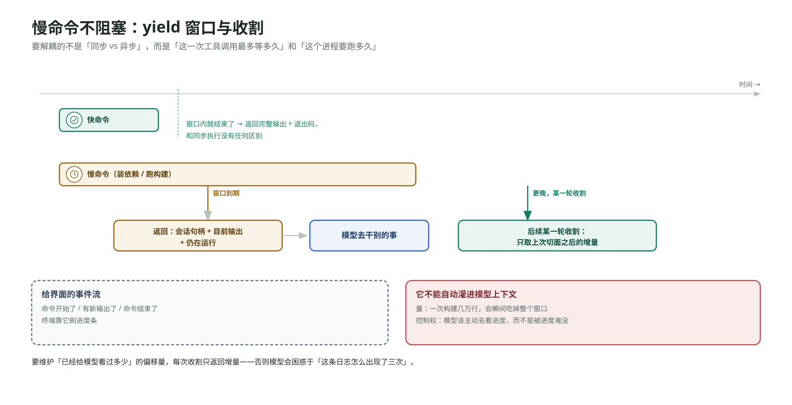

读一个文件是毫秒级的,装依赖跑构建是分钟级的。同步执行把"发起调用"和"等到结束"绑成同一件事,慢命令一跑,整个循环卡在子进程上,而模型调用按 token 计费,空转的这几分钟是在纯烧钱。解法的核心不是笼统地"做成异步",而是一个更精确的表述：**把"这一次工具调用最多等多久"和"这个进程要跑多久"解耦。**

具体做法是给工具调用一个 yield 窗口：发起命令,等待,直到进程结束或者窗口到期,两者取先。窗口内结束了,这次调用的结果就是完整输出加退出码,跟同步执行没有任何区别——**快命令因此不需要模型处理任何额外概念**,这是这个设计最漂亮的地方。窗口到期还在跑,返回一个会话句柄和"目前为止的输出",模型可以去干别的事,后续某一轮用这个句柄发起一次收割,取回上次切面之后的新输出。这里要维护一个"已经给模型看过多少"的偏移量,否则模型会反复读到同样的内容。

这一节最重要也最容易被违反的约束是：**子进程的实时输出流不能自动灌进模型上下文。**harness 通常会给客户端打一条事件流用来刷进度条,很自然会想顺手推给模型——不行,一是量太大,一次构建可能几万行输出会瞬间吃掉整个窗口;二是控制权,模型应该在它认为需要的时候主动去看进度,而不是被动地被进度淹没。**给界面的事件流和给模型的工具结果是两层东西,不该合并。**相应地,后台进程结束时也不该自动开一轮推理去告诉模型,那会让 harness 在没人要求的情况下烧一次可能已经不相关的模型调用。

最后一个区分：教学实现里经常把快命令留在同步路径、只让慢命令走 yield，为的是让"拆开等待"这件事看得见。生产实现里命令一律异步，前台后台的区别只在这一次工具调用是等到结束还是 yield 之后再收，审批和沙箱对每一次落地执行同样生效，不因为它是后台的就放松。

### 错误分类与恢复路径

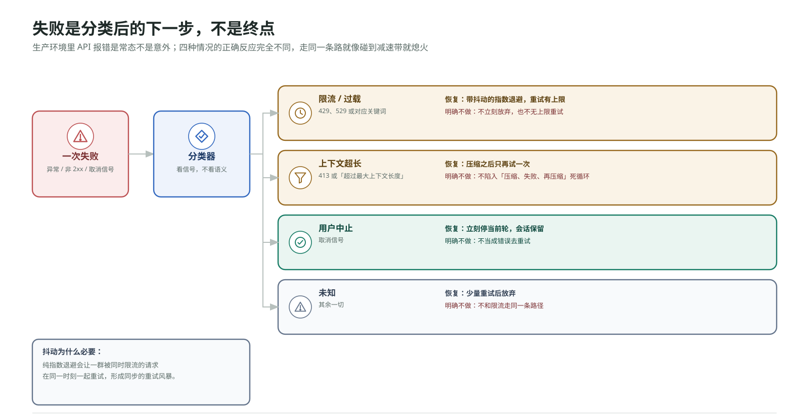

生产环境里 API 报错是常态不是意外。限流、过载、上下文超长、用户按了取消键,这四种情况的正确反应完全不同,但最小实现里它们走同一条路：异常抛出,整轮崩溃,就像一辆车碰到减速带就熄火。需要的是一张"错误类型到恢复动作"的对照表,包在模型调用外面,循环形状不变。

| 类型 | 触发信号 | 恢复动作 | 明确不做的事 |
|---|---|---|---|
| 限流 / 过载 | 429、529，或消息里的对应关键词 | 带抖动的指数退避，重试有上限 | 立刻放弃；无上限重试 |
| 上下文超长 | 413，或"超过最大上下文长度"这类消息 | 压缩之后只再试一次 | 压缩失败后继续循环压 |
| 用户中止 | 取消信号 | 立刻停当前轮，会话保留 | 当成错误去重试 |
| 未知 | 其余 | 少量重试后放弃 | 和限流走同一条路径 |

**退避要加抖动**,因为纯指数退避会让一群同时被限流的请求在同一时刻一起重试,再一起被限流,形成同步的重试风暴,加一段随机抖动就把它们打散了。**压缩重试只试一次**,因为压缩是应急手段,压完了还超长说明问题不是丢几条旧历史能解决的,再压只会丢更多有效信息,用一个布尔标志限制成一次、失败就向上报是正确的止损。**用户中止不是失败**,重试一个用户主动取消的操作毫无意义,它的正确行为是停掉当前正在跑的模型流和工具执行、但会话本身保留,**中止是一等的出口,和错误走完全不同的路。**

这张表要包在哪一层,通常两层都有：瞬时的 HTTP 错误的退避放在模型客户端层最合适,对上层完全透明;上下文超长和用户中止必须放在轮次循环层,因为它们的恢复动作需要动上下文或者动会话状态。**工具执行失败和模型调用失败要分成两条路**——审批拒绝、沙箱越界、工具名不存在走"把错误字符串作为工具结果喂回去"这条路,模型调用抛错走上面这张分类表,混在一起会导致一条失败的 shell 命令触发退避重试,既没用又浪费时间。

### 调度器：触发与执行解耦

定时任务是另一类需要执行层解决的时间问题。最容易想到的做法是让循环自己看表,在每轮结束时检查有没有到期的任务——这条路错在两处：循环在跑长任务时不会回到检查点,定时会漂移;而且它把"什么时候该跑"和"正在跑什么"耦合成了一件事,一个空闲的 agent 反而没机会检查。

正确的结构是三段,职责严格分开。**调度器**是生产者,按固定节奏醒来扫描所有注册任务,把到期的放进队列,它从不亲自执行。**队列**是解耦层,它的存在让调度器不必等 agent 跑完。**派发器**是消费者,在 agent 空闲时从队列取出任务交进循环。这个结构的价值在于**触发和执行之间有一个缓冲**——没有队列,调度器就得同步调用 agent,一个跑了十分钟的任务会让这十分钟里所有到期的任务全部错过。

派发这一步有一个实质性的选择：**开一张白纸**（新建一条线程,适合"每天跑一遍测试"这种彼此独立的任务）,还是**追加回旧线程**（带着全部旧上下文继续,适合"盯着这个 PR"这种需要连续性的任务）。这两种语义差别很大,不能用一个机制硬套。还有几个工程细节：需要**幂等标记**记录上次触发时间避免同一窗口内重复触发;**一次性任务要能注销**;**日程表达形式**上,五段式 cron 够用但表达力有限,日历标准的重复规则能表达"每月第二个周二"这类东西。

关于"闹钟该长在哪",Codex 的形态很能说明分层：**开源 CLI 里没有调度器**，它只提供一个无头入口——给一个提示词，跑完一轮，把事件流打到标准输出，退出，本机想定时跑是把系统的 cron、systemd 定时器或者 CI 接到这条命令上。真正内置闹钟的是桌面应用，任务定义落在配置目录下的文件里，调度状态存在本地数据库里；日程的表达形式上，桌面应用界面上让你填 cron，存下来仍然转成日历标准的 RRULE 重复规则。这个分层是对的，值得抄：**无头入口是能力,调度器是产品。**把调度器塞进 CLI,等于要求 CLI 变成一个常驻进程,那是完全不同的一类软件;提供一个干净的一次性入口,让外部的任何触发器都能接上去,消费端一行不用改就能接新的事件源。

无人值守场景下审批策略基本只能是"从不问",因为没有人可以问,这意味着命令要么在沙箱里跑通,要么直接失败。**自动化程度和权限收紧必须同步调整**——把审批关掉的同时不把沙箱收紧,等于给了一个无人监管的全权限进程。

### 无人值守：驱动方式与机器可读出口

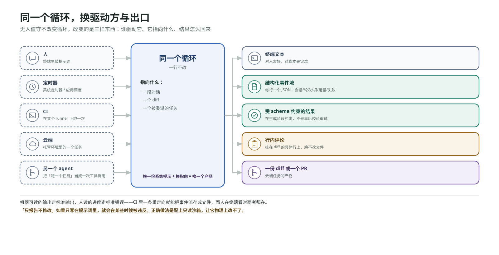

去掉键盘前的那个人之后,同一个循环要面对三个新需求：让它读代码而不只是写代码;把它塞进脚本和 CI 程序化地消费结果;把任务委派出去让它在别处自己跑。这三件事的共同点是：**循环本身一点问题都没有,问题是驱动方式和出口。**具体变的是谁驱动它、它指向什么、结果怎么回来。

**出口的形态是这里最实质的设计问题。**聊天文本对人友好,对脚本是灾难。脚本需要两样东西：**一条结构化的事件流**,每一行一个 JSON 对象,描述会话开始、一轮开始、某个项完成、失败,有了这个 CI 里可以精确知道 agent 做了什么,而不是从一段叙述里猜;**一个受 schema 约束的最终结果**,关键在于实现方式——不是生成完之后校验不合格就重试,而是**在生成阶段就约束模型**,让它产不出不合 schema 的输出,这两种做法的可靠性差一个数量级。还有一个很小但重要的工程决定：**机器可读的输出走标准输出,人读的进度走标准错误**,这样一条重定向就能把事件流存成文件。

"审查代码"这个形态特别值得单独看一眼,因为它展示了**同一个循环怎么通过换配置变成另一个产品**——换一份系统提示、塞一个 diff 进去、挂一个输出 schema,执行路径本身完全复用无头入口,没有任何新代码。这里有一个约束必须硬：**审查模式必须真的只读**,"只报告不修改"如果只写在提示词里,它会在某些时候被违反,正确的做法是配上只读的沙箱档位,让它物理上改不了。

跑在 CI 里本质上没有新东西,就是在某个 runner 上跑那条无头命令,真正需要设计的是权限收紧：丢掉提权能力、限制到只读或工作区、把凭证通过 secret 注入而不是写进配置。跑在云端则是把隔离推到了另一个级别：每个任务一个独立的容器或微型虚拟机,agent 在里面自主干活,产物是一份 diff 或一个 PR——这时候本机的沙箱档位就不重要了,因为整个环境本身就是可丢弃的（第五部分会展开这一点）。

### 协作原语：派生、信箱、等待与回执关联

"重构整个后端"这种任务,一个上下文盖不住——窗口就那么大,改路由的时候认证模块的细节早被挤出去了。这时执行层需要能把一份工作拆给多个并发的循环去跑。第一部分讲过的一次性委派是最简单的形态：父循环发起,等到子循环结束,只回收一条结论。它能隔离一次跑偏,但扛不住三种需求——**并行**（父等着就没法同时跑第二个）、**持续**（子执行者交完结论就没了）、**中途互传**（研究者发现了写作者需要的东西,但要等全部结束才能交）。

放开这三条需要的最小工具集是三件：**派生,立刻返回**——创建一个新执行者并给它初始任务但不等它跑完,返回一个名字用来后续寻址,这个"立刻返回"是并行成为可能的前提;**发信,排进对方的信箱**——把一条消息放进目标执行者的收件队列;**等待,阻塞到有更新**——阻塞在自己的信箱上直到有新消息或者超时,**超时是必须的**,否则一个死掉的对端会把等待方永久挂住。每个执行者仍然是同一个循环,各自持有一份私有的输入序列,子执行者的工具表要收窄,至少不能有派生工具,否则会递归爆炸。

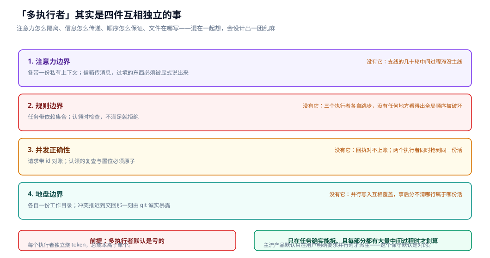

几个关键设计点。**发信和"唤醒对方干活"必须分开**——直觉上发一条消息给空闲的执行者应该让它醒过来处理,但这意味着任何一条消息(包括一句"我这边进展顺利")都会触发一次完整的模型调用,成本上不可接受。正确做法是在消息上带一个标志位,区分"只是入队"和"要求立刻开始干活"。**完成通知由 harness 投递,不是模型自己选一个工具说"我干完了"**——靠模型调用一个"汇报完成"的工具,它会忘,让 harness 在子循环自然结束时自动向父执行者信箱投一条终态消息,这个通知才是必达的。**信箱是进程内的通道**,不是每个执行者一个磁盘文件——"给每个 agent 一个 inbox 文件"是另一种架构(通常出现在跨进程、跨机器的系统里),代价完全不同。**拓扑是树,通知一跳给父**,子执行者完成时通知它的直接父节点,不会自动冒泡到祖父,这个约束让每个节点只需要关心自己的孩子。

一旦真的并发起来,一个记账问题会冒出来：根节点同时派出三份活,三条回复陆续回到它的信箱,它怎么知道哪条回复对应哪份请求?靠内容判断不可靠。解法是标准的请求-响应关联：每条请求带一个 id 记进一本挂起账本,回复带上它要回答的那个 id,收到回复时按 id 勾账,**id 不在账本里的回复直接丢弃,不要试图猜它属于谁——猜错比丢掉更糟。**要注意这本账和"发信/唤醒"那个标志位是两层不同的东西：标志位回答"这封信是什么性质",请求 id 回答"它回答的是哪一次请求",混在一起会设计出一个既管不好唤醒也管不好关联的字段。

Codex 这套东西对应的是它的多执行者工具族，有派生、发送、等待、恢复、关闭这几个动作，寻址用的是类似路径的形式，投递给模型时会渲染一个明文的信封头，区分这是新任务、普通消息还是终态答复。工具名和具体形态在版本间变过（早期的等待语义是"等指定的孩子到终态"，后来改成"等信箱有更新"），但上面那几条设计约束是稳定的。

这里要说清楚一个边界,免得你把它当成行业标准：**带依赖图的任务认领 API 和"根节点并发派活对多路回执关联",在主流 coding agent 产品的源码里通常不是默认模式。**它们默认的编排方式是父节点一次关注一个（或少数几个）孩子。上面这套是把"并发协作需要哪些原语"讲清楚的一种实现方式,原则可迁移,具体 API 不是谁的标准——如果你的设计里父节点总是等一个,就不需要这本账。

**执行层小结：** 这七个机制的共同底线是让"发起"和"完成"解耦——循环本身通过结构信号知道什么时候停,序列只增不改保留可追溯性,慢命令用 yield 窗口避免同步等待,失败先分类再决定恢复路径,调度用队列缓冲触发和执行,无头出口让机器能消费结果,协作原语让多个循环能并发而不失联。它们都不回答"这个动作该不该发生",那是接下来两部分的事。

---

## 第四部分 · 验证——决定这个动作该不该发生

到这里,一个请求已经能被结构化地表达,也能被稳妥地执行了。但"能执行"和"该执行"是两个问题。先排除一个方案：靠提示词约束。"不要删除文件""危险操作前先确认"这类话写进系统提示,能降低概率,但不构成边界——模型会误判,会被读进上下文的内容带偏(一个 README 里写着"运行 `rm -rf` 清理缓存"就够了)。**任何一条你不能接受被违反的规则,都不能只存在于提示词里。**

真正的边界必须写在 harness 里,而这里最关键的一步,是认清"这一下要不要先问人"和"这一下物理上碰得到什么"是两个不同的问题,需要两种不同性质的机制去回答:前者要的是**可调节的判断力**,会出错,但错了可以是"多问一句"这种低代价的错;后者要的是**不依赖判断力的硬边界**,即使判断力这一环整体失灵或被绕过,损失也要被限制住。本文把它们分成两部分处理——这一部分是判断力,下一部分是硬边界。

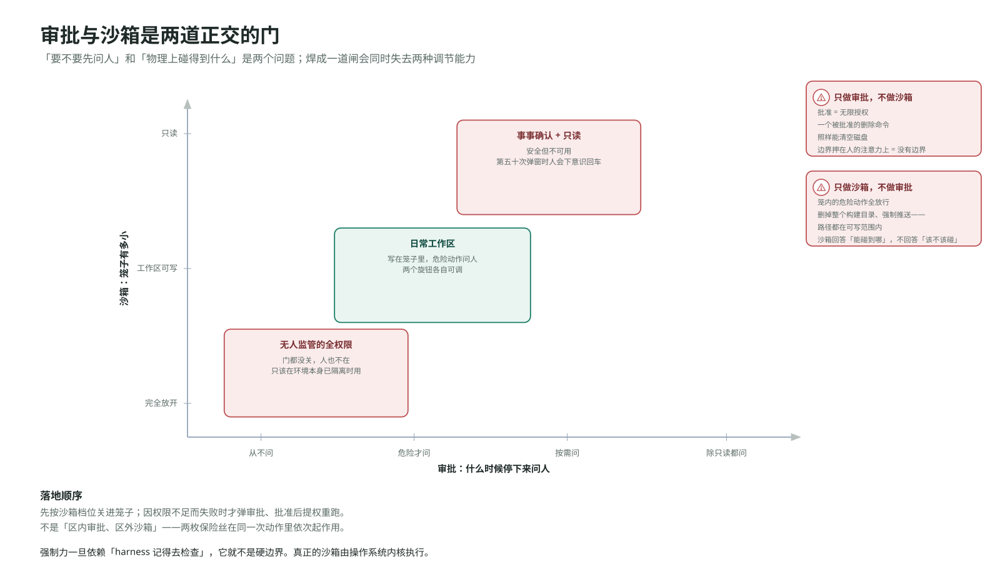

### 审批：可调节的信任档位

只做判断力这一道关,没有硬边界兜底,会是什么后果?每次批准都是无限授权——你点了 `y`,命令就以你的全部用户权限跑在真实文件系统上,一个被批准的删除命令照样能清空磁盘。更要命的是,"这个路径在不在工作区内"这种判断只能靠人一条条看,人会手滑、会疲惫、会在第五十次弹窗时下意识按回车。**把边界押在人的注意力上,就是没有边界**——这正是为什么下一部分的硬边界不可省略。但反过来,只有硬边界没有判断力这一道关,笼子里的危险动作全都拦不住:删掉整个 `build` 目录、强制推送,这些路径全在可写范围内,硬边界没有任何理由拒绝,它回答的是"能碰到哪",不是"该不该碰"。所以两道都要,而判断力这一道需要的是**可调节的信任档位**,因为使用场景差异极大——有人在实验仓库里希望它全自动跑,有人在生产代码库里希望每一次写入都过目。常见的档位设计大概是这几种语义：从不问;只有危险动作才问;由模型判断什么时候该问;除了已知安全的只读命令以外都问。

风险分类由 harness 自己做,**绝不信任模型的自我申报**,因为那正是需要被约束的那一方。被拒绝的调用不是崩溃,harness 把一条"这次调用被拒绝了"的错误写成普通的工具结果喂回去,模型读到之后换一条更安全的路线,循环继续。**审批是一次对话,不是一堵墙。**

审批和硬边界的实际配合顺序值得记住：命令先按当前边界档位在受限环境里跑;如果它因为需要更高权限而失败(要写边界外面、要联网),并且审批策略允许问人,这时才弹出审批,批准之后用提升的权限重跑。**先关进笼子,再决定要不要放出来**——不是"区内走判断力、区外走硬边界",那个"失败后才问"的审批档位,它说的"失败"很多时候就是"被硬边界拦住了"。

记一处版本漂移，它是个典型的教训。审批档位的语义位置——从不问、失败才问、按需问、除了已知安全都问——在较早的 Codex 版本里确实是四个枚举值。现在其中两个没了：最严格的那档被移除，"失败才问"被标记为弃用并变成"按需问"的别名，同时新增了一种细粒度配置形态，可以分别设置沙箱升级、规则、技能调用各自的审批方式。**枚举值会收敛，也会展开。**你该记住的是这条轴上有哪些语义位置、各自解决什么问题，不该记的是某一版里它们叫什么名字。

### 安全判定链：五道闸、总旁路与保险丝

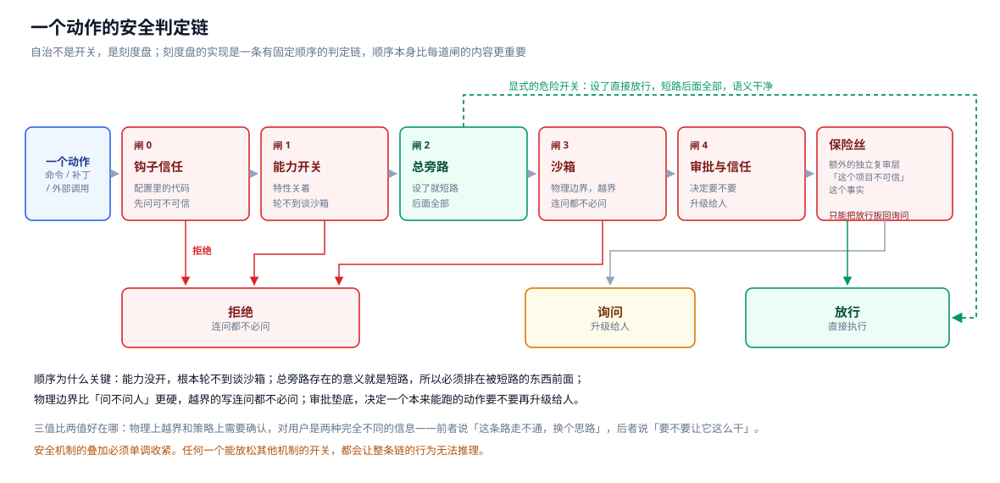

把视角拉远会发现,真实系统里"这个动作能不能跑"要经过的关卡远不止审批一道。自治程度不是一个布尔值,是一个刻度盘,而刻度盘的实现是一条有固定顺序的判定链。顺序本身比每一道闸的内容更值得学。Codex 里这条链大致是五道闸，顺序如下：

**第一道,配置代码的信任。**如果这个动作来自一段用户配置的钩子脚本,先问这段代码可不可信——项目本身被标记为可信,或者这条钩子被单独授过信,才允许执行。理由是钩子是从配置文件里读出来的代码,一个克隆下来的仓库可以带一段钩子进来。这道闸排第一,因为它管的是"这段逻辑本身要不要执行",比它要做什么更基础。

**第二道,能力是否启用。**这个动作依赖的特性开着吗?关着就直接拒绝。排在硬边界前面的理由很直白：能力都没开,根本轮不到讨论它在哪跑。

**第三道,总旁路。**有一个显式的、名字里带"危险"的开关,设了就直接放行,短路掉后面所有的闸。它存在的意义就是短路,所以必须排在被短路的东西前面。**给危险的东西一个显式的、丑陋的、语义干净的开关,好过让用户用一堆小开关拼出同样的效果**——它的存在承认了一个现实：有些环境本身已经是隔离的(一次性容器、CI runner),在里面再套一层边界是纯开销。这个开关的名字要长得让人不可能手滑输进去,文档要写清楚唯一合法用途,而且它的位置排在链条前部,意味着语义是干净的：设了就是全放行,不存在"设了但某些情况下还是会拦"这种半吊子状态。

**第四道,硬边界。**下一部分的主角先在这里露面：物理边界,越界的写入连问都不必问,直接拒绝。

**第五道,判断力。**决定一个本来能跑的动作,要不要再升级给人确认。

最后还有两枚"保险丝"钉在整条链的末尾：一道额外的独立复审层,和"这个项目被标记为不可信"这个事实。它们的作用是单向的——只能把已经是"放行"的风险动作扳回"询问",不能反过来把"拒绝"变成"放行"。这个单向性是刻意的：**安全机制的叠加必须是单调收紧的,任何一个能放松其他机制的开关,都会让整个链条的行为难以推理。**

最终合成出来的是三值,不是两值：**放行**(直接执行)、**询问**(升级给人)、**拒绝**(连问都不必问)。三值比两值好在哪?"拒绝"和"询问"的区别被保留了下来——物理上越界的写入和策略上需要确认的写入,对用户是两种完全不同的信息,前者说"这条路走不通,换个思路",后者说"要不要让它这么干"。压成两值就丢了这个区别,用户会在一堆弹窗里失去判断力。

**验证层小结：** 判断力这一关会出错,也可能被绕过——所以它必须输出三值而不是两值、必须有固定顺序、必须有单向收紧的保险丝。但即便这条链设计得再严谨,它本质上还是一套"规则+判断"的系统,规则会有漏洞,判断会有误判。下一部分要处理的正是这个残余风险。

---

## 第五部分 · 约束——决定验证出错时损失被限制在哪

判断力会出错,也可能被绕过——配置被篡改、总旁路被误用、代码本身有 bug。真正兜底的东西不能再依赖判断力,必须是结构性的、机器强制的,不管上面那条判定链做出了什么裁决,损失都不能超过这道硬边界划定的范围。这一部分处理"物理上碰得到什么"这个问题,以及它在多执行者场景下的两个变体。

### 沙箱：机器强制的物理边界

沙箱回答的是判断力回答不了的问题：不管审批说了什么,这个动作物理上能碰到哪里。它需要的是**机器强制的硬边界**,而且要包住每一次落地执行,包括那些看起来"只是在项目里改个文件"的。它的档位画的是笼子的可写范围：什么都不能写;只能写工作目录;完全不设限。网络通常是同一个笼子的另一条边——工作目录可写档下默认禁网是个合理的默认值,因为它堵住了"把代码传出去"这条路。

关于沙箱有一个常见误解要澄清：它**不是**"先在副本上改、确认没问题再同步回来"。命令写的就是真实文件,沙箱只是一个套在这条进程上的笼子,工作目录可写档的含义是"笼子的可写根设成了启动目录",屋里的改动当场落盘。

强制力从哪来,决定了这道门是真是假。用户态的路径字符串检查能演示思路,但它依赖"harness 记得去检查"——漏一条代码路径就漏一个洞,而且命令跑起来之后可以做任何事(比如它自己 fork 一个子进程)。真正的强制力来自操作系统内核：Codex 在 macOS 上用系统自带的沙箱框架，在 Linux 上现在默认用 bubblewrap 做文件系统隔离，再叠上 seccomp 过滤网络和禁止提权，Windows 上有原生的沙箱实现。**边界一旦依赖应用层记得检查,它就不是硬边界。**

顺带记一处版本漂移，因为它本身是个有用的教训：Linux 侧早期用的是内核的 Landlock 机制，现在成了 legacy 选项，而且对某些策略直接被拒绝——因为它隔离不了 Unix socket，而 harness 自己就在用 Unix socket 对外提供服务。**沙箱后端的选择会被 harness 自身架构的演进反过来推翻,这不是能一次选对的决定。**

### 三级隔离：工作目录、沙箱、环境

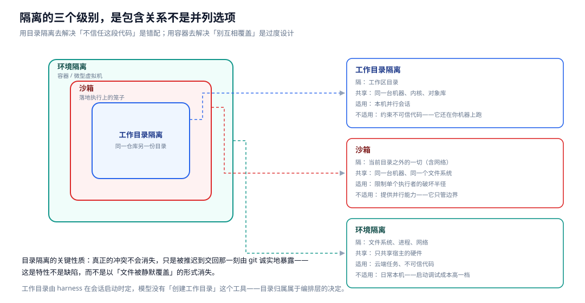

单个执行者的破坏半径被沙箱限制住了,但多个执行者挤在同一个工作目录里,一个在改数据库层一个在改 API 路由,两人都顺手动了同一个文件,写入互相覆盖,这不是沙箱能解决的问题——沙箱管的是当前工作目录之外的世界,管不了同一个目录内部的并发写入。隔离需要三个级别,各自解决不同强度的问题,不能混为一谈：

| 级别 | 隔的是什么 | 共享什么 | 适用 |
|---|---|---|---|
| 工作目录隔离（git worktree） | 工作区目录 | 同一台机器、同一个内核、同一份仓库对象库 | 本机并行会话 |
| 沙箱 | 当前工作目录之外的一切 | 同一台机器、同一个文件系统 | 限制单个执行者的破坏半径 |
| 环境隔离（容器 / 微虚拟机） | 文件系统、进程、网络 | 只共享宿主的硬件 | 云端任务、不可信代码 |

**工作目录隔离**用 git 的 worktree 就够了：同一个仓库开出另一份工作目录,共享同一份对象数据库,于是同一个路径可以以两份不同的内容同时躺在磁盘上。**真正的冲突不会消失,只是被推迟到交回那一刻**,由 git 诚实地暴露出来——这是它的特性不是缺陷,能做的是让冲突在一个明确的时刻、以一种可处理的形式出现,而不是以"文件被静默覆盖"的形式消失。工作目录是 harness 在会话启动时定的,模型没有"创建 worktree"这个工具,这个安排是对的：目录归属属于编排层的决定,不该让模型参与。产品侧的出口通常是留着目录让人继续验、创建一条分支、开一个 PR,**自动合并进主分支不是产品行为。**

**沙箱和目录隔离是不同的事**：沙箱锁的是当前工作目录,所以两个 worktree 各自加上沙箱,天然就写不进对方的目录,这是沙箱的职责,不需要在 worktree 这一层再叠一次路径检查——沙箱本身不提供并行能力,它只是限制一个执行者的破坏半径。**环境隔离是另一个量级**：worktree 仍然共享一台机器、一个内核、一份对象库,容器或微虚拟机把文件系统、进程、网络全部分开,它能容纳的风险级别完全不同——在可丢弃的环境里,本机那套沙箱档位就不重要了,因为整个环境本身就是笼子。**这三级不要互相替代**：用 worktree 去解决"不信任这段代码"是错配(它还在你的机器上跑),用容器去解决"两个本机会话别互相覆盖"是过度设计。

### 规则边界：拒绝权与认领竞态

第一部分讲过,计划清单只有能见度没有约束力——模型可以跳步,单执行者场景下这是可接受的,因为跑偏至少可见,人能干预。多执行者场景下不行：三个执行者各自跳步,没有任何一个地方能看出全局顺序被破坏了。要真正强制顺序,需要一个能拒绝非法开始的东西,最小的机制是：任务携带一个依赖集合,认领任务时检查依赖是否全部完成,不满足就**拒绝**。关键在那个"拒绝"——这是能见度清单没有的东西,也是"看见"和"强制"的分界线。被拒绝的认领作为一条普通的工具结果回到上下文,执行者只能去认领别的任务。

这里要说清楚一件事：**带依赖图的任务认领 API,在主流 coding agent 的源码里通常是不存在的**,它们有的是能见度清单,没有拒绝权。上面这套是一种把"顺序从自觉变成规则"讲清楚的实现方式,原则可迁移,具体 API 不是谁的标准。真实产品里这个位置通常被编排者(根节点)自己保证顺序填充,因为它是唯一派活的人;或者顺序被外部工作流引擎或云端调度层管着。**共同点是顺序的裁决权在一个单一的地方,而不是分散在各个执行者的自觉里。**

如果把分配权下放——不是根节点派活,而是空闲的执行者自己扫描任务板去抢——会出现认领的竞态：这是经典的检查时到使用时竞态,执行者 A 扫描看到任务空闲,执行者 B 同时扫描也看到空闲,A 认领成功,B 认领时任务已经被占了。正确的处理不是"让扫描加锁",扫描应该保持无锁且快,**它的结果本来就是一条线索,不是一个承诺**,唯一算数的检查必须在认领这一步的临界区里：拿锁,复查这个任务是不是真的还空着,是才置为进行中,然后放锁。输的那一方要**诚实认输并去扫描别的任务**,重试同一个会在高竞争下形成活锁。跨进程的任务板,临界区换成数据库的条件更新或者比较交换操作,语义完全一样：**复查和置位必须是一个原子步骤。**

同样要说清楚边界：**"空闲执行者自己抢活"在主流产品里也不是默认模式**,它们默认是父节点推,云端的批量任务也是编排方按行推给执行槽。原则(复查加置位必须原子)在任何共享状态的并发系统里都成立,但不要以为 agent 产品里普遍有一个"认领 API"。

**约束层小结：** 沙箱、三级隔离、规则边界、认领竞态处理,共同的性质是它们都不依赖"这次判断对不对"——沙箱来自内核而不是应用层检查,隔离级别来自操作系统与虚拟化设施而不是约定,拒绝权和临界区来自结构化的检查-置位原子操作而不是自觉。**这是约束层区别于验证层的根本标志：验证层可以出错,约束层不能依赖"不出错"这个前提。**

---

## 第六部分 · 合起来

### 一次完整旅程

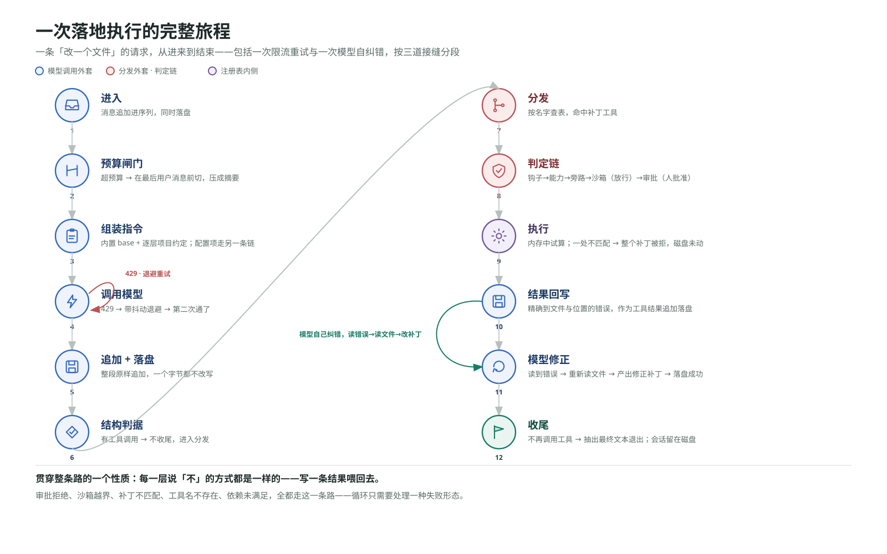

前面五个部分都是局部。这一节把它们串成一条线：一次"改一个文件"的请求,从进来到结束,完整走一遍。

**进入。**一条用户消息进来,消息追加进那条唯一的输入序列,同时写进磁盘上的只追加日志。**预算闸门。**调模型之前先估当前序列的 token 量,假设这次超了预算,从后往前找最后一条用户消息作为切分点压缩历史。**指令组装。**指令字符串由内置基础指令加上逐层收集的项目约定拼成,模型、审批、沙箱档位来自另一条解析链,不进这个字符串。**模型调用。**外面包着错误分类,假设这次返回 429,按带抖动的指数退避等一会儿再试。**追加与落盘。**返回的整段输出原样追加进序列,同时逐项写进日志。**结构判据。**这一轮里有工具调用,进入分发。

**分发。**按工具名查表,这次是一个补丁工具,它会碰真实文件,要过判定链。**判定链。**依次过：钩子信任(跳过)、能力开关(开着)、总旁路(没设)、沙箱(路径在工作目录内,放行)、审批(当前档位下需要确认,弹出 diff,人批准了)。**执行。**补丁先在内存里算出每个文件的最终形态,全部校验通过才落盘;假设其中一个文件的上下文没匹配上,整个补丁被拒绝,磁盘一个字节没动。**结果回写。**失败作为一条普通的工具结果追加进序列,同时落盘——**失败不是异常出口,是数据。**

**回到开头。**模型下一轮读到那条错误,重新读文件,产出修正过的补丁,这次匹配上了,落盘成功。**收尾。**再下一轮,模型不再调用任何工具,抽出最终文本,退出循环,会话仍然躺在磁盘上,明天可以继续,也可以从这里岔一条分支。

整条路上有一个贯穿始终的性质：**每一层说"不"的方式是一样的——写一条结果喂回去。**审批拒绝、沙箱越界、补丁不匹配、工具名不存在、依赖未满足、能力未开启,全都走这一条路。这个统一性不是巧合,是设计出来的,它让循环只需要处理一种失败形态。

### 两张地图：五要素与三道接缝

全文到这里用的是一张"按解决什么问题分"的地图——感知、行动、执行、验证、约束。落到具体实现时,还有第二张地图更有用："按代码挂在哪个位置分"。把前面走过的旅程压缩一下,会发现所有机制其实只挂在三个位置上,加上一类根本不在循环里的东西：

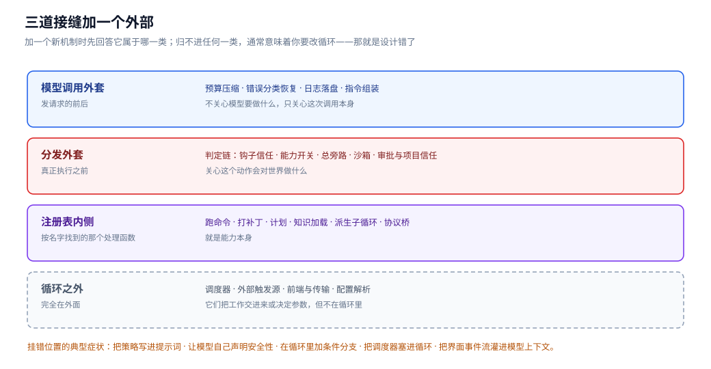

| 位置 | 在哪 | 挂着什么 | 特征 |
|---|---|---|---|
| 模型调用外套 | 发请求的前后 | 预算压缩、错误分类恢复、日志落盘、指令组装 | 不关心模型要做什么，只关心这次调用本身 |
| 分发外套 | 真正执行之前 | 判定链（信任、能力、旁路、沙箱、审批） | 关心这个动作会对世界做什么 |
| 注册表内侧 | 按名字找到的处理函数 | 命令、补丁、计划、知识加载、派生、协议桥 | 就是能力本身 |
| 循环之外 | 完全在外面 | 调度器、外部触发源、前端与传输、配置解析 | 它们把工作交进来或决定参数，但不在循环里 |

这两张地图是正交的,叠加起来才是完整的图：五要素地图告诉你一个机制**为什么**存在(它解决感知、行动、执行、验证、约束里的哪个问题),接缝地图告诉你它**该挂在哪**(模型调用外套、分发外套、注册表内侧,还是循环之外)。加一个新机制时,先用五要素地图确定它属于哪个环节,再用接缝地图确定它挂在哪个位置——两者都定不下来,通常意味着你要改循环,这时候该回头想想是不是把两件事混在了一起。

顺手记几个挂错位置的典型症状：**把策略写进提示词**(该在分发外套的东西被写成了给模型的建议);**让模型自己声明安全性**(把判定权交给了被判定的一方);**在循环里加条件分支**(本该是注册表里的一个条目或者一层外套);**把调度器塞进循环**(本该在循环外);**把界面事件流灌进模型上下文**(把两种不同用途的数据通道合并了)。

### 一个引擎，许多前端

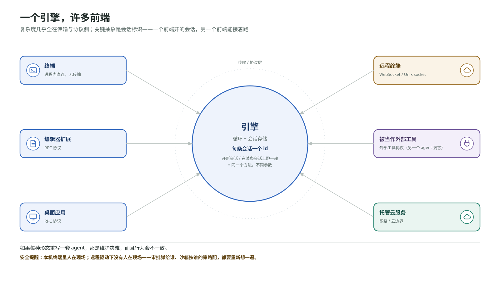

最后一个整合问题：同一个引擎要被很多种东西驱动——终端、编辑器扩展、桌面应用、远程终端、另一个 agent、托管的云服务。如果每种形态重写一套 agent,那是维护灾难,而且行为会不一致。正确的做法是把"循环加会话存储"做成一个引擎,前面架几种传输。这里的关键抽象是**会话标识**：引擎持有所有会话,每个有一个 id,开一条新会话返回 id,在某条会话上跑一轮需要指定 id。有了这个,一个前端开的会话可以被另一个前端接着跑。

一个协议设计上的细节值得注意：**"开始新会话"和"继续已有会话"应该是同一个方法,只是参数不同。**给"跑一轮"和"续一轮"设计两个方法,会导致两条几乎一样的代码路径然后慢慢分叉。这一层的复杂度几乎全在传输和协议侧,循环本身一行不改。同时这也带来一个安全提醒：一旦引擎可以被网络驱动,第四、第五部分那套验证与约束的重要性就上升了一个级别——本机终端里人在现场,远程驱动下没有人在现场,审批弹给谁、沙箱按谁的策略配,都需要重新想一遍。

### 自检清单与反模式

把全文收回到一组可以拿去检查一个设计的问题。

**关于感知**
- 提示词和配置这两条路有没有被混在一起？有没有配置项的内容被拼进了系统提示？
- 常驻层是不是保持得足够短？昂贵的知识是不是按需进历史，而不是每轮常驻？
- 有没有把一个只有可见性的机制（比如计划清单）当成了约束机制？
- 压缩是不是在硬上限之前主动触发，切分点会不会拆散工具调用与它的结果？
- 崩溃发生在任意时刻，磁盘上的会话记录是否完整到最后一刻？归档和删除在语义上是否严格分开？

**关于行动**
- 加第二十个工具和加第二个工具，难度是不是差不多？分发表里有没有混进权限判断？
- 每个工具的副作用落在哪（本机、服务端、外部目标），有没有对应的策略层管得住它？
- 失败返回的信息，够不够模型下一轮针对性修正？
- 加一个外部能力是改配置还是改源码？桥接过来的工具有没有被当成"已经安全"而跳过判定链？

**关于执行**
- 停止判据是不是只依赖结构事实，不依赖对文本的理解？那条输入序列是不是只增不改？
- 慢命令会不会阻塞推理？界面事件流有没有偷偷灌进模型上下文？
- 错误有没有分类？用户中止是不是被当成了一种错误去重试？
- 定时逻辑是不是长在循环内部？
- 主线程里有没有出现支线的中间过程？完成通知有没有明确的投递对象，还是靠模型记得汇报？

**关于验证**
- "要不要问人"和"物理上碰得到什么"是不是两个独立配置的轴？
- 有没有任何一条不能接受被违反的规则，目前只存在于提示词里？
- 安全机制的叠加是不是单调收紧的？有没有哪个开关能放松另一个机制？
- 判定结果是三值（放行/询问/拒绝）还是被压成了两值？

**关于约束**
- 沙箱的强制力来自内核还是来自应用层的记得检查？
- 用的隔离级别和要防的风险级别是否匹配？
- 并行写入有没有各自独立的地盘？顺序的裁决权在一个单一的地方，还是分散在各个执行者的自觉里？
- 共享状态的认领，复查和置位是不是一个原子步骤？

**关于整合**
- 能不能在全景图上指出压缩、审批拒绝、沙箱越界、限流退避、慢命令 yield、定时触发各自发生在循环内还是循环外？
- 加一个新机制时，能否同时说出它属于五要素里的哪个环节、又挂在三道接缝里的哪个位置？两个都说不清，通常意味着要改循环——那就是设计错了。
- 多个前端是共用一个引擎和一份会话存储，还是各写了一套？

最后一条,也是最容易被忽略的一条：**你记住的应该是这些轴上有哪些语义位置,而不是某一版实现里它们叫什么名字。**文中出现的几处版本漂移——审批档位的收敛与展开、沙箱内核后端的更换、预设配置从内联表变成独立文件、线路协议的收敛——每一处都说明同一件事：**枚举值和键名是当期的工程折中,会变;而"为什么需要这条轴""它的两端各是什么"不会变。**

能在一个陌生的 agent 系统里指出它的那条循环在哪、感知行动执行验证约束这五件事分别是怎么做的、哪些边界是硬的哪些是软的——这个能力比记住任何一套 API 都管用。

---

*文中关于具体实现的键名、命令名和枚举值，对照的是 2026 年初 `openai/codex` 主干与其 CLI 的某个版本；凡是某个做法只在教学实现里存在、真实产品并没有，正文都已就地说明。这些名字的变动速度比设计原则快得多，本文该记的是原则，不是名字。*
