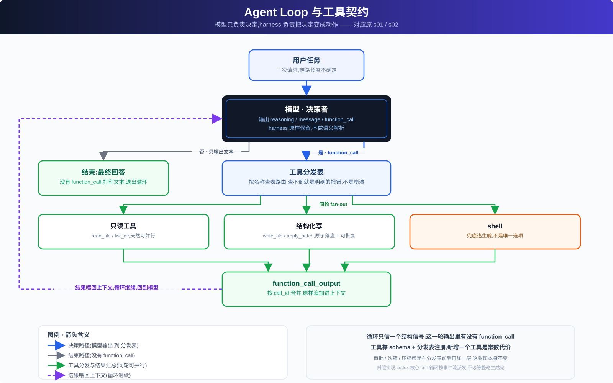

# 01 · Agent Loop 与工具契约



## 循环的本质

Agent Loop 是把"模型给出一个决定"和"这个决定变成世界上一个真实结果"连起来的最小机制。模型单次输出只能表达意图——它说要跑一条命令、读一个文件,但这只是文本;真正执行命令、读出文件、把结果交回模型,是 harness 的职责。循环把"模型决定 → harness 执行 → 结果喂回"这个来回自动化,并让它重复任意次,直到模型自己判断任务完成。

判断"继续还是终止",不靠 harness 理解模型说了什么——理解语义必然有边界情况,任何"猜"都会在某个输入上出错。稳妥的做法是只依赖一个结构信号:

| 信号 | 循环动作 |
|---|---|
| 这一轮输出里有 `function_call` | 执行工具 → 结果作为 `function_call_output` 追加进上下文 → 继续下一轮 |
| 这一轮输出里没有 `function_call` | 模型给出了最终答案 → 打印文本 → 结束 |

这个判据不解析文本内容,只看结构,边界情况天然更少。真实系统里,循环消费的是一条**事件流**——模型边生成边吐出结构化输出项,harness 一旦看到一个完整的 `function_call` 就能立即派发执行,不必等这一轮的全部内容都生成完。独立的只读调用因此可以更早并行起跑,长任务的第一次工具调用也不必等模型把全部推理都写完才开始。

循环里的状态只有一份:一条只增长的输入序列(线程)。模型每一轮的完整输出——推理过程、要说的话、工具调用——都原样追加进这条序列,harness 不裁剪、不改写。原因很直接:模型下一轮的推理是接着上一轮的思路走的,擅自丢弃或改写会让模型"接不上"自己刚才的判断。后面所有机制(压缩、持久化、审批拦截)都是在"往序列里追加什么、什么时候追加"上做文章,不改变它作为唯一状态源的地位。

这套设计把决策权和执行权彻底分开:模型只产出决定,harness 只负责让决定发生并把结果原样反馈。这条边界一旦模糊——比如让 harness 去猜模型"应该"想干什么,或者在提示词里塞满 if-else 规则引导模型该怎么做——系统就会退化成一段披着大模型外壳的脆弱脚本,出问题时无从判断是模型判断错了还是 harness 的规则错了。

## 工具契约:注册代替拼接

只有一个 `shell` 工具时,模型的每个意图都要先翻译成一段 shell 字符串——读文件拼 `cat`,写文件拼 `echo` 加重定向,改一行拼 `sed`。这层翻译是纯负担:容易拼错、引号转义混乱,而且 harness 拿到的只是一段不透明字符串,执行前没法做类型校验。

解法是让"能力"本身是结构化契约:

- **声明**:每个工具在模型看到的清单里是一条带类型参数的 schema,模型直接填参数,不拼字符串。
- **分发**:harness 维护一张工具名到处理函数的映射表(dispatch table),模型返回工具名和参数,harness 查表调用;查不到,返回明确错误,不崩溃。
- **扩展代价是常数**:新增一个工具只需要在清单里加一条声明、在映射表里加一行——循环本身、分发逻辑本身不用动。这是判断一套工具系统好不好的核心标准:如果加第 20 个工具比加第 2 个难得多,说明分发机制里混入了不该有的特殊逻辑。

分发是按名字查表的无状态操作,同一轮内相互独立的调用天然可以并行执行(fan-out)——这不是额外设计出来的能力,是"结构化调用 + 无状态分发"的自然结果。

分发表本身只回答"调用哪个、传什么参数",不回答"这次调用能不能做"。真实系统里,一次调用在真正执行前还要先过 `approval_policy`(要不要问人)、再过 `sandbox_mode`(能碰到什么资源)两层独立策略——这两层被有意设计成和分发逻辑分离,是下一篇的主题。

## 结构化写入:apply_patch 解决的三件事

改文件是工具契约里最值得细看的一类动作。给模型自由文本的写权限——生成一段 `sed` 命令,或直接吐出整份新文件——看起来更灵活,但会丢掉三样东西:

| 要求 | 自由文本写的问题 | 结构化补丁(`apply_patch`)怎么解决 |
|---|---|---|
| 可审查性 | `sed -i 's/old/new/'` 的真实效果要跑完才知道 | 补丁本身声明了改哪个文件、锚定哪段上下文、删/加哪几行,天生是一份可读 diff |
| 原子性 | 多文件改动容易停在"改了一半"的中间状态 | 先在内存里算出每个文件的最终形态,全部校验通过才一次性落盘;任何一处上下文对不上就整体拒绝 |
| 失败可恢复 | 改坏的文件状态不明,模型无法判断下一步 | 每处改动落地前先匹配上下文,匹配不上返回精确错误(哪个文件、大致哪个位置),模型下一轮可针对性重试 |

`apply_patch` 的补丁是一段行导向的小型 DSL,骨架大致是:

```text
*** Begin Patch
*** Update File: path/to/a.md
@@
 上下文行(原样保留)
-删除的行
+新增的行
*** End Patch
```

这套语法可以用两种方式暴露给模型:普通 function tool 把补丁体塞进一个 JSON 字符串参数,只保证外层合法、补丁体本身仍是任意字符串,格式错误全靠解析器兜底;受文法约束的 freeform 工具则让补丁语法在模型生成阶段就被专用文法限制住,模型在结构上就不可能生成语法非法的补丁。前者更通用,后者更强但要求模型侧支持受限生成——选哪种取决于能不能控制模型的生成接口。

失败路径的设计精度不该低于成功路径的优先级:错误信息越精确,模型下一轮越能针对性修正,而不是对着一个状态不明的文件盲试。

## 多路退出与下一篇

模型不再调用工具只是最常见的一种收尾方式。一次真实的 turn 还要处理:

- 用户主动中断(Esc / Ctrl-C)
- 审批被拒绝
- 沙箱越界
- 模型限流触发的重试
- 上下文超长触发的压缩重试

每一种都对应一种不同的收尾或恢复策略,这是下一篇要展开的内容。

这一篇建立的判断标准是:循环只依赖结构信号,不猜语义;能力靠注册表扩张,不改分发逻辑;失败路径的设计优先级不低于成功路径。这三条撑得起一个能跑的最小 harness,但现在还有一个明显的漏洞——模型手里的 `write_file`、`apply_patch`、`shell` 想做就能做,执行前没有任何东西会先确认这个动作该不该被允许。下一篇处理的正是这道关卡:把"要不要先问人"(`approval_policy`)和"能碰到什么资源"(`sandbox_mode`)拆成两个独立维度分开设计,而不是合成一道闸门。
