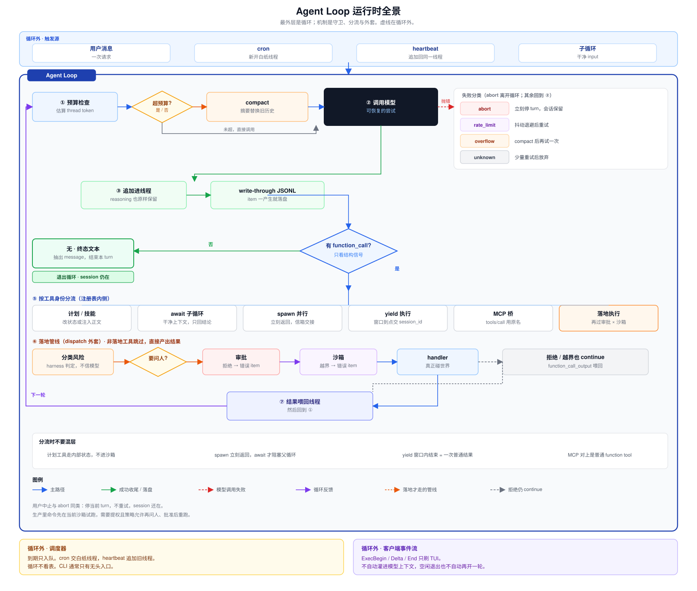
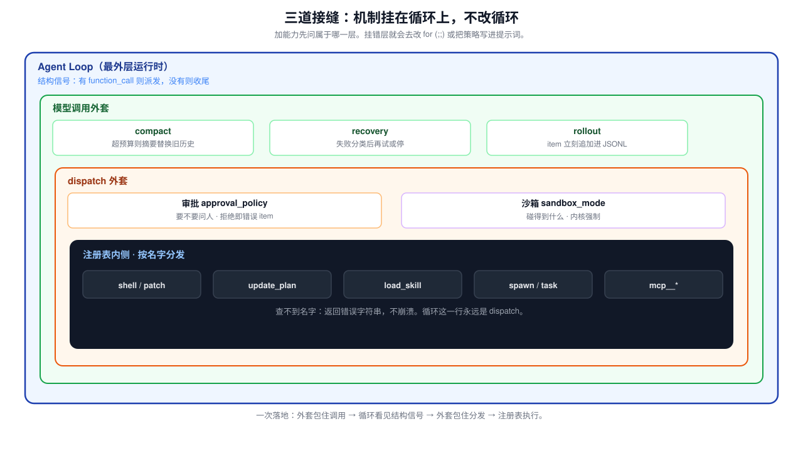
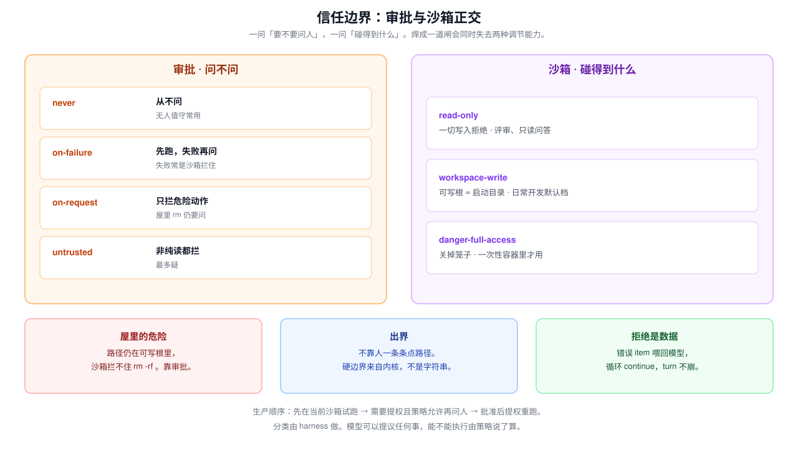
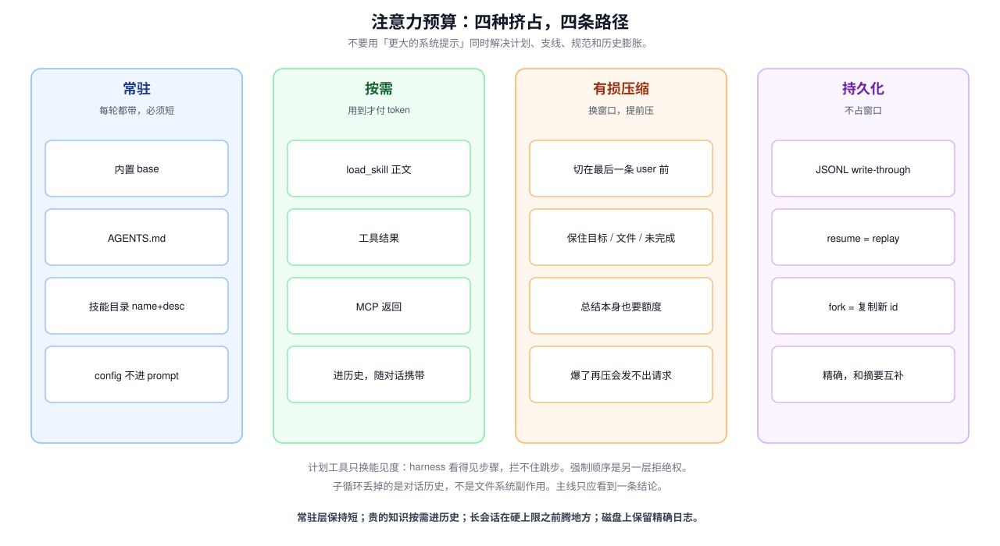
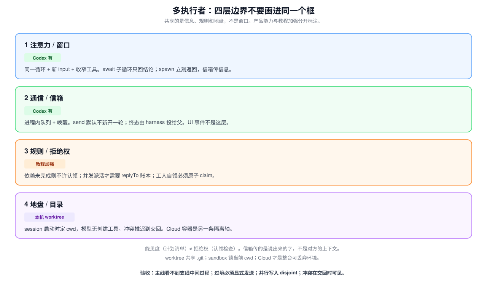

# Harness 工程：从 Agent Loop 到可生产系统

这篇笔记从一套把 Codex 拆开的课程里抽出可迁移的部分。目标不是复刻 Codex，而是掌握 **harness 工程**：把模型的一次决定，变成世界上可恢复、可审计、可限权的动作。课程编号只在文末对照表出现；正文按问题组织。

Harness 不是 prompt 工程，也不是「把工具函数堆进一个聊天机器人」。它是运行时。岗位上要能独立做的事可以收成四条：画出带全部分支的循环；把新能力挂到正确接缝上；把信任、注意力、时间、多执行者拆成正交轴；把失败、拒绝、超时都当成喂回模型的数据，而不是崩溃出口。

贯穿全文的三条约束：

1. **循环不改形状。** 加机制是在固定接缝上挂钩，不是另写一个大脑。
2. **决策权与执行权分离。** 模型产出结构信号；harness 执行、拦截、记录。拒绝也是普通工具结果，循环不停。
3. **看见不等于强制。** 计划清单增加能见度；审批、沙箱、认领检查才有拒绝权。两层不要焊成一道闸。

---

## 1. 全景：Agent Loop 是运行时

一次用户请求、一次定时触发、一次子 Agent 的干净输入，进入的都是同一个循环。循环做的事始终是：调用模型，把输出追加进唯一线程，按结构信号决定继续还是收尾，把工具结果喂回去。后面所有机制都是这条路上的守卫、分流和外套，不是第二套控制流。

停不停只看这一轮输出里有没有 `function_call`。有就派发，没有就抽出终态文本并退出。这条判据不解析自然语言。理解语义必然有边界情况；结构信号的边界更少。生产实现消费的是事件流：模型边生成边吐出完整的工具调用，harness 可以立刻派发，不必等整轮文本结束。只读调用因此能更早并行起跑。

循环里的状态只有一份：一条只增长的输入序列（线程）。模型每一轮的完整输出——推理过程、要说的话、工具调用——都原样追加。擅自裁剪或改写会让模型接不上自己刚才的判断。压缩、持久化、审批拦截都是在「往序列里追加什么、什么时候追加」上做文章，不改变它作为唯一状态源的地位。

这条运行时可以写成带守卫的状态机：

1. 入口可以是用户消息、cron 新开的白纸线程、heartbeat 追加回旧线程、或子 Agent 的干净 input。循环本身不看表。
2. 调模型之前估算 token。逼近预算则把旧历史总结成一条摘要，保留当前轮，再发请求。总结本身也要装进窗口，所以预算必须低于硬上限。
3. 调模型。失败先分类再恢复：限流退避，超长则压缩后只再试一次，用户中止立刻停 turn 并保留 session，未知错误少量重试后放弃。
4. 成功输出整段追加进线程，同时 write-through 落到只追加日志。
5. 没有 `function_call`：收尾退出。
6. 有调用：按工具身份分流。计划与技能只改 harness 状态或注入正文；`task` 嵌套一个 await 的子循环；`spawn_agent` 立刻返回、孩子自己跑；慢命令先等 yield 窗口；MCP 桥到外部进程；会碰世界的调用再过审批和沙箱。
7. 任一拒绝、越界、超时都写成 `function_call_output`，回到第 2 步。
8. 用户中止是一等出口：停当前 turn，会话还在。

机制并不都在同一层。对循环而言只有三道接缝：

| 接缝 | 位置 | 挂上去的机制 |
|------|------|----------------|
| 模型调用外套 | 发请求前后 | 预算压缩、错误恢复、rollout 落盘 |
| dispatch 外套 | 真正执行前 | 审批、沙箱 |
| 注册表内侧 | 按名字找到的 handler | shell、补丁、计划、技能、派生、MCP 桥 |

加第 N 个机制时，先问它属于哪一道接缝。挂错层的典型后果是改循环、把策略写进提示词、或让模型自己宣布「我很安全」。判断一套工具系统好不好的标准同样简单：加第 20 个工具如果比加第 2 个难得多，分发里已经混进了不该有的特殊逻辑。

---

## 2. 最小闭环：结构信号与工具契约

模型单次输出只能表达意图。它说要跑一条命令、读一个文件，这只是文本。真正执行并把结果交回，是 harness 的职责。把「模型决定 → harness 执行 → 结果喂回」自动化并重复到模型不再调工具，就是最小可运行的 agent。

只有一个 `shell` 时，每个意图都要先翻译成字符串：读文件拼 `cat`，写文件拼重定向，改一行拼 `sed`。这层翻译是纯负担——容易拼错，引号转义混乱，harness 拿到的是不透明字符串，执行前没法做类型校验，也不知道它要碰哪条路径。模型一轮里想做几件独立的事时，还被迫串成多条 shell。

解法是让能力本身成为结构化契约：

- **声明。** 每个工具在模型看到的清单里是一条带类型参数的 schema。模型填参数，不拼字符串。
- **分发。** harness 维护工具名到处理函数的映射。查不到就返回明确错误，不崩溃。
- **扩张代价是常数。** 新工具只改清单和映射表，循环不动。

分发按名字查表、无状态，同一轮内相互独立的调用天然可以并行。这不是额外设计出来的能力，是结构化调用的自然结果。分发表只回答「调用哪个、传什么参数」，不回答「这次能不能做」。后一个问题交给审批和沙箱，有意与分发分离。

改文件是工具契约里最值得单独设计的一类动作。给模型自由文本写权限——生成 `sed`，或直接吐出整份新文件——看起来灵活，会丢掉三样东西：

| 要求 | 自由文本写的问题 | 结构化补丁怎么解决 |
|------|------------------|--------------------|
| 可审查 | 真实效果要跑完才知道 | 补丁声明改哪个文件、锚定哪段、删加哪几行 |
| 原子性 | 多文件容易停在改了一半 | 先在内存里算出每个文件的最终形态，全部校验通过才落盘 |
| 失败可恢复 | 改坏的状态不明 | 上下文匹配失败则整体拒绝，并返回精确位置 |

补丁可以有两种暴露方式。普通 function tool 把补丁体塞进一个 JSON 字符串，只保证外层合法，格式错误靠解析器兜底。受文法约束的 freeform 工具在生成阶段就限制语法，模型在结构上产不出非法补丁。前者更通用，后者更强但要求生成接口支持受限解码。选哪种取决于能不能控制模型侧。失败路径的设计精度不该低于成功路径：错误越精确，模型下一轮越能针对性修正。

生产级循环与教学最小循环的差别，全是保护机制，不是另一种智能。先吃透「结构信号 + 注册表」，后面的门和外套才有地方挂。

---

## 3. 信任边界：两道正交的门

安全不能靠相信模型不会乱来。模型会误判，会被注入内容带偏，会对含糊指令做激进解读。真正可靠的边界必须写在 harness 里，而且要拆成两问：

- **审批**回答「这一下要不要先问人」。
- **沙箱**回答「这一下物理上碰得到什么」。

两问焊成一道闸会同时失去两种调节能力。每次读写都问人，agent 没法用；批过就以用户全部权限跑在真实工作区上，一个被批准的 `rm -rf /` 照样能清空磁盘。屋里的危险动作路径仍在可写根里，沙箱往往拦不住；出界不该靠人一条条点路径，人会手滑、疲惫、被说服。

审批需要的是可调节的信任档位，不是一律询问。常见四档是：从不问（`never`）、先跑失败再问（`on-failure`）、只拦危险（`on-request`）、非纯读都拦（`untrusted`）。风险分类由 harness 自己做，不信任模型的自我申报。被拒绝的调用不是崩溃：一条错误 item 喂回模型，模型换更安全的路线，循环照常继续。无人值守前端没有人可问，通常配 `never`，命令要么在沙箱里跑，要么直接失败。

沙箱需要的是机器强制的硬边界，并且包住每一次调用，包括「只是在项目里改文件」的那些。命令仍然写真实文件，不是先改副本再同步。三档画的是笼子的可写范围：只读、仅工作区、完全放开。`workspace-write` 把可写根设成启动目录；网络限制在生产里常常是同一道笼子的另一条边。教学实现用用户态路径检查示意边界思想；生产的强制力来自操作系统内核（macOS Seatbelt、Linux Landlock）。边界一旦依赖「harness 记得去检查」，就不是硬边界。

生产路径上两道门是拧在一起的：命令先按当前 `sandbox_mode` 在受限环境里试跑；需要更高权限（出界、联网）且 `approval_policy` 允许问人，再弹出审批，批准后用提升的权限重跑。`on-failure` 的「失败」很多时候就是沙箱拦住了。把两层拆开讲，是为了职责清晰；落地时顺序是「先关进笼子，再决定能不能升级」。

patch 与 shell 都过沙箱。只有显式切到完全放开（或跑在本来就可丢弃的容器里）才关笼子。审批和沙箱叠在同一条路上，各管一问，不是「区内审批、区外沙箱」。

---

## 4. 注意力是稀缺资源

上下文窗口有限。长任务会同时遇到四种不同的挤占：计划只存在模型脑子里，做着做着偏了；支线的几十轮中间过程淹没主线；项目规范一次性塞进系统提示，每轮都在烧无关 token；历史只增不减，直到 API 拒绝下一轮。这四种挤占用同一套「更大的提示词」解决，会把真正有效的指令稀释在噪音里。

正确的拆法是按成本结构分工。

**外化计划，只换能见度。** 多步任务的步骤如果只在模型内部，harness 看不见，自然没法在跑偏时拉一把。给模型一个不做任何实际工作的计划工具：动手前声明整份步骤列表，之后每有进展就重写同一份列表。harness 存的是当前完整计划，收到就整体替换，不做 diff 合并。状态只有 `pending` / `in_progress` / `completed`，同一时刻只允许一步进行中。计划工具走 harness 内部，不进沙箱。它增加的是规划的可见性，拦不住跳步。需要强制顺序时，必须另做带拒绝权的规则层（见第 8 节）。

**支线用干净上下文，只把结论带回来。** 追一条调用链读了三十个文件，这些中间过程跟最终目标无关，却占着主线程的位置。解法是同一个循环用一份全新输入再进一次：子循环工具表收窄（去掉派生类工具，防止不受控嵌套），跑完只返回结论文本，中间对话历史丢弃。文件系统副作用仍留在工作目录里，丢掉的只是注意力噪音。子 Agent 不是另一种 Agent，也不是第二个模型。价值在上下文边界，不在「多一个模型」。

**知识分成常驻目录和按需正文。** 把 React 规范、SQL 风格、提交格式全部拼进系统提示，改一个 CSS 颜色也要带着几千行。技能的最小形态是一个带 `name` / `description` 的文档：启动时只把目录拼进提示，正文在任务匹配时作为一次工具结果注入。目录每个技能几个 token，可以每轮常驻；正文几千 token，只在需要时付。走注册表按名字取，不走文件路径，避免路径遍历。项目里「永远适用」的约定（构建命令、提交语气）走常驻指令；「某类任务才用得上」的流程走技能。两者互补，不要把按需知识焊进常驻层。

**窗口快满时有损压缩，且必须提前压。** 线程默认只增不减，等于假设记忆免费。闸门加在每次调模型之前：超预算就把最早的若干轮总结成一条摘要项，丢掉原文，保留当前轮。切分点从后往前找最后一条用户消息，避免把 `function_call` 和它的 `function_call_output` 拆到两边。摘要来自另一次模型调用——没有工具、只要短文本、尽量保住当前目标、动过的文件、未完成工作。压缩本身要额度，贵的是把旧历史再读一遍的输入；之后每一轮都少传那一大段原文。等窗口已经爆了再压，连这次总结请求都发不出去。

**提示词是运行时组装出来的，配置不进提示词。** 内置 base 永远在，声明身份和工具用法。项目 `AGENTS.md` 存在才追加在后，换项目不用改 harness。真实系统还会并一份用户级全局指令。模型、推理档位、审批、沙箱是另一条解析路径，按「命令行 / 环境 > profile > 配置根 > 内置默认」覆盖。`config.toml` 不是另一段提示词；改 `--profile` 改的是这次调用的参数，不会往系统提示里追加文字。文本合并决定模型读到什么，配置解析决定它是谁、想多深、受哪档策略约束。

注意力管理的验收标准：常驻层保持短；贵的知识按需进历史；长会话在硬上限之前主动腾地方；计划对 harness 可见。做不到这四条，模型再强也会在第 N 轮忘了最初要干什么。

---

## 5. 会话是一等对象

从最小循环到压缩，线程都还只活在内存里。进程一关，会话就没了。长任务不能明天接着干，也没有任何记录可查「它改过哪些文件」。模型本身没有持久状态，所有记忆都在上下文里；上下文在内存里；内存随进程消失。问题不在模型记性差，而在 harness 从没把会话写到一个比进程更长寿的地方。

解法是把线程镜像成只追加的 JSONL 日志：每产生一个 item（用户消息、工具调用、工具输出、最终回复），立刻序列化成一行。不要把整个对话写成一个大 JSON 数组再整文件重写——历史越长越慢，写到一半崩溃可能让整份会话解析失败。JSONL 已落盘的行不动，最多丢最后没写完的那一行；`tail -1` 就是最新一条。

本机 CLI 选本地文件而不是 MySQL，是访问模式决定的：一个开发者、一台机器、一份会话一份日志，操作几乎只有追加、整段重放、复制、移动、删除。会话里常有源码和密钥，默认留在本机 home。数据库换来的并发、跨用户 JOIN、按任意字段检索，这个场景用不上，却要先跑服务、管账号、做 schema。产品变成多租户云端 Agent、要按人 / 仓库 / 时间检索或跨机共享时，再把这份日志同步进数据库才划算。那是另一套 harness。

围绕这份日志的生命周期都可以用文件操作表达：resume 是跳过文件头后按行 replay；fork 是复制成新 id（原会话不动，新头记下从哪岔出）；archive 是挪进隐藏目录；delete 才是删除。因为每一项在产生的瞬间落盘，进程死掉不丢数据；因为 fork 是复制，分支互不影响。这些操作没有一个需要改动循环。

压缩换的是窗口，rollout 换的是寿命。摘要是有损的，进程一关连摘要都没了。两层都要：活跃上下文里用摘要接续工作，磁盘上用精确日志恢复和分叉。

---

## 6. 失败是分类后的下一步

生产里 API 报错是常态：限流、过载、上下文超长、用户按 Esc。这些错的正确反应完全不同。把它们当成同一种崩溃，循环对「调用失败」就只有一个终点。需要的是一张「错误类型 → 恢复动作」对照表，包在模型调用外面，循环形状不变。

| 类型 | 触发信号 | 恢复动作 | 明确不做的事 |
|------|----------|----------|--------------|
| 限流 / 过载 | HTTP 429 / 529，消息里的 rate limit / overloaded | 带抖动的指数退避，最多 N 次 | 立刻放弃，或无上限重试 |
| 上下文超长 | HTTP 413，context length / too long | 压缩后只再试一次 | 等窗口爆了再压；压缩失败后继续死循环 |
| 用户中止 | AbortError / Esc | 立刻停当前 turn，会话保留 | 当错误重试 |
| 未知 | 其余 | 少量重试后放弃 | 与 429 走同一条路径 |

退避用 `min(base × 2^attempt, 上限)` 再加一小段随机抖动，避免一群并发请求在同一时刻一起重试。中止不是失败：重试一个用户主动取消的操作没有意义，但会话必须还能接着发下一条。

生产上常把瞬时 HTTP 错误的退避放在模型客户端层，对 turn 循环透明——上层看到的要么是成功的事件流，要么是已经重试过仍失败的错误。流式让「什么时候算失败」更细：连接可能在中途断开，客户端要判断已吐出的内容能否续上、还是必须整轮重来。恢复哲学不变：先分类，再选代价最小的路径。

工具执行的失败与模型调用的失败要分开看。审批拒绝、沙箱越界、未知工具名，走的是「错误字符串作为 tool output」这条路，循环继续。模型调用抛错，走的是这张分类表。两类都不要变成进程级异常。

---

## 7. 时间：循环不阻塞，也不自己看表

读文件是毫秒级，构建和安装是分钟级。同步 `exec` 把「调用」和「等到结束」绑成一件事，循环卡在子进程上，模型调用按 token 计费，空转就是烧钱。定时任务则是另一类时间问题：到点该跑一轮，不该等人来推。

两件事的解法都是 **把等待移出「这一次必须结束」**，但移法不同。

**慢操作：一次工具调用最多等一个 yield 窗口。** 先 `spawn` 子进程，等到窗口截止或进程退出。窗口内结束，这一次工具结果就是输出和退出码；还在跑，才把 `session_id` 交回去。模型拿到「仍在跑」之后可以去干别的，后续某一轮再用轮询式写入（空输入即 poll）再等一个窗口，把从上次切面之后的输出收割回来。快命令往往第一次就结束，不必让模型处理句柄。

子进程的实时输出走客户端事件流，给 TUI 刷进度。这条流不自动灌进模型上下文。模型要再看进度，必须再调收割工具，或等用户新开一轮。会话已经空闲时进程退出，也不该因此自动再开一轮推理——否则 harness 会在没人要求的时候烧一次模型。UI 事件不是模型输入。

教学上可以把快活留在同步 shell、只让慢命令走 yield，是为了让「拆开等待」看得见。生产核心里命令一律异步，前台后台只差在这一次工具调用是 await 到结束还是 yield 后再收。审批和沙箱对每一次落地执行同样生效。

**定时：闹钟在循环外面。** 循环不会自己看表。调度器每个 tick 只把到期任务入队；派发器在 agent 空闲时取出，按种类决定怎么把一条用户消息交进循环。`cron` 交的是一张白纸（新线程，发现进 inbox）；`heartbeat` 交的是「回到刚才那句话」（追加到同一条 thread）。队列把触发与执行解耦，调度器不必等 agent 跑完。

开源 CLI 往往只提供无头入口（给一个 prompt，跑完一轮，打事件流，退出）。真正的本地闹钟在带调度器的桌面应用里：定义落在配置文件，状态落在本地库，日程用 RRULE。系统 cron、CI、云侧任务、Gmail / Slack 事件，都是同一类「外面的触发器到点叫一次循环」。消费者（dispatcher）不用改，就能接别的事件源。无人值守默认仍受沙箱约束；没人点 y/n 时审批策略通常是从不问。

时间相关的验收标准：慢命令不阻塞推理；模型上下文里没有偷偷塞进去的 UI 事件；定时任务不长在循环内部。

---

## 8. 多执行者：共享信息、规则和地盘，不共享窗口

单个上下文盖不住「重构整个后端」这种跨模块任务。窗口就那么大，认证细节会在改路由时被挤出去。这里有三条必须分开的边界：注意力边界、协作规则边界、文件系统地盘。产品实现、教程加强、云侧隔离经常被画成一件事，下面分开写。

### 注意力：各带上下文，信箱传信息

一次性子循环（父 await 到子结束、只回收结论）能隔离一次跑偏，扛不住需要并行、持续、中途互传信息的任务。并行队友的最小集合是三件工具：派生立刻返回一个名字（或路径），不等孩子跑完；发信把消息排进对方信箱，默认不给空闲对方新开一轮；等待阻塞在「有更新」上，带超时，防止挂死。

每个队友仍是同一个循环，各持一份私有 input。孩子工具表收窄，防止递归爆炸；真实系统若允许嵌套，必须有并发上限。孩子收工时由 harness 向父信箱投递终态，不是模型再选一个「我打完了」的工具。过境的东西必须被说出来：研究者可以看完几十条笔记，只把一句结论发给写作者；root 窗口里甚至只有两封终态。

信箱是进程内通道（队列 + 唤醒），不是每个 Agent 一个磁盘文件。会话历史走 rollout 落盘；信箱本身随进程结束。发信与「唤醒对方开一轮」必须分开：闲聊进信箱不该立刻烧一次模型。要对方立刻干活，需要单独的 follow-up / assign，把唤醒位置为真。拓扑是树：完成通知一跳给父，祖父不会自动看见孙节点结束。同学之间可以直发，产品默认仍由 root 编排。每个子 Agent 自己烧 token，比单 Agent 贵；默认只在明确要求并行时才派生。

### 规则：看见计划，还是强制顺序

计划工具让步骤对 harness 可见，模型仍可以跳着做。多执行者要认同一份「谁先谁后」，必须有一个共享真相来源能拒绝非法开始。最小规则是：任务带依赖集合，依赖没全部完成就不许认领；完成时扫描下游，把刚解锁的任务报告出来。操作做成模型可调用的工具，结果就是板面状态，天然进上下文。

这层拒绝权是教程在计划状态机上多写的一步，用来把「顺序从自觉变成规则」讲清楚。主流 coding agent 的源码里通常只有能见度清单，没有带依赖图的认领 API。原则可迁移：编排多个执行者时，顺序不能靠各个模型自觉。实现可以是任务板、工作流引擎、或云侧调度器，不要把某一种教学 API 当成行业标准。

并发派活还有对账问题。信箱能把字送过去，三条回执同时到达时，靠语气对不上「答的是哪条请求」。生产默认往往是父一次关注一个（或少数）孩子，按 Agent 路径一跳完成通知，不需要 N 路 in-flight 请求对 N 路回执。一旦真正并发派活，就要有请求 id 与回执关联，未知 id 直接丢掉。这本账是教学加强，不是源码里已有的协议抄短。信封头区分的是「这封信是什么、要不要开一轮」；id 关联区分的是「它回答哪一次请求」。两层不要混。

把分配权下放给工人（自己看板、自己抢）时，新问题是 TOCTOU：两个空闲工人可以同时扫到同一份待领。`scan` 只是线索，不加锁，结果可能已经过时。唯一算数的检查在 `claim` 的临界区里：锁内复查仍空闲，才置进行中。输的人诚实认输，回去再扫下一份，不要重抢同一份。跨进程看板用数据库条件更新或 compare-and-swap，语义相同。主流产品默认仍是父派活；工人自领是教程为演示临界区多走的一步。云侧把作业推给隔离执行槽，也是推，不是 Agent 自己抢。

### 地盘：并行的手各改各的目录

注意力和规则都解决了「谁干什么」，还没解决「在哪干」。两个工人挤在同一个工作目录，对同一路径的写入会互相覆盖。本机并行 session 的最小隔离是 git worktree：另一份工作目录，挂一条分支（或 detached HEAD），共享同一个 `.git`。同一个路径因此可以同时以两份不同内容躺在磁盘上。模型没有「创建 worktree」工具；cwd 是 session 启动时 harness 定的，循环开始之后模型只看见自己的目录。

Worktree 给你的是同一个仓库里的另一份目录，不是另一份仓库。真正的冲突不会消失，而是被推迟到交回那一刻，由 git 诚实地暴露。产品出口通常是留目录、创建分支、handoff、开 PR，不会自动并进主分支。教学用一次 merge 把「推迟的冲突」演出来，不要写成产品有一条自动合并流水线。

目录隔离不是云侧环境隔离。Worktree 仍共享一台机器、一个内核、一份对象数据库。云侧任务跑在自己的容器或微虚拟机里，文件系统、进程、网络都分开，产物是 diff / PR。沙箱锁的是当前 cwd：两个 worktree 再加沙箱，写不进对方目录，那是沙箱的职责，不必在 worktree 层再叠一次路径检查。

多执行者的验收标准：主线看不到支线的中间过程；过境信息必须显式发送；完成通知有明确投递对象；并行写入有 disjoint 的地盘；冲突在交回时可见。能见度工具、拒绝权、信箱、工作目录，四件事不要画进同一个框。

---

## 9. 能力外延：标准协议，而不是改源码加工具

内置工具把能力边界焊在 harness 发布节奏上。公司内部的工单、部署系统、知识库，不能每个都重写进 agent，更不能每加一个就重新发一版。需要的是标准协议：外部服务实现它，agent 就能调用，不管那服务用什么语言、跑在哪台机器上。MCP（Model Context Protocol）是这条路上的现行协议。

连接发生在循环开始之前。配置里声明服务器的启动命令（以及可选的环境、工作目录）；harness 在会话启动时把每个服务器 spawn 成子进程，经 stdio 按行收发 JSON-RPC：先握手，再列出工具，再把每个工具桥成普通 function tool。模型没有「先连接再调用」的工具。给模型看的名字带服务器前缀，避免两台服务器的同名工具撞车；真正打给子进程的是原始工具名。

对循环来说，桥过来的工具和内置工具长得一样：一个名字、一份 schema、一次分发。循环不知道、也不需要知道背后是外部进程。加能力从改源码变成改配置。HTTP 传输、工具白名单、OAuth、把 agent 自己当 MCP 服务器对外暴露，都是同一座桥的延伸，不改变「启动时发现、按名调用」这条主干。

破坏性的外部工具仍走审批。桥接不是提权。MCP 子进程是另一条进程，不要把 spawn 说成沙箱；沙箱锁的仍是当前 cwd 里那次落地执行。

---

## 10. 组合：机制很多，循环一个

真实 harness 不会只带一个机制上工。难点不是把工具、审批、沙箱、计划、记忆、子循环、MCP 堆在一起，而是看清它们各自挂在循环的哪一道接缝上。套回去之后，一次落地执行的旅程是：记忆与恢复包住模型调用，循环根据结构信号进入分发，沙箱与审批包住注册表，结果作为普通输出回到线程。哪一层说不，都把错误喂回去，循环不停。

可迁移的判断清单：

- 新机制先归类：注册表工具、dispatch 外套、模型调用外套、还是循环外的触发器。归不进去，就会去改循环。
- 安全两轴独立配置。能见度工具不代替拒绝权。
- 所有拒绝、超时、越界、未知工具，都是数据。进程级异常留给真正不可恢复的情况。
- UI 事件流不等于模型输入。调度器不等于循环。
- 压缩有损、且必须提前。持久化精确、且必须 write-through。
- 子执行者共享信息与规则，不共享窗口；并行写入共享仓库，不共享工作目录。
- 外部能力走发现与桥接，不走「模型先调用连接工具」。
- 能在全景图上指出 compact、审批拒绝、沙箱越界、立即返回的派生、cron 触发各自发生在循环内还是循环外。

课程把机制拆开教，是为了每次只看一道接缝。生产系统是这些接缝同时在场。读到这里，回头看任何一章的实现，认的是同一张图上的一个钩子。

---

## 对照与范围

下面只为回读原章节。教学加强标明了，避免把教程发明说成某产品的 API。

| 机制 | 接缝 | 原章节 | 归属 |
|------|------|--------|------|
| 结构信号循环 | 运行时本身 | s01 | 内核 |
| 结构化工具 / 补丁 | 注册表 | s02 | 内核 |
| 审批 | dispatch 外套 | s03 | 内核 |
| 沙箱 | dispatch 外套 | s04 | 内核；强制力在 OS |
| 计划清单 | 注册表（内建，不进沙箱） | s05 | 能见度 |
| 子循环 | 注册表 | s06 | 内核（await 形态） |
| 技能两级加载 | 注册表 + 提示目录 | s07 | 内核 |
| 上下文压缩 | 模型调用外套 | s08 | 内核 |
| 会话 JSONL | 模型调用外套 | s09 | 内核 |
| 指令组装 / 配置覆盖 | 循环外组装，结果喂进调用 | s10 | 内核 |
| 错误分类恢复 | 模型调用外套 | s11 | 内核 |
| 依赖任务板 | 注册表 + 拒绝权 | s12 | **教程加强** |
| yield 执行 | 注册表 | s13 | 内核（`unified_exec`） |
| 定时触发 | 循环外调度器 | s14 | CLI 仅无头入口；闹钟在 App |
| 并行队友 / 信箱 | 注册表 + 进程内通道 | s15 | 产品 Multi-Agent |
| 请求-回执账本 | 信箱上的教学协议 | s16 | **教程加强** |
| 工人自领 | 任务板上的并发 claim | s17 | **教程加强** |
| git worktree | session 启动时定 cwd | s18 | 本机并行；教学 merge 不是产品出口 |
| MCP 客户端 | 启动时发现，注册表桥接 | s19 | 内核 |
| 三接缝合成 | 全文 | s20 | 组合原则 |

Cloud 容器隔离、把引擎当 MCP 服务器暴露、插件打包，落在这条 1–20 主线之后，不在本文展开。隔离轴可以记一句：worktree 是目录，sandbox 是当前 cwd 的内核策略，Cloud 是整台可丢弃的执行环境。
