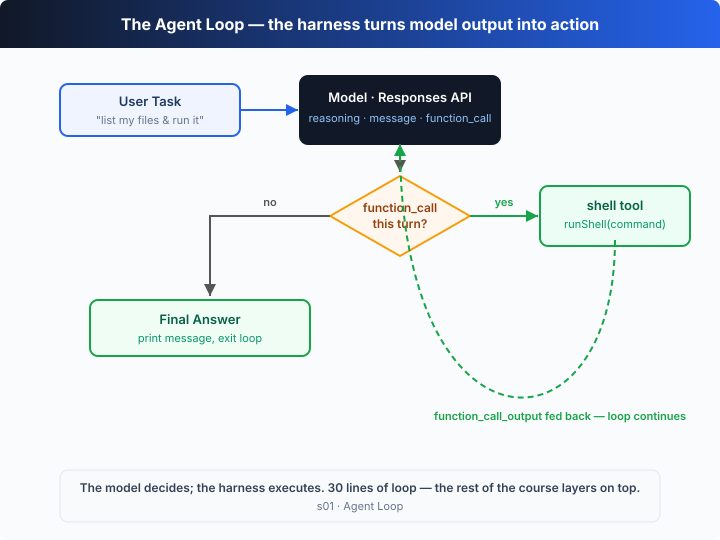

# s01: The Agent Loop — One Loop Is All You Need

[中文](README.md) · [English](README.en.md)

`s01` → [s02](../s02_tool_use/) → s03 → s04 → ... → s20
> *"One loop & a shell is all you need"* — one tool + one loop = an agent.
>
> **Harness layer**: the loop — the first connection between the model and the real world.

---

## The Problem

You ask the model: "List the files in my current directory, then run `XXX.ts`."

The model can emit a shell command, but then it stops — it won't run it, can't see the result, and can't keep reasoning from that result.

You could run it yourself, paste the output back, and let it continue; when the next command appears, you run and paste again.

Every round trip, *you* are the middleman. Automating that middleman is what this chapter is about.

---

## The Solution



A `for (;;)` loop: keep going while the model calls tools, stop when it doesn't. Codex uses the OpenAI **Responses API** — each turn the model returns a list of output items, and the loop only cares about one signal:

| output item | meaning | loop action |
|-------------|---------|-------------|
| `type == "function_call"` | the model says "I want to use a tool" | execute → feed the result back as a `function_call_output` → continue |
| no `function_call` (only a `message`) | the model says "I'm done" | print the final text, exit the loop |

A `reasoning` item is the chain-of-thought of a reasoning model like the ones Codex runs on; the harness keeps it in context and it doesn't change the loop.

---

## How It Works

Translate this into TypeScript, step by step:

**Step 1**: the user's question becomes the first input item.

```ts
const thread = [{ role: "user", content: query }];
```

**Step 2**: send the input plus tool definitions to the model (Responses API).

```ts
const resp = await openai.responses.create({
  model: MODEL, instructions: INSTRUCTIONS,
  input: thread, tools: TOOLS,
  reasoning: { effort: "medium" },   // Codex runs on reasoning models
});
```

**Step 3**: append the whole turn (reasoning + message + tool calls) to the thread, then check for tool calls. None → done.

```ts
thread.push(...resp.output);
const calls = resp.output.filter((i) => i.type === "function_call");
if (calls.length === 0) return;
```

**Step 4**: execute each tool call and collect the results.

```ts
for (const call of calls) {
  const { command } = JSON.parse(call.arguments);
  const result = runShell(command);
  thread.push({ type: "function_call_output", call_id: call.call_id, output: result });
}
```

**Step 5**: results are back in the thread — go to step 2.

Assembled into one function:

```ts
async function agentLoop(input) {
  for (;;) {
    const output = await callModel(input);
    input.push(...output);

    const calls = output.filter((i) => i.type === "function_call");
    if (calls.length === 0) return;            // no more tool calls → done

    for (const call of calls) {
      const result = runShell(JSON.parse(call.arguments).command);
      input.push({ type: "function_call_output", call_id: call.call_id, output: result });
    }
  }
}
```

Thirty-odd lines: the smallest runnable kernel of an agent harness. It isn't intelligence itself — it's the minimal frame that lets the model *keep acting*. **The model decides** (whether to call a tool, and which); **the harness executes** (run it, feed the result back). The next 19 chapters layer mechanisms on top of this loop, and the loop itself never changes.

---

## Try It

> **Teaching demo note**: with an API key, the code runs shell commands the model generates. Use a scratch directory so you don't touch real project files. Offline mode only writes to `.tmp/s01/` at the repo root. s03/s04 build the real approval + sandbox system.

**No API key needed**: without `OPENAI_API_KEY` this chapter runs a **fixed script** — it **ignores your prompt** and always demos "create `hello.ts` → `cat` to verify → stop", the same storyboard as the web simulator. Type anything; watch `function_call` (`continue`) vs `message` (`stop`).

**Setup** (first run):

```sh
npm install
cp .env.example .env        # fill in OPENAI_API_KEY and MODEL_ID to run the real model
```

**Run**:

```sh
npx tsx s01_agent_loop/code.ts                # offline script (ignores the prompt)
OPENAI_API_KEY=sk-... npx tsx s01_agent_loop/code.ts   # real model (commands follow the task)
```

With a key, try these prompts:

1. `Create a file called hello.ts that prints "Hello, Codex!"`
2. `List all TypeScript files in this directory`
3. `What is the current git branch?`

Watch for: each turn prints the full `output` array. `type: function_call` means call a tool, `name` is the tool, `arguments` holds the command; `type: message` is text. `$` is the harness running a command — it is not part of `output`. A second prompt in the same process does **not** re-run the script.

---

## What's Next

Right now the model only has the `shell` tool: reading a file means `cat`, writing means `echo ... >`, finding means `find` — ugly and error-prone.

s02 Tool Use → give it a set of real structured tools (read, write, apply_patch, search). What happens? Will it call several tools in parallel? Do concurrent tools step on each other?

<details>
<summary>Into the Codex source</summary>

> The following is based on the overall structure of OpenAI's open-source [`openai/codex`](https://github.com/openai/codex) repo (`codex-rs`, written in Rust). The chapter's thirty-line `for (;;)` is the minimal skeleton of Codex's core turn loop; every difference is a protection mechanism added for production robustness.

**The chapter's `agentLoop` ≈ Codex's turn loop.** Each item below hardens that core.

<details>
<summary>1. Loop condition: more than "no function_call means stop"</summary>

The chapter decides whether to continue by "did this turn still contain a `function_call`". Codex's core loop (`run_turn` / `try_run_turn` in `core`) consumes a **stream of events**: the harness sees each `ResponseItem` as the model generates it and dispatches a tool call as soon as it's complete, rather than waiting for the whole turn. That lets tools start earlier and run in parallel (see s13 on background tasks).

</details>

<details>
<summary>2. Session state: the chapter only has one input array</summary>

| # | Concept in Codex | purpose | chapter |
|---|------------------|---------|---------|
| 1 | conversation history / turn context | the input items for this iteration | s01 |
| 2 | `ExecPolicy` + sandbox handle | how each command is approved and where it runs | s03 / s04 |
| 3 | compaction state | auto-compact when context fills up | s08 |
| 4 | session rollout / persistence | resume, `codex resume` | s09 |
| 5 | error & retry counters | classify and recover from failures | s11 |

The chapter keeps only #1; the rest are added back one per chapter.

</details>

<details>
<summary>3. Multiple exit & recovery paths</summary>

The chapter has one exit (the model stops calling tools). A production Codex turn also handles: user interrupt (Esc), approval denial, sandbox violations, model rate limits and retries, output-token ceilings, and compaction retries when context overflows. Each maps to a recovery or exit strategy (expanded in s11, error recovery).

</details>

<details>
<summary>4. Approval & sandboxing are the real differentiators</summary>

Codex makes "can this command run, and where" a first-class citizen of the harness: `approval_policy` (untrusted / on-failure / on-request / never) decides when to stop and ask a human, and `sandbox_mode` (read-only / workspace-write / danger-full-access) plus OS-level isolation (Seatbelt on macOS, Landlock on Linux) decides what a command can actually touch. This chapter only uses a string match as a stopgap; s03/s04 build the real thing.

</details>

**In one line**: Codex's production turn loop is still "call the model → run the tool → feed the result back" at its core. Every extra field and exit path is a protective mechanism. Master the core loop first and everything else unfolds naturally.

</details>

<!-- translation-sync: zh@v1, en@v1 -->
