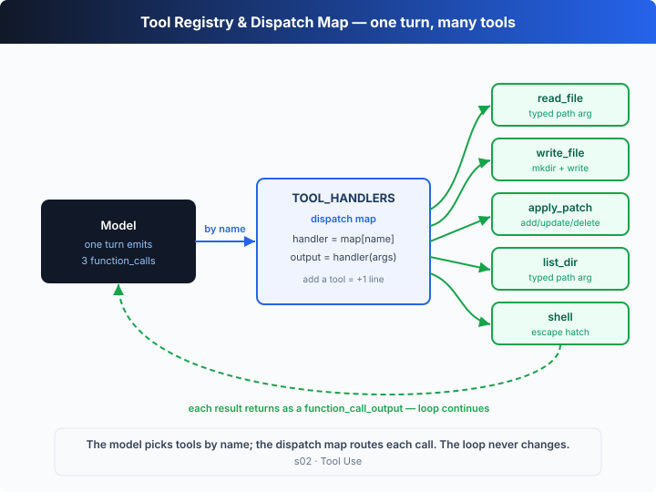

# s02: Tool Use — Add a Tool, Add a Line

[中文](README.md) · [English](README.en.md)

`s01` → `s02` → [s03](../s03_approval/) → s04 → ... → s20
> *"Add a tool, add a line"* — the loop stays put; register a new tool in the dispatch map and it's live.
>
> **Harness layer**: tool dispatch — extending the boundary of what the model can reach.

---

## The Problem

The s01 agent has only the `shell` tool. To read a file, the model has to assemble `cat path/to/file`; to write a file, `echo "..." > file`; to change one line, `sed -i 's/old/new/'`.

The model is *thinking* "read this file" but is forced to translate that into a shell string first. That extra translation layer wastes tokens, is easy to get wrong, turns quoting/escaping into a mess — and the harness receives a blob of text it can't type-check or use to know which path is being touched.

Worse, the model often wants to do several things at once — read a, read b, list a directory. If each action has to be encoded as shell and sent one at a time, it's slow and easy to lose context.

---

## The Solution



Give the model a set of **structured tools**, plus a **dispatch map** that routes each call by name. The model no longer assembles shell; it says "call `read_file` with `{path: "a.ts"}`". The harness receives a `function_call`, looks it up, invokes the matching function, and feeds the result back.

Adding a tool takes exactly two edits: one schema in `TOOLS` (telling the model "what I can do") and one mapping in `TOOL_HANDLERS` (telling the harness "how to do it"). The loop itself doesn't change by a single line.

The five tools registered in this chapter:

| tool | purpose | why structured beats raw shell |
|------|---------|--------------------------------|
| `read_file` | read a file (optionally first N lines) | `path` is a typed arg — no `cat`, clean output |
| `write_file` | write a file (auto-creates parent dirs) | no quoting/escaping or redirection to get wrong |
| `apply_patch` | add / update / delete files (Codex-style patch) | several edits in one submission, explicit and reviewable |
| `list_dir` | list a directory | no parsing of free-text `ls` output |
| `shell` | run any command | kept as the "escape hatch", no longer the only option |

The model can also return **several `function_call`s in a single turn** — "read a, read b, list the directory" said all at once — and the harness dispatches each in turn. That's fan-out.

---

## How It Works

The s01 loop is kept intact; the only change is in the "execute the tool" step: a hardcoded `runShell()` becomes a table lookup.

**Step 1**: define the tool schemas — the "menu" the model sees. Each is a Responses API function tool.

```ts
const TOOLS = [
  { type: "function", name: "read_file",  /* parameters: { path, limit? } */ },
  { type: "function", name: "write_file", /* parameters: { path, content } */ },
  { type: "function", name: "apply_patch",/* parameters: { patch } */ },
  { type: "function", name: "list_dir",   /* parameters: { path } */ },
  { type: "function", name: "shell",      /* parameters: { command } */ },
];
```

**Step 2**: each tool maps to an implementation function. Args are typed, not free strings.

```ts
function runReadFile(p: string, limit?: number): string {
  const lines = fs.readFileSync(resolvePath(p), "utf8").split("\n");
  return (limit ? lines.slice(0, limit) : lines).join("\n");
}
```

**Step 3**: register them in the dispatch map — tool name to handler. Adding a tool = adding one line.

```ts
const TOOL_HANDLERS: Record<string, (a: Args) => string> = {
  read_file:  (a) => runReadFile(String(a.path), a.limit),
  write_file: (a) => runWriteFile(String(a.path), String(a.content)),
  apply_patch:(a) => runApplyPatch(String(a.patch)),
  list_dir:   (a) => runListDir(String(a.path)),
  shell:      (a) => runShell(String(a.command)),
};
```

**Step 4**: dispatch — look the name up, parse args, invoke. Unknown tools return an error instead of crashing.

```ts
function dispatch(name: string, argsJson: string): string {
  const handler = TOOL_HANDLERS[name];
  if (!handler) return `Error: unknown tool '${name}'`;
  return handler(JSON.parse(argsJson));
}
```

**Step 5**: in the loop, swap the hardcoded `runShell(...)` for `dispatch(...)`. However many calls the model returns in a turn, that's how many get dispatched — that's fan-out.

```ts
for (const call of calls) {                 // a turn may hold several function_calls
  const result = dispatch(call.name, call.arguments);   // ← the one line that changed
  input.push({ type: "function_call_output", call_id: call.call_id, output: result });
}
```

The assembled loop is character-for-character identical to s01 except for that one execution line. That's the real power of structured tools: **the loop stays generic, and capability grows by registration**. The model picks tools and fills in args; the harness routes, executes, and feeds results back. Every later chapter (approval, sandbox, planning) just adds a layer in front of or behind this dispatch table — the table itself never moves.

---

### A closer look: the apply_patch grammar

The most interesting entry in the registry is `apply_patch`. Codex does not let the model edit code with `sed -i` / `echo >`; it asks for a **structured patch** — a tiny line-oriented DSL. The full grammar (the chapter's `parsePatch` implements a subset):

```text
*** Begin Patch
*** Update File: path/to/a.md        # modify an existing file
*** Move to: path/to/b.md            # (optional) rename / move it along the way
@@                                   # hunk header: anchors the change that follows
 context line (one leading space, kept verbatim)
-line to remove (leading -)
+line to add (leading +)
*** End of File                      # (optional) anchor at end of file
*** Add File: path/to/c.md           # create a file: the following + lines are its content
+first line of the new file
*** Delete File: path/to/d.md        # delete a file
*** End Patch
```

What each directive means:

| directive | purpose | note |
|-----------|---------|------|
| `*** Begin Patch` / `*** End Patch` | the patch envelope wrapping every operation | one patch may hold several file ops |
| `*** Add File: <path>` | create a file | the following `+` lines are its content; errors if the file already exists |
| `*** Update File: <path>` | modify a file | followed by one or more hunks |
| `*** Move to: <path>` | rename / move | only valid right after `Update File` |
| `@@` | hunk header | separates distinct edit hunks and anchors context |
| `*** End of File` | end-of-file anchor | marks a hunk as applying at EOF |
| ` ` / `-` / `+` line prefix | context / remove / add | the three kinds of hunk body line |

Why does Codex prefer a structured patch over letting the model edit files freeform? Three words:

- **Reviewability**: a patch *is* a diff — a human can see at a glance which file changed, which lines were removed, which were added. The real effect of `sed -i 's/.../.../'` is only known after it runs.
- **Atomicity**: the chapter parses the *entire* patch first (`parsePatch`), then computes every file's final form in memory, and only touches disk once *everything* validates. If any file's context fails to match, the whole patch is rejected — the disk ends up either fully updated or byte-for-byte untouched, never half-written.
- **Failure recovery**: each `Update File` hunk must first *find its context* in the file's current content before replacing. No match? You get a precise error (`Error: context not found in <path>`), and the model retries with that error on the next turn — instead of staring at a corrupted file.

The offline demo shows both outcomes: the first patch lands cleanly, the second has context that doesn't match and is rejected wholesale, and the `read_file` right after proves the file is untouched.

---

## Try It

> **Teaching demo note**: with an API key, the code runs tool calls the model generates (write files, apply patches, run shell). Use a scratch directory so you don't touch real project files. Offline mode only writes to `.tmp/s02/` at the repo root. s03/s04 build the real approval + sandbox system.

**No API key needed**: without `OPENAI_API_KEY` this chapter runs a **fixed script** — it **ignores your prompt** and always demos "one turn writes two files → one turn applies two patches (one lands, one is rejected because context does not match) → verify", the same storyboard as the web simulator. Type anything; watch `function_call` (`continue`) vs `message` (`stop`), and how several `function_call`s in one turn are routed by `name`.

**Setup** (first run):

```sh
npm install
cp .env.example .env        # fill in OPENAI_API_KEY and MODEL_ID to run the real model
```

**Run**:

```sh
npx tsx s02_tool_use/code.ts                # offline script (ignores the prompt)
OPENAI_API_KEY=sk-... npx tsx s02_tool_use/code.ts   # real model (tools follow the task)
```

With a key, try these prompts:

1. `Create two files a.md and b.md, then list the directory` (fan-out of several calls in one turn)
2. `Read README.md and summarize this project in a new file SUMMARY.md` (read + write)
3. `Use a patch to add a "Usage" section to SUMMARY.md` (apply_patch)

Watch for: each turn prints the full `output` array. Several `function_call`s in one turn are fan-out; the harness routes each by `name`. The `apply_patch` argument is the patch body — don't look at a summary. In the second turn one patch commits and the other is rejected wholesale; the following `read_file` proves the file is untouched. A second prompt in the same process does **not** re-run the script.

---

## What's Next

The model now holds five tools, and `write_file`, `apply_patch`, and `shell` can write or delete at will. Ask it to "clean up the project" and it might actually delete things.

s03 Approval → put an approval gate in front of tool execution: should this operation ask the user first? What's the difference between the four `approval_policy` modes?

<details>
<summary>Into the Codex source</summary>

> The following is based on the overall architecture of OpenAI's open-source [`openai/codex`](https://github.com/openai/codex) repo (`codex-rs`, written in Rust). The chapter's "schema array + dispatch map" is the minimal skeleton of Codex's tool system; the differences are production-grade robustness and safety.

**The chapter's `TOOL_HANDLERS` ≈ the layer where Codex routes a model function call to a concrete tool implementation.** A few key points from the real implementation below.

<details>
<summary>1. Tools are first-class — apply_patch especially</summary>

In the tool set Codex exposes to the model, `apply_patch` isn't a nice-to-have; it's the **preferred way to modify files**. The model is explicitly steered to edit code with a structured patch (`*** Begin Patch ... *** Add/Update/Delete File ...`) rather than `echo >` or `sed`. The chapter implements a minimal Add/Update/Delete/Move parser; the real repo has a full patch grammar with parsing and validation that handles context matching, file moves, and more — and a patch passes through approval and the sandbox before it ever touches disk (see s03/s04).

**Freeform or JSON function?** This is a real detail worth getting straight. `apply_patch` can be exposed to the model in two ways:

| form | what the model sees | strength of constraint |
|------|---------------------|------------------------|
| ordinary function tool (what the chapter uses) | one JSON arg `{ "patch": "<string>" }` | only guarantees valid JSON; the patch body can be any string, so the harness must catch bad input at parse time |
| freeform custom tool | a **raw text** body constrained by a dedicated **grammar** | the model is constrained by the grammar *while generating*, so it **cannot emit a malformed patch at all** |

This distinction used to be controlled by the `apply_patch_freeform` feature flag. In current Codex (v0.144.x), `codex features list` reports that flag as `removed` — the grammar-constrained freeform form has "graduated" to be the standard behavior, no longer a toggleable experiment. The chapter uses the first form so it can demo over an ordinary Responses API function tool, but the parser (`parsePatch`) teaches the very same real grammar.

</details>

<details>
<summary>2. Dispatch isn't a HashMap lookup — it's routing inside an event stream</summary>

The chapter iterates the `calls` array after a turn finishes and dispatches each one. Codex's core loop consumes a **stream of events**: as the model generates `ResponseItem`s, the harness pulls out each complete function call as soon as it arrives and hands it to the matching tool logic, rather than waiting for the whole turn. Independent tool calls can start earlier and run in parallel (read-only tools have no interdependencies and can run concurrently), and each result returns to context as a `function_call_output`. In the real implementation fan-out is *true concurrency*; the chapter runs calls sequentially — same concept.

</details>

<details>
<summary>3. Every tool call passes through a validation + policy pipeline</summary>

The chapter's `dispatch` only "parses args + invokes". Before Codex actually executes a tool, it validates the arguments and then layers two policies on top:

| layer | purpose | chapter |
|-------|---------|---------|
| argument / schema validation | are the arg types and required fields valid | s02 (the chapter leans on JSON Schema) |
| `approval_policy` | should this call ask the user first | s03 |
| `sandbox_mode` + OS isolation | what resources can this call actually touch | s04 |

This chapter only has the top layer; the two below are added back in s03/s04, and the dispatch table never changes.

</details>

<details>
<summary>4. The tool set is extensible — MCP beyond the built-ins</summary>

Beyond Codex's built-in tools (read, write, patch, shell, …), external tools can be plugged in via `mcp_servers`: their schemas are listed to the model alongside the built-ins, and calls are bridged to the corresponding MCP server. To the model, a built-in and an MCP tool look identical, and the dispatch layer handles them uniformly. s19 covers MCP bridging in detail.

</details>

**In one line**: Codex's tool system is still "the model picks a tool by name, the harness routes and executes, the result is fed back". The real implementation moves that layer into an event stream and adds concurrency plus a policy pipeline. Get "register + dispatch" solid first; approval and the sandbox are just layers added around this table.

</details>

<!-- translation-sync: zh@v3, en@v3 -->
