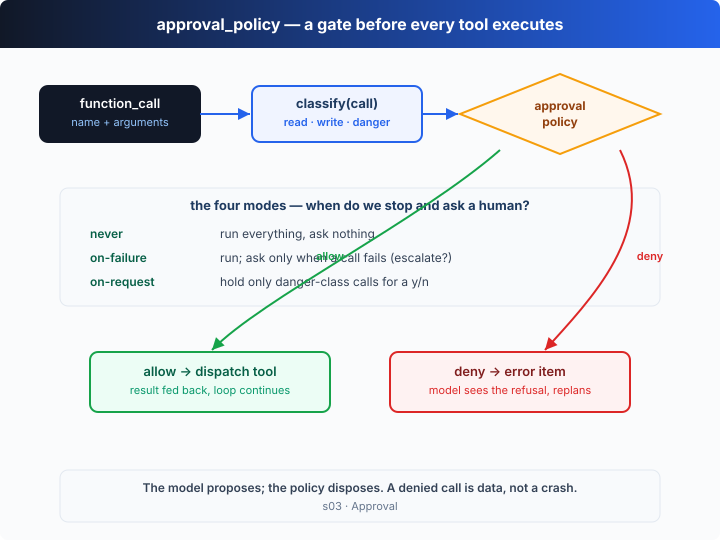

# s03: Approval — Ask Before You Execute

[中文](README.md) · [English](README.en.md)

s01 → s02 → `s03` → [s04](../s04_sandbox/) → ... → s20
> *"The model proposes, the policy disposes"* — the model suggests; the approval policy decides.
>
> **Harness layer**: approval — a gate in front of tool execution.

---

## The Problem

The s02 agent has a set of tools, and every call runs **the moment it's made**. Say "clean up my project" and it might actually run `rm -rf`.

Safety can't rest on "trusting the model not to misbehave". Models misjudge, get steered by injected malicious content, and read aggressive intent into vague instructions. A reliable boundary has to live in the harness: *before* a tool executes, decide whether this one needs a human.

But asking for every call is unbearable — confirm every file read and the agent is useless. What's needed is an **adjustable trust dial**.

---

## The Solution



Insert an **approval gate** in front of dispatch. The harness first classifies each tool call into a risk level (`read` / `write` / `danger`), then the `approval_policy` decides: run it straight away, hold it for a human, or ask only when it fails.

Codex's `approval_policy` has four modes — four trust settings:

| mode | meaning | when does it stop and ask a human |
|------|---------|-----------------------------------|
| `never` | full trust, ask nothing | never — every call runs |
| `on-failure` | run first, ask on failure | only when a call **fails**, ask whether to escalate and retry |
| `on-request` | hold only the dangerous | only when a call is classified `danger` (e.g. `rm -rf`) |
| `untrusted` | most suspicious, hold by default | anything that isn't a pure read (`write` / `danger` / unknown) |

A held call pauses in the REPL, waiting for your `y`/`n`. **A denial is not a crash**: the harness feeds an error item back to the model, which reads "I was denied" and can continue down a safer path.

---

## How It Works

On top of s02's dispatch loop, add exactly one layer: "classify + approval gate".

**Step 1**: classify — the harness judges risk itself, rather than trusting the model's self-report.

```ts
type Risk = "read" | "write" | "danger";
function classify(call: OutputItem): Risk {
  if (call.name === "read_file" || call.name === "list_dir") return "read";
  if (call.name === "shell") {
    const cmd = JSON.parse(call.arguments).command.trim();
    if (DANGER.some((d) => cmd.includes(d))) return "danger"; // rm/sudo/dd/...
    if (READ_ONLY.some((r) => cmd.startsWith(r))) return "read"; // ls/cat/git status/...
    return "write";
  }
  return "write"; // write_file / apply_patch / unknown tools all mutate state
}
```

**Step 2**: the policy decision — should this call be held before it runs?

```ts
function needsApprovalUpFront(policy: Policy, risk: Risk): boolean {
  switch (policy) {
    case "never":       return false;              // ask nothing
    case "on-request":  return risk === "danger";  // hold only dangerous calls
    case "untrusted":   return risk !== "read";    // hold anything not a pure read
    case "on-failure":  return false;              // run first, ask after a failure
  }
}
```

**Step 3**: the gate. If held, ask; if denied, feed an error item back and the loop carries on.

```ts
if (needsApprovalUpFront(POLICY, risk)) {
  const ok = await confirm(`hold [${POLICY}] ${call.name} risk=${risk}. Allow?`);
  if (!ok) {
    input.push({ type: "function_call_output", call_id: call.call_id,
                 output: `Error: denied by approval_policy (${POLICY})` });
    continue; // the model sees the denial and picks a safer path
  }
}
let result = dispatch(call.name, call.arguments);
```

**Step 4**: `on-failure` is a different rhythm — nothing is held up front; the ask comes **after a failure**, offering an escalated retry.

```ts
if (POLICY === "on-failure" && result.startsWith("Error")) {
  if (await confirm("call failed [on-failure] retry with approval?")) {
    result = dispatch(call.name, call.arguments); // retry with approval
  }
}
```

All four policies share one `classify`; they differ only in *when to ask*. The key insight: **approval is the harness's job, not the model's politeness**. The model may propose anything; whether it runs is the policy's call. And a "denial" is just ordinary data to the model — it reads it and keeps reasoning, instead of the whole turn blowing up.

---

## Try It

> **Teaching demo note**: the offline demo has the model attempt an `rm -rf agent_scratch`, which the gate holds for your answer. When piping an answer, put the `y`/`n` after the task (e.g. `printf 'do it\nn\nq\n'`). The code only creates/deletes `agent_scratch/` in the current directory.

**No API key needed**: the default policy is `on-request`. The offline model issues a safe write and a dangerous `rm -rf` in a **single turn**, so you can see "write allowed, dangerous command held". Flip through all four policies with the env var.

**Setup** (first run):

```sh
npm install
cp .env.example .env        # fill in OPENAI_API_KEY and MODEL_ID to run the real model
```

**Run**:

```sh
npx tsx s03_approval/code.ts                              # default: on-request
APPROVAL_POLICY=untrusted npx tsx s03_approval/code.ts    # holds the write too
APPROVAL_POLICY=never     npx tsx s03_approval/code.ts    # asks nothing
OPENAI_API_KEY=sk-...     npx tsx s03_approval/code.ts    # real model
```

Try these prompts:

1. `Create a scratch folder and put a note in it` (a write; allowed under on-request, held under untrusted)
2. `Delete the scratch folder` (`rm -rf` is classified danger; held for you under on-request)
3. `List the files here` (a pure read; every policy lets it straight through)

Watch for: with the same set of calls, which get held and which get allowed under each policy? How does a denied call turn into an error item fed back to the model?

---

## What's Next

Approval answers "should it run", but even when you type `y`, what the command can actually *touch* is still unrestricted — an approved `rm -rf /` can still wreck the system. And under `on-request`, the model asks you every time it writes outside the workspace, which gets tedious.

s04 Sandbox → draw a hard boundary at the execution layer with `sandbox_mode`: read-only / workspace-write / fully open. Approval governs "do we ask"; the sandbox governs "what can be touched".

<details>
<summary>Into the Codex source</summary>

> The following is based on the overall architecture of OpenAI's open-source [`openai/codex`](https://github.com/openai/codex) repo (`codex-rs`, written in Rust). The chapter's "classify + four-mode policy + hold-and-ask" is the minimal skeleton of Codex's approval mechanism; the difference is how deeply it couples with the sandbox and the TUI.

**The chapter's `approval_policy` ≈ the `approval_policy` in Codex's config (set in `~/.codex/config.toml` or a profile).** Key points from the real implementation below.

<details>
<summary>1. The four modes are a real enum</summary>

Codex models the approval policy as a four-value enum with the same semantics as the chapter: `untrusted` (most suspicious, asks about almost everything), `on-failure` (run first, request escalation when the sandbox refuses or a call fails), `on-request` (the model decides when a human is needed), `never` (never ask, typical for unattended runs). To keep the focus on "when to ask", the chapter simplifies `on-request` to "hold only danger" and `untrusted` to "hold anything not a pure read" — same direction, coarser granularity.

</details>

<details>
<summary>2. Approval and the sandbox are interlocked</summary>

The chapter splits approval (here) and the sandbox (s04) into two chapters to keep each one's job clear. In Codex they're two stages on the same execution path: a command first runs under `sandbox_mode` in a restricted environment; if it needs higher privileges (write outside the workspace, network access) and the current `approval_policy` allows asking, the harness surfaces an approval and, once granted, re-runs with **elevated privileges**. In other words, the "failure" in `on-failure` is very often "the sandbox blocked it". The chapter's "ask whether to retry after a failure" is a simplification of exactly that flow.

</details>

<details>
<summary>3. How you're asked depends on the frontend</summary>

The chapter asks with `y/n` in a REPL. Codex's interactive terminal (TUI) renders an approval panel showing the command and offering choices like "allow / always allow / deny". Non-interactive mode (`codex exec`, unattended) usually pairs with `never`, because there's nobody to ask — a command either runs in the sandbox or fails outright. The chapter unifies this path with "a denial feeds an error item back".

</details>

<details>
<summary>4. A denied command is visible to the model</summary>

As in the chapter, Codex doesn't blow up the turn on a denial: the refusal returns to context as tool output, and the model reads "the user didn't approve" and can choose a safer alternative, or explain what it was trying to do. That makes approval a **conversation**, not a wall.

</details>

**In one line**: Codex's approval is a first-class harness responsibility, using the four-mode `approval_policy` to tune "when to ask a human", and interlocking with the sandbox to decide "with what privileges to re-run once approved". The chapter compresses that chain into "classify → policy → hold-and-ask → denial fed back". Get approval's responsibility boundary solid first; s04 adds the execution boundary (the sandbox).

</details>

<!-- translation-sync: zh@v1, en@v1 -->
