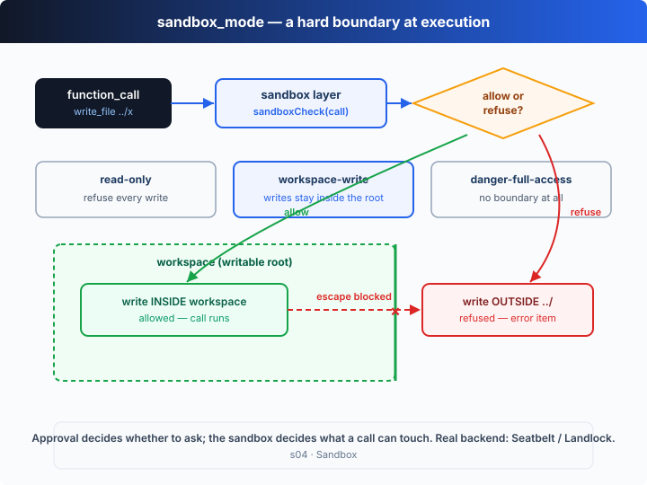

# s04: Sandbox — 批准了，也不能乱碰

[中文](README.md) · [English](README.en.md)

s01 → s02 → s03 → `s04` → [s05](../s05_plan_tool/) → ... → s20
> *"Approval decides whether to ask; the sandbox decides what you can touch"* —— 审批管「问不问」，沙箱管「碰得到什么」。
>
> **Harness 层**：执行 —— 在执行层画一条硬边界。

---

## 问题

s03 给工具执行前加了一道审批门，但这道门只回答「要不要问人」。一旦你按下 `y`，命令就以你的全部权限运行——一个被你批准的 `rm -rf /`，照样能把磁盘清空。

更别扭的是，在 `on-request` 策略下，模型每次想写工作区以外的文件都要停下来问你。于是你成了那道边界：一个接一个地判断「这个路径行不行」。既繁琐又危险——边界靠的是你的注意力，而人总有手滑、疲惫、被说服的时候。

安全不该押在人的警觉上。你要的是 harness 用机器的方式强制执行：不管刚才批没批，一个调用物理上只能碰这么多。这就是沙箱。

---

## 解决方案



在 dispatch 外面再包一层**沙箱**：拦截每个工具调用，判断它想写哪个路径、落在哪，再对照 `sandbox_mode` 决定放行还是拒绝。被拒绝的调用不会崩溃——harness 把一条错误 item 喂回模型，模型读到「越界被拒」后换一条路继续。

Codex 的 `sandbox_mode` 有三档，对应三条边界：

| 模式 | 能读 | 能写 | 适用场景 |
|------|------|------|----------|
| `read-only` | 任意 | 一切写入都被拒 | 只让模型看代码、做评审 |
| `workspace-write` | 任意 | 仅工作区（启动目录）内 | 默认档，日常开发 |
| `danger-full-access` | 任意 | 任意，无边界 | 完全信任，或跑在一次性容器里 |

注意：教学版的沙箱是一个**用户态路径检查**（判断目标路径是否在工作区内）。真实的 Codex 用的是操作系统级隔离——macOS 的 Seatbelt、Linux 的 Landlock（见文末「深入 Codex 源码」）。边界思想一模一样，只是强制力从「应用层判断」换成了「内核拒绝」。

---

## 工作原理

在 s02 的分发循环上，只加「沙箱判定」这一层。它包住 dispatch，所以对每个工具 uniformly 生效。

**第 1 步**：一个路径是否在工作区内——相对路径不以 `..` 开头、也不是绝对路径逃逸。

```ts
const isInside = (root: string, target: string): boolean => {
  const rel = path.relative(root, target);
  return rel === "" || (!rel.startsWith("..") && !path.isAbsolute(rel));
};
```

**第 2 步**：`write_file` 的判定。`read-only` 下一律拒；`workspace-write` 下越界才拒。

```ts
if (name === "write_file") {
  const target = resolvePath(String(args.path));
  if (MODE === "read-only") return refuse("read-only sandbox: writes are disabled");
  if (!isInside(WORKSPACE, target)) return refuse(`write outside workspace: ${target}`);
  return ALLOW;
}
```

**第 3 步**：`shell` 没有结构化路径参数，只能用一个教学级启发式——先猜它会不会写（`>`、`rm`、`mv`…），再扫命令里的路径 token 有没有指到工作区外。

```ts
if (name === "shell") {
  const cmd = String(args.command ?? "");
  const mutates = SHELL_WRITES.some((op) => cmd.includes(op));
  if (MODE === "read-only") return mutates ? refuse("read-only sandbox: command may write") : ALLOW;
  const escape = shellTargets(cmd).find((t) => !isInside(WORKSPACE, t)); // 越界路径
  if (escape) return refuse(`command touches outside workspace: ${escape}`);
  return ALLOW;
}
```

**第 4 步**：沙箱**包住** dispatch——先拦截、判定，再（可能）执行。拒绝就返回一条错误字符串，作为 `function_call_output` 喂回模型。

```ts
function sandboxedDispatch(call: OutputItem): string {
  const args = JSON.parse(call.arguments ?? "{}") as Args;
  const verdict = sandboxCheck(call, args);
  if (!verdict.ok) return `Error: blocked by sandbox_mode=${MODE}: ${verdict.reason}`;
  return TOOL_HANDLERS[call.name ?? ""]?.(args) ?? `Error: unknown tool '${call.name}'`;
}
```

**第 5 步**：循环里，执行前先过沙箱，把判定结果打在每一行上（`✓ allow` / `✗ reason`）。

```ts
for (const call of calls) {
  const verdict = sandboxCheck(call, JSON.parse(call.arguments ?? "{}"));
  console.log(`-> ${call.name}(...) ${verdict.ok ? "✓ allow" : "✗ " + verdict.reason}`);
  const result = sandboxedDispatch(call);   // ← 唯一改动：dispatch 包进了沙箱
  input.push({ type: "function_call_output", call_id: call.call_id, output: result });
}
```

关键洞见：**审批和沙箱回答的是两个不同的问题**。审批问「这一下要不要先问人」——逐次的判断；沙箱问「这一下物理上碰得到什么」——永远在线的硬不变量。沙箱包住 dispatch，所以对读写、patch、shell 一视同仁地生效；而对模型来说，「越界被拒」只是一条普通数据，它读到后继续推理，而不是整轮崩掉。

---

## 试一下

> **教学 demo 提示**：代码会在当前目录创建 `agent_scratch/` 并写入文件，还会**故意尝试**写 `../s04_outside.txt`（越界，将被沙箱拦下）。建议在临时测试目录里运行。

**无需 API key 也能跑**：默认 `sandbox_mode=workspace-write`。离线模型会在**同一轮**发起 4 个调用——工作区内写入、读回、越界写 `../`、以及一条写入的 shell 命令，让你看清「界内放行、越界被拒」。用环境变量切换三档各试一遍。

**准备**（首次运行）：

```sh
npm install
cp .env.example .env        # 想跑真实模型就填入 OPENAI_API_KEY 和 MODEL_ID
```

**运行**：

```sh
npx tsx s04_sandbox/code.ts                                   # 默认 workspace-write
SANDBOX_MODE=read-only          npx tsx s04_sandbox/code.ts   # 一切写入都被拒
SANDBOX_MODE=danger-full-access npx tsx s04_sandbox/code.ts   # 无边界（小心！）
OPENAI_API_KEY=sk-...           npx tsx s04_sandbox/code.ts   # 真实模型
```

试试这些 prompt：

1. `Create a notes file in a scratch folder and read it back`（界内写 + 读，workspace-write 放行）
2. `Write a file one level up, outside this directory`（越界写，workspace-write 拒绝）
3. `Just list what's here`（纯读，三档都放行）

观察重点：同一组调用，在三种 `sandbox_mode` 下哪些被放行、哪些被拒？被拒绝的调用是如何变成错误 item 喂回给模型的？

---

## 接下来

现在 Agent 能在边界内安全地读写、跑命令了。但面对一个多步骤任务，它拿到需求就直接开干——你看不到它打算分几步、现在做到哪一步、还剩什么。

s05 Plan Tool → 给模型一个 `update_plan` 工具，让它把计划发布成一份实时清单：每步的状态随进度更新，你一眼看清全局。

<details>
<summary>深入 Codex 源码</summary>

> 以下内容基于 OpenAI 开源的 [`openai/codex`](https://github.com/openai/codex) 仓库（`codex-rs`，Rust 实现）的整体架构。教学版的「路径检查 + 三档模式 + 拒绝喂回」就是 Codex 沙箱机制的最小骨架；真正的差异在于强制力来自操作系统内核，而不是应用层的一次字符串判断。

**教学版的 `sandbox_mode` ≈ Codex 配置里的 `sandbox_mode`（在 `~/.codex/config.toml` 或 profile 里设置）。** 下面是真实实现的几个关键点。

<details>
<summary>一、三档模式是真实存在的配置枚举</summary>

Codex 把沙箱模式建模成一个配置枚举，语义与教学版一致：`read-only`（只能读，任何写入都被拒）、`workspace-write`（可写工作区及临时目录，读取范围更宽，默认通常还限制网络）、`danger-full-access`（不做隔离，命令以用户全部权限运行）。教学版为了聚焦「边界判在哪」，把网络限制等细节略去，只保留「写入边界」这条主线。

</details>

<details>
<summary>二、真正的后端是 OS 内核：Seatbelt 与 Landlock</summary>

教学版用 `isInside()` 在用户态判断路径，这只是个示意。Codex 的强制力来自操作系统：

| 平台 | 机制 | 作用 |
|------|------|------|
| macOS | **Seatbelt**（`sandbox-exec`，SBPL 策略文件） | 内核级拒绝越权的文件/网络访问 |
| Linux | **Landlock**（LSM） | 非特权进程也能自我施加文件系统访问策略 |

命令在启动前被包进对应的沙箱 helper（`codex-rs` 里有按平台分派的 seatbelt / landlock 封装），之后即使命令本身想越界，内核也会直接拒绝——而不是靠应用层「拦住」。这就是为什么沙箱是硬边界：它不依赖 harness 记得去检查。

</details>

<details>
<summary>三、沙箱和审批是拧在一起的</summary>

正如 s03 源码解读所说，Codex 里二者在同一条执行路径上：一条命令先按 `sandbox_mode` 在受限环境里试跑；若它需要更高权限（要写工作区外、要联网）且当前 `approval_policy` 允许问人，harness 弹出审批，批准后用提升的权限重跑。教学版把「先试跑、失败再升级」简化成了「沙箱直接拒 + 错误 item 喂回」，方向一致。

</details>

<details>
<summary>四、patch 与 shell 都过沙箱，危险档才会关掉它</summary>

Codex 里不只 shell 命令，`apply_patch` 这类文件修改同样受沙箱约束——写入被限制在允许的可写根内。只有显式切到 `danger-full-access`（或跑在本来就可丢弃的容器/云环境里）时，沙箱才被关闭。教学版的 `sandboxedDispatch` 包住所有工具，正是在复刻这条「无一例外」的原则。

</details>

**一句话**：Codex 的沙箱是一条由操作系统内核强制执行的硬边界，三档 `sandbox_mode` 决定边界画在哪，并与审批联动决定「越权时能不能升级」。教学版把这条链路压成「判定 → 放行/拒绝 → 拒绝喂回」，先把边界的职责吃透——真正的差别只在于，生产级的拒绝来自内核，而不是一次路径字符串比较。

</details>

<!-- translation-sync: zh@v1, en@v1 -->
