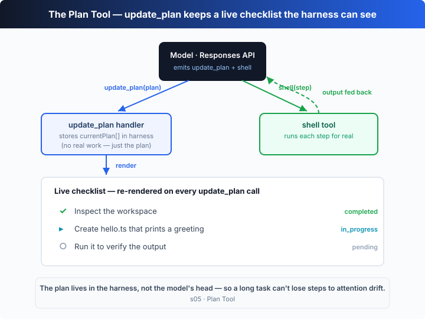

# s05: 计划工具 — 没有计划的 Agent，做着做着就偏了

[中文](README.md) · [English](README.en.md)

`s01` → `s02` → `s03` → [s04](../s04_sandbox/) → `s05` → [s06](../s06_subagents/) → `s07` → ... → s20
> *"A plan the harness can see"* — 先列步骤再动手，长任务才不会丢步。
>
> **Harness 层**：规划 —— 让 Agent 在动手之前先把步骤说清楚。

---

## 问题

给 Agent 一个多步任务：「把所有脚本改成 TypeScript，跑测试，把失败的修好」。

它改了三个文件，跑了一次测试，看到两个失败，开始埋头修。修着修着，它忘了最初的目标是「改成 TypeScript」——那两个失败的测试把注意力全吸走了。

对话越长越严重：工具结果不断填满上下文，最初那句话的分量被一轮轮稀释。一个十步的重构，做到第三步就开始即兴发挥，因为第四到第十步早被挤出了注意力。

问题不在模型不够聪明，而在**计划只存在于模型的脑子里**。harness 看不到它，自然没法在它跑偏时拉一把。

---

## 解决方案



给模型一个 `update_plan` 工具：动手之前先把整个步骤列表声明出来，之后每完成或开始一步，就把**同一份列表**重写一遍发回来。计划不再是模型脑中的念头，而是一次 `function_call`——harness 接到后把它存进自己的状态，并渲染成一份**实时更新的清单**。

| 信号 | 含义 | harness 动作 |
|------|------|--------------|
| `update_plan`（全 `pending`） | 模型在动手前声明计划 | 存下 `currentPlan[]`，渲染整份清单 |
| `update_plan`（某步变 `in_progress`） | 模型开始做这一步 | 重写状态，重新渲染（同一时刻只有一步 `in_progress`） |
| `update_plan`（某步变 `completed`） | 这一步做完了 | 重写状态，清单上的 `○` 变成 `✓` |

关键：这个工具**不做任何实际工作**——它不能读文件、不能跑命令。它唯一的作用是让 harness 能**看着计划变化**。`shell` 工具才真正干活，两者在循环里交替出现。

---

## 工作原理

在 s01 的循环上加一个工具，分步来看：

**第 1 步**：定义步骤类型和 `update_plan` 工具。`status` 只能是三种值。

```ts
type PlanStep = { step: string; status: "pending" | "in_progress" | "completed" };

// 工具 schema（节选）：接收一整份 plan，而不是 diff
{
  name: "update_plan",
  parameters: {
    plan: { type: "array", items: { step: "string", status: "pending|in_progress|completed" } },
  },
}
```

**第 2 步**：工具处理器把计划存进 harness 状态，并重新渲染清单。返回的字符串会作为 `function_call_output` 喂回给模型。

```ts
let currentPlan: PlanStep[] = [];

function updatePlan(plan: PlanStep[]): string {
  currentPlan = plan;
  const done = plan.filter((s) => s.status === "completed").length;
  console.log(`## Plan  (${done}/${plan.length} done)`);
  for (const s of plan) console.log(`  ${ICON[s.status]} ${s.step}`);
  return `Plan updated: ${done}/${plan.length} steps completed.`;
}
```

**第 3 步**：循环里按工具名分发。`update_plan` 走渲染，`shell` 才真正执行。

```ts
if (call.name === "update_plan") {
  result = updatePlan(args.plan);       // 只更新计划并重绘清单
} else {
  result = runShell(args.command);      // 真正干活
}
input.push({ type: "function_call_output", call_id: call.call_id, output: result });
```

**第 4 步**：模型每一轮都会看到上一步的 `function_call_output`（"Plan updated: 1/3 ..."），于是接着更新计划或跑下一步。循环本身和 s01 一模一样，只是分发多了一个分支。

组装起来，模型的典型轨迹是：`update_plan`（全 pending）→ `shell`（第 1 步）→ `update_plan`（1 completed、2 in_progress）→ `shell`（第 2 步）→ …→ `update_plan`（全 completed）→ 输出结论。

**核心洞察**：`update_plan` 没有给 Agent 增加任何**执行能力**，它增加的是**规划的可见性**。计划被外化到 harness 里，模型每轮都得对着它交代进度——这正是长任务不丢步的原因。

---

## 试一下

> **教学 demo 提示**：离线 demo 会在当前目录创建并运行一个 `hello.ts`。建议在临时目录里跑，或跑完手动删掉它。

**无需 API key 也能跑**：没有 `OPENAI_API_KEY` 时，本章的内置离线模型会把「列计划 → 逐步执行 → 逐步打勾」完整演一遍。

**准备**（首次运行）：

```sh
npm install
cp .env.example .env        # 想跑真实模型就填入 OPENAI_API_KEY 和 MODEL_ID
```

**运行**：

```sh
npx tsx s05_plan_tool/code.ts                # 离线 demo 模型
OPENAI_API_KEY=sk-... npx tsx s05_plan_tool/code.ts   # 真实模型
```

试试这些 prompt：

1. `Rename every script to TypeScript, run the tests, fix what fails`
2. `Set up a small package: tsconfig, an entry file, and a build script`
3. `Refactor this file into modules and verify it still runs`

观察重点：第一次工具调用是不是 `update_plan`？计划列了几步？执行中状态有没有从 `pending` 走到 `in_progress` 再走到 `completed`，同一时刻是不是只有一步 `in_progress`？

---

## 接下来

Agent 现在会规划了。但如果某一步本身就是个大任务——「重构整个认证模块」——光靠在一份清单里打勾不够。这一步背后是几十个小操作，全堆在同一个对话里，照样把上下文淹没。

s06 Subagents → 把这种大步骤**委派给一个子 Agent**：它有自己干净的上下文，专心做完，只把结论带回主线。

<details>
<summary>深入 Codex 源码</summary>

> 以下基于 OpenAI 开源的 [`openai/codex`](https://github.com/openai/codex) 仓库（`codex-rs`，Rust 实现）的整体结构。教学版的 `update_plan` 就是 Codex 计划工具的最小骨架；差异全在生产级的状态管理与 UI 渲染上。

**教学版的 `updatePlan` ≈ Codex 的计划工具处理器。** 下面每一项都是在这个核心上做的加固。

<details>
<summary>一、计划工具是「核心内建」，不走沙箱</summary>

Codex 给模型的工具里，除了 `shell`、`apply_patch` 这类要落地执行的，还有一个计划工具。它的地位很特殊：当模型发出 `update_plan` 调用时，核心 turn 循环**不会**把它丢给沙箱或审批策略去跑，而是在 harness 内部直接处理——更新会话状态里的计划，然后立刻给模型回一个确认。教学版用「`if (call.name === "update_plan")` 走渲染分支」还原的正是这条特殊路径：计划工具改变的是 harness 的状态，不是文件系统。

</details>

<details>
<summary>二、状态字段：pending / in_progress / completed，一个不落</summary>

Codex 计划项的状态枚举和教学版完全一致：`pending`、`in_progress`、`completed`。配套的系统提示会引导模型：复杂任务先建计划、一次只让一步处于 `in_progress`、每有进展就重写整份列表。教学版把这条引导写进了 `INSTRUCTIONS`，并要求「每次发整份 plan 而非 diff」——这和真实实现一致，因为 harness 存的就是**当前完整计划**，收到就整体替换，不做合并。

</details>

<details>
<summary>三、渲染是事件驱动，不是轮询</summary>

教学版在 `updatePlan` 里直接 `console.log` 一份清单。Codex 的 TUI 是异步的：核心处理计划工具后会发出一个「计划已更新」的事件，前端订阅这个事件来重绘状态面板里的清单（同时滚动的事件流还在继续）。也就是说「存状态」和「画出来」是解耦的，靠事件总线连起来。教学版把两者合在同一个函数里，是为了让读者一眼看清「调用 → 状态 → 渲染」这条链。

</details>

<details>
<summary>四、计划也会进 rollout，可随会话恢复</summary>

Codex 的会话会被持久化成 rollout（见 s09），计划作为会话状态的一部分同样落在里面。这意味着 `codex resume` 恢复一条长会话时，之前那份没打完勾的清单也能回来。教学版把 `currentPlan` 放在进程内存里，退出即清空——这是刻意的简化，持久化留给 s09 再讲。

</details>

**一句话**：Codex 的计划工具核心就是「模型重写整份步骤列表 → harness 存下并重绘」。所有额外机制——内建分发、事件驱动渲染、随 rollout 持久化——都是为了让它在生产 TUI 里既实时又可恢复。先看清这条主干，细节自然展开。

</details>

<!-- translation-sync: zh@v1, en@v1 -->
