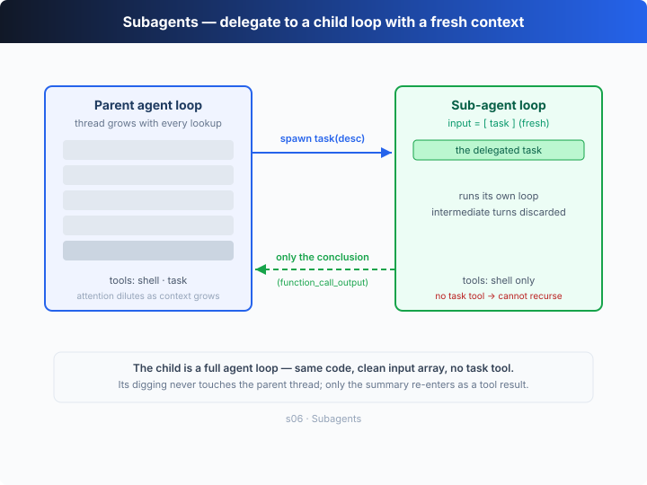

# s06: 子 Agent — 大任务拆小，每个拿到的都是干净上下文

[中文](README.md) · [English](README.en.md)

`s01` → `s02` → `s03` → `s04` → [s05](../s05_plan_tool/) → `s06` → [s07](../s07_skills/) → ... → s20
> *"A fresh context for every digression"* — 支线任务交给子 Agent，主线不被带偏。
>
> **Harness 层**：规划 —— 上下文隔离，注意力不漂移。

---

## 问题

Agent 在修一个 bug。为了追一条调用链，它读了三十个文件，和主线聊了六十轮。消息列表涨到一百多条，其中大部分是「追调用链」的中间过程，跟「修 bug」这个最终目标毫无关系。

这些中间过程占着上下文的位置，让 Agent 越来越「健忘」——它快想不起来最初要修的是什么了。

换个场景：你修 bug 的时候，会**另开一个终端**去追调用链。追完了，终端一关，结论记进笔记，回到原来的终端接着修。Agent 也需要这个能力：开一个独立的子循环，给它一个独立的消息列表，让它专心做一件事。

---

## 解决方案



新增一个 `task` 工具：调用它时，harness 派生一个**子 Agent**——它有自己全新的 `input` 数组，跑自己的 agent 循环，做完只把**结论文本**带回主线。子 Agent 的中间过程被整个丢弃；只有结论作为一次 `function_call_output` 回到父线程。

| 设计决策 | 选择 | 原因 |
|----------|------|------|
| 上下文隔离 | 全新 `input = [task]` | 子 Agent 的中间过程不污染父线程 |
| 只回传结论 | `agentLoop` 返回最终文本 | 不是把整个消息列表塞回去 |
| 禁止递归 | 子 Agent 的工具里没有 `task` | 防止子 Agent 再派生新的子 Agent |
| 复用同一个循环 | 父子跑的是同一个 `agentLoop` | 子 Agent 不是新机制，是循环的再次进入 |

子 Agent 不是另一种 Agent，它就是**同一个循环用一份干净输入再跑一遍**。

---

## 工作原理

在 s01 的循环上做点改造，分步来看：

**第 1 步**：让循环返回最终文本（而不是只打印），这样子 Agent 才能把结论交回去。同时按 `who` 区分父子，子 Agent 用受限工具。

```ts
async function agentLoop(input: unknown[], who: "parent" | "sub"): Promise<string> {
  // ...模型不再调工具时，把最终 message 的文本抽出来 return
}
```

**第 2 步**：`task` 工具只加进父 Agent 的工具表，子 Agent 没有它。

```ts
const TOOLS = [SHELL_TOOL, TASK_TOOL];   // 父：可以委派
const SUB_TOOLS = [SHELL_TOOL];          // 子：没有 task → 不能递归
```

**第 3 步**：核心是 `spawnSubagent`。注意它造的 `subInput` 是**全新数组**，里面只有那一条任务——这就是「干净上下文」。

```ts
async function spawnSubagent(description: string): Promise<string> {
  const subInput: unknown[] = [{ role: "user", content: description }]; // 干净上下文
  const result = await agentLoop(subInput, "sub");  // 自己的循环、自己的工具
  return result;                                    // 只回传结论，中间过程丢弃
}
```

**第 4 步**：循环里按工具名分发，`task` 走派生，其余照常执行，结果都喂回当前线程。

```ts
if (call.name === "task") {
  result = await spawnSubagent(args.description);  // 派生子 Agent
} else {
  result = runShell(args.command);                 // 自己干
}
input.push({ type: "function_call_output", call_id: call.call_id, output: result });
```

组装起来：父 Agent 收到任务 → 决定委派 → `spawnSubagent` 用一个干净输入再跑一遍 `agentLoop` → 子 Agent 跑完返回结论 → 结论作为 `function_call_output` 回到父线程 → 父 Agent 拿着结论继续。

**核心洞察**：子 Agent 的价值不在「多一个模型」，而在**上下文的边界**。支线任务的几十轮中间过程被挡在边界外，主线只看到一条结论——注意力因此不漂移。

---

## 试一下

**无需 API key 也能跑**：没有 `OPENAI_API_KEY` 时，内置离线模型会把「父 Agent 委派 → 子 Agent 用干净上下文查 `package.json` → 只把结论带回主线」完整演一遍。

**准备**（首次运行）：

```sh
npm install
cp .env.example .env        # 想跑真实模型就填入 OPENAI_API_KEY 和 MODEL_ID
```

**运行**：

```sh
npx tsx s06_subagents/code.ts                # 离线 demo 模型
OPENAI_API_KEY=sk-... npx tsx s06_subagents/code.ts   # 真实模型
```

试试这些 prompt：

1. `Use a subtask to find out what test/build tooling this repo uses`
2. `Delegate: read the files under spec/ and summarize the authoring rules`
3. `Research how the web/ docs site is built, but keep my main thread clean`

观察重点：有没有出现 `[subagent spawned]` / `[subagent done]`？子 Agent 的命令是不是以 `[sub]` 前缀输出？父 Agent 最后是不是只接着处理子 Agent 返回的那条结论？

---

## 接下来

Agent 现在能拆任务了。但每个任务需要的**知识**不一样：改前端组件要懂 React 规范，写 SQL 要懂表结构。把这些知识全塞进系统提示，上下文立刻就爆了。

s07 Skills → 技能**按需加载**：不在系统提示里堆文档，用到的时候才把那份说明注入上下文——和读一个文件一样自然。

<details>
<summary>深入 Codex 源码</summary>

> 以下基于 OpenAI 开源的 [`openai/codex`](https://github.com/openai/codex) 仓库（`codex-rs`，Rust 实现）的整体结构。教学版的 `spawnSubagent` 是「用干净输入再进一次循环」的最小骨架；真实系统在这之上加了会话管理、并行与隔离。

**教学版的子 Agent ≈ 一次新的、独立上下文的 turn 循环。** 下面每一项都是在这个核心上做的扩展。

<details>
<summary>一、子 Agent = 同一个循环，新的会话上下文</summary>

Codex 的 turn 循环不是游离的函数，它由一份会话上下文驱动——里面装着当前这段对话的历史输入项。所谓「开子 Agent」，本质是**构造一份新的会话上下文**（自己的历史、自己的工具集），再让同一套 turn 逻辑跑起来，而不是共享父对话的历史。教学版的 `agentLoop(subInput, "sub")` 就是这件事：循环代码一份没改，变的只是喂进去的输入和工具。

</details>

<details>
<summary>二、工具集的收窄是防递归的关键</summary>

教学版用「子 Agent 的工具表里没有 `task`」来禁止递归。真实系统同样需要这道闸：一个能再派生子 Agent 的子 Agent，会产生不受控的嵌套和资源消耗。因此子任务的可用工具会被显式收窄（去掉派生类工具，必要时也收窄会写盘的工具）。这不是教学版的偷懒，而是所有多 Agent harness 的通行做法。

</details>

<details>
<summary>三、只回传结论 vs. 共享中间状态</summary>

教学版让子 Agent 只返回最终文本，中间过程整个丢弃。这是一种刻意简化：真实 harness 里，子任务的**文件系统副作用**（写的文件、跑的命令）是保留在工作目录里的，丢掉的只是对话历史。另外，子任务往往还需要把进度、取消信号、审批请求冒泡回父端 UI——教学版用「父等子跑完、只收一条结论」绕开了这套异步通信，把异步留给 s13 再讲。

</details>

<details>
<summary>四、Codex Cloud：把「干净上下文」做到极致</summary>

Codex Cloud 的模型可以看作子 Agent 的极端形态：**每个任务都在自己隔离的环境里跑**，自带一份干净上下文，互不干扰（s18 的 git worktree 隔离讲的就是这套）。教学版的「全新 `input` 数组」是同一思想在单进程里的缩影——上下文边界划在哪，并行和隔离就能做到哪。

</details>

**一句话**：子 Agent 的核心是「同一个循环 + 干净输入 + 收窄的工具 + 只回结论」。真实系统在它之上叠加会话管理、异步通信与环境隔离，但那条「支线不污染主线」的主干没变。

</details>

<!-- translation-sync: zh@v1, en@v1 -->
