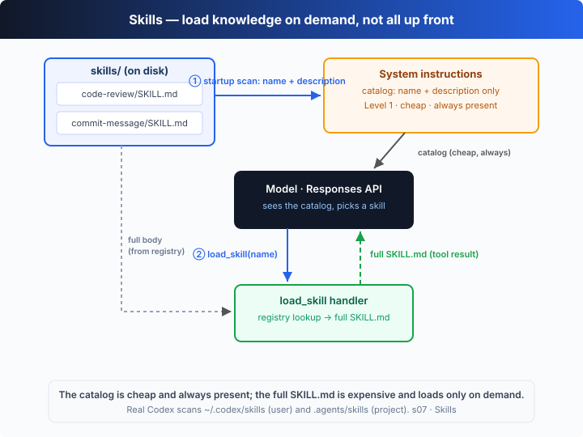

# s07: Skills — Load Knowledge on Demand, Not All Up Front

[中文](README.md) · [English](README.en.md)

`s01` → `s02` → `s03` → `s04` → `s05` → [s06](../s06_subagents/) → `s07` → [s08](../s08_context_compact/) → ... → s20
> *"Load knowledge on demand, not all up front"* — inject the manual into the context only when you need it.
>
> **Harness layer**: planning — load knowledge on demand, don't cram the context full.

---

## The Problem

Your project has a React component style guide, a SQL style guide, and a Conventional Commits format. You want the agent to follow them automatically. The most direct idea is to cram them all into the system prompt:

```ts
const INSTRUCTIONS =
  "You are a coding agent. " +
  read("docs/react-style.md") +      // 2000 lines
  read("docs/sql-style.md") +        // 1500 lines
  read("docs/commit-format.md");     // 800 lines
```

Four thousand-odd lines of system prompt. The agent carries all of these documents on every single call — whether it's changing a CSS color or writing a SQL query. 99% of it has nothing to do with the current task, yet it burns tokens every turn and dilutes the instructions that actually matter.

The knowledge is needed, but **carrying all of it all the time** is wrong. That isn't how people deal with documentation either: you don't memorize the whole wiki — you first learn "there's a guide for that," then go read it when the need arises.

---

## The Solution



Turn knowledge into **skills**: a `SKILL.md` file whose opening YAML frontmatter declares a `name` and a `description`, with the full rules in the body. The harness does **two-level loading**:

| level | content | when it enters the context | cost |
|-------|---------|----------------------------|------|
| ① catalog | each skill's `name` + `description` | scan `skills/` at startup, fold into the system prompt | a few tokens per skill, present every turn |
| ② body | the entire `SKILL.md` rules | when the task matches, the model calls `load_skill(name)` | thousands of tokens, paid **only when needed** |

The model sees "which skills I have" every turn (the cheap catalog) but memorizes no body. Only when it decides "this task needs the commit format" does it make one `load_skill` call, injecting that full manual as a `function_call_output` — as naturally as reading a file.

The key: the body is **not part of the system prompt** — it is a tool result. You pay for it when you use it, and pay nothing when you don't.

---

## How It Works

Add a "scan + load" mechanism on top of the s01 loop, step by step:

**Step 1**: at startup, scan the `skills/` directory, parse each `SKILL.md`'s frontmatter, and register only the `name` + `description` (the body is kept in memory, not in the prompt).

```ts
type Skill = { name: string; description: string; content: string };
const SKILL_REGISTRY = new Map<string, Skill>();

function scanSkills(): void {
  for (const dir of subdirsOf(SKILLS_DIR)) {
    const raw = fs.readFileSync(path.join(dir, "SKILL.md"), "utf8");
    const meta = parseFrontmatter(raw);            // read name / description
    SKILL_REGISTRY.set(meta.name, { name: meta.name, description: meta.description, content: raw });
  }
}
scanSkills(); // runs once, at startup
```

**Step 2**: fold the **catalog** (not the bodies) into the system prompt. The model sees the available skills every turn, at negligible cost.

```ts
const INSTRUCTIONS =
  `You are a coding agent. Available skills:\n` +
  [...SKILL_REGISTRY.values()].map((s) => `- ${s.name}: ${s.description}`).join("\n") +
  `\nWhen the task matches a skill's description, call load_skill to fetch its full instructions.`;
```

**Step 3**: the `load_skill` tool fetches the **full body** from the registry by name. Going through the registry rather than a file path means the model only ever supplies a key — no path-traversal risk.

```ts
function loadSkill(name: string): string {
  const skill = SKILL_REGISTRY.get(name);
  if (!skill) return `Skill not found: ${name}.`;
  return skill.content;                            // the full SKILL.md returned as a tool result
}
```

**Step 4**: dispatch on the tool name in the loop. The body returned by `load_skill` is fed back into the thread as a `function_call_output`, and the model then works by its rules.

```ts
if (call.name === "load_skill") {
  result = loadSkill(args.name);     // inject the full skill manual
} else {
  result = runShell(args.command);   // do the real work
}
input.push({ type: "function_call_output", call_id: call.call_id, output: result });
```

Assembled: startup → scan the catalog into the system prompt → the model sees the task match a skill → calls `load_skill` → the full rules enter the context → it follows them. This chapter ships two example skills (`code-review`, `commit-message`), and the offline demo acts out the whole "match → load → follow" flow.

**Core insight**: a skill is not "a bigger system prompt" — it turns knowledge from a **fixed cost into an on-demand cost**. The catalog tells the model *what exists*; the body tells it *how to do it*. The former is cheap enough to carry every turn; the latter is expensive enough to pay for only when truly needed.

---

## Try It

> **Teaching demo note**: this chapter reads two example skills (`code-review`, `commit-message`) from `s07_skills/skills/`. The offline demo runs `git status --short` to show "load the skill, then follow it."

**No API key needed**: without `OPENAI_API_KEY`, the built-in offline model decides which skill the task matches, calls `load_skill` to inject the full rules, then runs one command by those rules to wrap up.

**Setup** (first run):

```sh
npm install
cp .env.example .env        # fill in OPENAI_API_KEY and MODEL_ID to run the real model
```

**Run**:

```sh
npx tsx s07_skills/code.ts                # offline demo model
OPENAI_API_KEY=sk-... npx tsx s07_skills/code.ts   # real model
```

Try these prompts:

1. `Review my changes` (matches `code-review`)
2. `Write a commit message for what's staged` (matches `commit-message`)
3. `What skills are available?` (reads the catalog only, no body loaded)

Watch for: how many skills does it print as scanned at startup? Does `[skill loaded]` appear when the task matches? Does the full `SKILL.md` enter the context only *after* you need it (rather than sitting in the system prompt from the start)?

---

## What's Next

On-demand loading solves "don't carry what you shouldn't carry up front." But another problem appears: after the agent works for half an hour, the message list is stuffed with intermediate steps — stale tool results, outdated file contents — squatting on context without producing value.

s08 Context Compact → auto-compact when the context fills up: summarize the older turns into one compact item, freeing space to keep going.

<details>
<summary>Into the Codex source</summary>

> The following is based on the overall structure of OpenAI's open-source [`openai/codex`](https://github.com/openai/codex) repo (`codex-rs`, written in Rust). The chapter's "scan a catalog + load on demand" is the minimal skeleton of Codex's skill mechanism; the loading and injection logic lives mostly on the core side, and this capability is still evolving quickly — what follows is an architecture-level comparison.

**The chapter's `load_skill` ≈ Codex's skill loading.** Each item below extends that core.

<details>
<summary>1. Skill sources: more than one skills/ directory</summary>

The chapter scans a single local `skills/`. Codex discovers skills from several locations, layered by scope: `~/.codex/skills` is **user-level** (applies to every project), `.agents/skills` inside a project is **project-level** (applies to that repo only), and built-in skills sit alongside them. The sources are merged and de-duplicated into one catalog. The chapter uses a single directory to show "discover skills from disk"; the layering and merging are left for you to map onto the real implementation.

</details>

<details>
<summary>2. Frontmatter: name + description are the catalog's keys</summary>

The chapter parses only the `name` and `description` fields — exactly the minimum a skill needs to be *listed in the catalog*: the name to call it by, the description so the model can judge "when should I use this". The real implementation's frontmatter is richer (and evolves across versions), but `name` / `description` remain the core of the catalog layer. The chapter's `parseFrontmatter` deliberately takes just those two.

</details>

<details>
<summary>3. The essence of two-level loading: from fixed cost to on-demand cost</summary>

Codex's system prompt already carries a fair amount (built-in instructions, `AGENTS.md`, and so on — see s10). Folding every skill body in as well would bloat it without bound. The skill mechanism's answer matches the chapter: **the catalog is resident, the body is on demand** — the model first sees a cheap list of skills and pulls the full manual into the context only when it decides it needs one. The chapter reproduces this path with "`load_skill` returns the body as a `function_call_output`"; once the body is in history it rides along like any tool result until it is compacted (see s08) or the session ends.

</details>

<details>
<summary>4. Skills vs. AGENTS.md: resident instructions vs. on-demand knowledge</summary>

`AGENTS.md` (s10) is a **resident** project-level instruction — conventions like coding standards and build commands that "always apply" and should be present every session. A skill is **on-demand** expertise — a procedure only a certain kind of task needs. The two complement each other: put "always obey" rules in resident instructions, and make "needed only sometimes" knowledge a skill loaded on demand. This chapter covers only the skills half; assembling resident instructions is left for s10.

</details>

**In one line**: Codex's skill mechanism is, at its core, "scan a catalog at startup → the model loads bodies on demand". The real sources, frontmatter fields, and injection details are richer, but the trunk — "the catalog is cheap and resident, the body is expensive and on demand" — stays the same. See the trunk clearly first and the details unfold on their own.

</details>

<!-- translation-sync: zh@v1, en@v1 -->
