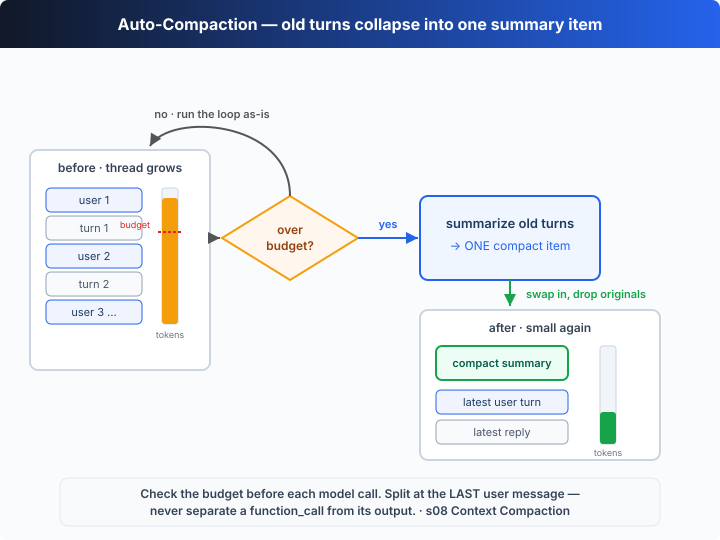

# s08: Context Compaction — 上下文总会满，要在满之前腾地方

[中文](README.md) · [English](README.en.md)

`s01` → ... → [s07](../s07_skills/) → `s08` → [s09](../s09_memory_sessions/) → `s10` → ... → s20
> *"The context window always fills up — make room before it does"* — 上下文窗口总会满，要在满之前把旧历史压缩掉。
>
> **Harness 层**：记忆 —— 干净的记忆，换来几乎无限的会话。

---

## 问题

Agent 跑着跑着，API 突然拒绝了：

```
Error: your prompt exceeded the maximum context length
```

手里有 shell，能力是够的。但它读了一个上千行的文件，又跑了几十条命令——每一轮的 user 消息、每一次工具调用、每一段工具输出，全都堆在 `thread` 数组里只增不减。

上下文窗口是有限的。堆满之后，模型连下一轮都跑不了。s01 那个朴素的循环对「thread 会无限膨胀」毫无防备——它假设记忆是免费的。

问题不在模型记性差，而在 **harness 把「记住一切」当成了默认**。长任务要跑得下去，就得在快满的时候主动腾地方。

---

## 解决方案



s01 的循环一行不改，只在**每次调模型之前**加一道闸门：先估算整个 thread 的 token 数，一旦超过预算，就把最早的若干轮**总结成一条 compact 摘要项**，丢掉原文，只保留当前这一轮，然后照常继续。

| 概念 | 作用 | 教学版实现 |
|------|------|-----------|
| `TOKEN_BUDGET` | 近似 token 预算上限 | 用「字符数 ÷ 4」估算，超了就触发压缩 |
| 切分点 | 在哪里切开新旧历史 | 最后一条 `role:"user"` 消息之前 |
| compact 摘要项 | 旧历史的替代物 | 一条 `[Earlier conversation compacted…]` 的 user 消息 |
| 保留部分 | 压缩后原样留下 | 当前这一轮（切分点之后的所有 item） |

关键设计是**切分点的选择**：从后往前找最后一条 user 消息再切，就绝不会把一个 `function_call` 和它的 `function_call_output` 拆到两边——模型永远不会看到一个对不上号的悬空工具结果。

---

## 工作原理

把这个过程翻译成 TypeScript，分步来看：

**第 1 步**：估算 token。教学版没有精确 tokenizer，用「字符数 ÷ 4」这个常用启发式，足够判断「是不是快满了」。

```ts
function approxTokens(thread: unknown[]): number {
  let chars = 0;
  for (const item of thread) chars += JSON.stringify(item).length;
  return Math.ceil(chars / CHARS_PER_TOKEN); // CHARS_PER_TOKEN = 4
}
```

**第 2 步**：选切分点。从后往前找最后一条 user 消息，在它前面切。

```ts
let split = 0;
for (let i = thread.length - 1; i >= 0; i--) {
  if ((thread[i] as { role?: string }).role === "user") { split = i; break; }
}
if (split === 0) return; // 历史还不够老，没什么可压
```

**第 3 步**：把切出来的旧历史总结成一段 brief（调一次模型；离线时返回脚本化摘要），包成一条新的 user 消息。

```ts
const oldTurns = thread.slice(0, split);
const summary = await summarize(oldTurns);
const compactItem = {
  role: "user",
  content: `[Earlier conversation compacted into this summary]\n${summary}`,
};
```

**第 4 步**：用这条摘要项替换掉旧历史，当前这一轮原样保留。

```ts
thread.splice(0, thread.length, compactItem, ...thread.slice(split));
```

**第 5 步**：在每轮调模型**之前**检查预算，超了就压缩。放在轮次边界做，天然不会拆散调用对。

```ts
thread.push({ role: "user", content: query });
if (approxTokens(thread) > TOKEN_BUDGET) await compactThread(thread);
await agentLoop(thread); // 循环本身和 s01 一模一样
```

组装成完整的压缩函数：

```ts
async function compactThread(thread: unknown[]): Promise<void> {
  let split = 0;
  for (let i = thread.length - 1; i >= 0; i--) {
    if ((thread[i] as { role?: string }).role === "user") { split = i; break; }
  }
  if (split === 0) return;                     // 还不够老，没什么可压
  const oldTurns = thread.slice(0, split);
  const summary = await summarize(oldTurns);   // 一次模型调用，把旧历史压成 brief
  const compactItem = {
    role: "user",
    content: `[Earlier conversation compacted into this summary]\n${summary}`,
  };
  thread.splice(0, thread.length, compactItem, ...thread.slice(split));
}
```

**核心洞察**：压缩没有改变 agent 的形状——循环还是那个循环，工具还是那些工具。它只是在「调用模型」之前加了一道「腾地方」的闸门。离线 demo 会连着跑好几个「阶段」，每个阶段都往 thread 里灌一大段 verbose 输出，你能清楚看到 token 数一路涨过预算、触发 `[auto-compact]`，然后从 700 多掉回几十——而 agent 依旧接着干活，因为它看到的「过去」已经换成了那条摘要。

---

## 试一下

> **教学 demo 提示**：代码会执行模型生成的 shell 命令（离线 demo 里只是一条打印日志的 `node -e`）。建议在一个临时目录里运行。

**无需 API key 也能跑**：没有 `OPENAI_API_KEY` 时，本章用一个内置的「离线脚本化模型」连着跑 5 个脚本化阶段，每个阶段都往 thread 里灌一大段 verbose 输出，第二、三阶段就会触发压缩，你能完整看到 `[auto-compact]` 发生。

**准备**（首次运行）：

```sh
npm install
cp .env.example .env        # 想跑真实模型就填入 OPENAI_API_KEY 和 MODEL_ID
```

**运行**：

```sh
npx tsx s08_context_compact/code.ts                # 离线 demo 模型
OPENAI_API_KEY=sk-... npx tsx s08_context_compact/code.ts   # 真实模型
```

试试这些实验：

1. 直接跑一遍，盯着 `[context ~N tokens / budget 700]` 和 `[auto-compact]` 两行：第几轮开始超预算？压缩后掉到多少？
2. 把 `TOKEN_BUDGET` 改小（比如 `300`），看压缩是不是来得更早、更频繁。
3. 设上真实 `OPENAI_API_KEY` 再跑，看真实模型生成的摘要长什么样。

观察重点：压缩后 thread 里只剩「一条摘要项 + 当前轮」，但 agent 依然能接着干活——它对「过去」的全部认知，就是那条摘要。

---

## 接下来

压缩能腾地方，但它是**有损**的：「用 tab 不用空格」可能被简化成「用户有代码风格偏好」，而且进程一关、新开一个会话，连摘要都没了。能不能有一层不丢的、能跨会话续上的记忆？

s09 Memory & Sessions → 把每一轮追加写进 `.codex/rollout.jsonl`；下次 `codex resume` 能从这个日志里精确重建整个线程，接着上次的地方继续。

<details>
<summary>深入 Codex 源码</summary>

> 以下内容基于 OpenAI 开源的 [`openai/codex`](https://github.com/openai/codex) 仓库（`codex-rs`，Rust 实现）的整体结构。教学版的「估算预算 → 总结旧历史 → 替换后继续」就是 Codex 自动压缩（auto-compaction）的最小骨架；差异全在计数精度与触发时机的工程细节上。

**教学版的 `compactThread` ≈ Codex 的自动压缩流程。** 下面每一项都是在这个核心上做的加固。

<details>
<summary>一、真实触发用的是 API 返回的 token 计数，不是 chars/4</summary>

教学版用「字符数 ÷ 4」这种粗糙启发式来估算 token。Codex 跑在 Responses API 上，每次响应都会带回真实的 token 用量（usage），harness 又知道当前模型的上下文窗口大小，于是它能用**精确计数**判断距离上限还有多远，并在逼近上限时主动压缩。教学版之所以用启发式，是因为精确 tokenizer 不在教学范围内——但「先看用量、快满就压」这条逻辑完全一致。

</details>

<details>
<summary>二、压缩是一次「总结 turn」，摘要写回上下文</summary>

教学版的 `summarize()` 把旧历史发给模型、要求返回一段简短摘要。Codex 的压缩本质上也是一次**专门的总结请求**：它让模型把到目前为止的对话整理成一份足够接续工作的紧凑摘要，然后把这份摘要作为一个专门的输入项写回上下文，替换掉被压缩的原始历史，会话继续。和教学版一样，被丢弃的原文在活跃上下文里不复存在——模型对「过去」的认知就来自那条摘要。

</details>

<details>
<summary>三、除了自动触发，还有手动 `/compact`</summary>

教学版只演示「超过预算就自动压缩」。Codex 的 TUI 还提供一个手动的 `/compact` 斜杠命令，让用户在觉得上下文变笨、或者想主动清理时随时触发同一套压缩流程。自动与手动走的是同一条「总结 → 替换 → 继续」的路，区别只在触发源：一个是 harness 按 token 用量主动发起，一个是用户主动发起。

</details>

<details>
<summary>四、为什么要挑切分点、保留近期上下文</summary>

教学版刻意在「最后一条 user 消息」处切，并把当前这一轮原样保留。这样做的原因是 Responses API 的上下文是一个**有序项序列**：一个 `function_call` 必须和它对应的 `function_call_output` 成对出现，模型才能理解。如果随便从中间断开，就可能留下一个找不到调用的悬空结果，直接报错或让模型困惑。Codex 的压缩同样只替换「更早的历史」，把最近的、尚在使用的上下文保留下来，保证工具调用对的完整。

</details>

**一句话**：Codex 的自动压缩核心就是教学版这套「逼近上限 → 把旧历史总结成一条摘要 → 替换后继续」。所有额外机制——精确 token 计数、专门的总结提示、手动 `/compact`、近期上下文保留——都是为了让这条路径在真实长会话里既准又稳。先吃透「有损压缩换来无限会话」这一条，其余都是工程加固。

</details>

<!-- translation-sync: zh@v1, en@v1 -->
