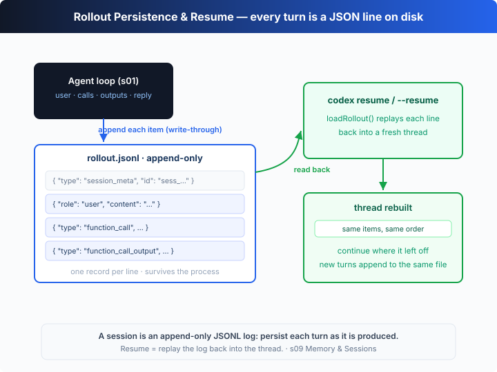

# s09: Memory & Sessions — Write Every Turn to Disk and a Session Never Really Ends

[中文](README.md) · [English](README.en.md)

`s01` → ... → [s08](../s08_context_compact/) → `s09` → [s10](../s10_instructions/) → `s11` → ... → s20
> *"Write every turn to disk, and a session never really ends"* — every turn hits disk, so the session outlives the process.
>
> **Harness layer**: memory — persistent state across processes and sessions.

---

## The Problem

From s01 to s08, the `thread` lives only in memory. Close the process or the terminal, and the whole session is gone.

That causes two real headaches. First: you ask the agent to do a long-running piece of work and want to shut it down and pick it up tomorrow — you can't, because the memory dies with the process. Second: halfway through, you want to review "what exactly did it do, which files did it touch" — and there's no record to look at.

The model has no persistent state of its own; all "memory" lives in the context, the context lives in memory, and memory dies with the process. The problem isn't that the model forgets — it's that **the harness never wrote the session anywhere that outlives the process**.

---

## The Solution



Write the session as an **append-only JSONL log**: every time a new item is produced (user message, tool call, tool output, final reply), serialize it to a line and append it to `rollout.jsonl`. The process can die at any moment; the log on disk survives.

On the next launch, pass `--resume`: read the log back line by line and replay it, in order, into an empty `thread`, and you continue **exactly** where you stopped. This is `codex resume`.

| concept | role | teaching implementation |
|---------|------|-------------------------|
| `rollout.jsonl` | the session's append-only log | one JSON item per line |
| `session_meta` | the log header | first line records id / cwd / start time |
| write-through | when to persist | append the moment an item is produced, not at turn end |
| `--resume` / `codex resume` | how to continue | read every line back and replay into a new thread |

The key design is **write-through**: you don't batch-write at the end of a turn — you persist each item the instant it exists. That way, no matter when the process crashes, the on-disk record is complete up to the very last moment; at most you lose one not-yet-finished item.

---

## How It Works

Translate this into TypeScript, step by step:

**Step 1**: when starting a new session, write the log header (`session_meta`) and truncate any old file.

```ts
function startRollout(path: string): void {
  mkdirSync(dirname(path), { recursive: true });
  const meta = { type: "session_meta", id: `sess_${Date.now()}`, cwd: CWD, started: new Date().toISOString() };
  writeFileSync(path, JSON.stringify(meta) + "\n"); // truncate: a brand-new session
}
```

**Step 2**: write-through — append each item as a line the moment it's produced.

```ts
function appendRollout(path: string, items: unknown[]): void {
  if (items.length === 0) return;
  appendFileSync(path, items.map((i) => JSON.stringify(i)).join("\n") + "\n");
}
```

**Step 3**: each turn, persist "what got added" — write the user message first, run the loop, then append everything the turn added.

```ts
thread.push(userItem);
appendRollout(ROLLOUT_PATH, [userItem]);          // persist the user turn first
const before = thread.length;
await agentLoop(thread);                          // the loop itself is identical to s01
appendRollout(ROLLOUT_PATH, thread.slice(before)); // then everything the turn added
```

**Step 4**: resume — read every line back, skip `session_meta`, replay into a thread.

```ts
function loadRollout(path: string): unknown[] {
  if (!existsSync(path)) return [];
  return readFileSync(path, "utf8")
    .split("\n").filter((l) => l.trim())
    .map((l) => JSON.parse(l))
    .filter((r) => r.type !== "session_meta");
}
```

**Step 5**: on launch with `--resume`, rebuild first, then continue; otherwise start fresh.

```ts
if (RESUME && existsSync(ROLLOUT_PATH)) {
  thread = loadRollout(ROLLOUT_PATH);    // rebuild the previous thread from disk
} else {
  startRollout(ROLLOUT_PATH); thread = []; // otherwise start a brand-new session
}
```

**Core insight**: persistence doesn't change the agent's shape — the loop is the same loop, the tools are the same tools. It only mirrors "the in-memory thread array" onto "an append-only log on disk". Because every item is persisted the instant it's produced, the on-disk record is complete to the last moment no matter when the process dies; resume is nothing more than a replay of that log. The offline demo runs two turns to disk, then — in the **same run** — simulates "exit the process → relaunch with `--resume`", replays 8 items from disk, and runs a third turn.

---

## Try It

> **Teaching demo note**: this chapter **really writes files** — it writes the rollout log to disk (in the system temp dir by default; override with `CODEX_ROLLOUT` to a project-local path) and runs the model's `echo` commands.

**No API key needed**: without `OPENAI_API_KEY`, the chapter's offline demo runs the full "write two turns → simulate resume → run one more" flow with no input required.

**Setup** (first run):

```sh
npm install
cp .env.example .env        # fill in OPENAI_API_KEY and MODEL_ID to run the real model
```

**Run**:

```sh
npx tsx s09_memory_sessions/code.ts                 # new session + simulated resume
npx tsx s09_memory_sessions/code.ts --resume        # actually resume from the saved log
CODEX_ROLLOUT=./.codex/rollout.jsonl npx tsx s09_memory_sessions/code.ts  # write to the project
```

Try these experiments:

1. Run it once, note the rollout path printed at the end, and `cat` it: is each line exactly one item?
2. Immediately run `npx tsx s09_memory_sessions/code.ts --resume` and watch `[resume] loaded N item(s)` — it read back everything from the last run.
3. Set `CODEX_ROLLOUT=./.codex/rollout.jsonl` to write the log into the current directory and get a feel for Codex's real layout.

Watch for: after the second turn, the "simulated resume" prints `[resume] rebuilt thread: 8 item(s)` — those 8 items come not from memory but from replaying the on-disk log.

---

## What's Next

Memory now survives across sessions. But the system prompt is still s01's one hardcoded string: switching projects means rewriting it, adding a capability means hand-editing it, and every request carries the full text. It should be assembled at runtime, in layers, like configuration.

s10 Instructions → built-in base + project `AGENTS.md` + a `config.toml` profile, assembled at runtime into the system prompt, the model, and the reasoning effort.

<details>
<summary>Into the Codex source</summary>

> The following is based on the overall structure of OpenAI's open-source [`openai/codex`](https://github.com/openai/codex) repo (`codex-rs`, written in Rust). The chapter's "append one line per item → replay on resume" is the minimal skeleton of Codex's session persistence (rollout) and `codex resume`; every difference is engineering detail about record granularity and resume entry points.

**The chapter's `appendRollout` / `loadRollout` ≈ Codex's rollout persistence and resume.** Each item below hardens that core.

<details>
<summary>1. The real path: rollout files under ~/.codex/sessions</summary>

The chapter writes the log to a single fixed file in the system temp dir. Codex persists each session's rollout under the user directory (`~/.codex/sessions/`, layered by date), with filenames roughly like `rollout-<timestamp>-<id>.jsonl`. That way many past sessions coexist on one machine, and `codex resume` can list them for you to pick. The chapter uses a single file so the "append → replay" chain stays obvious.

</details>

<details>
<summary>2. The rollout records structured items, not just chat text</summary>

The chapter serializes each thread item to a JSON line verbatim. Codex's rollout likewise is not plain conversation text but a **structured session record**: it opens with session metadata (id, working directory, the model and configuration in use, and so on), then records each item in order (user input, model output, tool calls and results, and so on). Precisely because it stores structured items rather than prose, resume can rebuild the thread **exactly**, instead of re-interpreting a blob of text.

</details>

<details>
<summary>3. There's more than one way to resume</summary>

The chapter has a single `--resume` switch that continues from a fixed file. Codex's `codex resume` lists the sessions saved on the machine for you to choose, and also offers "just continue the most recent" (e.g. `--last`) or resuming a specific session. The entry points differ but the essence is the same: locate a rollout file, read its contents, rebuild the thread, and keep going.

</details>

<details>
<summary>4. Why append-only JSONL</summary>

Both the chapter and Codex choose an "append-only, one JSON object per line" format for solid reasons: crash safety (already-written lines aren't corrupted by a mid-write exit), cheap writes (appending a line is O(1), no need to rewrite the whole file), and human-friendliness (you can `cat` / `tail` it to audit every step). It also makes the rollout a natural artifact for later analysis, reproduction, or feeding to other tools.

</details>

**In one line**: Codex's session persistence is, at its core, the chapter's "append one line per item → replay the whole thing on resume". Every extra mechanism — a per-session storage layout, structured metadata, multiple resume entry points — exists to make that path robust and auditable across many sessions over long periods. Internalize "write-through + replay = a resumable session" first; the rest is engineering hardening.

</details>

<!-- translation-sync: zh@v1, en@v1 -->
