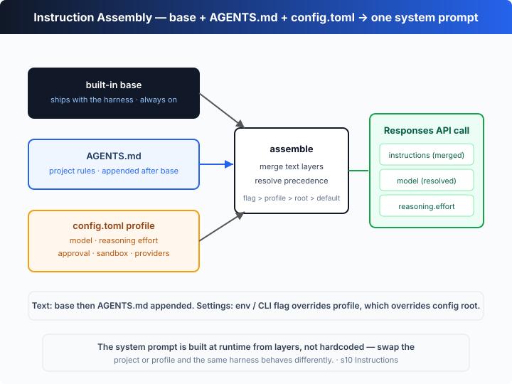

# s10: Instructions — the prompt is assembled, not hardcoded

[中文](README.md) · [English](README.en.md)

`s01` → ... → [s09](../s09_memory_sessions/) → `s10` → [s11](../s11_error_recovery/) → `s12` → ... → s20
> *"The prompt is assembled, not written"* — the system prompt is composed in layers at runtime, not welded into the source.
>
> **Harness layer**: planning — the same harness behaves differently for a different project or config.

---

## The Problem

From s01 to s09, the system prompt was a single hardcoded line:

```ts
const INSTRUCTIONS = `You are a coding agent running in ${CWD}. Use the shell tool ...`;
```

That's fine for s01. But as the agent grows up, three pain points become obvious:

1. **Switching projects means rewriting the whole prompt** — you don't know what to change and what to keep.
2. **"Configuration" is tangled into the code** — model, reasoning effort, approval policy, sandbox mode are all hardcoded; changing the model means editing source.
3. **The project's own rules have nowhere to live** — conventions like "use imperative commit messages" or "run `git status` before wrapping up" belong to the project, but they can only be stuffed into the harness, where they go stale the moment you switch projects.

The problem isn't a badly written prompt — it's that **the harness treats "a string" as configuration**. It should behave like real configuration: layered, overridable, resolved at runtime.

---

## The Solution



Split the system prompt into **layers**, assembled on demand at runtime; hand "which model, how hard to think" to a `config.toml`-style object to resolve. Handle the two kinds of thing separately:

**Text** (composed into the `instructions` string):

| Layer | Content | When it applies |
|-------|---------|-----------------|
| built-in base | who you are, how to use tools | always |
| `AGENTS.md` (project) | the project's own rules | appended after base, only if the file exists |

**Config** (resolved into concrete values):

| Key | Example |
|-----|---------|
| `model` / `model_reasoning_effort` | `gpt-5-codex` / `medium` |
| `approval_policy` / `sandbox_mode` | `on-request` / `workspace-write` |

**Precedence** (higher overrides lower):

| Precedence | Source | Example |
|-----------|--------|---------|
| highest | env / CLI flag | `MODEL_ID`, `--model` |
| middle | `--profile` | `--profile deep` |
| low | `config.toml` root / built-in default | `model = "..."` / `gpt-5-codex` |

The key design: **text merging** and **config resolution** are two independent paths. The first decides what the model *reads*; the second decides *who it is and how hard it thinks*.

---

## How It Works

Translate this into TypeScript, step by step:

**Step 1**: the built-in base, welded into the harness, always present.

```ts
const BASE_INSTRUCTIONS =
  `You are Codex, a coding agent running in ${CWD}. ` +
  `Use the shell tool to solve the task. Act, don't explain. ` +
  `When a project AGENTS.md is present, follow its instructions too.`;
```

**Step 2**: the project layer. Read `AGENTS.md`, use it only if it exists.

```ts
function loadAgentsMd(): string | null {
  const p = fileURLToPath(new URL("./AGENTS.md", import.meta.url));
  return existsSync(p) ? readFileSync(p, "utf8").trim() : null;
}
```

**Step 3**: the config layer. A `config.toml`-style object with `profiles` and `model_providers`.

```ts
const CONFIG: CodexConfig = {
  model: "gpt-5-codex",
  model_reasoning_effort: "medium",
  approval_policy: "on-request",
  sandbox_mode: "workspace-write",
  model_providers: { openai: { name: "OpenAI", wire_api: "responses" } },
  profiles: {
    fast: { model: "gpt-5-codex", model_reasoning_effort: "low" },
    deep: { model: "gpt-5-codex", model_reasoning_effort: "high" },
  },
};
```

**Step 4**: resolve the effective config by precedence — `--profile` overrides the config root, and `env` overrides everything.

```ts
function resolveConfig(cfg: CodexConfig, profileName?: string) {
  const profile = (profileName ? cfg.profiles?.[profileName] : undefined) ?? {};
  return {
    model: process.env.MODEL_ID ?? profile.model ?? cfg.model ?? "gpt-5-codex",
    effort: profile.model_reasoning_effort ?? cfg.model_reasoning_effort ?? "medium",
    approval_policy: cfg.approval_policy ?? "on-request",
    sandbox_mode: cfg.sandbox_mode ?? "workspace-write",
  };
}
```

**Step 5**: merge the text layers into a single `instructions` string.

```ts
function buildInstructions(): { text: string; layers: string[] } {
  const layers = ["built-in base"];
  let text = BASE_INSTRUCTIONS;
  const agents = loadAgentsMd();
  if (agents) {
    layers.push("AGENTS.md (project)");
    text += `\n\n# Project instructions (AGENTS.md)\n${agents}`;
  }
  return { text, layers };
}
```

**Step 6**: feed the resolved values to the API — model, instructions and reasoning effort all come from the resolution above, never from literals.

```ts
const resp = await openai.responses.create({
  model: MODEL,                 // from resolveConfig, not hardcoded
  instructions: INSTRUCTIONS,   // from buildInstructions, base + AGENTS.md
  input, tools: TOOLS,
  reasoning: { effort: EFFORT }, // also from resolveConfig
});
```

**Core insight**: the prompt is no longer a welded string — it's a runtime *text merge + config resolution*. Switch project (a different `AGENTS.md`) or switch effort (a different `--profile`) and the same harness behaves differently. In the offline demo, this chapter's bundled `AGENTS.md` asks the agent to "run `git status` before wrapping up" — and the scripted model does exactly that. That proves the assembled prompt genuinely drives the model's behavior, not just decorative text.

---

## Try It

> **Teaching demo note**: this chapter reads project instructions from `s10_instructions/AGENTS.md` and runs the model-generated `git status` command. Run it in this repo or any scratch git repo.

**No API key needed**: without `OPENAI_API_KEY`, the offline demo prints the assembled system prompt (both layers) and the resolved `model / effort / approval / sandbox` at startup; the scripted model then follows `AGENTS.md` and runs `git status` first.

**Setup** (first run):

```sh
npm install
cp .env.example .env        # fill in OPENAI_API_KEY and MODEL_ID to run the real model
```

**Run**:

```sh
npx tsx s10_instructions/code.ts                    # default config
npx tsx s10_instructions/code.ts --profile deep     # use the deep profile (effort=high)
OPENAI_API_KEY=sk-... npx tsx s10_instructions/code.ts   # real model
```

Try these experiments:

1. Run it directly and check whether `layers` in the startup panel reads `built-in base + AGENTS.md (project)`, and look at the `resolved:` line.
2. Run once with `--profile fast` and once with `--profile deep`, and watch `effort` change from `medium` to `low` / `high`.
3. Edit `s10_instructions/AGENTS.md` (say, change the rule to "run `git diff` before wrapping up"), run again, and watch the startup panel and the model's behavior change immediately.

Watch for: which layer does the `model` / `effort` in `resolved:` come from? After you edit `AGENTS.md`, do the assembled prompt and the model's behavior change right away?

---

## What's Next

The prompt now assembles at runtime, and the model and effort switch via config. But the agent still falls over completely on any API error — rate limits, overload, context overflow, the user hitting Esc. These aren't bugs, they're the norm, and each one demands a completely different response.

s11 Error Recovery → wrap `callModel` in a layer of *classified retries*: back off on rate limits, compact-then-retry on overflow, stop immediately on abort.

<details>
<summary>Into the Codex source</summary>

> The following is based on the overall structure of OpenAI's open-source [`openai/codex`](https://github.com/openai/codex) repo (`codex-rs`, written in Rust). The chapter's "merge base + AGENTS.md, resolve model/effort from config" is the minimal skeleton of Codex's instruction assembly; the differences are all in the engineering details of how many sources there are and how overrides work.

**The chapter's `buildInstructions` + `resolveConfig` ≈ Codex's instruction assembly and config resolution.** Each item below hardens that core.

<details>
<summary>1. The base prompt is built into codex-rs — and varies by model</summary>

The chapter writes the base as a single constant string. Codex's base instructions are built into `codex-rs`, and they are **not one fixed block** — they select different built-in prompts depending on the model in use (e.g. `gpt-5-codex` vs others) and on configuration. In other words the "built-in base" is itself a layer that configuration can influence, not just a welded literal. The chapter uses a single constant so the fact that "there is always a base layer" is immediately visible.

</details>

<details>
<summary>2. Discovery and merging of AGENTS.md</summary>

The chapter only reads "one AGENTS.md in this chapter's directory". Codex's convention is broader: it looks for `AGENTS.md` in the project (project-level instructions) and also supports a global `~/.codex/AGENTS.md`, **merging** these project/user-level instructions into what gets sent to the model. The core idea matches the chapter — base first, project conventions appended after; the real implementation just supports more sources and a fuller lookup rule.

</details>

<details>
<summary>3. config.toml: model, effort, policies, profiles, providers</summary>

The chapter's `CONFIG` object corresponds to the real `~/.codex/config.toml`. It supports keys including `model`, `model_reasoning_effort`, `approval_policy`, `sandbox_mode`, plus **`profiles`** (a set of named presets selected with `--profile` that override the root values) and **`model_providers`** (custom providers, with `wire_api`, for pointing Codex at a compatible gateway instead of the default API). The chapter puts all of this in one object literal so the "layering + override" structure is clear without pulling in a TOML parser.

</details>

<details>
<summary>4. Precedence: CLI > profile > config root > built-in default</summary>

The chapter demonstrates the override order with "`env` > `--profile` > config root > default". Codex's real rules point the same way: the **command line** (e.g. `-c key=value`, `--model`, `--profile`) beats `config.toml`; a value inside a `profile` beats the same-named value at the config root; built-in defaults are the fallback. The env var (`MODEL_ID`) plays the role of "highest-precedence override" in the chapter, standing in for real-world CLI/environment overrides. Once you understand "later-applied layers override earlier-applied layers", the whole resolution makes sense.

</details>

**In one line**: the core of Codex's instruction assembly is exactly the chapter's "merge base + AGENTS.md into instructions, resolve model/effort/policies from config, override by precedence". Every extra mechanism — per-model built-in prompts, multi-source AGENTS.md, TOML with profiles/providers, finer override rules — exists to keep that assembly flexible and predictable across real multi-project, multi-model use. Master "layering + override = a configurable prompt" and the rest is engineering hardening.

</details>

<!-- translation-sync: zh@v1, en@v1 -->
