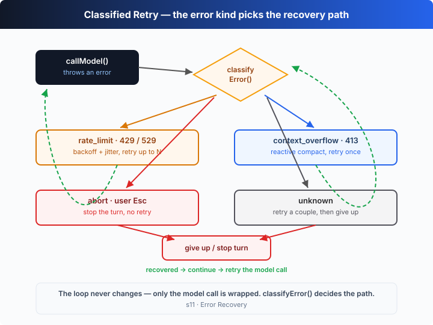

# s11: 错误恢复 — 错误不是崩溃，是分类后的下一步

[中文](README.md) · [English](README.en.md)

`s01` → ... → [s10](../s10_instructions/) → `s11` → [s12](../s12_task_system/) → `s13` → ... → s20
> *"An error is not a crash, it's a classified next step"* — 限流退避、超长压缩、中止即停。
>
> **Harness 层**：规划 —— 主循环遇到失败时，先分类再决定怎么恢复。

---

## 问题

Agent 跑到一半，模型调用抛了个错：

```
Error: 429 Too Many Requests
```

s01 那个朴素的循环对 `callModel()` 没有任何保护——一个异常抛出来，整个 turn 直接崩了。没重试、没压缩、没区分「等一下就好」和「真没救了」。

可生产环境里，API 报错是**常态**而不是意外：限流（429）、过载（529）、上下文超长（413 / context overflow）、用户按了 Esc 中止。这些错的**正确反应完全不同**——限流该退避重试，超长该先压缩再试，中止该立刻停手。把它们当成同一种「崩溃」处理，就像一辆车一碰到减速带就熄火。

问题不在模型不够稳，而在 **harness 把「调用失败」当成了终点**。它需要的是一张「错误 → 恢复路径」的对照表。

---

## 解决方案



s01 的循环一行不改，只在 `callModel()` 外面包一层**分类重试**。模型调用一抛错，先送进 `classifyError()` 分桶，再按桶选恢复路径，恢复了就 `continue` 回到循环开头重试：

| 错误类型 | 触发信号 | 恢复动作 |
|----------|----------|----------|
| `rate_limit` | HTTP 429 / 529、「rate limit」「overloaded」 | 指数退避 + 抖动，最多重试 N 次 |
| `context_overflow` | HTTP 413、「context length」「too long」 | 反应式压缩（丢掉最旧的轮次），**只重试一次** |
| `abort` | 用户 Esc / `AbortError` | 立刻中止当前 turn，不重试 |
| `unknown` | 其它一切 | 少量重试，超过就放弃 |

关键洞察：**恢复策略是错误类型的函数**。同一个 `try/catch`，抓到 429 该等，抓到 413 该压，抓到 abort 该停——分不清这三者，就谈不上健壮。退避公式是标准的 `min(500 × 2^attempt, 32s)` 再加 0–25% 随机抖动，避免一群并发请求在同一时刻一起重试。

---

## 工作原理

在 s01 的循环上加一层包装，分步来看：

**第 1 步**：写一个分类器，把任意异常映射到四种桶之一。看 HTTP 状态码、错误码、错误名、消息文本。

```ts
type ErrKind = "rate_limit" | "context_overflow" | "abort" | "unknown";

function classifyError(err: unknown): ErrKind {
  const e = err as { status?: number; code?: string; name?: string; message?: string };
  const msg = (e?.message ?? "").toLowerCase();
  if (e?.name === "AbortError" || msg.includes("abort")) return "abort";
  if (e?.status === 429 || e?.status === 529 || msg.includes("rate limit")) return "rate_limit";
  if (e?.status === 413 || e?.code === "context_length_exceeded" || msg.includes("too long"))
    return "context_overflow";
  return "unknown";
}
```

**第 2 步**：准备两件恢复工具——指数退避计时器，和一个最小的反应式压缩（丢掉最旧的轮次，给上下文腾地方；s08 才讲完整的自动压缩）。

```ts
function backoffDelay(attempt: number): number {
  const base = Math.min(500 * 2 ** attempt, 32_000); // 封顶 32s
  return base + Math.random() * base * 0.25;         // 加 0–25% 抖动
}

function compactThread(input: unknown[], keepRecent = 3): void {
  const tail = input.slice(-keepRecent);
  input.length = 0;
  input.push({ role: "user", content: "[compacted] earlier turns summarized" }, ...tail);
}
```

**第 3 步**：写包装函数。里面是一个 `for (;;)`，每次先试着调模型；抛错就分类，按桶决定 `continue`（重试）、`throw`（放弃/中止）。每个桶有自己的计数器。

```ts
async function callModelWithRecovery(input: unknown[]): Promise<OutputItem[]> {
  let rateLimitRetries = 0, unknownRetries = 0, compacted = false;
  for (;;) {
    try {
      return await callModel(input);            // 成功就直接返回
    } catch (err) {
      switch (classifyError(err)) {
        case "abort":    throw err;             // 中止：立刻向上抛
        case "rate_limit":
          if (rateLimitRetries++ < 5) { await sleep(backoffDelay(rateLimitRetries)); continue; }
          break;
        case "context_overflow":
          if (!compacted) { compacted = true; compactThread(input); continue; }
          break;
        default:
          if (unknownRetries++ < 2) { await sleep(backoffDelay(unknownRetries)); continue; }
      }
      throw err;                                // 桶里没招了：放弃
    }
  }
}
```

**第 4 步**：循环本身和 s01 一模一样，唯一区别是把裸调用换成包装调用。

```ts
const output = await callModelWithRecovery(input); // ← s11：包过，不是裸调
```

**核心洞察**：错误恢复没有改动 agent 的「形状」——循环还是那个循环，工具还是那些工具。它只是把「调用模型」这一步从「一次成败」变成「可恢复的尝试」。离线 demo 里，脚本化模型被安排**先连错三次**（429 → 529 → 上下文超长），你能清楚看到三条恢复路径各走了一遍，第四次才真正调通、跑工具、收尾。

---

## 试一下

> **教学 demo 提示**：代码会执行模型生成的 shell 命令（离线 demo 里就是 `ls -la`）。建议在临时目录里跑。

**无需 API key 也能跑**：没有 `OPENAI_API_KEY` 时，本章的离线脚本化模型会先**故意连错三次**（限流、过载、上下文超长），把三条恢复路径完整演一遍，然后才成功。

**准备**（首次运行）：

```sh
npm install
cp .env.example .env        # 想跑真实模型就填入 OPENAI_API_KEY 和 MODEL_ID
```

**运行**：

```sh
npx tsx s11_error_recovery/code.ts                # 离线 demo 模型
OPENAI_API_KEY=sk-... npx tsx s11_error_recovery/code.ts   # 真实模型
```

试试这些 prompt：

1. `list the files in this directory`
2. `show the current git branch`
3. `create hello.ts that prints "hi"`

观察重点：前三次模型调用是不是分别触发了限流退避（间隔在变长）、过载退避、以及「反应式压缩后重试」？注意看 `[recovery]` 日志里每种错误走的不同路径，以及压缩时被丢弃的早期轮次。

---

## 接下来

Agent 现在经得起失败了。但它处理的还是「一次性」任务——你给一个目标，它做完就完。一个真实项目要拆成一堆**有依赖关系**的子任务：先建数据库，才能写 API，才能写测试。

s12 Task System → 给 Agent 一块**共享任务板**：能创建、认领、完成任务，能声明依赖、挡住没就绪的活。这也是后面多 Agent 协作的地基。

<details>
<summary>深入 Codex 源码</summary>

> 以下基于 OpenAI 开源的 [`openai/codex`](https://github.com/openai/codex) 仓库（`codex-rs`，Rust 实现）的整体结构。教学版的「分类 + 重试」就是 Codex 处理模型调用失败的最小骨架；差异全在生产级的流式细节与状态管理上。

**教学版的 `callModelWithRecovery` ≈ Codex 模型客户端与 turn 循环里的失败处理。** 下面每一项都是在这个核心上做的加固。

<details>
<summary>一、退避重试发生在「模型客户端」层，不在 turn 循环层</summary>

教学版把重试逻辑直接包在 `callModel()` 外面，和循环贴在一起。Codex 里这两层是分开的：底层的**模型客户端**（`core` 里负责和 Responses API 建流式连接的那部分）在遇到瞬时 HTTP 错误（429、5xx）时，会先做**带抖动的指数退避重试**，重试耗尽才把错误向上抛给 turn 循环。也就是说「限流退避」对上层是透明的——上层看到的要么是成功的事件流，要么是一个已经重试过 N 次仍然失败的错误。教学版把它摊平在一层，是为了让「分类 → 动作」这条链一眼可见。

</details>

<details>
<summary>二、上下文超长对应的是「自动压缩」，不只是丢轮次</summary>

教学版的 `compactThread` 很粗暴：直接丢掉最旧的几条。Codex 的做法是**压缩（compaction）**：当对话逼近模型的上下文窗口，它会让模型把前面的历史**总结**成一条紧凑的摘要项，再用摘要替换原始历史后继续（这正是 s08 的主题）。API 返回「prompt too long / context overflow」是触发这条路径的信号之一，但更常见的是 harness 根据 token 用量**主动**在超限前就压缩。教学版用「丢最旧轮次」模拟「腾出上下文」这个效果，机制上是同一条「先压再试」的路。

</details>

<details>
<summary>三、中止是一等公民，和「报错」走完全不同的路</summary>

教学版把 `abort` 单独分成一桶，抓到就立刻向上抛、停止当前 turn。Codex 同样把**用户中断**（TUI 里按 Esc）和**真正的错误**严格区分：中断会让当前 turn 干净地收尾——停掉正在跑的模型流和工具执行，但**会话本身保留**，用户可以马上接着发下一条指令。它不被算作「失败重试」的对象，因为重试一个用户主动取消的操作毫无意义。这也是为什么教学版的 `abort` 分支是 `throw` 而不是 `continue`。

</details>

<details>
<summary>四、流式让「什么时候算失败」更微妙</summary>

教学版把模型调用当成一次「要么返回、要么抛错」的整体。Codex 走的是**流式**：模型边生成边发事件，harness 边收边派发工具。于是「失败」可能发生在流的中途——连接断了、某个事件出错。客户端要判断这条流是「已经吐出了足够内容、可以续」还是「必须整体重来」，这比教学版的整调用重试要细。但**恢复的哲学完全一致**：先给失败分类，再对每一类选一条代价最小的恢复路径。

</details>

**一句话**：Codex 的错误恢复核心就是教学版这张「错误类型 → 恢复动作」的对照表。所有额外机制——分层重试、自动压缩、中断与会话分离、流式续接——都是为了让这张表在真实的流式、长会话环境里既稳又不打扰用户。先吃透「分类决定恢复」这一条，其余都是工程加固。

</details>

<!-- translation-sync: zh@v1, en@v1 -->
