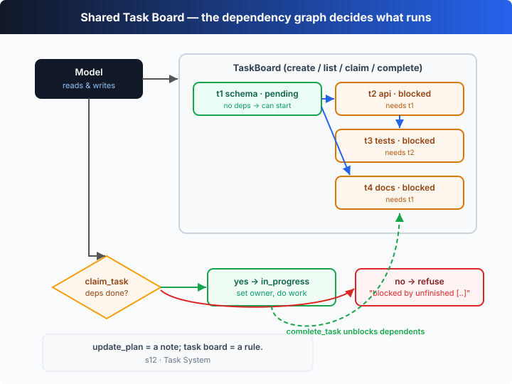

# s12: The Task System — A Shared Task Board the Agent Can Read and Write

[中文](README.md) · [English](README.en.md)

`s01` → ... → [s11](../s11_error_recovery/) → `s12` → [s13](../s13_background_tasks/) → `s14` → ... → s20
> *"A board the agent can read and write"* — break a big goal into tasks, order them by dependency, and let the board decide what runs first.
>
> **Harness layer**: collaboration — turn one big goal into a dependency graph of tasks with statuses that can be claimed.

---

## The Problem

Give the agent a real project: "Set up the database, write the API, add tests, write the docs."

It lists a checklist with s05's `update_plan`, then dives into the API — halfway through it realizes there's no database table yet and doubles back; while adding tests it finds the API signature changed and doubles back again. It keeps doing "whatever it remembers next," and the ordering lives entirely in its head.

You can't put the roof on before the foundation. These sub-tasks have an **order**: the API depends on the database being ready, the tests depend on the API. And the checklist only lives for this one conversation — a new turn, a different agent, and it's gone.

The problem isn't that the model can't break down tasks — it's that **the breakdown only exists in the model's head**. The harness can't see the dependencies, so it can't step in when the agent tries to "build the roof before the foundation."

---

## The Solution



Upgrade the plan from "a thought in the model's head" to a **shared task board held by the harness**: each task is a structured object (`id`, `subject`, `status`, `owner`, `blockedBy`), and the model reads and writes the board through five tools. The loop is still s01's loop; only the dispatch table gains a few tools:

| tool | purpose | key check |
|------|---------|-----------|
| `create_task` | create a task, optionally declaring `blockedBy` dependencies | deps stored on the task object |
| `list_tasks` | list the whole board (status + deps + blocked flag) | rendered for the model to see |
| `claim_task` | claim a task, `pending → in_progress` | **refused** if blocked or already claimed |
| `complete_task` | mark done, `in_progress → completed` | unlocks downstream tasks as a side effect |
| `shell` | do the real work (create tables, write code, run tests) | interleaves with the task tools |

There's exactly one core rule: **a task may not be claimed until every entry in its `blockedBy` is `completed`**. Ordering no longer relies on the model's memory — it's a hard constraint on the board. In the offline demo you'll see the model try to jump the gun and claim the blocked `t2`, only to be refused by the board; once `t1` completes, `t2` and `t4` unlock automatically.

---

## How It Works

On top of s01's loop + s02's dispatch table, add a task board, step by step:

**Step 1**: define the task's structure and state machine. Three states, two actions, and `blockedBy` forming a dependency graph.

```ts
type TaskStatus = "pending" | "in_progress" | "completed";
type Task = { id: string; subject: string; status: TaskStatus;
              owner: string | null; blockedBy: string[] };
// state machine: pending ──claim──> in_progress ──complete──> completed
```

**Step 2**: the board's core is this "can it start" check — it only passes once every dependency is completed.

```ts
canStart(id: string): boolean {
  const t = this.tasks.get(id);
  if (!t) return false;
  return t.blockedBy.every((dep) => this.tasks.get(dep)?.status === "completed");
}
```

**Step 3**: `claim` runs three checks first — does it exist? is it still `pending`? are all deps done? Fail any and the claim is refused.

```ts
claim(id: string, owner: string): string {
  const t = this.tasks.get(id);
  if (!t) return `Error: no such task ${id}`;
  if (t.status !== "pending") return `Error: ${id} is ${t.status}, cannot claim`;
  if (!this.canStart(id)) return `Error: ${id} is blocked by unfinished ...`;
  t.owner = owner; t.status = "in_progress";
  return `Claimed ${id} (${t.subject})`;
}
```

**Step 4**: besides marking done, `complete` scans for whose `blockedBy` is now satisfied — and reports the tasks it just unlocked.

```ts
complete(id: string): string {
  this.tasks.get(id)!.status = "completed";
  const unblocked = this.list()
    .filter((x) => x.status === "pending" && x.blockedBy.includes(id) && this.canStart(x.id));
  return `Completed ${id}` + (unblocked.length ? ` — unblocked: ...` : "");
}
```

**Step 5**: register these five tools into the dispatch table; the loop itself is unchanged. Each turn the model sees the board state returned by the tools and decides whom to claim next.

```ts
const DISPATCH: Record<string, (args) => string> = {
  create_task: (a) => `Created ${board.create(a.subject, a.blockedBy).id}`,
  list_tasks: () => board.render(),
  claim_task: (a) => board.claim(a.id, "agent"),
  complete_task: (a) => board.complete(a.id),
  shell: (a) => runShell(a.command),
};
```

**Core insight**: `update_plan` is a sticky note the model writes for itself; a task board is a **rule the harness enforces**. A sticky note can be rewritten on a whim, but a `claim_task` refusal is set in stone — if the dependencies aren't ready, you simply can't claim it. Turning "order" from the model's diligence into the harness's constraint is exactly what makes multi-agent collaboration (s15–s17) possible later: everyone answers to the same board and the same rules.

---

## Try It

> **Teaching demo note**: the offline demo uses `shell` to run `echo` as a stand-in for real work; it touches no real files. The task board lives in process memory and is cleared on exit (persistence is left to s09's rollout).

**No API key needed**: without `OPENAI_API_KEY`, the built-in offline model runs the whole arc — "build a 4-task dependency board → jump the gun and get refused → claim and work in order → unlock downstream."

**Setup** (first run):

```sh
npm install
cp .env.example .env        # fill in OPENAI_API_KEY and MODEL_ID to run the real model
```

**Run**:

```sh
npx tsx s12_task_system/code.ts                # offline demo model
OPENAI_API_KEY=sk-... npx tsx s12_task_system/code.ts   # real model
```

Try these prompts:

1. `Set up the database, build the API on top of it, then test and document it`
2. `Plan a small web app: scaffold, implement, test — with the right order`
3. `Break "migrate this repo to TypeScript" into tasks and start the first one`

Watch for: when the model first tries to claim a blocked task, does the board refuse it? After a task completes, which tasks lose their `[blocked]` flag in `list_tasks`?

---

## What's Next

The task board solves "what to do first." But some tasks take a long time to run — full test suites, builds, deploys. Model calls are billed by the token, so sitting idle waiting on a slow command is burning money.

s13 Background Tasks → push slow operations into the **background**: the agent doesn't wait, keeps reasoning about other things, and collects the result on a later turn once it's done.

<details>
<summary>Into the Codex source</summary>

> The following is based on the overall structure of OpenAI's open-source [`openai/codex`](https://github.com/openai/codex) repo (`codex-rs`, written in Rust). The chapter's task board turns "a plan" into a dependency graph; the closest built-in mechanism in Codex is `update_plan`, and the differences are persistence and dependency enforcement.

**The chapter's `TaskBoard` ≈ a "dependency-hardened" version of Codex's plan tool.** Each item below compares them.

<details>
<summary>1. Codex's built-in is update_plan, not a full task board</summary>

Codex's built-in planning tool for the model is `update_plan` (see s05): the model rewrites and returns a whole list of steps (each with a `pending / in_progress / completed` status), and the core turn loop handles it inside the harness, updating session state — **no sandbox, no execution**. It has status and progress, but **no `blockedBy` dependency graph, no owner, no enforced "refuse to claim."** The chapter's task board adds exactly that dependency-checking constraint on top of `update_plan`'s state machine — a teaching step up, not a replica of a native Codex feature.

</details>

<details>
<summary>2. Dependency enforcement is the key layer the chapter adds</summary>

Codex's `update_plan` only expresses "which step I'm on now"; it doesn't stop the model from skipping around. The chapter's `claim_task` adds a rule Codex's plan tool doesn't have: if `blockedBy` isn't all completed, the claim is **refused**. This "harness enforces ordering" idea is closer to task scheduling in multi-agent orchestration — in Codex Cloud / multi-agent settings, when one goal is split into sub-tasks handed to different agents, who goes first must be decided by a shared source of truth, not by each agent's diligence. The chapter builds that "shared board" for a single agent first; s15–s17 put multiple agents on it.

</details>

<details>
<summary>3. Where the state lives: memory vs rollout</summary>

The chapter keeps the task board in process memory, cleared on exit. Codex's session state (including the `update_plan` plan) is persisted via the **rollout** (see s09), so `codex resume` can bring back an unfinished plan when restoring a long session. In other words: in Codex, "plan/state" persistence goes through the session rollout; the chapter deliberately makes the board pure in-memory so the reader focuses on the single new mechanism — dependency checking — and leaves persistence to s09.

</details>

<details>
<summary>4. Why "tools" and not "keywords"</summary>

Both the chapter and Codex expose task operations as **model-callable tools**, not special syntax the harness parses. The benefit is shared: the model calls `create_task` / `claim_task` exactly the way it calls `shell`, the tool result is the board state, and it naturally lands in context for the model to keep reasoning over. The only difference is where each is handled — built-in tools like `update_plan` are handled directly by the core loop, while ones like `shell` go through approval + sandbox. The chapter's `DISPATCH` table holds both kinds, continuing s02's registry.

</details>

**In one line**: the chapter's task board = Codex `update_plan`'s state machine + a layer of dependency enforcement + (left to s09) persistence. It turns "what to do first" from the model's diligence into the harness's rule — the minimal precondition for multiple executors to collaborate on one shared plan.

</details>

<!-- translation-sync: zh@v1, en@v1 -->
