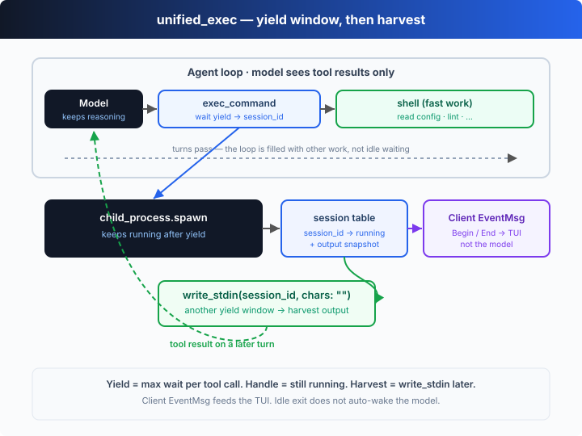

# s13: Background Tasks — Detach the Slow Command, the Agent Doesn't Wait

[中文](README.md) · [English](README.en.md)

`s01` → ... → [s12](../s12_task_system/) → `s13` → [s14](../s14_automations/) → `s15` → ... → s20
> *"Detach the slow command, keep reasoning, harvest it later"* — run slow commands in the background, collect the result on a later turn.
>
> **Harness layer**: concurrency & automation — asynchronous execution that doesn't block the main loop.

---

## The Problem

Ever used a washing machine? You toss the clothes in, press start, and go cook dinner or answer messages — 30 minutes later it beeps to tell you it's done. You don't stand in front of it waiting.

The agent's `shell` tool is the same. `npm install` takes minutes; `npm run build` takes tens of seconds. The moment one of these runs, the loop is stuck inside `execSync`, unable to do anything else.

Reading a file is milliseconds — no waiting. `git status` returns in a second — no waiting. But `npm install`? Minutes. The agent sits idle for minutes while the model is billed by the token — idling is burning money.

---

## The Solution



Split the slow command into **two steps**: first `run_background` `spawn`s it (returning a task id immediately, **without blocking**), and the agent keeps doing other work with `shell`; a few turns later, `check_background` **harvests** the result by id. The loop is still s01's loop, with just two new tools:

| tool | purpose | returns |
|------|---------|---------|
| `run_background` | `spawn` a slow command as a child process, register it | a `bg_N` id right away, plus "still running, check later" |
| `check_background` | poll the registry by id | `still running`, or `finished` + the captured output |
| `shell` | run fast commands (synchronous, unchanged) | output immediately |

The key point: `run_background` returns not a result but a **handle**. Getting `bg_1` tells the model "this is still running," so it does something else first; on a later turn it calls `check_background(bg_1)` and gets either "not done yet" or "done, here's the output." **The waiting time gets filled** instead of idled away. In the offline demo you'll see the first check come back `still running`, and after doing another piece of work, the second check returns `finished` with the output harvested.

---

## How It Works

On top of s01's loop + s02's dispatch table, add a background-task registry and two tools, step by step:

**Step 1**: a registry holding each background process's id, command, status, and accumulated output.

```ts
type BgTask = { id: string; command: string; status: "running" | "done"; output: string };
const bgTasks = new Map<string, BgTask>();
```

**Step 2**: `startBackground` uses `spawn` to launch the child process — it's **asynchronous**, returning the moment it's called. Output streams accumulate, and when the process exits the status flips to `done`.

```ts
function startBackground(command: string): string {
  const id = `bg_${++bgSeq}`;
  const task: BgTask = { id, command, status: "running", output: "" };
  bgTasks.set(id, task);
  const child = spawn(command, { cwd: CWD, shell: true });   // returns at once, no blocking
  child.stdout?.on("data", (d) => (task.output += String(d)));
  child.stderr?.on("data", (d) => (task.output += String(d)));
  child.on("close", (code) => { task.status = "done"; task.output += `\n(exit ${code})`; });
  return `Started ${id} in the background. Poll it with check_background.`;
}
```

**Step 3**: `checkBackground` looks up the registry by id. Still running → "running"; finished → hand back the accumulated output — that's the "harvest."

```ts
async function checkBackground(id: string): Promise<string> {
  await flushIo();                       // let the loop run the child callbacks before reading
  const t = bgTasks.get(id);
  if (!t) return `Error: no such background task ${id}`;
  return t.status === "running"
    ? `${id} still running: ${t.command}`
    : `${id} finished: ${t.command}\n--- output ---\n${t.output}`;
}
```

**Step 4**: register both tools into the dispatch table; the loop is unchanged. The model starts the slow work with `run_background`, interleaves fast `shell` work, then harvests with `check_background`.

```ts
const DISPATCH = {
  shell: (a) => runShell(a.command),                 // fast: synchronous
  run_background: (a) => startBackground(a.command), // slow: background
  check_background: (a) => checkBackground(a.id),    // poll: harvest
};
```

**Core insight**: a synchronous tool fuses "invoke" and "wait for the result" into one thing; a background tool **splits it in two** — "start" returns a handle immediately, "harvest" is deferred. In between, the agent's main loop isn't freed up to wait; it's filled with other work. One implementation detail makes the point vividly: a foreground `execSync` **blocks Node's event loop**, so `checkBackground` `await`s a beat at the top to let the child's "exit / data" callbacks run first — otherwise the process has finished at the OS level but Node hasn't yet flipped the status to `done`.

---

## Try It

> **Teaching demo note**: the offline demo's background command is `sleep 1.5 && echo ...`, and the foreground commands are `echo` / `sleep 2`. No real files are touched.

**No API key needed**: without `OPENAI_API_KEY`, the built-in offline model runs the whole arc — "start a build in the background → interleave fast work → first check not done → do another piece of work → second check harvests the output."

**Setup** (first run):

```sh
npm install
cp .env.example .env        # fill in OPENAI_API_KEY and MODEL_ID to run the real model
```

**Run**:

```sh
npx tsx s13_background_tasks/code.ts                # offline demo model
OPENAI_API_KEY=sk-... npx tsx s13_background_tasks/code.ts   # real model
```

Try these prompts:

1. `Run the build in the background and read package.json while it runs`
2. `Start the test suite in the background, then keep refactoring src`
3. `Install dependencies in the background and scaffold the app meanwhile`

Watch for: does the slow command go through `run_background` and return a `bg_N` immediately? Is the first `check_background` a `still running`? Does the agent keep doing other work in the gap, and does the last check harvest the output?

---

## What's Next

Background tasks solve "slow operations don't block the main loop." But what if you want something done **on a schedule** — "run the tests every day at 9am," "check the service status every 5 minutes" — triggered not by you or the model right now, but automatically when the time comes?

s14 Automations → give the agent an **alarm clock**: a tiny scheduler that enqueues a task on a cron-like tick and wakes the agent to run it.

<details>
<summary>Into the Codex source</summary>

> The following is based on the overall structure of OpenAI's open-source [`openai/codex`](https://github.com/openai/codex) repo (`codex-rs`, written in Rust). The chapter's "spawn + poll to harvest" is the minimal skeleton of asynchronous execution; Codex's core is **fully async**, and the differences are in the execution model and how results come back.

**The chapter's `run_background` / `check_background` ≈ a minimal slice of Codex's async execution model.** Each item below compares them.

<details>
<summary>1. Codex's core is fully async (tokio), not "sync with an occasional background"</summary>

The chapter defaults to synchronous (blocking `execSync`) and only detaches "slow commands." Codex's Rust core runs on the **tokio async runtime**: every command execution `spawn`s a child process and returns a handle, and the core loop `await`s it rather than blocking. So in Codex "background" isn't a special mode — it's the **default**: all execution is an async task, and the only difference is whether it's `await`ed right away (foreground — you need the result to continue) or suspended and collected later (background). The chapter flips this to "sync by default, background as the exception" to make the act of "splitting the wait" more visible.

</details>

<details>
<summary>2. A streaming event loop means harvesting doesn't need polling</summary>

The chapter's model has to actively `check_background` to learn whether the background task finished. Codex's core loop consumes a **stream of events**: a child process's output and exit enter the stream as events, and the harness can **push** a "background task finished" event to the model on a later turn, rather than waiting for the model to remember to ask. The chapter's "model actively polls" is the same data flow with "push" swapped for "pull" — more explicit, and easier to teach.

</details>

<details>
<summary>3. codex exec: non-interactive runs with no TUI</summary>

`codex exec` (non-interactive mode) uses the **same** core loop but starts no TUI and has no human in the middle: it runs one prompt to completion, prints the event stream to stdout, and exits. This is exactly where background/async execution earns its keep — with no interactive user to wait on, all work must be advanced asynchronously and harvested when due. The chapter's offline demo is really a minimal "exec-style" run: give it a goal and it runs the background task to completion, harvests it, and wraps up, with nobody watching.

</details>

<details>
<summary>4. Approval & sandboxing still govern every execution</summary>

Foreground or background, every command in Codex passes `approval_policy` and `sandbox_mode` (s03/s04) before it runs: going async changes "when you wait for the result," not "whether it may run, and where." To keep the focus on the async mechanism, the chapter reduces approval/sandboxing to a string match; in the real implementation, a background-spawned child runs in the same sandbox under the same policy.

</details>

**In one line**: Codex's execution is asynchronous by nature — every command is `spawn`ed as a task, and foreground vs background only differ in "await now or collect later." The chapter compresses that model into two tools (`run_background` to start, `check_background` to harvest), plus `codex exec` as the no-interaction entry point — and that's the whole idea behind "slow operations don't block the main loop."

</details>

<!-- translation-sync: zh@v1, en@v1 -->
