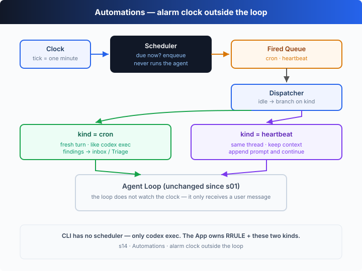

# s14: Automations — 到点自己跑

[中文](README.md) · [English](README.en.md)

`s01` → ... → [s13](../s13_background_tasks/) → [s14](../s14_automations/) → [s15](../s15_agent_teams/) → ... → s20
> *"Set the schedule, the harness runs itself"* — 时间驱动的触发，调度与执行解耦。
>
> **Harness 层**：并发与自动化 —— 独立调度器判断时间，队列传递触发。

---

## 问题

闹钟不需要你盯着它才会响。你设好 7:00，到点它自己响——你在睡觉、在洗澡、在做饭，它照响不误。

到目前为止，每一章的 Agent 都是**被动**的：你敲一句，它跑一轮。s13 让 Agent 能后台跑慢任务，但那个任务仍然是你手动敲出来的。

可「每天早上 9 点跑一遍测试」「每 30 分钟看一眼 CI 红了没」这类周期性工作，不该每次都要人来推一把。让 harness 自己决定**什么时候**该跑一轮，就是本章要加的机制。

---

## 解决方案



新增一个**调度器**：每个 tick 把当前时间拿去和每个 automation 的 cron 表达式匹配；命中的任务不直接执行，而是**塞进一个触发队列**；另一头的**派发器**在 Agent 空闲时从队列里取一个任务，用 s01 那个不变的 agent loop 跑完整一轮。触发（scheduler）与执行（dispatcher）通过队列解耦。

手动触发 vs 定时触发：

| | 手动触发（s01–s13） | 定时触发（s14） |
|---|---|---|
| 触发者 | 用户输入 | 调度器（cron 匹配） |
| 触发时机 | 随时，要人敲 | cron 表达式指定的时刻 |
| 需要人参与 | 是 | 否：自动入队，空闲时自动执行 |
| 执行内容 | 当次对话 | 一次完整的 agent turn |

> 教学版用一个**模拟时钟**（每 tick 走一分钟）让 demo 几秒跑完；cron 匹配器是真实语义，换成真实时钟就能按真实时间触发。

---

## 工作原理

分四块来看：cron 匹配、调度器（生产者）、派发器（消费者）、以及那个不变的 agent loop。

**第 1 步**：cron 字段匹配。支持 `*`、`*/N`、`N`、`N-M`、逗号列表。

```ts
function cronFieldMatches(field: string, value: number): boolean {
  for (const part of field.split(",")) {
    if (part === "*") return true;
    const step = /^(\*)\/(\d+)$/.exec(part);
    if (step && value % Number(step[2]) === 0) return true;
    const range = /^(\d+)-(\d+)$/.exec(part);
    if (range && value >= Number(range[1]) && value <= Number(range[2])) return true;
    if (/^\d+$/.test(part) && value === Number(part)) return true;
  }
  return false;
}
```

**第 2 步**：五段式语义。分钟、小时、月份必须全部匹配；日（DOM）和星期（DOW）同时被约束时，任一命中即可（OR）。

```ts
if (!(cronFieldMatches(minute, t.minute) &&
      cronFieldMatches(hour, t.hour) &&
      cronFieldMatches(month, t.month))) return false;
if (dom === "*" && dow === "*") return true;
// 只有一个被约束就用它；都被约束就取 OR
return domOk || dowOk;
```

**第 3 步**：调度器是生产者。每个 tick 推进模拟时钟一分钟，把命中的 automation **入队**——它从不亲自执行。一次性任务触发后即注销。

```ts
tick(now: SimTime): void {
  const marker = `${now.hour}:${now.minute}@${now.dom}`;
  for (const a of [...this.automations.values()]) {
    if (!cronMatches(a.cron, now) || a.lastFired === marker) continue;
    a.lastFired = marker;                 // 同一分钟不重复触发
    firedQueue.push(a);                   // 只入队，不执行
    if (!a.recurring) this.automations.delete(a.id);
  }
}
```

**第 4 步**：派发器是消费者。它不管时间，只在 Agent 空闲时从队列取一个任务，跑完整一轮 agent turn。队列空了、调度器也停了，就退出。

```ts
async function dispatcher(): Promise<void> {
  while (!halted || firedQueue.length > 0) {
    const job = firedQueue.shift();       // 空闲时取一个
    if (!job) { await sleep(TICK_MS / 3); continue; }
    await runAutomation(job);             // s01 的 agent loop，原样复用
  }
}
```

组装起来，生产者与消费者只靠 `firedQueue` 相连：

```ts
const drain = dispatcher();               // 消费者常驻
for (let minute = 0; minute <= 5; minute++) {
  scheduler.tick({ minute, hour: 9, dom: 15, month: 7, dow: 3 });  // 生产者
  await sleep(TICK_MS);
}
halted = true;
await drain;                              // 等队列清空再退出
```

关键在于**解耦**：调度器不知道 agent loop 的存在，agent loop 也不知道 cron 的存在。队列是两者之间唯一的契约。这样调度器可以按自己的节奏触发，Agent 可以按自己的节奏消费，谁也不用等谁。一次定时触发，就是往队列里放一条「`[Scheduled] ...`」的用户消息，剩下的和 s01 一模一样。

---

## 试一下

> **教学 demo 提示**：offline demo 会执行只读 shell 命令（`git status` 等）。建议在临时目录里运行；真实的审批 + 沙箱见 s03/s04。

**无需 API key 也能跑**：本章是**自运行演示**，没有 REPL。没有 `OPENAI_API_KEY` 时用内置的离线脚本化模型——它会按任务挑一条只读命令、执行、再汇报，把「触发 → 入队 → 派发 → 跑一轮」完整走一遍。

**准备**（首次运行）：

```sh
npm install
cp .env.example .env        # 想跑真实模型就填入 OPENAI_API_KEY 和 MODEL_ID
```

**运行**：

```sh
npx tsx s14_automations/code.ts                # 离线 demo 模型
OPENAI_API_KEY=sk-... npx tsx s14_automations/code.ts   # 真实模型
```

试试这些改动：

1. 把某个 automation 的 cron 改成 `"* * * * *"`，看它每个 tick 都触发。
2. 用真实 key 跑一遍，观察模型如何为「run the test suite」挑命令。
3. 再加一个 `recurring: false` 的一次性任务，看它触发一次后自动注销。

观察重点：调度器（生产者）只在命中时入队、从不执行；派发器（消费者）只在空闲时取任务、从不看时间。两者只靠队列相连。

---

## 接下来

现在一个 Agent 能按时间表自己跑了。但很多任务一个人扛不动：「重构整个后端」涉及认证、数据库、路由、测试，单个上下文装不下所有细节。

s15 Agent Teams → 让两个有名字的队友各带各的上下文，用异步信箱互相发消息，把一个任务拆开协作。

<details>
<summary>深入 Codex 源码</summary>

> 以下基于 OpenAI 开源的 [`openai/codex`](https://github.com/openai/codex) 仓库（`codex-rs`，Rust 实现）的整体结构，以及 Codex Cloud 的自动化能力。教学版的「scheduler + queue + 同一个 agent loop」就是自动化「何时跑、跑什么」的最小骨架；真实实现把调度、持久化和运行环境做成了生产级。

**教学版的 automation ≈ Codex 的一次定时任务。** 差异全在调度的承载方和运行环境。

<details>
<summary>一、调度在哪：本地进程 vs Codex Cloud</summary>

教学版的调度器跑在 Agent 进程内：进程一关，调度就停。Codex 的自动化主要承载在 **Codex Cloud**——你在云端为一个仓库 + 运行环境配置定时任务（如每晚跑一次），由云端基础设施按 cadence 触发，不依赖你本地机器是否开机。本地想达到同样效果，通常是把系统的 `cron` / `systemd timer` 接到 `codex exec` 上，让操作系统级的调度器在到点时拉起一次无头运行。

</details>

<details>
<summary>二、一次触发跑什么：`codex exec` 无头一轮</summary>

教学版触发后跑一次 `runAutomation`——一个完整的 agent turn。Codex 对应的是 **`codex exec`**（非交互模式）：给定一个 prompt，它跑一个完整的 turn（模型 → 工具 → 喂回 → 直到完成），把结果打印出来，然后退出。自动化本质上就是「调度器到点 + `codex exec` 跑一轮」。教学版的 dispatcher 就是 `codex exec` 的角色。

</details>

<details>
<summary>三、触发是事件，不只是 cron</summary>

教学版只有 cron 一种触发源。真实系统里自动化的触发源更多样：定时（cron）、仓库事件（新 PR、CI 变红）、webhook、甚至另一个 Agent 的产出。但它们共享同一个抽象——**触发器把一条任务放进队列，执行器在空闲时消费**。教学版的 `firedQueue` 就是这个抽象的最小形态：换成别的事件源，消费者一侧完全不用改。

</details>

<details>
<summary>四、持久化与幂等</summary>

教学版把 automation 存在内存里，进程退出就没了。生产级自动化会把任务定义**持久化**（跨重启保留），并用类似教学版 `lastFired` 的标记保证同一时刻不重复触发、重启后能补跑漏掉的触发。教学版的 `lastFired` 标记（`HH:MM@dom`）演示的正是这种幂等思路：同一分钟绝不触发两次。

</details>

**一句话**：自动化的核心不是「会跑任务」——那是 s01 就会的——而是「**到点自己触发**」。把触发器、队列、执行器三者解耦，cron 只是众多触发源里的一种。吃透这个解耦，事件驱动的 Agent 就顺理成章了。

</details>

<!-- translation-sync: zh@v1, en@v1 -->
