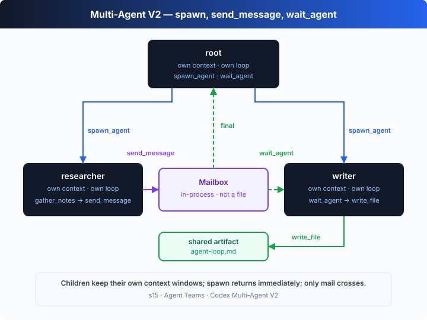

# s15: Agent Teams — Own Contexts, Mailbox Messaging

[中文](README.md) · [English](README.en.md)

`s01` → ... → [s14](../s14_automations/) → [s15](../s15_agent_teams/) → [s16](../s16_team_protocols/) → ... → s20
> *"Split the task across teammates, not across one context"* — async mailboxes + named teammates.
>
> **Harness layer**: collaboration — many agents, each with its own context, linked by a message bus.

---

## The Problem

"Refactor the whole backend" spans the auth module, the database layer, the API routes and the tests. While one agent is fixing the routes, the auth details have already been pushed out of its context — the window is only so big, and a single agent's attention can't cover every module.

s06's sub-agent was a temp worker: call it in, take its conclusion, throw it away. Some tasks need **teammates that communicate, work in parallel, and each keep their own context**. One researches, one writes, neither crowds the other's window — they just hand over the bit the other needs.

---

## The Solution



Add two things: a **MessageBus** (one async mailbox per teammate) and a **teammate loop** (each named agent holds a private context and runs its own agent loop). Sending a message is just a `send_message` tool call; waiting for one is `wait_inbox`, which blocks until something arrives. The teaching demo has a `researcher` research and a `writer` write, coordinating the hand-off over the mailbox.

Sub-agent vs teammate:

| | s06 sub-agent | s15 teammate |
|---|---|---|
| lifecycle | one-shot, destroyed after use | multi-turn, lives until the task is done |
| context | isolated from the parent, returns a conclusion | private to each, shares info via messages |
| communication | returns one result | async mailbox, message anytime |
| relationship | main agent + occasional sub-agent | peers with names |

---

## How It Works

Three pieces: the mailbox bus, send/receive as tools, and each teammate's own loop.

**Step 1**: the mailbox bus. `send` appends a message — if the recipient is blocked on `wait_inbox` it's handed over directly, otherwise it queues; `recv` blocks (with a timeout fallback so a real run can't hang).

```ts
class MessageBus {
  private boxes = new Map<string, Message[]>();
  private waiters = new Map<string, ((m: Message) => void)[]>();

  send(from: string, to: string, content: string): void {
    const msg = { from, to, content, ts: Date.now() };
    const pending = this.waiters.get(to);
    if (pending?.length) pending.shift()!(msg);   // someone waiting → deliver now
    else this.boxes.set(to, [...(this.boxes.get(to) ?? []), msg]);
  }

  async recv(to: string, timeoutMs = 15_000): Promise<Message | null> {
    const box = this.boxes.get(to);
    if (box?.length) return box.shift()!;
    return new Promise((resolve) => { /* block until a message or timeout */ });
  }
}
```

**Step 2**: send/receive are just tools. `send_message` and `wait_inbox` register as ordinary Responses API function tools, dispatched by the harness like any other tool — but their effect is on **another agent's context**, not the filesystem.

```ts
if (name === "send_message") { BUS.send(self, args.to, args.content); return `delivered to ${args.to}`; }
if (name === "wait_inbox") {
  const msg = await BUS.recv(self);                       // block for a message
  return msg ? `[inbox from ${msg.from}] ${msg.content}` : "(inbox timeout)";
}
```

**Step 3**: each teammate is an independent loop holding a private `input` array (its own context window). The mailbox tools let the two loops coordinate.

```ts
async function teammate(name, role, task, scratch) {
  const input: unknown[] = [{ role: "user", content: task }];   // private context
  for (let step = 0; step < 8; step++) {
    const output = await callModel(input, role);                // each calls its own model
    input.push(...output);
    const calls = output.filter((i) => i.type === "function_call");
    if (calls.length === 0) return;                             // this teammate is done
    for (const c of calls) {
      const result = await runTool(c.name, JSON.parse(c.arguments), name, scratch);
      input.push({ type: "function_call_output", call_id: c.call_id, output: result });
    }
  }
}
```

**Step 4**: launch them together; the hand-off is driven by the mailbox.

```ts
await Promise.all([
  teammate("researcher", "researcher", "Research … then send findings to 'writer'.", scratch),
  teammate("writer", "writer", "Wait for findings, write agent-loop.md, tell 'researcher'.", scratch),
]);
```

The core insight: **teammates share information, not a context**. The `researcher` can read dozens of raw notes and send only a one-line conclusion to the `writer`; the writer's window never holds those notes, only the sentence it needs. That's exactly why a team can carry a big task — every context stays small and focused, relaying the necessary information along by message. And there's no central scheduler: with send and wait, the two loops complete the hand-off themselves.

---

## Try It

> **Teaching demo note**: the code creates an `s15-team-*` scratch directory under the system temp dir (`os.tmpdir()`) and writes `agent-loop.md` there — it doesn't touch your project files.

**No API key needed**: this chapter is a **self-running demo** with no REPL. Without `OPENAI_API_KEY` it uses a built-in offline scripted model — `researcher` and `writer` each follow a script through the full "research → send → wait → write → reply" hand-off.

**Setup** (first run):

```sh
npm install
cp .env.example .env        # fill in OPENAI_API_KEY and MODEL_ID to run the real model
```

**Run**:

```sh
npx tsx s15_agent_teams/code.ts                # offline demo model
OPENAI_API_KEY=sk-... npx tsx s15_agent_teams/code.ts   # real model
```

Try these tweaks:

1. Run with a real key and watch how the two teammates phrase that "findings" message in natural language.
2. Add "after writing, send the file path to researcher" to the writer's task and watch a second round of messages.
3. Shrink `recv`'s `timeoutMs` and watch the `(inbox timeout)` fallback prevent a hang.

Watch for: each teammate calls its own model and holds its own `input`; the mailbox is the only information channel. The `writer` receives just that one conclusion, not the researcher's whole pile of notes.

---

## What's Next

Teammates can work and communicate now, but coordination is still loose: the `researcher` sends a line, the `writer` replies, all in natural language with no structure. If a lead wants to hand work to teammates and know exactly which result answers which request, natural language isn't enough.

s16 Team Protocols → wrap messages in typed envelopes (request / response / broadcast) so a lead can route work and collect results by id.

<details>
<summary>Into the Codex source</summary>

> The following is based on common multi-agent architectures, with reference to the sub-agent mechanism in OpenAI's open-source [`openai/codex`](https://github.com/openai/codex) repo (`codex-rs`). The chapter's "named teammates + async mailbox" is the minimal skeleton of an agent team; real implementations make lifecycle, isolation and persistence production-grade.

**The chapter's teammate ≈ a Codex sub-agent + a shared mailbox.** The differences are isolation strength and message delivery.

<details>
<summary>1. Context isolation: the chapter gets it for free</summary>

Each teammate holds a private `input` array, so isolation is "free" — they are physically two arrays. Codex's sub-agents follow the same idea: a sub-agent gets a **fresh, independent context** to run a subtask and returns only its conclusion, keeping the main context clean. The difference is that a real implementation manages that context's lifecycle explicitly (create, run, reclaim); the chapter only demonstrates the core of "separate arrays".

</details>

<details>
<summary>2. Mailbox in memory vs on disk</summary>

The chapter's `MessageBus` is an in-process, in-memory queue: intuitive, but the messages vanish when the process exits. Real multi-agent systems often **persist mailboxes to disk** (one inbox file per agent) — sending appends a line, reading consumes it, and a file lock guards against concurrent writes. Persistence makes mailboxes observable and recoverable across processes and restarts; the chapter's in-memory queue skips all that to focus on the async hand-off itself.

</details>

<details>
<summary>3. Blocking wait vs idle polling</summary>

The chapter uses `wait_inbox` to **block** a teammate until a message arrives (with a timeout fallback). In real systems a teammate that finishes a round often enters **idle polling**: periodically glance at the inbox, start a new round if there's a message, keep waiting otherwise. Both approaches converge — "suspend when idle, wake on a message". The blocking model is more direct; the polling model is cheaper and integrates more easily with a main event loop.

</details>

<details>
<summary>4. Loose messages vs structured protocols</summary>

The chapter's messages are loose `{from, to, content}` — enough to communicate, but with no notion of "which request this reply answers". s16 upgrades them into typed envelopes with `id` and `kind`, so a lead can route and correlate reliably. Real systems likewise structure team communication: plain text, task assignment, approval requests and shutdown handshakes are distinct message types, each handled in its own branch.

</details>

**In one line**: a teammate = its own context + its own agent loop + a mailbox. Get those three together and a single agent becomes a team. The hard part isn't "run two loops" — it's how they hand off reliably, which is exactly what the next chapter's protocols solve.

</details>

<!-- translation-sync: zh@v1, en@v1 -->
