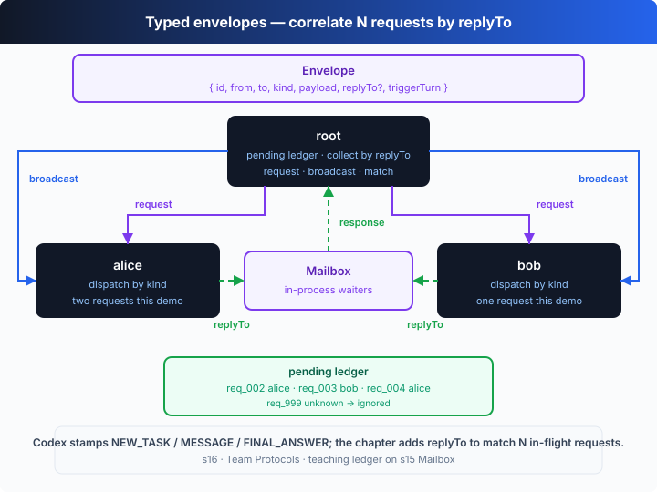

# s16: Team Protocols — Messages Need a Contract

[中文](README.md) · [English](README.en.md)

`s01` → ... → [s15](../s15_agent_teams/) → [s16](../s16_team_protocols/) → [s17](../s17_autonomous_agents/) → ... → s20
> *"Type the message, correlate by id"* — one contract for request / response / broadcast.
>
> **Harness layer**: collaboration — a structured handshake between agents.

---

## The Problem

s15's teammates can trade messages, but they're loose natural language: one line out, one line back, no structure. When a lead hands out three tasks at once and three results flow back from two teammates, how does it know **which result answers which request**? Guess from the tone?

Two scenarios force the issue. **Delegation** — the lead splits three tasks between alice and bob, and as results stream back it needs a reliable way to match each one. **Broadcast** — "we're starting" / "wrap up" needs to reach everyone at once, with no per-person reply. Both scenarios share one shape: type the message, correlate by id.

---

## The Solution



Add a **typed envelope** `Envelope`: `{ id, from, to, kind, payload, replyTo? }`, where `kind` is `request | response | broadcast`. A **lead** routes work to a specific teammate as a `request`; a `broadcast` reaches everyone at once; when a teammate replies with a `response` it sets `replyTo` to the `id` of the request it's answering, so the lead can **correlate the result back to the pending request exactly**.

Three message kinds, one contract:

| kind | direction | needs reply | purpose |
|------|-----------|-------------|---------|
| `request` | lead → one teammate | yes (a `response`) | assign a piece of work |
| `response` | teammate → lead | no | return a result; `replyTo` points at the request id |
| `broadcast` | lead → everyone | no | announcements: kickoff, stand-down, status changes |

---

## How It Works

Four pieces: the envelope type, the teammate loop that dispatches by kind, and the lead's routing + correlation.

**Step 1**: the envelope is the contract. The `id` is the correlation key that threads the whole exchange — a request carries it out, a response carries it back (in `replyTo`).

```ts
type Kind = "request" | "response" | "broadcast";
type Envelope = {
  id: string;          // unique id; a response correlates by it
  from: string;
  to: string;          // a teammate name, or "*" for a broadcast
  kind: Kind;
  payload: string;
  replyTo?: string;    // response-only: the id of the request it answers
};
```

**Step 2**: the bus routes by `kind`. A broadcast is copied into every registered mailbox (no echo to the sender); everything else is point-to-point.

```ts
send(env: Envelope): void {
  const targets = env.kind === "broadcast" ? [...this.boxes.keys()] : [env.to];
  for (const t of targets) {
    if (t === env.from) continue;                 // never echo a broadcast to its sender
    this.boxes.set(t, [...(this.boxes.get(t) ?? []), env]);
  }
}
```

**Step 3**: the teammate loop dispatches by `kind`. A `broadcast` is just noted, no reply; a `request` gets worked and answered with a `response` whose `replyTo` is the request's id.

```ts
if (env.kind === "broadcast") { /* noted, no reply needed */ continue; }
if (env.kind === "request") {
  const result = await runWork(name, env.payload, scratch);
  BUS.send({
    id: nextId("resp"), from: name, to: env.from,
    kind: "response", payload: result,
    replyTo: env.id,                               // correlate back to the request
  });
}
```

**Step 4**: the lead routes work and matches responses by `replyTo`, marking pending requests fulfilled.

```ts
async collect(total: number): Promise<void> {
  let got = 0;
  while (got < total) {
    const env = await BUS.recv(this.name, 15_000);
    if (!env || env.kind !== "response" || !env.replyTo) continue;
    const req = this.pending.get(env.replyTo);     // correlate
    if (!req) continue;                            // a response for an unknown id: ignore
    req.result = env.payload;
    got++;
  }
}
```

The core insight: **one id threads the whole round trip**. The request goes out as `req_002`, the response comes back with `replyTo: "req_002"`, and the lead's pending ledger ticks `req_002` off. Loose natural language can't do that — with three replies arriving together, there's no id to tell who answered what. And all three `kind`s share one envelope and one dispatch branch: adding a new coordination primitive (an approval, a shutdown handshake) is just a new `kind` and a new branch — the contract itself doesn't change.

---

## Try It

> **Teaching demo note**: the code creates an `s16-team-*` scratch directory under the system temp dir (`os.tmpdir()`) and writes each section file there — it doesn't touch your project files.

**No API key needed**: this chapter is a **self-running demo** with no REPL. Without `OPENAI_API_KEY` it uses a built-in offline scripted model — the lead broadcasts kickoff, routes three tasks to two teammates, and collects three correlated replies, narrating throughout.

**Setup** (first run):

```sh
npm install
cp .env.example .env        # fill in OPENAI_API_KEY and MODEL_ID to run the real model
```

**Run**:

```sh
npx tsx s16_team_protocols/code.ts                # offline demo model
OPENAI_API_KEY=sk-... npx tsx s16_team_protocols/code.ts   # real model
```

Try these tweaks:

1. Run with a real key and watch the model produce different `write_file` content for each section title.
2. Route one more task to bob and change `collect(3)` to `collect(4)`, then watch the ledger.
3. Temporarily log `env.replyTo` inside `collect` to see the correlation key up close.

Watch for: does each `response`'s `replyTo` point exactly at a `request`'s `id`? Why does a broadcast need no reply? How do the three pending requests flip from PENDING to fulfilled one by one?

---

## What's Next

In s15–s16 the lead has to hand each teammate its work: "alice does this, bob does that". With 10 unclaimed tasks on the board, the lead assigns 10 times — and that itself becomes the bottleneck.

What if teammates **watched the board and claimed work themselves**? The lead only creates tasks; teammates discover, claim, run and report on their own.

s17 Autonomous Agents → self-organizing workers that no longer need a leader to delegate.

<details>
<summary>Into the Codex source</summary>

> The following is based on common multi-agent coordination architectures, with reference to the overall design of OpenAI's open-source [`openai/codex`](https://github.com/openai/codex) repo (`codex-rs`). The chapter's "typed envelope + id correlation" is the minimal skeleton of a team contract; real implementations make message schemas, state machines and gating production-grade.

**The chapter's envelope ≈ a structured protocol message in a real system.** The differences are schema validation and state tracking.

<details>
<summary>1. Loose dict vs schema-checked messages</summary>

The chapter's envelope is a TypeScript type — its shape is enforced at compile time. Real systems usually make protocol messages **runtime-validated structured data** (defined with Zod / JSON Schema, for example), so a malformed message is rejected at the boundary instead of flowing into a handler. The chapter skips runtime validation to focus on id correlation; adding it is boundary hardening — the contract structure doesn't change.

</details>

<details>
<summary>2. Three kinds vs a whole family of message types</summary>

The chapter covers delegation, replies and announcements with three `kind`s (request / response / broadcast). Real team systems have more: task assignment, idle notifications, approval request/response, plan approval, shutdown handshakes, permission changes — each with its own handler branch. But they all share the mechanism the chapter demonstrates — **correlating a round trip by request id**. The chapter's one correlation logic standing in for many protocols is a sound simplification.

</details>

<details>
<summary>3. Id correlation: the chapter matches the real approach</summary>

The chapter's "out as `req_002`, back with `replyTo: "req_002"`" pairing is exactly how real request-response protocols correlate. Real implementations back this with a **state machine** (pending → approved / rejected / fulfilled) and guard against duplicate or late responses (the chapter's "unknown id: ignore" in `collect` is an embryonic form of de-dup / cross-talk protection). The difference is only in how complete the guarding is; the correlation-key idea is identical.

</details>

<details>
<summary>4. Demonstrating flow vs enforcing gating</summary>

The chapter demonstrates the message **flow** (assign → work → reply) without implementing execution **gating** — e.g. "block a high-risk operation until approved". In real systems coordination protocols are often bound to permissions: after a teammate raises a high-risk request, the lead must explicitly approve before it proceeds. The chapter only builds the "request-response correlation" foundation; gating is a policy layered on top, and s03/s04's approval and sandbox are exactly where that kind of policy lives.

</details>

**In one line**: upgrading a message from "a sentence" to "a contract with an id" turns teamwork from "relying on tacit understanding" into "something you can reconcile". Three kinds share one envelope, one id threads one round trip — master that, and approvals, shutdowns and self-organization (next chapter) are just new kinds added to the same contract.

</details>

<!-- translation-sync: zh@v1, en@v1 -->
