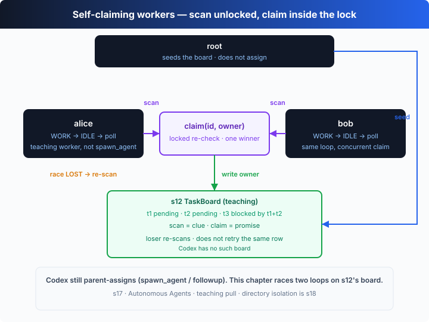

# s17: Autonomous Agents — 自己看板，自己认领

[中文](README.md) · [English](README.en.md)

`s01` → ... → [s16](../s16_team_protocols/) → [s17](../s17_autonomous_agents/) → [s18](../s18_worktree_isolation/) → ... → s20
> *"Poll the board, claim it yourself"* — 空闲时轮询，抢到就干，干完再抢。
>
> **Harness 层**：协作 —— 没有 Lead 派活，工人自组织。

---

## 问题

s16 的队友会按契约收发消息了，但每份活都得 Lead 亲手派：「alice 做这个，bob 做那个」。任务板上躺着 10 份待领的活，Lead 就得派 10 次——**Lead 自己成了瓶颈**。

更要命的是，Lead 并不真的知道哪个队友此刻有空。它只能凭感觉派：派给一个正忙的队友，活就排队；派给一个闲着的，才不浪费。这份「谁有空」的信息，其实**每个队友自己最清楚**。

那把分配权下放呢？让队友自己看任务板、自己挑活、自己认领。Lead 只负责把任务写上板。可一旦两个空闲的队友同时看上同一份活，新问题就来了：**怎么保证一份活只被一个人领走？**

---

## 解决方案



把 Lead 从分配循环里拿掉。每个工人跑一个三阶段循环：**WORK**（干认领到的活）→ **IDLE**（轮询共享任务板）→ **SHUTDOWN**（板上全做完了就退出）。没有 Lead 派活，工人自己找下一份活。

关键在「认领」这一步。看板对外暴露两个操作：一个**不加锁的纯读** `scan()`，和一个**原子的** `claim()`。竞争是设计的一部分——两个工人完全可能在同一瞬间 `scan()` 到同一份 pending 任务，所以「它现在还空着吗」这句权威判断必须放进 `claim()` 的**临界区**里。输的人诚实认输，回去重新扫。

| 概念 | 含义 | 备注 |
|------|------|------|
| `scan()` | 纯读看板，**不加锁** | 两个工人可能同时读到同一份 pending 任务——竞争从这里开始 |
| `claim(id, owner)` | 原子认领：**锁内**复查任务仍空闲，才置 `in_progress` | 临界区里只有一个赢家 |
| race LOST | `claim` 返回失败（任务已被抢） | 诚实认输，重新 `scan()` 找下一份 |
| 依赖 `blockedBy` | 依赖没做完就不可认领 | t3 要等 t1、t2 都 `done` 才开放 |

---

## 工作原理

四块：可认领的判定、不加锁的读、把读-改-写串成原子操作的互斥锁，以及工人自己的循环。

**第 1 步**：什么算「可认领」？pending、没主、所有依赖都已完成。

```ts
private claimable(t: Task): boolean {
  return (
    t.status === "pending" &&
    !t.owner &&
    t.blockedBy.every((id) => this.tasks.get(id)?.status === "done")
  );
}
```

**第 2 步**：`scan()` 是纯读，故意不加锁。它快，但结果可能**已经过时**——你读到 t1 空着的那一刻，另一个工人可能正在认领它。

```ts
scan(): Task | undefined {
  return this.all().find((t) => this.claimable(t));  // 读完就可能变旧
}
```

**第 3 步**：一个 promise 链互斥锁。把「读-检查-改-写」整段挂到链尾，保证同一时刻只有一段在跑——这就是临界区。

```ts
class Mutex {
  private tail: Promise<unknown> = Promise.resolve();
  run<T>(fn: () => T | Promise<T>): Promise<T> {
    const next = this.tail.then(fn);
    this.tail = next.catch(() => undefined);
    return next;
  }
}
```

**第 4 步**：原子认领——本章的核心。先用一个 `sleep` 模拟慢存储（这就是竞争窗口），然后**在锁内**重新检查任务是否仍空闲。只有发现它还真空着的那个工人才赢；其余人拿到一句诚实的「输了」。

```ts
async claim(id: string, owner: string): Promise<{ ok: boolean; reason: string }> {
  await sleep(CLAIM_LATENCY_MS);              // 读与写之间的缝隙：竞争就住在这里
  return this.lock.run(() => {
    const t = this.tasks.get(id);
    if (!this.claimable(t))
      return { ok: false, reason: `already ${t.status} (owner: ${t.owner ?? "none"})` };
    t.owner = owner;
    t.status = "in_progress";                 // 锁内复查通过 → 唯一赢家
    return { ok: true, reason: "claimed" };
  });
}
```

组装成工人的完整循环：

```ts
async function worker(name: string, board: TaskBoard, scratch: string): Promise<void> {
  for (;;) {
    const task = board.scan();
    if (!task) {
      if (board.allSettled()) return;               // SHUTDOWN：板上全做完了
      await sleep(POLL_MS);                          // IDLE：继续轮询
      continue;
    }
    const res = await board.claim(task.id, name);
    if (!res.ok) continue;                           // race LOST → 重新扫描
    const result = await runTask(name, task, scratch); // WORK：在自己的上下文里干
    await board.complete(task.id, result);           // 把结果贴回看板
  }
}
```

核心洞察：**`scan()` 给你的只是一条线索，不是一份承诺。** 它告诉你「刚刚那一刻 t1 空着」，但等你伸手去领，世界可能已经变了。所以唯一算数的检查，是 `claim()` 临界区里那一次复查——这叫 TOCTOU（time-of-check-to-time-of-use，检查时与使用时的间隙）。把复查放进锁里，临界区就只剩一个赢家，**双认领在结构上被消灭了**。输的人不需要重试同一份活，它只要回去重新 `scan()`，板上自然有下一份在等它。

---

## 试一下

> **教学 demo 提示**：代码会在系统临时目录（`os.tmpdir()`）下建一个 `s17-scratch-*` 目录，往里面写各任务的 artifact 文件，不碰你的项目文件。

**无需 API key 也能跑**：本章是**自运行演示**，没有 REPL。没有 `OPENAI_API_KEY` 时用内置的离线脚本化模型——alice 和 bob 同时醒来、同时 `scan()` 到 t1、在 `claim()` 的临界区里分出胜负，输的人转去领 t2，全程打印旁白。

**准备**（首次运行）：

```sh
npm install
cp .env.example .env        # 想跑真实模型就填入 OPENAI_API_KEY 和 MODEL_ID
```

**运行**：

```sh
npx tsx s17_autonomous_agents/code.ts                # 离线 demo 模型
OPENAI_API_KEY=sk-... npx tsx s17_autonomous_agents/code.ts   # 真实模型
```

试试这些改动：

1. 在 `Promise.all` 里再加一个 `worker("carol", ...)`，看三份活如何被三个工人瓜分。
2. 把 `CLAIM_LATENCY_MS` 调大到 `200`，加宽竞争窗口，观察更多 `race LOST`。
3. 给看板再加一份无依赖的 `t4`，看它和 t1、t2 一样被并行认领。

观察重点：alice 和 bob 同时 `scan()` 到 t1 时，`claim()` 如何保证只有一个人赢？输的人是不是真的去领了下一份（而不是卡住或重抢）？被 t1+t2 阻塞的 t3，是不是在两者都 `done` 后才被认领？

---

## 接下来

工人能自组织了，但他们还挤在**同一个工作目录**里。alice 为她的任务改写 `app.txt`，bob 为他的任务也改写 `app.txt`——互相覆盖，而且事后分不清哪行改动属于哪份任务。

s18 Worktree Isolation → 给每份任务一个独立的 git worktree，并行工人各改各的目录，互不打架。这正是 Codex Cloud 的模型。

<details>
<summary>深入 Codex 源码</summary>

> 以下基于多 worker 调度的通行架构，并对照 OpenAI 开源的 [`openai/codex`](https://github.com/openai/codex) 仓库（`codex-rs`）与 Codex Cloud 的整体思路。教学版的「原子认领 + 自扫描」是自治工人的最小骨架；真实实现把存储、锁和恢复做成了生产级。

**教学版的 `claim()` ≈ 真实调度器里的一次原子认领。** 差异全在「锁」和「看板」的真实形态上。

<details>
<summary>一、内存互斥锁 vs 真实的原子原语</summary>

教学版的 `Mutex` 是一条 promise 链——它能成立，是因为 Node 单线程、整块看板住在同一个进程的内存里。真实系统里看板往往是**共享存储**（数据库、文件），工人在不同进程甚至不同机器上，互斥锁管不到那里。于是「锁内复查」换成存储层自己的原子原语：数据库的 `UPDATE ... WHERE status='pending'`（带事务）、一次 compare-and-swap、或一个 lockfile。语义和教学版完全一致——**「复查 + 置位」必须是同一次原子操作**——只是承载它的机制换了。

</details>

<details>
<summary>二、竞争窗口：教学版是模拟的，真实世界天生就有</summary>

教学版用 `await sleep(CLAIM_LATENCY_MS)` 人为撑开「读与写之间的缝隙」，好让你在小 demo 里也能看见 `race LOST`。真实调度器不用演——网络延迟、存储往返天然就在每次「读到空闲」和「写下认领」之间塞进一段间隙，TOCTOU 竞争是常态而不是例外。教学版把它浓缩成一个 `sleep`，是为了让竞争**可复现、可观察**；防守方式（临界区内复查）两者相同。

</details>

<details>
<summary>三、Codex Cloud 的任务派发</summary>

Codex Cloud 里一次「任务」跑在**它自己隔离的环境**中（下一章 s18 会展开），由调度层把排队的任务派给空闲的执行槽。教学版的「工人轮询看板、原子认领」正是这套「排队 → 认领 → 执行 → 回写」循环的最小复刻：真实系统里「看板」是共享的任务存储，「认领」是一次原子状态迁移，「工人」是被调度起来的独立执行环境。教学版把多机、多进程折叠成单进程里的两个 `async` 工人，好让你专注「认领必须原子」这一件事。

</details>

<details>
<summary>四、依赖与恢复</summary>

教学版的 `blockedBy` 判定（依赖全部 `done` 才开放认领）对应任务图里最朴素的一条边约束（s12 任务系统会单独讲）。真实系统还要处理教学版略掉的边角：工人领到一半崩溃，任务得能被**回收重发**（而不是永远卡在 `in_progress`）；同一任务可能被设计成**最多认领 N 次**；完成事件要落盘以便断点续跑。这些都是叠加在「原子认领」地基上的加固，不改变地基本身。

</details>

**一句话**：自治的本质是把「谁有空」这份信息下放给每个工人，再用一次**原子认领**兜住并发。教学版用一条 promise 链当临界区、用一个 `sleep` 当竞争窗口，就把「扫描 → 认领 → 干 → 回写」的完整闭环跑给你看了；真实系统只是把同样的语义搬进共享存储和独立执行环境里。

</details>

<!-- translation-sync: zh@v1, en@v1 -->
