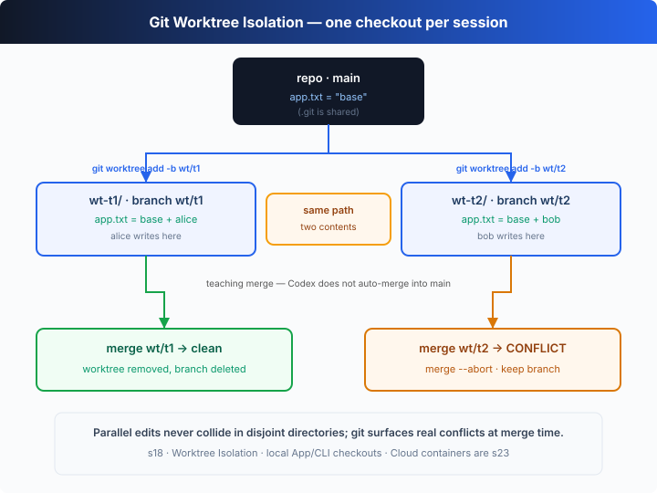

# s18: Worktree Isolation — One Task, One Directory

[中文](README.md) · [English](README.en.md)

`s01` → ... → [s17](../s17_autonomous_agents/) → [s18](../s18_worktree_isolation/) → [s19](../s19_mcp_servers/) → ... → s20
> *"One task, one directory"* — parallel hands edit disjoint directories, never colliding.
>
> **Harness layer**: collaboration — directory-level isolation for parallel execution via git worktrees (the Codex Cloud model).

---

## The Problem

s17 let idle workers claim tasks for themselves, but they still share **one working directory**. Alice's task is "design the DB schema", bob's is "write the API routes" — and both happen to rewrite `app.txt`.

Alice calls `write_file("app.txt", ...)`; bob calls `write_file("app.txt", ...)`. Two people writing the same file at the same time **clobber each other**, and afterwards nobody can tell which line belongs to which task — rolling back just one task's changes is impossible.

s15–s17 solved "who does what" (the task system) and "how to coordinate" (message contracts, self-claiming), but not "**where** the work happens". This chapter fills that gap.

---

## The Solution



Give **every task its own git worktree** — a separate working directory on its own branch, all sharing one `.git`. Alice edits her `app.txt` in `wt-t1/`; bob edits his in `wt-t2/`: **the same path, two different contents, on disk at the same time**, neither overwriting the other.

This is exactly the **Codex Cloud model**: a task runs in an isolated environment and hands its changes back as a diff / PR. This chapter replays that "isolate → work → merge → clean up" lifecycle with local worktrees.

| operation | git command | effect |
|-----------|-------------|--------|
| create | `git worktree add <dir> -b wt/<task>` | one directory + one branch per task, sharing a single `.git` |
| isolate | (no command) | the same path `app.txt` edited independently in two directories, both on disk |
| merge | `git merge --no-ff wt/<task>` | a clean merge lands on main automatically; git refuses on a real conflict |
| clean up | `git worktree remove` + `git branch -D` | clean merge → delete the directory and branch |
| keep | `git merge --abort` | conflict → roll back the merge, keep the branch for human review (Codex Cloud's "open a PR" moment) |

---

## How It Works

Four pieces: a git helper, creating a worktree, working and committing inside each worktree, and the final merge-and-clean-up.

**Step 1**: funnel every git call into one synchronous helper that runs in a given repo and returns stdout.

```ts
function git(repo: string, args: string): string {
  return String(execSync(`git ${args}`, { cwd: repo, stdio: ["ignore", "pipe", "pipe"] })).trim();
}
```

**Step 2**: create a worktree — `git worktree add <dir> -b <branch>` builds the new directory and the new branch in one command (off the current HEAD). One task binds one directory and one branch.

```ts
function createWorktree(repo: string, root: string, task: Task): { dir: string; branch: string } {
  const dir = path.join(root, task.worktree);
  const branch = `wt/${task.id}`;
  git(repo, `worktree add "${dir}" -b ${branch}`);   // new dir + new branch, from HEAD
  return { dir, branch };
}
```

**Step 3**: after claiming a task, the worker runs its agent loop **inside its own worktree** — `write_file` can only write into `wt.dir`, never reaching anyone else's. When done, it commits right there on that branch.

```ts
async function worker(name: string, board: TaskBoard, repo: string, root: string): Promise<void> {
  const task = board.claimNext(name);
  if (!task) return;
  const wt = createWorktree(repo, root, task);        // one directory + branch per task
  // …run the agent loop inside wt.dir: write_file only writes into its own worktree…
  git(wt.dir, "add -A");
  git(wt.dir, `commit -m "${task.id}: ${task.title}"`);
  board.complete(task.id);
}
```

**Step 4**: merge and clean up. `mergeBack` merges the branch into main with `--no-ff` — it returns `true` on a clean merge, and `false` when git exits non-zero on a real conflict; `removeWorktree` deletes the directory and the branch.

```ts
function mergeBack(repo: string, branch: string): boolean {
  try { git(repo, `merge --no-ff ${branch} -m "merge ${branch}"`); return true; }
  catch { return false; }                            // non-zero exit = git hit a real conflict
}
function removeWorktree(repo: string, dir: string, branch: string): void {
  git(repo, `worktree remove --force "${dir}"`);
  git(repo, `branch -D ${branch}`);
}
```

Assembled into the merge loop at the end of the demo:

```ts
for (const t of board.all()) {
  const branch = `wt/${t.id}`;
  if (mergeBack(repo, branch)) {
    removeWorktree(repo, path.join(root, t.worktree), branch);  // clean → delete dir + branch
  } else {
    git(repo, "merge --abort");                                 // conflict → keep the branch for review
  }
}
```

The core insight: **a worktree is "another directory in the same repo", not "another repo".** Every worktree shares one `.git` (the object store and refs live in one place) but has its own working tree and current branch — so two people editing the same path don't interfere, because they're simply not in the same directory. Real conflicts don't vanish; they're **deferred to merge time**, where git surfaces them honestly: a clean merge lands on main, a conflict triggers `merge --abort` and keeps the branch for a human to decide. That "truth at merge time" moment is exactly when Codex Cloud turns a chunk of work into a PR handed back to a person.

---

## Try It

> **Teaching demo note**: the code builds a **real git repository** under the system temp dir (`os.tmpdir()`) with `git init`, then runs `worktree add`, `commit` and `merge` — all inside that temp directory, never touching your project.

**No API key needed**: this chapter is a **self-running demo** with no REPL. Without `OPENAI_API_KEY` it uses a built-in offline scripted model — alice and bob each claim a task and rewrite the same `app.txt` in their own worktrees, then it demonstrates one clean merge and one real conflict, narrated throughout.

**Setup** (first run):

```sh
npm install
cp .env.example .env        # fill in OPENAI_API_KEY and MODEL_ID to run the real model
```

**Run**:

```sh
npx tsx s18_worktree_isolation/code.ts                # offline demo model
OPENAI_API_KEY=sk-... npx tsx s18_worktree_isolation/code.ts   # real model
```

Try these tweaks:

1. Have the two tasks edit **different** files (e.g. t2 writes `routes.txt` instead) and watch both merges come out clean and both worktrees get cleaned up.
2. Run with a real key and watch the model write different content into `app.txt`.
3. Afterwards run `git -C <the repo path it prints> log --oneline --graph` to see the branch-and-merge topology.

Watch for: are the two worktrees' `app.txt` files "same path, different content" at the same time? Why does the first merge come out clean and the second conflict? Is the conflicting branch deleted, or kept for human review?

---

## What's Next

Now the agent team can self-organize in isolated directories. But their abilities are still capped by the handful of tools we hand-wrote into the harness — `write_file`, `shell`, the task board…

What if the tools aren't ours to write? A company Jira, a home-grown deploy system, a knowledge base — you can't rewrite each one into the harness.

s19 MCP Servers → bolt an "external tool bridge" onto the agent: any service that implements the standard protocol plugs in, and the agent never needs to know who wrote it.

<details>
<summary>Into the Codex source</summary>

> The following is based on common git-worktree usage, with reference to the overall design of OpenAI's open-source [`openai/codex`](https://github.com/openai/codex) repo (`codex-rs`) and of Codex Cloud. The chapter's "one worktree per task" is the minimal skeleton of the isolation model; real implementations isolate more strongly and recover more completely.

**The chapter's worktree ≈ a task's isolated environment in Codex Cloud.** The differences are the **strength** of the isolation and the **completeness** of the lifecycle.

<details>
<summary>1. Directory isolation vs environment isolation</summary>

The chapter uses `git worktree` for **directory-level** isolation: several working trees share one `.git`, one machine, one filesystem. That's already enough to solve "the same path overwriting itself". Codex Cloud goes further — each task runs in **its own isolated execution environment** (a container / micro-VM), with separate filesystem, process space and network, and the repo is cloned into it. The chapter picks worktrees because they're light, run locally, and happen to demonstrate the same thing: **giving parallel changes a disjoint piece of ground**.

</details>

<details>
<summary>2. A merge conflict = Codex Cloud's "open a PR" moment</summary>

The chapter merges locally with `git merge`: a clean one lands on main automatically, a conflict triggers `merge --abort` and keeps the branch for a human. Codex Cloud turns this step into a product — after a task finishes in its isolated environment, the changes are collected into a **diff / PR** handed back for review, and conflicts or uncertainties are decided by a person rather than auto-merged. The chapter's "merge succeeds → clean up / conflict → keep the branch" is a minimal replay of that "auto-merge or escalate to a human".

</details>

<details>
<summary>3. Lifecycle cleanup and recovery</summary>

The chapter demonstrates the backbone of the lifecycle: `worktree add` (create) → work → `merge` → `worktree remove` + `branch -D` (clean up), plus `merge --abort` + keep-the-branch (escalate). Real implementations also handle the corners the chapter skips: how to **reap orphaned worktrees** after a worker crashes; reconciling with `git worktree list` / `git worktree prune` to clear leftovers; validating worktree names against path traversal; refusing to delete by default when there are uncommitted changes. These are hardening layers on the "create → isolate → merge → clean up" backbone — they don't change the backbone itself.

</details>

<details>
<summary>4. Why this matters for local parallel sessions too</summary>

Worktrees aren't only a cloud concept. When you run several agent sessions locally at once (or edit something yourself while an agent edits something else), giving each session its own worktree lets both change the same repo without stepping on each other — which is exactly how `codex` handles parallel work locally. The "parallel without interference" the chapter simulates with two `async` workers holds just as well in two terminals on your own machine.

</details>

**In one line**: parallel safety isn't "make changes not conflict" — it's "give each change a disjoint piece of ground and defer the conflict to merge time, where git surfaces it honestly". The chapter runs that whole backbone with `git worktree add / merge / remove`; Codex Cloud just moves the same model into stronger isolation and swaps "merge" for "open a PR for human review".

</details>

<!-- translation-sync: zh@v1, en@v1 -->
