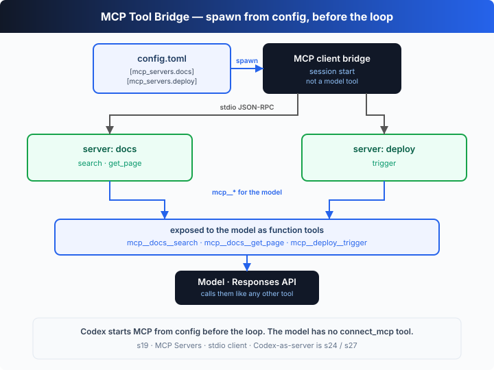

# s19: MCP Servers — External Tools, One Standard Protocol

[中文](README.md) · [English](README.en.md)

`s01` → ... → [s18](../s18_worktree_isolation/) → [s19](../s19_mcp_servers/) → [s20](../s20_full_harness/)
> *"External tools, one standard protocol"* — discover, namespace, call; the agent never knows who wrote the tool.
>
> **Harness layer**: collaboration — turning external processes into first-class tools with MCP.

---

## The Problem

From s01 to s18, every tool in the agent's hand was written by us into the harness — `shell`, `write_file`, the task board, worktrees. You wrote each tool's input validation, execution logic and error handling line by line.

Now you want to plug in three **other people's** services: the company Jira (query issues, file tickets), a home-grown deploy system (trigger deploys), and the team knowledge base (search docs). You can't rewrite a toolset into the harness for each one, and you certainly don't want to re-ship the agent every time you add a service.

What you need is a **standard protocol**: any external service that implements it can be called by the agent directly — no matter what language it's written in or which machine it runs on. That's MCP (Model Context Protocol).

---

## The Solution



Declare a server under `[mcp_servers.<name>]` in `~/.codex/config.toml` (`command` + `args`). The harness **spawns each server as a child process** and **reads/writes JSON-RPC 2.0 line-by-line over stdio**: first an `initialize` handshake, then `tools/list` to discover what tools it offers, then it **bridges** each one into an ordinary Responses API function tool named `mcp__<server>__<tool>`. The model calls it like any other tool, and behind the scenes the harness translates that call into a `tools/call` to the child process.

| concept | meaning |
|---------|---------|
| `[mcp_servers.<name>]` | declares a server in config.toml: `command` + `args` (+ optional `env`) |
| stdio JSON-RPC | the harness spawns the server as a child process and exchanges JSON-RPC 2.0 messages line-by-line |
| `initialize` / `tools/list` | handshake + discover which tools the server offers |
| `tools/call` | actually invoke one of the tools |
| `mcp__<server>__<tool>` | the bridged tool name: a namespace to prevent collisions, and the name the model sees |

---

## How It Works

Four pieces: the config declaration, spawning a child process and speaking JSON-RPC, the handshake + discovery, and bridging into the tool registry.

**Step 1**: what does a server look like? Just a config entry saying "which command starts it". This is exactly the shape of an `[mcp_servers.*]` table in `~/.codex/config.toml`.

```ts
const MCP_CONFIG: Record<string, { command: string; args: string[] }> = {
  docs:   { command: NODE, args: ["--import", "tsx", SELF, "--mcp-server", "docs"] },
  deploy: { command: NODE, args: ["--import", "tsx", SELF, "--mcp-server", "deploy"] },
};
```

**Step 2**: spawn the server as a child process and exchange JSON-RPC line-by-line over its stdin/stdout. The server side does just three things: answer `initialize`, report `tools/list`, and execute `tools/call` (protocol goes to stdout, logs to stderr — never mixed).

```ts
async function connectMcp(name: string): Promise<McpClient> {
  const def = MCP_CONFIG[name];
  const child = spawn(def.command, def.args, { stdio: ["pipe", "pipe", "pipe"] });
  const client = new McpClient(name, child);
  await client.connect();                 // initialize handshake + tools/list discovery
  return client;
}
```

**Step 3**: handshake and discovery. `initialize` exchanges the protocol version and both sides' capabilities, then `tools/list` returns every tool definition the server exposes.

```ts
async connect(): Promise<void> {
  await this.request("initialize", { protocolVersion: "2024-11-05", clientInfo: { name: "learn-codex", version: "0.1.0" }, capabilities: {} });
  this.child.stdin!.write(JSON.stringify({ jsonrpc: "2.0", method: "notifications/initialized" }) + "\n");
  this.tools = (await this.request("tools/list")).tools as McpToolDef[];   // what tools were discovered
}
```

**Step 4**: bridge into the tool registry. Wrap each MCP tool as a Responses API function tool, prefixing the name with `mcp__<server>__<tool>` to prevent collisions; its handler just sends a `tools/call` to the child process.

```ts
function bridgeTools(client: McpClient): void {
  for (const t of client.tools) {
    register(
      fn(`mcp__${norm(client.name)}__${norm(t.name)}`, `(MCP:${client.name}) ${t.description}`, t.inputSchema),
      (args) => client.callTool(t.name, args)   // a model call becomes a tools/call to the child
    );
  }
}
```

And the `agentLoop` driving all of this is **unchanged since s01**: it just sees a few more function tools in the registry, and keeps calling the model, dispatching tools and feeding results back as usual. It doesn't know — and doesn't need to know — that behind those tools are external processes.

The core insight: **MCP is a "process ↔ tool" translation bridge.** Facing down, it speaks JSON-RPC to the child process (`initialize` / `tools/list` / `tools/call`); facing up, it presents the discovered tools to the model in the shape of ordinary function tools. The model sees a function called `mcp__docs__search`; when it calls, the bridge crosses into another process on its behalf, fetches the result, and feeds it back into the loop. So "adding a capability to the agent" goes from "edit the harness source" to "add one line of config" — regardless of what language the service is written in, or whether it's third-party at all.

---

## Try It

> **Teaching demo note**: the code spawns **two child processes** (itself, with a `--mcp-server` flag) speaking real stdio JSON-RPC — purely local, no network, no key, and it never touches your project files.

**No API key needed**: this chapter is a **self-running demo** with no REPL. Without `OPENAI_API_KEY` it uses a built-in offline scripted model — it calls three bridged tools in sequence: query the knowledge base (`docs.search`, `docs.get_page`, annotated readOnly) and trigger a deploy (`deploy.trigger`, annotated destructive), printing the JSON-RPC traffic throughout.

**Setup** (first run):

```sh
npm install
cp .env.example .env        # fill in OPENAI_API_KEY and MODEL_ID to run the real model
```

**Run**:

```sh
npx tsx s19_mcp_servers/code.ts                # offline demo model
OPENAI_API_KEY=sk-... npx tsx s19_mcp_servers/code.ts   # real model
```

Try these tweaks:

1. Add another tool to `SERVERS.docs.tools` and `handlers` (say `list_pages`), re-run, and watch `tools/list` discover it.
2. Run with a real key and watch the model pick `mcp__*` tools on its own to answer the same question.
3. Remove the `mcp__deploy__trigger` call from the offline script and ask something unrelated to deploys — feel why a `(destructive)` tool should go through approval (back to s03).

Watch for: does every tool name carry the `mcp__<server>__` prefix? Are the three steps `initialize` → `tools/list` → `tools/call` clearly visible in the log? When the model calls `mcp__docs__search`, is that backed by a JSON-RPC `tools/call` to the `docs` child process?

---

## What's Next

At this point the agent can plug in any external tool through one standard protocol. But look back: the first 19 chapters each added **one** mechanism, scattered across 19 demos running separately — a real harness doesn't work that way.

The tool registry, approval, sandbox, planning, memory, sub-agents, the task board, worktrees, MCP… these are meant to hang off **the same loop** and work together.

s20 Full Harness → wire every mechanism so far back into one complete harness and run a narrated trace. Many mechanisms, one loop.

<details>
<summary>Into the Codex source</summary>

> The following is based on the public MCP protocol, with reference to the overall structure of OpenAI's open-source [`openai/codex`](https://github.com/openai/codex) repo (`codex-rs`). The chapter's "declare → spawn → bridge" is the minimal skeleton of an MCP client; real implementations make connection management, naming and gating production-grade.

**The chapter's `McpClient` ≈ the connection codex-rs maintains for each `[mcp_servers]` entry.** The differences are connection lifecycle management and tool governance.

<details>
<summary>1. The config.toml declaration: the chapter matches the real shape</summary>

The chapter's `MCP_CONFIG` (`command` + `args`) is exactly the shape of an `[mcp_servers.<name>]` table in Codex's `~/.codex/config.toml`. A real entry can also carry `env` (to inject environment variables), startup and call timeouts, and so on; on startup Codex spawns and **supervises** each configured child process one by one. The chapter drops `env` and timeouts to focus on the "declare it and it's connected" core.

</details>

<details>
<summary>2. Transports: stdio is the default, HTTP is the extension</summary>

The chapter uses only **stdio** — spawn the server as a child process and exchange JSON-RPC line-by-line. That's MCP's local default transport and how Codex talks to local servers. MCP also supports HTTP-based remote transports (to reach remote servers), and a real client maintains several local + remote connections at once in its connection manager. The chapter keeps only stdio because it's the most direct form of "turning an external process into a tool".

</details>

<details>
<summary>3. Handshake, discovery and namespacing</summary>

The chapter's `initialize` (exchanging `protocolVersion` and both sides' capabilities) → `tools/list` (discover tools) → `tools/call` (invoke) is MCP's standard three-step, the same one Codex walks when connecting to a server. After discovery, a real implementation aggregates tools from **multiple servers** into one tool namespace and uses a prefix (the chapter's `mcp__<server>__<tool>`) so identically-named tools from different servers don't collide — exactly the naming idea the chapter demonstrates.

</details>

<details>
<summary>4. Permission gating and "Codex as a server itself"</summary>

In a real system, MCP tool calls still fall under Codex's **approval and sandbox** policy — a tool annotated destructive (the chapter's `deploy.trigger`) can be held by `approval_policy` pending human confirmation (see s03). And Codex can not only **consume** MCP servers but also **be served as** one via `codex mcp`, letting other agents call Codex as a tool. The chapter only demonstrates the "consume" half, but the bridge's translation mechanism works on both sides.

</details>

**In one line**: MCP turns "add a capability to the agent" from "edit the source" into "add one line of config". With one child process, three JSON-RPC methods and an `mcp__`-prefix bridge, the chapter runs "declare → discover → call" end to end; real implementations just layer connection supervision, multi-server aggregation, HTTP transports and permission gating on top.

</details>

<!-- translation-sync: zh@v1, en@v1 -->
