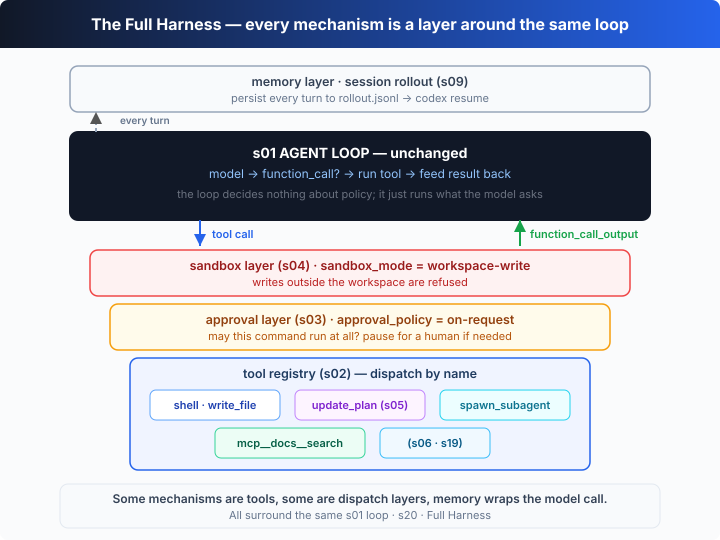

# s20: Full Harness — 机制很多，循环一个

[中文](README.md) · [English](README.en.md)

`s01` → ... → [s19](../s19_mcp_servers/) → [s20](../s20_full_harness/)
> *"Many mechanisms, one loop."* —— 工具、审批、沙箱、计划、记忆、子代理、MCP，全都挂在同一个循环上。
>
> **Harness 层**：协作 —— 把前 19 章的机制合成一个可运行的系统。

---

## 问题

前 19 章，每章只往循环上加**一个**机制。这样学最清楚，但真实的 Codex 不会只带一个机制上工。

一个能长期干活的 coding agent，得同时具备：一组结构化工具、一道审批闸门、一个沙箱、一份会自己更新的计划、能派活出去的子代理、能接外部工具的 MCP 桥，以及能断点续传的记忆。

难点不是把这些堆在一起——而是看清楚它们各自**挂在循环的哪个位置**：哪些是循环内侧的一个工具？哪些是包住工具分发的一层？哪些又包在模型调用之外？

这一章不发明新机制，只做一件事：把前面所有机制当成可组合的「层」，套回 s01 那个 `for (;;)` 上，然后跑一遍带旁白的 trace，让你亲眼看到每一层何时触发、何时说「不」。

---

## 解决方案



关键洞察：这些机制并不都在同一层。对循环而言，它们分三类——**注册表里的工具**、**包住分发的层**、**包住模型调用的层**。它们围着同一个循环，却从不改它：

| 机制 | 来自 | 挂在循环的哪 | 它做什么 |
|------|------|--------------|----------|
| 工具注册表 | s02 | 循环内侧（dispatch 核心） | 按名字分发结构化工具（`shell` / `write_file` / …） |
| `update_plan` | s05 | 注册表里的一个工具 | 让模型维护一份实时清单，边干边勾 |
| `spawn_subagent` | s06 | 注册表里的一个工具 | 开一个全新上下文的子循环，只把摘要带回父级 |
| `mcp__docs__*` | s19 | 注册表里的桥接工具 | 把外部 MCP server 的工具按 `mcp__<server>__<tool>` 暴露给模型 |
| 审批 | s03 | 包住 dispatch 的一层 | 每条命令先过 `approval_policy`，该问人就停下来问 |
| 沙箱 | s04 | 包住 dispatch 的更外层 | 用 `sandbox_mode` 决定写操作能不能出工作区 |
| 记忆 / rollout | s09 | 包住**模型调用**的一层 | 每轮追加到 `rollout.jsonl`，`codex resume` 可重载 |

于是整个 harness 是三层同心结构：注册表在核心，审批 / 沙箱包住分发，记忆包住模型调用——正中间，还是那个 s01 循环。

---

## 工作原理

**第 1 步**：先承认一个事实——循环本身一行没改。它和 s01 是同一个 `for (;;)`，唯一的「接缝」是把工具调用交给一个叫 `dispatch` 的东西：

```ts
async function agentLoop(input: unknown[], isChild = false): Promise<string> {
  const model = isChild ? callChildModel : callModel;
  for (;;) {
    const output = await model(input);
    input.push(...output);
    const calls = output.filter((i) => i.type === "function_call");
    if (calls.length === 0) return extractText(output);   // 模型不调工具 → 完成

    for (const call of calls) {
      const args = JSON.parse(call.arguments ?? "{}");
      const result = await dispatch(call.name ?? "", args);   // ← 唯一的接缝
      input.push({ type: "function_call_output", call_id: call.call_id, output: result });
    }
  }
}
```

**第 2 步**：第一类机制，只是注册表里的一个工具。s02 的注册表就两件事——把工具广告给模型、按名字分发：

```ts
const TOOLS: FnTool[] = [];
const REGISTRY = new Map<string, Handler>();
function register(tool: FnTool, handler: Handler): void {
  TOOLS.push(tool);                 // 广告给模型
  REGISTRY.set(tool.name, handler); // 按名字分发
}
```

`update_plan`（s05）、`spawn_subagent`（s06）、还有 MCP 桥接过来的 `mcp__docs__search`（s19），对循环来说长得一模一样：一个名字 + 一个 handler。MCP 桥接只是把远端工具换个名字再注册进来：

```ts
const bridged = fn(`mcp__${server}__${t.name}`, `(MCP:${server}) ${t.description}`, t.parameters);
register(bridged, (args) => s.call(t.name, args));
```

**第 3 步**：第二类机制不住在注册表里，而是**包住 dispatch 的一层**。审批（s03）和沙箱（s04）各是一个高阶函数：吃进一个 dispatch，返回一个更强的 dispatch。

```ts
type Dispatch = (name: string, args: Record<string, any>) => Promise<string>;

const withApproval = (next: Dispatch): Dispatch => async (name, args) => {
  if (classify(name, args) === "ask") {
    return "Error: approval_policy=on-request and the operator denied this command";
  }
  return next(name, args);
};

const withSandbox = (next: Dispatch): Dispatch => async (name, args) => {
  const target = writeTarget(name, args);
  if (target && !target.startsWith(WORKSPACE + path.sep)) {
    return `Error: sandbox_mode=workspace-write refused to write outside ${WORKSPACE}`;
  }
  return next(name, args);
};
```

组合起来——注册表在核心，先包审批，再包沙箱（越外层越先说话）：

```ts
const baseDispatch: Dispatch = async (name, args) => {
  const handler = REGISTRY.get(name);
  if (!handler) return `Error: unknown tool "${name}"`;
  return handler(args);
};
const dispatch = withSandbox(withApproval(baseDispatch));
```

**第 4 步**：第三类机制包在更外面——它包的是**模型调用**，不是工具分发。记忆（s09）就是这样一个 wrapper：每拿到一轮输出，先追加进 `rollout.jsonl`，再交还给循环。

```ts
type ModelFn = (input: unknown[]) => Promise<OutputItem[]>;
const withMemory = (next: ModelFn): ModelFn => async (input) => {
  const output = await next(input);
  fs.appendFileSync(ROLLOUT, output.map((i) => JSON.stringify(i)).join("\n") + "\n");
  return output;
};
```

于是一次工具调用的完整旅程是：**记忆 → 循环 → 沙箱 → 审批 → 注册表**，再原路返回。哪一层说「不」，就把一条错误当作普通的 `function_call_output` 喂回去——循环不停，模型接着想下一步。这就是终点章的全部：**加机制从来不是改循环，而是在这几个固定接缝上再套一层。**

---

## 试一下

> **教学 demo 提示**：本章会在一个独立的临时目录里建工作区（沙箱根），把 `notes.md` 和 `rollout.jsonl` 写在那里——不会碰你的仓库。沙箱拒绝写工作区之外的路径，这正是它该干的。

**无需 API key 也能跑**：没有 `OPENAI_API_KEY` 时，本章用一个「离线脚本化模型」每轮只发**一个**工具调用，让旁白 trace 把每一层恰好各点着一次——审批拒一次、沙箱拒一次、子代理跑一次、MCP 答一次。

**准备**（首次运行）：

```sh
npm install
cp .env.example .env        # 想跑真实模型就填入 OPENAI_API_KEY 和 MODEL_ID
```

**运行**（自我演示，无需输入）：

```sh
npx tsx s20_full_harness/code.ts                # 离线脚本化模型，看每层何时触发
OPENAI_API_KEY=sk-... npx tsx s20_full_harness/code.ts   # 真实模型，同样的层包住真实输出
```

试试这三种玩法：

1. 直接跑离线 demo，逐行读旁白：哪几行是**循环**在说话（`⚙` 和最终答案），哪几行是**层**在说话（`[approval]` / `[sandbox]` / `[plan]` / `[mcp]` / `[subagent]` / `[memory]`）。
2. 设上真实 `OPENAI_API_KEY` 再跑：离线脚本被旁路，但 `dispatch`、`withMemory`、整个分层结构原样包住真实模型的输出。
3. 改一处再看：在 `main()` 里换掉写死的 `task`，或调一下 `classify()` / `writeTarget()`，观察审批和沙箱的「放行 / 拒绝」如何随之改变。

观察重点：审批和沙箱各「拒绝」了一次，但循环没有停——错误被当作普通结果喂回去，模型继续。这正是「机制很多，循环一个」。

---

## 接下来

这是全书的终点，也是起点：从 s01 到现在，代码表面上越来越复杂，核心却始终没变。回头挑任何一章的机制，用真实 key 跑一遍；或者把这个拼好的 harness 指向你自己的仓库，看它在你真实任务上如何分层触发。再往下，就去读真正的 [`openai/codex`](https://github.com/openai/codex) 源码——你现在能认出里面每一层对应哪一章。

<details>
<summary>深入 Codex 源码</summary>

> 以下内容基于 OpenAI 开源的 [`openai/codex`](https://github.com/openai/codex) 仓库（`codex-rs`，Rust 实现）的整体结构。教学版用几个高阶函数把机制拼成层；Codex 的生产实现把同样的分层写进了核心的 turn 管线。差异是工程健壮性，不是架构。

<details>
<summary>一、循环本身：core 里的 turn 循环</summary>

教学版的 `agentLoop` 对应 `codex-rs/core` 里驱动一轮的 turn 循环（`run_turn` / `try_run_turn`）。差别在于：Codex 消费的是一条**事件流**——模型边生成边发 `ResponseItem`，harness 一旦看到完整的工具调用就派发，而不是等整轮结束。但判据和教学版一致：**这一轮还有没有工具调用**决定是否继续。循环里对审批、沙箱、记忆的全部调用，都挂在和教学版相同的接缝上。

</details>

<details>
<summary>二、dispatch 管道 ≈ Codex 的工具执行管线</summary>

教学版的 `withSandbox(withApproval(baseDispatch))` 在 Codex 里是一条真实的执行管线：工具调用先过 `approval_policy`（`untrusted` / `on-failure` / `on-request` / `never`）——`on-request` 会让 TUI 弹出一个审批提示，等人按 y/n——通过后命令再进入沙箱后端执行，输出作为 `function_call_output` 回到线程。教学版用「demo 自动答 no」代替了交互式提示，顺序和语义不变。

</details>

<details>
<summary>三、沙箱后端：教学版只查路径，真版靠操作系统</summary>

教学版的 `withSandbox` 只对 `write_file` 做一次字符串前缀检查。Codex 的 `sandbox_mode`（`read-only` / `workspace-write` / `danger-full-access`）是由**操作系统级隔离**强制执行的：macOS 上 Seatbelt（`sandbox-exec` 策略），Linux 上 Landlock / seccomp。也就是说，真实沙箱对**每一条** exec 生效，而不是只对某一个工具；违反是内核拦下的，不是一句字符串匹配。此外 `codex-rs` 还有一个 `execpolicy` 之类的策略层，把命令按规则分成 allow / prompt / deny。

</details>

<details>
<summary>四、工具注册表 ≈ openai_tools + MCP 命名空间</summary>

教学版的 `REGISTRY` 对应 Codex 把工具广告给模型再按名分发的机制：`shell`、`apply_patch`、`update_plan` 是内建的一等工具（`update_plan` 真实存在，模型调它维护待办，TUI 实时渲染）；MCP 工具则由 `~/.codex/config.toml` 里的 `mcp_servers` 配置，经连接管理器通过 stdio JSON-RPC 握手、列工具，再以 `mcp__<server>__<tool>` 的名字并入工具池。教学版用一个进程内 mock server 顶替了 stdio 传输，命名和分发是同一套。

</details>

<details>
<summary>五、记忆 / rollout ≈ RolloutRecorder 与 codex resume</summary>

教学版的 `withMemory` 每轮把输出追加进 `rollout.jsonl`。Codex 的 rollout 记录器（`RolloutRecorder`）做的是同一件事：把每个 `ResponseItem` 持久化到 `~/.codex/sessions/.../rollout-*.jsonl`，于是 `codex resume` / `codex exec resume` 能重载线程、从断点继续。教学版只追加了模型输出项，真实版还会记录会话元数据与事件，但「每轮落盘、可重载」的模式一致。

</details>

<details>
<summary>六、教学版的取舍（诚实清单）</summary>

为了让 demo 离线可跑、聚焦「分层」本身，本章做了这些简化：

- **子代理**用进程内的子循环（全新上下文、只回摘要）来演示这个通用模式；Codex 自身的子代理 / 多代理能力仍在演进，云端任务则用 git worktree 做隔离（见 s18）。
- **MCP** 用进程内 mock server，省掉了 stdio JSON-RPC 传输；桥接、命名、分发是真的。
- **审批** 自动作答而非弹出交互式提示；分类与放行 / 拒绝的分支是真的。
- **沙箱** 只做路径前缀检查；真实的 Seatbelt / Landlock 是内核级、对每条命令生效。

这些简化都有同一原则：**层的位置和循环的接缝是真的，层内部的实现被换成了教学版。**

</details>

**一句话**：Codex 的生产 harness 不是「另一个更聪明的大脑」，而是一套成熟的同心分层——工具在核心、审批与沙箱包住执行、记忆包住模型调用，正中间仍是那个从 s01 就没变过的循环。

</details>

<!-- translation-sync: zh@v1, en@v1 -->
