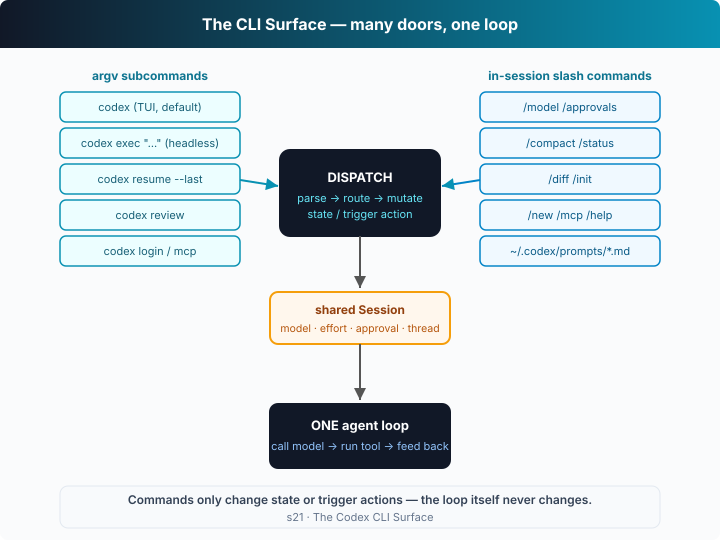

# s21: The Codex CLI Surface — One Binary, Many Doors

[中文](README.md) · [English](README.en.md)

`s01` → ... → [s20](../s20_full_harness/) → `s21` → [s22](../s22_config_toml/) → `s23`
> *"One binary, many doors"* — subcommands and slash commands are really just "different entrances into the same harness".
>
> **Harness layer**: Codex in depth — what changes isn't the loop, it's *which door you came in through*.

---

## The Problem

Throughout Part I (s01–s20) we built **one** loop. But the real Codex isn't a pile of scattered scripts — it puts that loop behind a **single `codex` binary** and gives you many doors:

- Want it interactive? Just type `codex` and you're in the TUI.
- Want a script to call it and exit when done? `codex exec "..."`.
- Want to pick up where you left off? `codex resume --last`.
- Want it to review code? `codex review`.
- Want to manage login or MCP servers? `codex login`, `codex mcp`.

Mid-session you also want to tweak settings on the fly: `/model` to switch models, `/approvals` to change the approval policy, `/compact` to squeeze the context, `/status` to check usage.

These entrances look different, but they **shouldn't each rebuild an agent**. The question: how do you design a *dispatch* layer so all these entrances converge on the single loop from s01?

---

## The Solution



Add **a dispatch layer**: parse argv subcommands and `/`-prefixed slash commands, and route each one to a harness function. The loop itself doesn't change by a single line — dispatch only decides "which door you came in through".

**argv subcommands** (chosen once, on the way in):

| Command | Form | What it does |
|---------|------|--------------|
| `codex` | TUI (default) | interactive session, all slash commands available |
| `codex exec "..."` | headless | run one task non-interactively, print and exit (see s23) |
| `codex resume [--last]` | headless/TUI | reload a saved session and continue (s09's rollout) |
| `codex review [--base B]` | headless | code review through the same loop (see s23) |
| `codex login [--device-auth]` / `logout` | one-shot | ChatGPT browser sign-in / `--with-api-key` / headless device code |
| `codex mcp list\|add\|...` | one-shot | manage MCP servers (s19) |

**In-session slash commands** (tweak any time): all go into a **dispatch table**; each handler mutates the shared `Session` or the harness and prints a result.

| Command | Effect |
|---------|--------|
| `/model <m> <effort>` | switch the model and reasoning effort |
| `/approvals <policy>` | set the `approval_policy` (newer Codex spells this `/permissions`; the old name still routes here) |
| `/compact` | compact the conversation to free context |
| `/status` | current config + token usage |
| `/diff` | show the working-tree git diff |
| `/init` | write an `AGENTS.md` scaffold into the workspace |
| `/new` · `/mcp` · `/help` · `/quit` | new session · list MCP · help · quit |

The key design: **slash commands and prompts share one entry point** — a line of input starting with `/` goes to the dispatch table, otherwise it's fed to the loop as a prompt.

---

## How It Works

Translate this dispatch layer into TypeScript, step by step:

**Step 1**: one `Session` state shared by every door — model, effort, approval, sandbox, working directory, conversation thread.

```ts
interface Session {
  model: string; effort: Effort; approval: Approval;
  sandbox: "read-only" | "workspace-write" | "danger-full-access";
  workspace: string; thread: unknown[]; mcpServers: string[];
}
```

**Step 2**: the slash-command dispatch table. Each handler takes the `Session` and args, mutates state, prints a result. `/model` just changes two fields:

```ts
const SLASH: Record<string, { desc: string; run: Handler }> = {
  "/model": { desc: "choose the active model and reasoning effort",
    run: (s, [m, e]) => {
      if (m) s.model = m;
      if (e && ["low","medium","high"].includes(e)) s.effort = e as Effort;
      console.log(`model → ${s.model}   effort → ${s.effort}`);
    } },
  // …/approvals /compact /status /diff /init /new /mcp /help…
};
SLASH["/permissions"] = SLASH["/approvals"]; // new name, same handler
```

**Step 3**: one in-session dispatch entry point. `/...` goes to the table, otherwise it's a prompt for the loop.

```ts
async function dispatch(s: Session, line: string): Promise<void> {
  if (line.startsWith("/")) {
    const [name, ...args] = line.split(/\s+/);
    const cmd = SLASH[name];
    return cmd ? cmd.run(s, args) : console.log(`unknown command ${name}`);
  }
  s.thread.push({ role: "user", content: line });
  return agentLoop(s);   // ← s01's loop, unchanged
}
```

**Step 4**: argv subcommands — pick a door on the way in. Each subcommand builds a fresh `Session`, then reuses the same `dispatch` / `agentLoop`.

```ts
async function routeArgv(argv: string[]): Promise<boolean> {
  const [sub, ...rest] = argv;
  const s = newSession(makeWorkspace());
  switch (sub) {
    case "exec":   await dispatch(s, rest.join(" ")); return true;  // headless: run one task
    case "review": await dispatch(s, "review the current changes…"); return true;
    case "resume": /* reload a rollout, s09 */ return true;
    case "login":  /* ChatGPT / api-key / device-auth */ return true;
    case "mcp":    /* manage MCP, s19 */ return true;
    default:       return false; // unknown subcommand → fall through to the TUI
  }
}
```

**Core insight**: this chapter never touched `agentLoop` at all. `/model` just sets `s.model` / `s.effort`, and the next turn's `callModel` picks it up naturally; `exec` is just "skip the REPL, run one prompt and exit"; `review` is just "pre-load a review prompt". **Behind every door is the same harness** — the dispatch layer fully decouples the "command-line surface" from the "agent core". In the offline demo you can see it: after `/model gpt-5-codex high`, the next agent message reports "this turn ran on model=gpt-5-codex at effort=high" — proof that dispatch really did change the harness's behavior.

---

## Try It

> **Teaching demo note**: this chapter builds a git repo with a change in the system temp dir to act as the "workspace" — it never touches your project.

**No API key needed**: offline, a scripted model drives the loop; `main()` plays back a **pre-written session script** that walks through every door (`/status`, `/model`, `/approvals`, `/diff`, `/init`, a real prompt, `/compact`, `/mcp`, `/quit`).

**Setup** (first run):

```sh
npm install
cp .env.example .env        # fill in OPENAI_API_KEY and MODEL_ID to run the real model
```

**Run**:

```sh
npx tsx s21_codex_cli/code.ts                     # narrated TUI-session demo
npx tsx s21_codex_cli/code.ts exec "fix the bug"  # via the exec subcommand (headless one-shot)
npx tsx s21_codex_cli/code.ts login               # via the login subcommand
npx tsx s21_codex_cli/code.ts review              # via the review subcommand
OPENAI_API_KEY=sk-... npx tsx s21_codex_cli/code.ts exec "..."   # real model
```

Try these experiments:

1. Run it directly and watch: after `/model gpt-5-codex high` in the session script, does the next agent message report the new model/effort?
2. Run `exec "..."` and `review`, and notice they use **the same** `dispatch` and `agentLoop` as the TUI.
3. Run `exec` once with a real key and feel what "headless mode" means — no REPL, it runs and exits.

Watch for: how do the `thread` length and token estimate printed by `/status` change after `/compact`? Do slash commands and prompts really go through the same entry function?

---

## What's Next

The command-line door is clear now. But tweaking `/model`, `/approvals` every time is tedious — Codex persists them as configuration in `~/.codex/config.toml`: model, reasoning effort, approval, sandbox, custom providers, profiles, MCP servers… dozens of knobs, plus a set of "who overrides whom" precedence rules.

s22 config.toml in Depth → resolve each of those knobs, and build a *precedence resolver*: CLI flag > profile > config file > built-in default.

<details>
<summary>Into the Codex source</summary>

> The following is based on the overall structure of OpenAI's open-source [`openai/codex`](https://github.com/openai/codex) repo (`codex-rs`, written in Rust), and on the real output of `codex --help` and each subcommand's `--help`. The chapter's "one dispatch table + one argv router" is the minimal skeleton of the CLI surface; the real implementation is a full multi-page TUI.

**The chapter's `dispatch` + `routeArgv` ≈ the real Codex command dispatch.** Each item below expands on that core.

<details>
<summary>1. Subcommands are dedicated paths defined with clap</summary>

The chapter routes subcommands with a `switch`. The real `codex-rs` uses Rust's `clap` to define the command tree: `codex` (default → TUI), `exec`, `review`, `resume`, `login`/`logout`, `mcp`, `cloud`, `apply`, `completion`, etc., each with its own flag set. The point matches the chapter — most of these subcommands **don't reuse the TUI's event loop**; they each drive the same core session logic their own way (see s23 for `codex exec`'s non-interactive path).

</details>

<details>
<summary>2. Slash commands are a popup menu in the TUI</summary>

The chapter lists slash commands in a map. In the real TUI, typing `/` pops up a selectable menu: `/model`, `/permissions` (formerly `/approvals`), `/compact`, `/status`, `/diff`, `/init`, `/new`, `/mcp`, `/review`, `/help`, `/quit`, and so on. Each command likewise just "mutates session state or triggers a harness action" — `/model` changes model and effort, `/compact` triggers a compaction (s08), `/init` writes an `AGENTS.md` scaffold. The chapter's "dispatch table + shared Session" maps precisely onto this "commands touch state, not the loop" design.

</details>

<details>
<summary>3. Custom prompts: `~/.codex/prompts/*.md`</summary>

The real Codex also supports **custom slash commands**: write a prompt template to `~/.codex/prompts/review.md` and you can invoke it as `/review` — essentially registering "frequently used prompts" into the dispatch table too. The chapter doesn't demo this separately, but it's just "add another row to the `SLASH` table", where the handler feeds a file's contents to the loop as a prompt.

</details>

<details>
<summary>4. Auth: ChatGPT sign-in vs API key vs device code</summary>

`codex login` has three real paths: the default "Sign in with ChatGPT" opens a browser for OAuth (works with Plus/Pro/Business/Edu/Enterprise plans); `--with-api-key` uses `OPENAI_API_KEY`; `--device-auth` runs a device-code flow in browserless/headless environments. Credentials are stored under `~/.codex/`, and `codex logout` clears them. The chapter only prints the routing result, because auth itself doesn't touch the loop — it only decides which credentials `callModel` uses.

</details>

**In one line**: the real Codex command-line surface — a set of subcommands + a set of slash commands + custom prompts — all converge on the same session core, via exactly this chapter's "parse → route → mutate-state/trigger-action" dispatch. Understand "many doors, one loop" and this whole surface is transparent.

</details>

<!-- translation-sync: zh@v1, en@v1 -->
