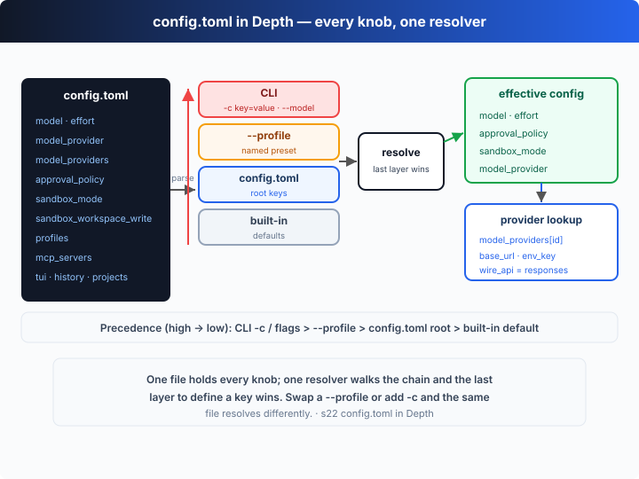

# s22: config.toml in Depth — 所有开关，一个解析器

[中文](README.md) · [English](README.en.md)

`s01` → ... → `s20` → [s21](../s21_codex_cli/) → `s22` → `s23`
> *"Every knob, one resolver"* — 所有开关都住在同一个文件里；一个解析器，沿着一条固定的优先级链，把它们解析成最终生效的那份配置。
>
> **Harness 层**：Codex 深潜 —— 真实 Codex 产品里，`~/.codex/config.toml` 是唯一的配置入口。

---

## 问题

在 Part I，配置要么硬编码在源码里（s01–s09），要么是一个精简的 `CONFIG` 对象字面量（s10）。那只是教学骨架。真实的 Codex 面对的是几十个开关，而且它们会相互作用。三个真实的痛点：

1. **不知道有哪些开关、键名是什么**——你想把 Codex 指向公司网关、给沙箱加一个可写目录、注册一个 MCP server、让某个项目免审批……这些都在哪配？键叫什么？散落一处的知识没法用。
2. **同一个键，能在好几个地方设**——`model` 可以来自内置默认、`config.toml` 根、一个 `--profile`，或命令行的 `-c key=value` / `--model`。当行为出乎意料时，到底是哪一层赢了？
3. **profile / provider / trust 会组合**——一个 `--profile` 可以把 provider 切成网关、把沙箱切成 `danger-full-access`；一个 `[projects."/path"]` 可以把整个项目标记为 trusted。它们叠在一起，没有全局心智模型就会失控。

问题不在「开关太多」，而在你把它当成「一堆散配置」。它其实是**一份 schema + 一个解析器**：文件定义了所有能配的东西，解析器沿着固定的优先级链把它解析成「最终生效的一份」。看懂这条链，就看懂了全部。

---

## 解决方案



`~/.codex/config.toml` 一个文件装下所有开关，`resolveConfig` 一个函数沿固定优先级链解析它。先把 schema 按区摸清（这是本章的参考表），再看链。

**模型与提供方**（指到默认 API，或任何兼容网关）：

| 键 | 取值 / 默认 | 说明 |
|----|------------|------|
| `model` | `"gpt-5-codex"` | 用哪个模型 |
| `model_reasoning_effort` | `minimal`/`low`/`medium`/`high`/`xhigh` | 推理档位（Responses API；`xhigh` 视模型而定） |
| `model_provider` | `"openai"` | 指向 `model_providers` 里的某个 id |
| `model_providers.<id>.name` | 显示名 | 提供方名称 |
| `model_providers.<id>.base_url` | URL | API 根地址（网关/自托管） |
| `model_providers.<id>.env_key` | 环境变量名 | 从哪个环境变量读该提供方的 key |
| `model_providers.<id>.wire_api` | `responses` | 线路协议；当前 Codex **只讲 `responses`**（`chat` 已移除，见下文源码） |
| `...http_headers` / `env_http_headers` / `query_params` | map | 附加的静态头 / 来自环境变量的头 / 查询参数 |
| `...request_max_retries` / `stream_max_retries` / `stream_idle_timeout_ms` | `4` / `5` / `300000` | 请求重试、流式重试、流式空闲超时 |

**审批与沙箱**（第一道安全闸，对应 s03/s04）：

| 键 | 取值 / 默认 | 说明 |
|----|------------|------|
| `approval_policy` | `untrusted`/`on-request`/`never`，或 `{ granular = {...} }` | 何时停下来问人；默认 `on-request`（`on-failure` 现在是它的别名） |
| `sandbox_mode` | `read-only`/`workspace-write`/`danger-full-access` | 文件与网络隔离；默认 `read-only` |
| `sandbox_workspace_write.network_access` | `false` | `workspace-write` 下是否放行出网 |
| `sandbox_workspace_write.writable_roots` | `[路径]` | 除工作区外额外可写的目录 |
| `sandbox_workspace_write.exclude_tmpdir_env_var` / `exclude_slash_tmp` | bool | 把 `$TMPDIR` / `/tmp` 排除出默认可写根 |

**预设、外部工具、界面、历史、项目信任**：

| 键 | 取值 / 默认 | 说明 |
|----|------------|------|
| `profiles.<name>` | 表 | 命名预设；`--profile <name>` 选中后**覆盖**根上的同名键 |
| `mcp_servers.<id>.command` / `args` / `env` | stdio | 起一个 stdio MCP server（见 s19） |
| `mcp_servers.<id>.url` (+ `bearer_token_env_var`) | streamable HTTP | 或连一个 HTTP MCP server |
| `mcp_servers.<id>.startup_timeout_sec` / `tool_timeout_sec` / `enabled` | `10` / `60` / `true` | 启动超时、单工具超时、是否启用 |
| `tui.alternate_screen` / `animations` / `notifications` / `notification_method` | `auto`/`true`/… | TUI 终端行为 |
| `history.persistence` / `max_bytes` | `save-all`/`none` | 是否把会话写进 `history.jsonl`，及其体积上限 |
| `projects.<path>.trust_level` | `trusted`/`untrusted` | 把某个项目/工作树标记为可信 |

**优先级链**（高覆盖低）——本章的核心：

| 优先级 | 来源 | 例子 |
|--------|------|------|
| 最高 | CLI `-c key=value` / flags | `-c sandbox_mode=read-only`、`--model`、`--profile` |
| 高 | `--profile NAME` | `--profile deep` |
| 低 | `config.toml` 根 | `model = "gpt-5-codex"` |
| 最低 | 内置默认 | `approval_policy="on-request"`、`sandbox_mode="read-only"` |

关键设计：**schema 与解析是两回事**。文件穷举了「能配什么」，解析器只问一个问题——对每个键，**最后一层定义它的是谁**，谁就赢。

---

## 工作原理

把这个过程翻译成 TypeScript，分步来看（完整版见 `code.ts`）。

**第 1 步**：一个 TOML 子集解析器。真实 Codex 用完整的 TOML crate；我们只需要配置文件真正用到的子集——标量、字符串、数组、内联表、`[dotted.table]` 头（允许带引号的段，因为项目路径里有 `.` 和 `/`）。核心是 `parseValue`：

```ts
function parseValue(raw: string): TomlValue {
  const s = raw.trim();
  if (s.startsWith('"') || s.startsWith("'")) return s.slice(1, -1);
  if (s === "true") return true;
  if (s === "false") return false;
  if (s.startsWith("[") && s.endsWith("]")) return splitTop(s.slice(1, -1), ",").map(parseValue);
  if (s.startsWith("{") && s.endsWith("}")) {
    const t: TomlTable = {};
    for (const pair of splitTop(s.slice(1, -1), ",")) {
      const eq = pair.indexOf("=");
      t[parseKey(pair.slice(0, eq))] = parseValue(pair.slice(eq + 1));
    }
    return t;
  }
  if (s !== "" && !Number.isNaN(Number(s))) return Number(s);
  return s; // lenient: a bare word (e.g. a `-c effort=high` value) becomes a string
}
```

`splitTop` 负责「只在嵌套深度 0、且在字符串之外」切分——所以 `[projects."/work/learn-codex"]` 这种带点的引号段不会被错误拆开。

**第 2 步**：内置默认层。注意这些是 codex-rs 的真实默认（`approval_policy` 默认 `on-request`、`sandbox_mode` 默认 `read-only`、provider 默认内置 `openai`）：

```ts
const DEFAULTS: TomlTable = {
  model: "gpt-5-codex",
  model_reasoning_effort: "medium",
  model_provider: "openai",
  approval_policy: "on-request",
  sandbox_mode: "read-only",
};
```

**第 3 步**：`trace`——沿链走一遍，**最后定义该键的层赢**，并记下它来自哪一层：

```ts
function trace(key: string, layers: Layer[]): { value: TomlValue; source: string } {
  let value: TomlValue = "(unset)", source = "(none)";
  for (const { label, table } of layers)
    if (Object.prototype.hasOwnProperty.call(table, key)) { value = table[key]; source = label; }
  return { value, source };
}
```

**第 4 步**：`resolveConfig` 把四层按从低到高排好，逐个键 `trace`：

```ts
const layers: Layer[] = [
  { label: "built-in default", table: DEFAULTS },
  { label: "config.toml root", table: cfg },
  { label: `--profile ${opts.profile}`, table: chosen ?? {} },
  { label: "CLI -c / flags", table: opts.cli ?? {} },
];
const entries: Resolved["entries"] = {};
for (const k of SCALAR_KEYS) entries[k] = trace(k, layers);
```

**第 5 步**：标量 `model_provider` 只是个 id，再解析成具体端点（base_url、env_key、wire_api）：

```ts
function resolveProvider(cfg: TomlTable, id: string) {
  const providers = (cfg.model_providers ?? {}) as TomlTable;
  if (id === "openai" && !providers[id])
    return { name: "OpenAI", base_url: "https://api.openai.com/v1", env_key: "OPENAI_API_KEY", wire_api: "responses" };
  const p = (providers[id] ?? {}) as TomlTable;
  return {
    name: String(p.name ?? id), base_url: String(p.base_url ?? "?"),
    env_key: String(p.env_key ?? "?"), wire_api: String(p.wire_api ?? "responses"),
  };
}
```

**核心洞察**：离线 demo 把同一份内嵌 `config.toml` 用三种 flag/profile 组合各解析一遍，并打印**每个键来自哪一层**。看场景 ③（`--profile deep` 再叠两个 `-c`）：

```text
model                  = gpt-5-pro        ← --profile deep
model_reasoning_effort = low              ← CLI -c / flags
model_provider         = gateway          ← --profile deep
approval_policy        = on-request       ← config.toml root
sandbox_mode           = read-only        ← CLI -c / flags
provider[gateway] → Corp Gateway · https://llm.corp.example/v1 · key=$GATEWAY_API_KEY · wire_api=responses
```

`model`/`provider` 被 profile 改写，`effort`/`sandbox` 被 `-c` 压过 profile，`approval` 没人碰、落回文件根——同一份文件，因为优先级链，解析出三份不同的「生效配置」。这就是「所有开关，一个解析器」。

---

## 试一下

> **教学 demo 提示**：本章解析的是**内嵌在 `code.ts` 里的一份教学用 `config.toml`**，不读你真实的 `~/.codex/config.toml`，也不写任何文件。放心运行。

**无需 API key 也能跑**：没有 `OPENAI_API_KEY` 时，demo 会打印三个场景下每个键的取值与来源层，最后一段「Your turn」会告诉你*将要*用解析出的 `model`/`effort`/`provider` 发什么请求。设了 key，它就真的用解析结果发一次 Responses API 调用——传输变了，解析不变。

**准备**（首次运行）：

```sh
npm install
cp .env.example .env        # 想跑真实模型就填入 OPENAI_API_KEY
```

**运行**：

```sh
npx tsx s22_config_toml/code.ts                                  # 三个场景的叙述式 demo
npx tsx s22_config_toml/code.ts --profile deep                   # 用 deep 预设（切到 gateway provider）
npx tsx s22_config_toml/code.ts --profile fast --model gpt-5-mini -c model_reasoning_effort=high
OPENAI_API_KEY=sk-... npx tsx s22_config_toml/code.ts --profile deep   # 真实 API 收尾
```

试试这些实验：

1. 直接跑，对比场景 ①（全来自文件根）和场景 ②（`--profile fast` 把 `effort`、`approval` 改成 profile 的值），看每行尾 `←` 标注的来源层。
2. 跑 `--profile deep`，看 `provider[gateway]` 那一行如何把 base_url 切成 `https://llm.corp.example/v1`、env_key 切成 `GATEWAY_API_KEY`。
3. 自己叠 `-c`：`-c sandbox_mode=read-only -c model_reasoning_effort=high`，看这两个键的来源层如何从 `--profile` 变成 `CLI -c / flags`，而其它键不动。

观察重点：每个键末尾 `←` 标注的是哪一层？当你同时给 `--profile` 和 `-c` 同一个键时，谁赢了？这正是那条链在起作用。

---

## 接下来

配置能解析了、provider 能切了、优先级也看清了。但这一切都还在「交互式在你机器上跑」的范畴里。真实世界里，Codex 还要离开你的笔记本：在 PR 上做 `codex review`、在 CI 里用 `codex exec` 无人值守地跑、在 Codex Cloud 的 worktree 里并行处理任务。

s23 Review, CI & Cloud → 同一个 loop，跑到真实的、无人看守的工作上去。这也是 Part II 的收官章。

<details>
<summary>深入 Codex 源码</summary>

> 以下内容基于 OpenAI 开源的 [`openai/codex`](https://github.com/openai/codex) 仓库（`codex-rs`，Rust 实现）。教学版的「TOML 子集解析 + 沿优先级链解析」就是 Codex 配置系统的最小骨架；差异全在键的数量与工程细节上。本节的键名、取值、默认值均对照真实源码核实过。

**教学版的 `parseToml` + `resolveConfig` ≈ Codex 的 `ConfigToml` 反序列化与配置解析。** 下面每一项都是在这个核心上的展开与核实。

<details>
<summary>一、真实 schema：codex-rs 的 ConfigToml</summary>

真实配置结构是 `codex-rs/config/src/config_toml.rs` 里的 `ConfigToml`。教学版 `CONFIG_TOML` 里出现的键都能在它对上：`model`、`model_provider`、`approval_policy`、`sandbox_mode`、`sandbox_workspace_write`、`mcp_servers`、`model_providers`、`profile` / `profiles`、`history`、`tui`、`model_reasoning_effort`、`projects`。codex-rs 用 `serde` 把整份 TOML 反序列化成强类型结构（绝大多数键是 `Option<T>`，缺省即走内置默认），教学版则用动态 `TomlTable`——结构同构，类型松紧不同。

</details>

<details>
<summary>二、wire_api：responses vs chat —— 以及 chat 已被移除</summary>

`wire_api` 选择提供方所讲的线路协议。**历史上**有两个值：`responses`（OpenAI 原生 Responses API，`/v1/responses`）和 `chat`（旧的 Chat Completions，`/v1/chat/completions`，很多第三方网关和本地服务如 Ollama 用它）。但在当前 codex-rs 里，**`chat` 已被移除**：`WireApi` 枚举（`codex-rs/model-provider-info/src/lib.rs`）只剩 `Responses` 一个变体，配 `wire_api = "chat"` 会报「no longer supported」并指向 discussion #7782。换句话说，**Codex 现在原生只讲 Responses API**，这也是本课程从 s01 起就只讲 Responses 的原因。教学版把 `wire_api` 标成 `responses` 正是反映这一现状。

</details>

<details>
<summary>三、approval_policy 与 sandbox_mode 的真实取值</summary>

`approval_policy`（`codex-rs/protocol/src/protocol.rs` 的 `AskForApproval`）：`untrusted`（内部名 `UnlessTrusted`，只自动放行「已知安全」的只读命令）、`on-request`（**`#[default]`，由模型决定何时请示**；`on-failure` 现在是它的 `serde(alias)`）、`never`，以及较新的 `granular = {...}` 细粒度表（按 `sandbox_approval` / `rules` / `skill_approval` 等分别开关）。`sandbox_mode`（`SandboxPolicy`）：`read-only`、`workspace-write`、`danger-full-access`（源码里还有 `external-sandbox`，表示进程已处外部沙箱中）。`workspace-write` 的子项正是教学版那张表：`writable_roots`、`network_access`（默认 `false`）、`exclude_tmpdir_env_var`、`exclude_slash_tmp`。

</details>

<details>
<summary>四、profiles：ConfigProfile 能覆盖哪些键</summary>

`[profiles.<name>]` 对应 `codex-rs/config/src/profile_toml.rs` 的 `ConfigProfile`，可覆盖 `model`、`model_provider`、`approval_policy`、`sandbox_mode`、`model_reasoning_effort`、`model_reasoning_summary`、`model_verbosity` 等。`--profile NAME` 选中后，它的取值**覆盖 `config.toml` 根上的同名键**——这正是教学版「profile 层压在 root 层之上」的来源。（Codex 也支持把预设放到独立的 `$CODEX_HOME/<name>.config.toml` 文件；机制相同。）

</details>

<details>
<summary>五、优先级与 -c：真实解析顺序</summary>

codex-rs 的生效顺序与教学版同向：**内置默认 → `config.toml` 根 → 选中的 profile → 命令行覆盖**。命令行里 `-c key=value`（也写作 `--config`）是最高优先级，且**支持带点号的键**（如 `-c sandbox_workspace_write.network_access=true`）和 TOML 值语法；`--model`、`--profile` 这类专用 flag 等价于对相应键的顶层覆盖。教学版的 `-c` 解析（含 `parseHeader` 走带点路径、`parseValue` 对裸词的宽容处理）就是在模仿这套行为。

</details>

<details>
<summary>六、provider 的网络细节与项目信任</summary>

`ModelProviderInfo` 还带 `request_max_retries`（默认 4）、`stream_max_retries`（默认 5）、`stream_idle_timeout_ms`（默认 300000）、`http_headers`、`env_http_headers`、`query_params`——教学版只演示了 `name`/`base_url`/`env_key`/`wire_api`。`projects.<path>.trust_level` 把项目/工作树标为 `trusted`/`untrusted`；受信项目还会加载项目级 `.codex/config.toml`，但项目级配置**不能**覆盖机器级的 provider、auth、telemetry 键——信任是有边界的。

</details>

**一句话**：Codex 的配置系统核心就是教学版这套「一份 TOML schema 穷举所有开关 + 一个解析器沿 `默认 < 根 < profile < CLI` 的链解析，并支持 provider/trust 的结构化查找」。所有额外机制——serde 强类型、wire_api 的 responses-only 化、granular 审批、provider 的重试/头/查询参数、项目级信任的边界——都是为了让这套解析在真实多模型、多网关、多项目使用里既灵活又可预期。吃透「schema + 一条优先级链」，其余都是工程加固。

</details>

<!-- translation-sync: zh@v1, en@v1 -->
