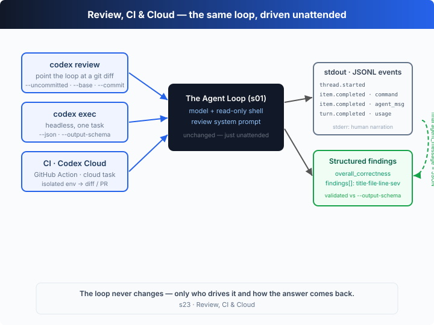

# s23: Review, CI & Cloud — the harness leaves your laptop

[中文](README.md) · [English](README.en.md)

`s01` → ... → `s20` → [s21](../s21_codex_cli/) → [s22](../s22_config_toml/) → `s23`
> *"The harness leaves your laptop"* — the same agent loop, handed to scripts, CI and the cloud to run unattended.
>
> **Harness layer**: Codex in depth — what changes isn't the loop, it's *who drives it, what it points at, and how the result comes back*.

---

## The Problem

From s01 to s20 we rebuilt a Codex-style harness one mechanism at a time; in Part II, s21 walked the real CLI's command surface and s22 resolved every knob in `config.toml`. But one assumption has never been broken: **the loop is driven by a person sitting at a keyboard** — you type a prompt, watch it run turn by turn, and approve each command by hand.

Real teams want the opposite: "it has to run even when nobody is watching":

1. **Have it read code, not just write it** — point the agent at a diff and get prioritized review comments back, ideally automatically on every PR, instead of begging it in a chat box.
2. **Embed it in scripts and CI** — run a task in a shell script or a GitHub Action and consume the result *programmatically*, not read a chat transcript. Chat text is friendly to humans and a disaster for scripts.
3. **Have it run for you offline** — delegate a task; it runs itself in an isolated cloud environment, you close your laptop and go to a meeting, and come back to a PR that's already open.

These three share one thing: the s01 loop is perfectly fine — the question is **how to make the same loop run unattended, on real work, and hand back a machine-usable result**. That's not a loop problem; it's a problem of the loop's *driver* and its *exit*.

---

## The Solution



The key insight in one line: `codex review`, `codex exec` in CI, and Codex Cloud tasks are **the same loop** — only three things change: **who drives it** (a person / a script / CI / the cloud), **what it points at** (a diff / a task / a delegated task), and **how the result comes back** (inline comments / a JSONL event stream + schema-conforming JSON / a PR).

| Form | Real command | Driven by | Points at | Result comes back as |
|------|--------------|-----------|-----------|----------------------|
| Review mode | `codex review [--uncommitted\|--base B\|--commit SHA]` | person / script | a git diff | prioritized findings (inline comments; doesn't touch your tree) |
| Headless exec | `codex exec --json --output-schema s.json "task"` | script / CI | a task | a JSONL event stream on stdout + a schema-conforming final message |
| Cloud task | `codex cloud exec \| status \| diff \| apply` | the cloud (hosted) | a delegated task | a diff / PR produced in an isolated environment |

**The review scope of `codex review`** (real flags, a top-level subcommand that also exists as `codex exec review`):

| flag | What it reviews |
|------|-----------------|
| `--uncommitted` | all staged + unstaged + untracked changes in the working tree |
| `--base <BRANCH>` | the diff of the current branch against the merge-base of a base branch |
| `--commit <SHA>` | the set of changes introduced by one commit |
| `[PROMPT]` or `-` | a custom review instruction; `-` reads it from stdin |
| `--title <TITLE>` | a commit title shown in the review summary |

Review is **read-only**: it reports "prioritized, actionable findings" as inline comments attached to specific diff lines, and **does not modify your working tree**.

---

## How It Works

Translate "unattended review" into TypeScript. The pipeline: build a buggy diff → run headless exec with a review system prompt + `--output-schema` → stream the run to stdout as JSONL → parse out structured findings.

**Step 1**: build the review target. In a temp dir, `git init`, commit a correct base, then write an **uncommitted** change — `git diff` gives exactly what `codex review --uncommitted` would see. This change hides three regressions you can spot from the diff alone.

```ts
function buildSampleRepo(): string {
  const repo = path.join(fs.mkdtempSync(path.join(os.tmpdir(), "s23-")), "repo");
  fs.mkdirSync(path.join(repo, "src"), { recursive: true });
  git(repo, "init -b main");
  // …config user.* …
  fs.writeFileSync(path.join(repo, "src", "login.ts"), BASE_TS);
  git(repo, "add -A");
  git(repo, 'commit -m "base login helpers"');
  fs.writeFileSync(path.join(repo, "src", "login.ts"), BUGGY_TS); // uncommitted change
  return repo;
}
const diff = git(repo, "diff"); // uncommitted → maps to `codex review --uncommitted`
```

**Step 2**: the review system prompt + `--output-schema`. The prompt constrains the agent to be a "read-only reviewer" — it may open files for context but must never edit them, and it returns only one JSON object. The schema pins the "final message" to a shape a script can depend on (this is exactly what `codex exec --output-schema` does).

```ts
const REVIEW_INSTRUCTIONS =
  `You are Codex running in review mode. You are given a unified git diff. ` +
  `Find real, prioritized problems … Use the shell only to read context; NEVER edit files. ` +
  `When done, reply with ONLY a JSON object matching the provided schema.`;

const FINDINGS_SCHEMA = {
  type: "object", required: ["overall_correctness", "findings"],
  properties: {
    overall_correctness: { type: "string", enum: ["patch is correct", "patch is incorrect"] },
    findings: { type: "array", items: { type: "object",
      required: ["title", "body", "file", "line", "severity"],
      properties: { title: {…}, body: {…}, file: {…}, line: {…},
        severity: { type: "string", enum: ["low", "medium", "high"] } } } },
  },
};
```

**Step 3**: the `--json` event stream. In headless mode each line of JSON goes to **stdout**; human narration goes to **stderr**, so stdout can be piped straight to a file or `jq`. The event types match the real `codex exec --json`.

```ts
function emitEvent(type: string, extra: Record<string, unknown> = {}): void {
  console.log(JSON.stringify({ type, ...extra })); // stdout = the machine channel
}
```

The real `codex exec --json` event and item types:

| event.type | meaning |
|------------|---------|
| `thread.started` | session started, with `thread_id` |
| `turn.started` | a turn started |
| `item.started` / `item.completed` | an item (tool call / message) started / completed, with the `item` object |
| `turn.completed` | a turn finished, with `usage` (input/output/reasoning tokens) |
| `turn.failed` / `error` | failure / error |

Item `type` values: `command_execution` · `agent_message` · `reasoning` · `file_change` · `mcp_tool_call` · `web_search` · `plan_update`.

**Step 4**: the headless executor `codexExec` — the heart of this chapter. It runs a task to completion with no human in the loop; with `json: true` it streams each turn's tool calls and the final message as JSONL; finally it returns the final agent message (the structured payload).

```ts
async function codexExec(prompt: string, opts: ExecOptions): Promise<string> {
  if (opts.json) emitEvent("thread.started", { thread_id: `thr_${Date.now().toString(36)}` });
  if (opts.json) emitEvent("turn.started");
  const input: unknown[] = [{ role: "user", content: prompt }];
  let finalText = "";
  for (let step = 0; step < 8; step++) {
    const output = await callModel(input, opts);            // a Responses call carrying the schema
    input.push(...output);
    const calls = output.filter((i) => i.type === "function_call");
    if (calls.length === 0) {                                // the model is done: final message
      for (const item of output)
        if (item.type === "message")
          for (const c of item.content ?? [])
            if (c.type === "output_text" && c.text) finalText += c.text;
      if (opts.json) emitEvent("item.completed", { item: { id: `item_${++itemSeq}`, type: "agent_message", text: finalText } });
      break;
    }
    for (const call of calls) {                              // tool call → command_execution item
      const { command } = JSON.parse(call.arguments ?? "{}") as { command: string };
      const result = runShell(opts.cwd, command);
      if (opts.json) emitEvent("item.completed", { item: { id, type: "command_execution", command, status: "completed", aggregated_output: result.slice(0, 400) } });
      input.push({ type: "function_call_output", call_id: call.call_id, output: result });
    }
  }
  if (opts.json) emitEvent("turn.completed", { usage: approxUsage(input) });
  return finalText;
}
```

Note `codexExec`'s signature: `{ instructions, cwd, json, schema }`. It knows nothing about "review" — **review is just exec with a different system prompt, a diff stuffed into the prompt, and a schema attached**. That is exactly this chapter's thesis:

```ts
const finalMessage = await codexExec(promptWithDiff, {
  instructions: REVIEW_INSTRUCTIONS, cwd: repo, json: true, schema: FINDINGS_SCHEMA,
});
const review = parseFindings(finalMessage); // validate and parse the findings
```

When running the real model, the schema constrains generation directly through the Responses API's Structured Outputs (`text.format = { type: "json_schema", … }`) rather than validating after the fact.

**The headless flags of `codex exec` (real)**:

| flag | meaning |
|------|---------|
| `--json` | stream the run to stdout as a JSONL event stream |
| `--output-schema <FILE>` | constrain the final message with a JSON Schema (Structured Outputs) |
| `-o, --output-last-message <FILE>` | write the final agent message to a file (and still print it) |
| `--color <always\|never\|auto>` | whether to colorize output (default auto) |
| `-C, --cd <DIR>` | the working root directory for the agent |
| `-s, --sandbox <MODE>` | `read-only` / `workspace-write` / `danger-full-access` |
| `-m, --model` / `-p, --profile` / `-c key=value` | override model / profile / any config key |
| `--skip-git-repo-check` · `--ephemeral` | run outside a git repo · don't persist the session |

### Wiring into CI: `openai/codex-action`

There's nothing new in CI — it's "run `codex exec` on some runner". The official Action `openai/codex-action@v1` installs the CLI for you, sets up a secure proxy to the Responses API, and wraps permission controls around `codex exec`:

| input | purpose |
|-------|---------|
| `openai-api-key` (required) | the key for the Responses API proxy, stored as a GitHub secret |
| `prompt` / `prompt-file` | the task, inline or from a file |
| `permission-profile` | e.g. `":read-only"` / `":workspace"`, controlling filesystem and network |
| `safety-strategy` | `drop-sudo` (default) / `unprivileged-user` / `read-only` / `unsafe` |
| `output-file` · `working-directory` · `model` · `effort` · `codex-args` | output target, working dir, model, reasoning effort, extra CLI args |
| (output) `final-message` | the final agent message — the next step can post it as a PR comment |

A minimal "auto-review on every PR" workflow: `actions/checkout` pulls the code → `openai/codex-action@v1` runs with `openai-api-key` + a review prompt → `github-script` posts the `final-message` output as a PR comment.

### Delegating to the cloud: Codex Cloud

Codex Cloud moves the same loop into an **isolated cloud environment**: each task gets its own container / micro-VM, clones your repo, first runs your configured **setup script** (install deps, inject variables and secrets, open the network per policy), the agent works autonomously inside while you watch logs live or send it to the background; when done it returns a summary + diff, and you can ask for rework or **open a PR with one click**. From the CLI you drive it with `codex cloud`:

| subcommand | purpose |
|------------|---------|
| `codex cloud exec` | submit a new cloud task without opening the TUI |
| `codex cloud status` / `list` | check the status of one / all cloud tasks |
| `codex cloud diff` | view the unified diff produced by a cloud task |
| `codex cloud apply` | apply a cloud task's diff to your local working tree (see also `codex apply <TASK_ID>`) |

**Core insight**: the loop hasn't changed since s01. Review mode = exec + a review prompt + a diff + a schema; headless = remove the "person" from the driver's seat and swap the result from "chat text" to "a machine-readable event stream on stdout"; CI and Cloud = run the same exec on someone else's runner / container. What changes is never the loop, but **who sits in the driver's seat, where the wheel points, and what the finish line hands back**.

---

## Try It

> **Teaching demo note**: the code `git init`s a **real git repository** in the system temp dir (`os.tmpdir()`), commits a base, writes an uncommitted change with 3 bugs, then runs a headless review on it. Everything happens in the temp dir and never touches your project.

**No API key needed**: this chapter is a **self-running demo** with no REPL. Without `OPENAI_API_KEY` it uses a built-in scripted "reviewer" — it first runs `cat -n src/login.ts` to see line numbers, then returns findings as schema-conforming JSON; the whole time it prints a `codex exec --json`-style event stream to stdout and human narration to stderr.

**Setup** (first run):

```sh
npm install
cp .env.example .env        # fill in OPENAI_API_KEY and MODEL_ID to run the real model
```

**Run**:

```sh
npx tsx s23_review_ci_cloud/code.ts                       # offline demo (machine stream + human summary)
npx tsx s23_review_ci_cloud/code.ts > events.jsonl        # keep only the JSONL event stream on stdout
npx tsx s23_review_ci_cloud/code.ts 2>/dev/null | jq .    # inspect the machine channel with jq
OPENAI_API_KEY=sk-... npx tsx s23_review_ci_cloud/code.ts # real model (schema via Structured Outputs)
```

Try these experiments:

1. Run it directly and tell the two channels apart: the 6 lines of JSONL on stdout (`thread.started` → `turn.completed`) are the machine channel; the timestamped narration on stderr is the human channel. After redirecting `> events.jsonl`, the file should contain **only** the event stream.
2. Change `BUGGY_TS` (say, fix `shouldLock` and leave only two bugs), run again, and watch the offline reviewer's verdict and finding count change.
3. Run it with a real key: `--output-schema` goes through the Responses Structured Outputs, so the model is *constrained* to produce valid JSON; compare that with the offline "validate after the fact" approach.

Watch for: the final `agent_message`'s `text` is the entire findings JSON; `codexExec` itself doesn't "understand" review at all — swap the `instructions` and prompt and it's a headless executor for any task.

---

## What's Next

At this point Part I's loop has been taken apart to the bottom, and Part II's three deep dives are done: s21 walked the real CLI's command surface, s22 resolved every knob in `config.toml`, and this chapter saw the same loop run unattended across review, CI and the cloud. **This harness has no secrets left.**

There's no s24 — now it's your turn to assemble s01–s23 into *your own* agent: take s01's loop as the skeleton, add the mechanisms you need layer by layer from s02–s20, then aim it at real work with s21–s23's real surface (CLI subcommands, `config.toml`, exec/review/cloud). To revisit that 30-line loop from the start, go to [s01](../s01_agent_loop/).

<details>
<summary>Into the Codex source</summary>

> The following is based on the overall structure of OpenAI's open-source [`openai/codex`](https://github.com/openai/codex) repo (`codex-rs`, written in Rust), the official docs, and the `--help` output of a locally installed `codex` CLI (v0.144.x). The chapter's "review prompt + `--json` event stream + `--output-schema`" is the minimal skeleton of this unattended surface; the differences are in engineering detail and in the closed-source hosted parts.

**The chapter's `codexExec` ≈ the real `codex exec`; the chapter's review ≈ `codex review` / `codex exec review`.** Each item below expands on that core.

<details>
<summary>1. exec is a dedicated non-interactive path in codex-rs</summary>

The chapter explains headless as "the same loop minus the REPL". In the real `codex-rs`, `codex exec` is a **dedicated non-interactive execution path**: it doesn't reuse the TUI's event loop but runs one task to completion, printing human-readable progress to stderr and results to stdout by default — which is where the chapter's "stdout machine channel / stderr human channel" split comes from. `codex review` and `codex exec review` share this non-interactive path, just pre-loaded with a review system prompt and diff-collection logic (`--uncommitted` / `--base` / `--commit`).

</details>

<details>
<summary>2. The --json JSONL event stream maps to real event types</summary>

The `thread.started` / `turn.started` / `item.started` / `item.completed` / `turn.completed` / `turn.failed` / `error` events the chapter's `emitEvent` produces, and the item types `command_execution` / `agent_message` / `reasoning` / `file_change` / `mcp_tool_call` / `web_search` / `plan_update`, all come from the official documentation of `codex exec --json` output. The chapter uses a subset (tool calls + the final message) and replaces the real implementation's finer-grained streaming deltas with human narration; `usage` is an estimate offline, whereas the real `turn.completed` carries precise token counts.

</details>

<details>
<summary>3. --output-schema lands on the Responses Structured Outputs</summary>

The chapter's online path puts the schema into `text.format = { type: "json_schema", … }`, matching what the real `codex exec --output-schema <FILE>` does: it uses the user's JSON Schema as the response format of the final message so the model is *constrained* to produce valid JSON, rather than validating after the fact and retrying. The chapter keeps a `parseFindings` after-the-fact validation as well, purely to demonstrate the "validate" step under the offline scripted model; in the real implementation the model re-generates when the schema isn't met. `-o/--output-last-message` corresponds to "write only the final message to a file".

</details>

<details>
<summary>4. CI's openai/codex-action is a separate repo wrapping the CLI</summary>

`openai/codex-action` is not in the main `openai/codex` repo — it's a standalone GitHub Action: it installs the Codex CLI, sets up a proxy to the Responses API, and tightens permissions on the runner with `permission-profile` / `safety-strategy` (`drop-sudo` by default). The `final-message` output it exposes is essentially the final agent message after `codex exec` finishes — the `finalText` the chapter's `codexExec` returns. Post it as a PR comment and you have an "auto-review bot".

</details>

<details>
<summary>5. Codex Cloud is a hosted product; the CLI is just its remote</summary>

Codex Cloud's isolated environment (a container / micro-VM per task, setup scripts, network policy, artifact-to-PR) is an **OpenAI-hosted service** whose internals are not in the open-source `codex-rs`. What the open-source CLI provides is the `codex cloud exec / status / list / diff / apply` set of "remote control" subcommands to submit tasks, check status, fetch diffs, and apply diffs back locally (alongside `codex apply <TASK_ID>`). The chapter simulates the "change → diff → return" loop with a local temp repo + `git diff`; the real isolation strength (filesystem / process / network all separated) is closer to s18's worktree model moved into containers.

</details>

**In one line**: review, CI and Cloud aren't new agents — they're three "unattended ways of driving" the same loop. Almost all the real complexity is on the engineering side — dedicated event types, the hard constraints of Structured Outputs, permission tightening on runners, and the isolation and artifact recovery of cloud environments — not in the loop itself. Once you internalize "change the driver + change the exit, the loop stays the same", this whole surface makes sense.

</details>

<!-- translation-sync: zh@v1, en@v1 -->
