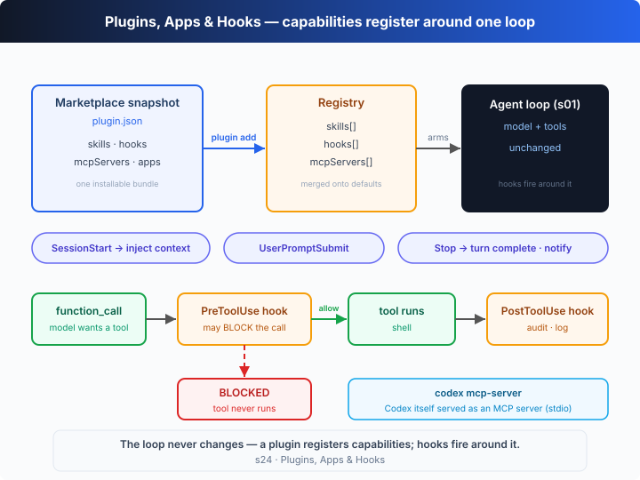

# s24: Plugins, Apps & Hooks — capabilities register around the loop

[中文](README.md) · [English](README.en.md)

`s01` → ... → `s20` → [s21](../s21_codex_cli/) → [s22](../s22_config_toml/) → [s23](../s23_review_ci_cloud/) → `s24` → `s25`
> *"Capabilities register around the loop"* — a plugin bundles skills, hooks and MCP servers into one install; hooks fire on the loop's lifecycle events; the loop itself never changes.
>
> **Harness layer**: Codex deep-dive — what changes is not the loop, but *who registered a capability into the registry* and *who hung a command on an event point*.

---

## The Problem

s07 covered **skills** (loading a piece of instructions on demand); s19 covered **MCP servers** (attaching a set of external tools). Both are "add one thing to the agent at a time." Real teams quickly hit three new pain points:

1. **Installing one piece at a time is too fragmented.** A team wants every member to have "the same skill + the same guard hook + the same MCP server." Should everyone configure it three times by hand? Can't we **bundle it into one package and install it with a single command**?
2. **We want to insert our own logic at the loop's key points.** *Before* every tool call, run a "is this command dangerous?" check; *after* every call, write an audit log; when the session *starts*, inject a team policy; when a turn *ends*, send a notification. None of these are new tools — they are **custom commands hung on the loop's lifecycle**.
3. **We want other agents to use Codex as a tool.** Not Codex calling an MCP server, but **turning Codex itself into an MCP server**, so another agent / MCP client can call it over stdio.

The common thread: the s01 loop stays put. The question is only **how to "register" capabilities around the loop**, and **how to hang commands on the loop's event points**.

---

## The Solution



In one sentence: **a plugin packages a set of capabilities into an installable unit; a hook fires a custom command on a lifecycle event of the loop; `codex mcp-server` exposes Codex itself as an MCP server.** All of them only write into a "registry" or fire on event points — **none of them touch the loop**.

### The plugin system (the `plugins` feature, stable, on by default)

A plugin = a `plugin.json` manifest that bundles **skills + hooks + mcpServers (and apps)**, distributed as a "marketplace snapshot" and installed with one command. The real subcommands (`codex plugin --help`):

| Command | What it does |
|---------|--------------|
| `codex plugin add <PLUGIN[@MARKETPLACE]>` | Install a plugin from a configured marketplace snapshot; supports `--marketplace <name>`, `--json` |
| `codex plugin list [--marketplace <name>] [--json] [--available]` | List plugins available (incl. uninstalled) from marketplace snapshots |
| `codex plugin marketplace add <SOURCE>` | Register a marketplace source: a local path, `owner/repo[@ref]`, or an HTTPS/SSH Git URL; supports `--ref`, `--sparse` |
| `codex plugin marketplace list [--json]` | List the marketplaces currently under consideration and their roots |
| `codex plugin marketplace upgrade` | Refresh configured Git marketplace snapshots |
| `codex plugin marketplace remove <name>` | Remove a marketplace source |
| `codex plugin remove <PLUGIN[@MARKETPLACE]>` | Remove an installed plugin from local config and cache |

Related real feature flags (`codex features list`): `plugins`, `plugin_sharing`, and `remote_plugin` are all **stable and on by default**. Installing is "**supplemented on top of** default discovery" — a plugin's skills/hooks/mcpServers merge in rather than replace the built-in defaults.

### Apps (the `apps` feature, stable, on by default)

Apps (Connectors) are **packaged, app-like extensions** from `chatgpt.com/apps`. In a user message they can be triggered **explicitly** via `[$app-name](app://{connector_id})`, or **implicitly** when the context suggests them; an installed app's MCP tools are either provided directly or **lazy-loaded** through `tool_search`. A separate flag, `enable_mcp_apps`, is still marked *under development*. It is essentially "yet another packaging form," so this chapter does not model it in the loop.

### The hook system (the `hooks` feature, stable, on by default)

Hooks are custom commands the harness runs on **lifecycle events** (from `hooks.json` or from a plugin), and they are a different thing from "plugin packaging" — a plugin is *how you distribute*, a hook is *what runs at an event point*. The real event names (from the local binary):

| Hook event | When it fires | What it can do |
|------------|---------------|----------------|
| `SessionStart` | Session begins | Inject extra context (team policy, environment info) |
| `UserPromptSubmit` | The user submits a prompt | Review / rewrite / record the input |
| `PreToolUse` | *Before* a tool call | **Can block the call** — the real error is "Tool call blocked by PreToolUse hook" |
| `PostToolUse` | *After* a tool call | Audit, log, format the result |
| `PermissionRequest` | On a permission request | Participate in the approval decision |
| `SubagentStart` / `SubagentStop` | A subagent starts / stops | Observe the subagent lifecycle |
| `PreCompact` / `PostCompact` | Around context compaction | Hook into compaction |
| `Stop` | A turn / the agent finishes | Notify, telemetry, wrap up |
| `SessionEnd` | The session ends | Clean up |

### Turning Codex into an MCP server (`codex mcp-server`)

`codex mcp-server` — *Start Codex as an MCP server (stdio)*. The direction reverses: not Codex connecting out to an external MCP server, but **Codex itself running as an MCP server** over stdio, so another agent / MCP client can treat "calling Codex" as calling a tool.

---

## How It Works

Let's translate "plugin registration + hook firing" into TypeScript. The core is a **registry**: installing a plugin merges the manifest's skills/hooks/mcpServers in; running the loop `fire`s hooks on event points.

**Step 1**: the hook model. A real hook is an external command (a script configured in `hooks.json`) that the harness runs on an event point, feeding it a JSON payload and reading a decision. `PreToolUse` can `block`; `SessionStart` can inject `context`.

```ts
type HookEvent = "SessionStart" | "UserPromptSubmit" | "PreToolUse" | "PostToolUse" | "Stop";
interface HookDecision { block?: boolean; reason?: string; context?: string }
interface Hook {
  event: HookEvent; name: string;
  command: string;                       // the shell command this hook stands in for
  run: (p: HookPayload) => HookDecision | void;
}
```

**Step 2**: a plugin manifest = a "parcel" of capabilities, mirroring the real `plugin.json`.

```ts
interface PluginManifest {
  name: string; marketplace: string;     // installed as name@marketplace
  skills: Skill[]; hooks: Hook[]; mcpServers: string[];
}
```

**Step 3**: the registry. `installPlugin` merges the parcel in on top of default discovery; `fire` runs every hook registered for an event and collects their decisions.

```ts
class Registry {
  skills = new Map<string, Skill>(); hooks: Hook[] = []; mcpServers: string[] = [];
  installPlugin(m: PluginManifest): void {
    for (const s of m.skills) this.skills.set(s.name, s);
    this.hooks.push(...m.hooks); this.mcpServers.push(...m.mcpServers);
  }
  fire(event: HookEvent, payload: Omit<HookPayload, "event">): HookDecision[] {
    const out: HookDecision[] = [];
    for (const h of this.hooks.filter((x) => x.event === event)) {
      const d = h.run({ ...payload, event });
      if (d) out.push(d);
    }
    return out;
  }
}
```

**Step 4**: the s01 loop, with hooks hung around it. Note `PreToolUse` fires **before the tool executes** — if any hook returns `block:true`, that command never runs.

```ts
async function agentLoop(reg: Registry, prompt: string): Promise<void> {
  const ctx = reg.fire("SessionStart", {}).map((d) => d.context).filter(Boolean).join("; ");
  reg.fire("UserPromptSubmit", { prompt });
  const thread: unknown[] = [{ role: "user", content: (ctx ? `[context] ${ctx}\n\n` : "") + prompt }];
  for (;;) {
    const output = await callModel(thread);
    thread.push(...output);
    const calls = output.filter((i) => i.type === "function_call");
    if (calls.length === 0) { reg.fire("Stop", {}); return; }       // turn finished
    for (const call of calls) {
      const { command } = JSON.parse(call.arguments ?? "{}") as { command: string };
      const blocked = reg.fire("PreToolUse", { tool: "shell", input: command }).find((d) => d.block);
      const result = blocked ? `Tool call blocked by PreToolUse hook: ${blocked.reason}` : runShell(command);
      if (!blocked) reg.fire("PostToolUse", { tool: "shell", input: command, output: result });
      thread.push({ type: "function_call_output", call_id: call.call_id, output: result });
    }
  }
}
```

**The core insight**: the loop has not changed since s01. Installing a plugin is just "writing capabilities into the registry"; a hook is just "firing a command on an event point." In the offline demo you will see: the moment `devtools@local` is installed, the registry gains 1 skill, 4 hooks and 1 MCP server; then as the loop runs, `SessionStart` injects a "confirm before deleting" policy, so when the model genuinely tries `rm -rf ./dist`, the `PreToolUse` guard **stops it before it ever runs**, while the safe `ls -1` is recorded by `PostToolUse` into an audit log. **The interception happens around the loop, not inside it.**

---

## Try It

> **Teaching-demo note**: this chapter does not touch your filesystem — the `shell` tool only runs `ls`; the `rm -rf` is blocked by a hook before it runs.

**No API key needed**: this chapter is a **self-running demo** with no REPL. Without `OPENAI_API_KEY`, a scripted model drives the loop: it first tries an `rm -rf` that the guard hook blocks, then runs a safe `ls`, then finishes — so every kind of hook fires once. Narration goes to stderr.

**Setup** (first run):

```sh
npm install
cp .env.example .env        # fill in OPENAI_API_KEY and MODEL_ID to run the real model
```

**Run**:

```sh
npx tsx s24_plugins_apps_hooks/code.ts                       # offline demo (plugin + hook trace)
OPENAI_API_KEY=sk-... npx tsx s24_plugins_apps_hooks/code.ts # real model
```

Try these experiments:

1. Run it and read the trace: how does the policy injected by `SessionStart` lead to the later `rm -rf` being **blocked before it runs** by `PreToolUse`? (Note `PreToolUse` fires twice, but the blocked call has **no** matching `PostToolUse` — the tool never ran.)
2. Edit the `DEVTOOLS` manifest (remove the `guard-rm` hook) and re-run — does `rm -rf` now execute directly? Feel how "the guard comes from a registered hook, not from the loop."
3. Run with a real key; the model decides what to do first. Watch the hooks still fire before/after every tool call, independent of the model's choices.

What to watch: the registry contents printed by the `plugin` lines (skill / hook / MCP-server counts), and that the `Stop` hook fires only **after** the agent says its final word — it hangs on the "turn finished" event, not on any single tool call.

---

## What's Next

By now you have seen almost all of Codex's "extension surfaces": skills (s07), MCP (s19), plugins / Apps / hooks (this chapter), and `codex mcp-server`, which turns Codex itself into an MCP server. They all obey the same iron rule — **register around the loop; never rewrite the loop**.

s25 takes you up a level, to "how one agent divides work with another": from extending a single harness to making several harnesses collaborate.

<details>
<summary>Into the Codex source</summary>

> The following is based on the overall architecture of OpenAI's open-source [`openai/codex`](https://github.com/openai/codex) repo (`codex-rs`, the Rust implementation), plus the real output of `codex plugin --help` / `codex mcp-server --help` / `codex features list` and the binary strings of the locally installed `codex` CLI (v0.144.6). The teaching version's "registry + event-fired hooks" is the minimal skeleton of this extension surface; the real implementation's complexity lives in the packaging format, marketplace snapshots, and the hook pipeline.

**The teaching `Registry` ≈ Codex's real capability registration; the teaching `fire` ≈ the real hook engine dispatching on event points.** Each item below builds on that core.

<details>
<summary>1. A plugin = a plugin.json manifest + a marketplace snapshot</summary>

A real plugin is described by a `plugin.json` manifest that bundles skills, hooks, mcpServers (and apps). A marketplace is a "snapshot" of a set of plugins; the source can be a local path, `owner/repo[@ref]`, or a Git URL (`codex plugin marketplace add`), `upgrade` refreshes Git snapshots, and `add` installs from a snapshot. The teaching version models this with a single `PluginManifest` object plus `installPlugin`'s "merge into the registry"; the real implementation "supplements on top of default component discovery rather than replacing the defaults."

</details>

<details>
<summary>2. Hook events and the blockable PreToolUse</summary>

The real hook event names (from the binary): `SessionStart`, `UserPromptSubmit`, `PreToolUse`, `PostToolUse`, `PermissionRequest`, `SubagentStart`/`SubagentStop`, `PreCompact`/`PostCompact`, `Stop`, `SessionEnd`. A hook is an external command; the harness feeds it a JSON payload and reads back a `hookSpecificOutput` decision. `PreToolUse` can **block** a call (the real error is "Tool call blocked by PreToolUse hook"); `SessionStart` can inject context. The teaching version simplifies "external command" into a TS handler but keeps the "fire on an event point + block/context decision" semantics. Hooks are a different thing from plugin packaging: the `hooks` feature (stable, on by default) governs "what runs at an event point," while the `plugins` feature governs "how you distribute."

</details>

<details>
<summary>3. Apps: packaged applications / connectors</summary>

The `apps` feature is stable and on by default. Apps (Connectors) come from `chatgpt.com/apps`, can be triggered explicitly in a user message via `[$app-name](app://{connector_id})` or implicitly by context, and their MCP tools are provided directly or lazy-loaded through `tool_search`. `enable_mcp_apps` is still marked *under development*. The teaching version only mentions it in narration, because it is essentially "yet another packaging form" and does not change the loop.

</details>

<details>
<summary>4. codex mcp-server: the direction reverses</summary>

s19 covered Codex acting as an MCP **client** connecting to external servers; `codex mcp-server` instead turns Codex into an MCP **server** (stdio), so another agent / MCP client treats "calling Codex" as calling a tool. The teaching version points out this reversal in one narration line, because "exposing yourself as a server" does not change the loop — it just adds a new entrance to it (yet another way through the same door, echoing s21).

</details>

**In one sentence**: plugins, Apps and hooks are not new agents — they are three ways of "registering capabilities around the same loop / hanging commands on event points"; `codex mcp-server` exposes the same loop in reverse as a tool. Internalize "register around the loop; the loop doesn't change," and this whole extension surface falls into place.

</details>

<!-- translation-sync: zh@v1, en@v1 -->
