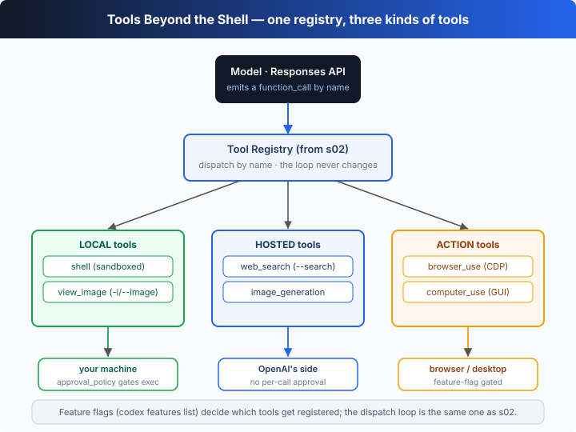

# s25: Shell 之外的内置工具 —— 同一个注册表，三种新工具

[中文](README.md) · [English](README.en.md)

`s01` → ... → [s23](../s23_review_ci_cloud/) → [s24](../s24_plugins_apps_hooks/) → `s25` → [s26](../s26_local_models_providers/) → ... → `s28`
> *"The registry holds far more than a shell"* —— 联网、看图、生成图、驱动浏览器、操作桌面，全是注册进同一张表的工具。
>
> **Harness 层**:Codex 深潜 —— 换的不是 loop，而是「工具箱里到底装了什么」。

---

## 问题

回到 s02，我们造了一个**工具注册表**：按名字分发，里面装着 `read_file`、`write_file`、`apply_patch`、`list_dir`、`shell`——五件工具，全都绕着「读文件 / 改文件 / 跑命令」转。从 s02 到 s20，无论加什么机制，模型能「做」的事始终没跳出你的工作区和那个 shell。

但真实任务经常要**越过工作区的边界**：

1. 「TypeScript 最新版加了什么？」——答案在**网上**，不在你的仓库里。模型总不能靠猜。
2. 「照这张截图把 UI 复刻出来」——输入是**一张图**，模型得先「看见」它。
3. 「给我的发布博客配一张头图」——输出是**一张要生成出来的图**。
4. 「打开这个页面，点进文档，把 API 签名抄下来」——要**驱动一个真浏览器**。
5. 「把桌面那个窗口拖到左边再截个图」——要**操作整个 GUI**。

一个只有 shell 的 agent 对这五件事全都无能为力。问题是：怎么在**不动 s01 那个 loop**的前提下，把这些能力塞给模型？

---

## 解决方案



答案和 s02 一模一样：**还是那张注册表，还是按名字分发**，只是往里注册了更多工具。关键在于——这些新工具不都是「在你机器上跑的本地函数」，它们分**三种**：

| 种类 | 工具 | 真正在哪跑 | 由什么开启 |
|------|------|------------|------------|
| **本地** local | `shell` | 你的机器（沙箱内） | `approval_policy` 把关（见 s03/s04） |
| **本地** local | `view_image` | 读工作区里的图片文件 | `-i`/`--image` 给首条 prompt 附图；agent 可再打开工作区图片 |
| **托管** hosted | `web_search` | **OpenAI 一侧**（Responses 原生工具） | `--search` flag，**无逐次审批** |
| **托管** hosted | `image_generation` | **OpenAI 一侧**（gpt-image） | `features.image_generation`（stable） |
| **动作** action | `browser_use` | 驱动一个**真浏览器**（走 CDP） | `features.browser_use`（+`_external`/`_full_cdp_access`/`in_app_browser`） |
| **动作** action | `computer_use` | 操作你的**桌面 GUI** | `features.computer_use`（stable） |

三类工具的分工：

- **托管工具**：模型发出调用，**OpenAI 在服务端执行**，harness 只负责把结果缝回对话。`web_search` 和 `image_generation` 都属此类——它们不消耗你本机的任何东西。
- **本地工具**：和 s02 一样由 harness 在你机器上跑，`shell` 受审批/沙箱约束；`view_image` 只是把图片读进来给多模态模型「看」。
- **动作工具**：harness 亲自去驱动一个外部目标——浏览器（Chrome DevTools Protocol）或整个桌面（截图 → 模型推理 → 键鼠事件，循环往复）。

**哪些工具被注册，由 feature flag 决定**。用本地真实 CLI 验证（`codex features list`，v0.144.6）：

| feature flag | 阶段 | 默认 | 管什么 |
|--------------|------|------|--------|
| `browser_use` | stable | 开 | 浏览器驱动工具 |
| `browser_use_external` | stable | 开 | 连接外部浏览器 |
| `browser_use_full_cdp_access` | stable | 开 | 放开完整 CDP 访问 |
| `in_app_browser` | stable | 开 | App 内嵌浏览器 |
| `computer_use` | stable | 开 | 桌面 GUI 操作工具 |
| `image_generation` | stable | 开 | 图片生成工具 |
| `standalone_web_search` | **under development** | 关 | 独立的网页搜索（开发中，别当稳定功能用） |
| `web_search_cached` / `web_search_request` | **deprecated** | 关 | 旧的联网开关，已弃用 |
| `search_tool` | **removed** | 关 | 已移除 |

开关方式（真实命令）：`codex features enable <name>` / `codex features disable <name>` 写进 `config.toml`；或一次性 `-c features.<name>=true`、`--enable <FEATURE>` / `--disable <FEATURE>`。

---

## 工作原理

把「扩展工具注册表」翻译成 TypeScript，分步来看：

**第 1 步**：给 s02 的注册表加**元数据**。除了 `name → handler`，再记录每件工具的 `kind`（local / hosted / action）、由什么 gate、以及真实 Codex 里它干什么。分发循环从不读这些字段——它们是给 harness（和本章旁白）用的，正如真实 CLI 用 feature flag 决定「注册哪些工具」。

```ts
interface ToolSpec {
  kind: "local" | "hosted" | "action";
  gatedBy: string;      // 真实开关这个工具的 flag / feature
  note: string;         // 真实 Codex 工具实际做什么
  description: string;  // 给模型看的描述
  parameters: Record<string, unknown>;
  run: (args: Record<string, unknown>) => string; // 教学版执行器
}
```

**第 2 步**：注册一个**托管**工具。`web_search` 的模型可见描述和普通函数工具一样，但 `note` 说清了真相——它在 OpenAI 一侧执行，由 `--search` 开启、无逐次审批。

```ts
reg.register("web_search", {
  kind: "hosted",
  gatedBy: "--search (live web search, no per-call approval)",
  note: "the native Responses `web_search` tool — OpenAI runs the search server-side.",
  description: "Search the live web and return summarized results with citations.",
  parameters: { type: "object", properties: { query: { type: "string" } }, required: ["query"], additionalProperties: false },
  run: ({ query }) => `[simulated web results for "${query}"] …`,
});
```

**第 3 步**：注册一个**动作**工具。`browser_use` 的 `run` 不去执行命令，而是（在真实 Codex 里）通过 CDP 驱动浏览器；教学版返回一句模拟结果。

```ts
reg.register("browser_use", {
  kind: "action",
  gatedBy: "features.browser_use (+_external, _full_cdp_access, in_app_browser)",
  note: "drives a real browser over the Chrome DevTools Protocol: navigate, click, read the DOM.",
  // …navigate/click/read → 模拟的页面快照
});
```

**第 4 步**：分发逻辑**和 s02 一字不差**。注册表按名字找到工具、调它的 `run`、把结果作为 `function_call_output` 缝回线程。旁白只是顺带把元数据打印出来，让你看清「这件工具在哪跑」。

```ts
dispatch(name: string, argsJson: string): string {
  const t = this.tools.get(name);
  if (!t) return `Error: unknown tool ${name}`;
  const args = JSON.parse(argsJson || "{}");
  console.log(`⚙ ${name} [${t.kind} · gated by ${t.gatedBy}]`); // 旁白
  return t.run(args);
}
```

**核心洞察**：s01 的 loop、s02 的「按名字分发」全都原封不动。新增的只是**注册表里的条目变多了，且条目的「执行位置」不再只有本机**——有的在 OpenAI 一侧跑（托管），有的驱动外部目标（动作）。对模型来说它们长得一模一样：都是一个有名字、有 JSON 参数的 function tool。离线 demo 里你能看到模型连续调用 `web_search` → `view_image` → `browser_use` → `image_generation` → `computer_use`，全程没碰一下 shell。

---

## 试一下

> **教学 demo 提示**：本章在系统临时目录造一个 1×1 的真实 PNG（`screenshot.png`）供 `view_image` 打开，并让 `image_generation` 模拟写出一张 `hero.png`。全部发生在临时目录，不碰你的项目。

**无需 API key 也能跑**：离线时脚本化模型按固定脚本依次调用每件内置工具，旁白标注它「真实跑在哪、由什么开启」。

**准备**（首次运行）：

```sh
npm install
cp .env.example .env        # 想跑真实模型就填入 OPENAI_API_KEY 和 MODEL_ID
```

**运行**：

```sh
npx tsx s25_builtin_tools/code.ts                       # 离线 demo
OPENAI_API_KEY=sk-... npx tsx s25_builtin_tools/code.ts # 真实模型（走同一注册表）
```

试试这些实验：

1. 直接跑，看开头列出的「注册表清单」：每件工具的 `kind`（local/hosted/action）和 gate（`--search`、`-i/--image`、`features.*`）。
2. 看模型五次工具调用——注意 `web_search` 和 `image_generation` 标的是 `hosted`（跑在 OpenAI 一侧），`browser_use`/`computer_use` 标的是 `action`（驱动浏览器/桌面），`view_image` 标的是 `local`。
3. 用真实 key 跑一遍：这些工具仍以 function tool 形式暴露给模型，由同一张注册表分发——教学模型只是把「真正执行」换成了模拟。

观察重点：loop 和 s02 的分发函数有没有因为这些新工具而改动一行？「工具很多」和「loop 很简单」是怎么同时成立的？

---

## 接下来

工具箱看明白了——但 `web_search`、`image_generation` 这些托管/动作工具都依赖 OpenAI 的服务端。如果你的模型根本不在 OpenAI 一侧呢？很多人想把 Codex 接到**本地模型**（ollama、lmstudio）或自定义 provider 上，用 `--oss` 跑开源模型。

s26 本地模型与自定义 Provider → 解析 `--oss`、`--local-provider`、`model_providers` 和 `wire_api`，看 harness 怎么把「模型后端」也变成一个可替换的旋钮。

<details>
<summary>深入 Codex 源码</summary>

> 以下基于 OpenAI 开源的 [`openai/codex`](https://github.com/openai/codex) 仓库（`codex-rs`，Rust 实现）的整体结构、官方文档，以及本地安装的 `codex` CLI（v0.144.6）的 `--help` 与 `codex features list` 真实输出。教学版的「带元数据的注册表」是这套多模态/动作工具面的最小骨架。

**教学版的 `ToolRegistry` ≈ 真实 Codex 的工具装配（tool specs + feature gates）。** 下面每一项都是在这个核心上的展开。

<details>
<summary>一、web_search 是 Responses 的托管工具，不是本地函数</summary>

教学版把 `web_search` 注册成普通函数工具，但 `note` 和 `kind: "hosted"` 已点明真相：在真实 Codex 里它是 **Responses API 的服务端托管工具**——模型发出 `web_search` 调用，OpenAI 在后端执行检索并把带引用的结果流回，harness 不在本机跑任何搜索代码。`--search` flag 的真实帮助文本（v0.144.6）写得很明白：*"Enable live web search. When enabled, the native Responses `web_search` tool is available to the model (no per-call approval)"*——「无逐次审批」正因为它不产生本机副作用。`codex exec --json` 的事件流里也能看到 `web_search` 类型的 item（见 s23）。

</details>

<details>
<summary>二、图片输入走多模态，view_image 让 agent 主动看图</summary>

真实 CLI 的 `-i, --image <FILE>...`（帮助文本：*"Optional image(s) to attach to the initial prompt"*）把图片作为多模态输入附到首条 prompt。除此之外 agent 还能用 `view_image` 这类工具在会话中途主动打开工作区里的图片给模型看。教学版用 `view_image` 一个工具同时代表这两条路径（`-i` 附图 + 会话中看图），本质都是「把图片字节读进来，作为模型的视觉输入」。

</details>

<details>
<summary>三、image_generation / browser_use / computer_use 由 feature flag 装配</summary>

`codex features list`（v0.144.6）显示这些工具由稳定 feature flag 控制：`image_generation`、`browser_use`、`browser_use_external`、`browser_use_full_cdp_access`、`in_app_browser`、`computer_use` 均为 stable 且默认开启。这印证了教学版的设计——**注册表在启动时按 feature flag 决定「注册哪些工具」**。`browser_use` 在真实实现里通过 CDP（Chrome DevTools Protocol）驱动一个真浏览器；`computer_use` 则走「截图 → 模型推理 → 键鼠事件」的桌面操作回路。相对的，`standalone_web_search` 还是 under development、`web_search_cached`/`web_search_request` 已 deprecated、`search_tool` 已 removed——本章已在表格里如实标注，别把开发中/已弃用的当稳定功能。

</details>

<details>
<summary>四、开关机制：codex features + -c / --enable</summary>

真实开关这些工具的入口有三个，教学版在表格里都已给出：`codex features enable|disable <name>`（把 `features.<name>=true/false` 写进 `~/.codex/config.toml`）；命令行一次性覆盖 `-c features.<name>=true`；以及可重复的 `--enable <FEATURE>` / `--disable <FEATURE>`（等价于 `-c features.<name>=true/false`）。这套「flag → config → 工具装配」的链路与 s22 讲的配置优先级一致。

</details>

**一句话**：内置工具面不是「更多 shell」，而是**同一张注册表里多了三种执行位置**——本机（受审批/沙箱约束）、OpenAI 一侧（托管，无本机副作用）、外部目标（浏览器/桌面，动作回路）。真实实现的复杂度几乎全在「这些工具真正在哪跑、怎么被 feature flag 装配」，而不是分发逻辑——那部分从 s02 起就没变过。

</details>

<!-- translation-sync: zh@v1, en@v1 -->
