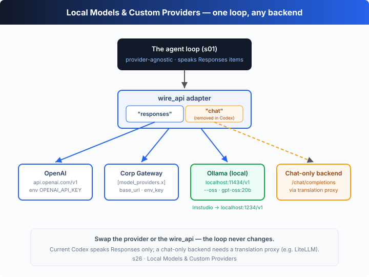

# s26: Local Models & Custom Providers — one loop, any model backend

[中文](README.md) · [English](README.en.md)

`s01` → ... → [s23](../s23_review_ci_cloud/) → [s24](../s24_plugins_apps_hooks/) → [s25](../s25_builtin_tools/) → `s26` → [s27](../s27_codex_service_surfaces/) → `s28`
> *"One loop, any backend"* —— where the model lives is just one more swappable knob on the harness.
>
> **Harness layer**: Codex deep-dive — what changes is not the loop, but "which backend the model points at, and which wire protocol it speaks."

---

## The Problem

From s01 to s25, one hidden assumption was never challenged: **the model lives at OpenAI**. `callModel` hits `api.openai.com`, reads its key from `OPENAI_API_KEY`, and speaks OpenAI's native Responses API.

But in the real world, many people want to tear that assumption down:

1. **Use a local open-source model** — Ollama or LM Studio is running on the machine with a `gpt-oss:20b` inside. No sending code to the cloud, no API bill — just let Codex work with a model on **your own hardware**.
2. **Go through a company gateway** — the company runs a single LLM gateway (`https://llm.corp.example/v1`) that all traffic, auditing, and billing flow through. Codex must point at it, not connect to OpenAI directly.
3. **Plug into a third-party / self-hosted service** — some compatible endpoint that may not speak OpenAI's Responses API at all, only the older Chat Completions.

These three share a common thread: the s01 loop has nothing wrong with it — it only cares about "hand my input items to a backend, get output items back." The question is **how to make "the model backend" itself a swappable knob**: where it points (base_url), what credential it uses (env_key), and which wire protocol it speaks (wire_api). That's not a loop problem — it's the loop's **transport layer**.

---

## The Solution



The key insight in one sentence: **abstract "the model backend" into a provider registry plus a wire_api adapter**. The loop only ever speaks Responses-shaped items; the adapter is the *only* place that knows which HTTP dialect a given backend speaks. Swap the provider, swap the wire_api — the loop doesn't change a single line.

**The two real local paths in the CLI** (verified via `codex --help`):

| flag | what it does |
|------|--------------|
| `--oss` | use an open-source provider (a local model), not OpenAI |
| `--local-provider <lmstudio\|ollama>` | pick which local provider; without `--oss`, uses the config default or an interactive picker |
| `-m, --model <MODEL>` | choose the model — e.g. `gpt-oss:20b` on the local path |

Built-in OSS providers (current Codex speaks the **Responses** wire for both):

| provider | default base_url | notes |
|----------|------------------|-------|
| `ollama` | `http://localhost:11434/v1` | a local Ollama server; defaults to the Responses endpoint in recent versions |
| `lmstudio` | `http://localhost:1234/v1` | local LM Studio; natively supports the Responses API |

**The `model_providers` config table** (`config.toml` — the four knobs of a custom provider):

| key | value | what it does |
|-----|-------|--------------|
| `model_providers.<id>.name` | display name | the provider's name |
| `model_providers.<id>.base_url` | URL | the API root (gateway / self-hosted / local) |
| `model_providers.<id>.env_key` | env var name | which environment variable to read the key from (omittable for local providers) |
| `model_providers.<id>.wire_api` | `responses` | the wire protocol; current Codex **only accepts `responses`** (see below) |

A custom id **may not** reuse the reserved words `openai` / `ollama` / `lmstudio`.

**`wire_api`: responses vs chat — and chat has been removed.** Historically `wire_api` had two values: `responses` (OpenAI-native, `/v1/responses`) and `chat` (the old Chat Completions, `/v1/chat/completions`, used by many gateways and local servers). But in current codex-rs **`chat` has been removed**: setting `wire_api = "chat"` errors with "no longer supported" and points to discussion #7782. In other words **Codex now natively speaks only the Responses API** — the local providers (ollama, lmstudio) have both added Responses endpoints; a backend that **only speaks chat** needs a **translation proxy** in front of it (e.g. LiteLLM) to turn Responses into chat.

**Profiles freeze a provider+model pair into a preset**: write `model_provider = "ollama"` + `model = "gpt-oss:20b"` into `$CODEX_HOME/<name>.config.toml`, then `codex --profile <name>` switches to that backend in one shot (the profile mechanism is covered in s22).

---

## How It Works

Let's translate "a swappable model backend" into TypeScript, step by step:

**Step 1**: the provider registry. Each entry is exactly the four knobs of `model_providers.<id>`, plus a `local` flag (to mark the `--oss` local path). `openai` / `ollama` / `lmstudio` are built-in reserved words.

```ts
interface ModelProviderInfo {
  id: string; name: string; baseUrl: string;
  envKey?: string; wireApi: WireApi; local?: boolean;
}
const REGISTRY: Record<string, ModelProviderInfo> = {
  openai:   { id:"openai", name:"OpenAI", baseUrl:"https://api.openai.com/v1", envKey:"OPENAI_API_KEY", wireApi:"responses" },
  ollama:   { id:"ollama", name:"Ollama (local)", baseUrl:"http://localhost:11434/v1", wireApi:"responses", local:true },
  lmstudio: { id:"lmstudio", name:"LM Studio (local)", baseUrl:"http://localhost:1234/v1", wireApi:"responses", local:true },
};
```

**Step 2**: register a custom provider, enforcing two real rules — reserved words can't be reused, and current Codex only accepts responses.

```ts
function defineProvider(id, p) {
  if (["openai","ollama","lmstudio"].includes(id))
    throw new Error(`provider id "${id}" is reserved`);
  REGISTRY[id] = { id, ...p };
}
// When real Codex loads config: a non-responses wire_api → "no longer supported"
```

**Step 3**: the wire_api adapter — the heart of this chapter. `encodeRequest` translates a canonical Responses-shaped request into the backend's dialect; `decodeResponse` translates it back. The chat path translates both ways: `function_call` → an assistant `tool_calls` message, `function_call_output` → a `role:"tool"` message, and the response's `tool_calls` back into `function_call` items.

```ts
function encodeRequest(p, req) {
  if (p.wireApi === "responses")
    return { url: `${p.baseUrl}/responses`, body: { model, instructions, input, tools } };
  // chat: translate Responses items into chat.completions messages
  return { url: `${p.baseUrl}/chat/completions`, body: { model, messages: toChat(req), tools: toChatTools(req.tools) } };
}
function decodeResponse(p, raw) {
  if (p.wireApi === "responses") return raw.output;
  const msg = raw.choices[0].message;            // chat → translate back to Responses items
  return [...(msg.tool_calls ?? []).map(toFunctionCall), ...(msg.content ? [toMessage(msg.content)] : [])];
}
```

**Step 4**: the agent loop — provider-agnostic, one line unchanged. It only calls `callProvider(p, …)` and gets canonical items back, with no idea whether it's hitting OpenAI, a company gateway, local ollama, or a chat-only backend.

```ts
async function agentLoop(p, task) {
  const input = [{ role: "user", content: task }];
  for (let step = 0; step < 8; step++) {
    const output = await callProvider(p, { model, instructions, input, tools }); // ← the only place that touches transport
    input.push(...output);
    const calls = output.filter((i) => i.type === "function_call");
    if (calls.length === 0) { /* print the final message */ return; }
    for (const call of calls) input.push({ type: "function_call_output", call_id: call.call_id, output: runShell(parse(call).command) });
  }
}
```

**Core insight**: the offline demo runs the **same task** across four providers — openai, a corp gateway, local ollama, and legacy-chat — and **prints each wire request**. You watch the URL and body shape change with the dialect (`/responses` carrying `input`, `/chat/completions` carrying `messages`) while the loop, the tool, and the task above it stay **identical every single time**. The chat path makes the point especially well: the adapter translates Codex's Responses calls into chat — which is exactly what a "translation proxy" (LiteLLM) does, and what older Codex did before chat was removed. What changes is never the loop — it's **which backend it points at, and which dialect it speaks**.

---

## Try It

> **Teaching-demo note**: this chapter **talks to no real backend** — the local / custom / chat providers are all simulated by built-in "dialect-aware" scripted backends. It does really `echo` a command to prove the loop really executes tools, but it touches no files and sends no network requests. When `OPENAI_API_KEY` is set, only the openai path goes to the real Responses API.

**No API key needed**: scripted backends drive the loop through all four providers, printing each wire request.

**Setup** (first run):

```sh
npm install
cp .env.example .env        # fill in OPENAI_API_KEY and MODEL_ID to hit real OpenAI
```

**Run**:

```sh
npx tsx s26_local_models_providers/code.ts                          # offline demo: four providers, one task
OPENAI_API_KEY=sk-... npx tsx s26_local_models_providers/code.ts    # the openai path hits the real API
```

Try these experiments:

1. Just run it and compare the four blocks: openai / corp hit `/responses` with `input` in the body; legacy-chat hits `/chat/completions` with `messages`. The URL and shape change; the loop doesn't.
2. Look at the ollama block: the model auto-switches to `gpt-oss:20b` and the base_url is `localhost:11434` — a "local model, no OpenAI involved" path.
3. Note the line at the top of the legacy-chat block: `[real codex] wire_api = "chat" is no longer supported…` — that's the real error current Codex raises when loading config; the chat adapter in the demo plays the role of a "translation proxy."

What to watch: across the four blocks, are the `$ echo …` and the final "Served by …" lines structurally identical? Which two lines are the only things that change (`POST <url>` and the body shape)?

---

## What's Next

The model backend is swappable now — `--oss` points at local, `model_providers` points at a gateway, wire_api handles the dialect. But so far everything we've touched has been "the CLI process": type a command, read the output. Real Codex has another face — **being driven as a service by other programs**: `codex mcp-server` turns Codex itself into an MCP server, `codex app-server` / `exec-server` expose socket services, and the desktop app and IDE plugins all connect to the same kernel.

s27 Codex as a Service → how the harness goes from "a CLI" to "a set of remotely-drivable services."

<details>
<summary>Into the Codex source</summary>

> The following is based on the overall architecture of OpenAI's open-source [`openai/codex`](https://github.com/openai/codex) repo (`codex-rs`, the Rust implementation), the official docs, and the `--help` / `codex features list` output of the locally installed `codex` (v0.144.6). The teaching version's "provider registry + wire_api adapter" is the minimal skeleton of this mechanism.

**The teaching `REGISTRY` + `encodeRequest`/`decodeResponse` ≈ real Codex's `ModelProviderInfo` and client construction.** Each item below expands on — and verifies — that core.

<details>
<summary>1. --oss / --local-provider: the built-in local providers</summary>

`--oss` ("Use open-source provider") and `--local-provider <lmstudio|ollama>` are real flags in `codex --help`. codex-rs builds in two OSS providers — `ollama` (default `http://localhost:11434/v1`) and `lmstudio` (default `http://localhost:1234/v1`) — and you can set a default with `oss_provider = "ollama"` in config.toml. There was once a separate `ollama-chat` provider that spoke Chat Completions; it has **been removed** — both local providers now default to the Responses endpoint. The teaching version writes them straight into `REGISTRY` with `local:true`, matching this "built-in local backend" design.

</details>

<details>
<summary>2. wire_api: the responses-only turn, and chat's removal</summary>

`wire_api` is defined by the `WireApi` enum in codex-rs's `model-provider-info` crate. **Historically** it had `Responses` and `Chat` variants; the current version **keeps only `Responses`**. Setting `wire_api = "chat"` produces the hard error "`wire_api = "chat"` is no longer supported. How to fix: set `wire_api = "responses"`" (pointing to discussion #7782; chat was deprecated in Dec 2025 and removed in Feb 2026). The teaching version keeps the chat adapter and prints this real error to demonstrate the "translation proxy" role — in reality a chat-only backend relies on a proxy like LiteLLM to translate Responses into chat; Codex itself no longer does this.

</details>

<details>
<summary>3. The full ModelProviderInfo field set</summary>

Beyond the `name`/`base_url`/`env_key`/`wire_api` the teaching version shows, the real `ModelProviderInfo` carries network details like `request_max_retries` (default 4), `stream_max_retries` (default 5), `stream_idle_timeout_ms`, `http_headers`, `env_http_headers`, and `query_params`. A custom provider id **may not** reuse the reserved words `openai` / `ollama` / `lmstudio`. These were all verified in s22's config deep-dive, and this chapter reuses the same conclusions.

</details>

<details>
<summary>4. Profiles and the boundary of project-level config</summary>

`--profile <name>` layers `$CODEX_HOME/<name>.config.toml` on top of the base config, and a preset can set `model_provider` + `model` to switch to a backend in one shot (e.g. a "local ollama" preset). Note the boundary: **project-level** `.codex/config.toml` **cannot** set provider-routing keys (`model_provider`, `model_providers`, `oss_provider`, etc.) — those only live in the user-level `~/.codex/config.toml`. In other words, "which backend the model points at" is a machine-level decision; a project has no say.

</details>

**In one sentence**: local models, company gateways, and third-party endpoints are not new agents — they're the same loop with a different "transport layer." Almost all the complexity in the real implementation is engineering — default ports for built-in providers, the responses-only turn of wire_api, provider retries/headers/query params, and the boundary between profiles and project-level config — not the loop itself. Once you internalize "a registry plus a dialect-translating adapter, with the loop unchanged," you've seen through the whole mechanism.

</details>

<!-- translation-sync: zh@v1, en@v1 -->
