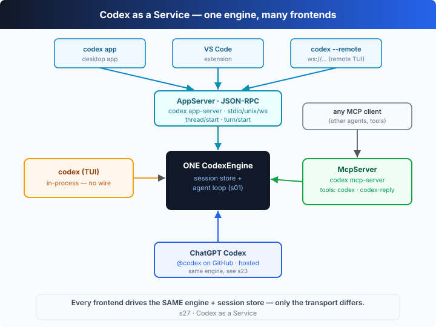

# s27: Codex as a Service 与其他形态 —— 一个引擎，许多前端

[中文](README.md) · [English](README.en.md)

`s01` → ... → [s26](../s26_local_models_providers/) → [s27](../s27_codex_service_surfaces/) → [s28](../s28_sessions_sandbox_safety/)
> *"One engine, many frontends"* —— 同一个 agent loop，既能在你终端里跑，也能作为服务被远程驱动、被当作工具调用。
>
> **Harness 层**:Codex 深潜 —— 换的不是 loop,而是「这个 loop 住在哪个进程里、隔着哪种传输被谁驱动」。

---

## 问题

s21 看过 `codex` 二进制的「许多扇门」——`exec`、`review`、`resume`……但那些门都开在**你自己的终端**里：你敲命令，loop 在你眼前这个进程里跑。真实世界很快提出三个新需求：

1. **让别的程序来驱动 Codex**——VS Code 扩展想在编辑器里开一个会话；一个远程 TUI 想连到另一台机器上的 Codex；它们都不该重造一个 agent，而该「接进」一个已经在跑的引擎。
2. **让 Codex 变成一个工具**——另一个 agent（比如 Claude、或你自己的编排脚本）想把「跑一个 Codex 任务」当成一次工具调用，拿到 thread id，再继续追问。这时 Codex 不再是驱动者，而是**被调用者**。
3. **让 Codex 脱离终端形态**——一个桌面 App、一个 IDE 插件、甚至 ChatGPT 网页版和 GitHub 上的 `@codex`，它们看起来千差万别。

如果每种形态都重写一套 agent，那是维护灾难。问题是：**怎么把同一个引擎 + 同一个会话存储，暴露成进程边界、网络边界之外的多种前端，让它们全部收敛回 s01 那一个 loop？**

---

## 解决方案



关键洞察一句话：**引擎只有一个，前端可以有很多**。把「agent loop + 会话存储」做成一个 `CodexEngine`，再在它前面架几种**传输/协议**——进程内直连、JSON-RPC（app-server）、MCP（mcp-server）——每种前端只是选了其中一条路进来。loop 本身一行不改。

真实 Codex（v0.144.x）把这些前端都装在同一个引擎上：

| 前端 | 真实命令 / 入口 | 传输 | 它是… |
|------|----------------|------|-------|
| TUI / CLI | `codex`、`codex exec` | 进程内（无传输） | 直接驱动引擎 |
| 远程 TUI | `codex --remote ws://host:port` | websocket | 把 TUI 接到远端 app-server |
| 桌面 App | `codex app [PATH]` | app-server 协议 | 官方桌面前端 |
| VS Code 扩展 | （编辑器内） | app-server 协议 | 第一方 IDE 前端 |
| app-server | `codex app-server --listen <URL>` `[experimental]` | stdio/unix/ws | 把引擎作为**服务**跑 |
| remote-control | `codex remote-control start\|stop\|pair` `[experimental]` | 带遥控的 app-server | 守护进程 + 配对码 |
| exec-server | `codex exec-server --listen <URL>` `[EXPERIMENTAL]` | ws（默认）/stdio | 独立执行服务 |
| Codex 作为工具 | `codex mcp-server` | MCP（stdio） | 引擎**被调用**，暴露成工具 |
| 托管形态 | ChatGPT Codex · GitHub `@codex` | 托管云 | 同一引擎，跑在云端（见 s23） |

**`codex mcp-server` 把引擎变成工具**（已对本机 CLI 实测）：服务器名 `codex-mcp-server`，恰好暴露两个工具——`codex`（开一个会话并跑）和 `codex-reply`（凭 thread id 继续追问）。于是任何 MCP 客户端都能「调用 Codex」。

**`codex app-server` 把引擎变成服务**：`--listen` 选传输（`stdio://` 默认、`unix://PATH`、`ws://IP:PORT`、`off`），客户端用 JSON-RPC 调 `thread/start` 开线程、`turn/start` 跑一轮，进度以 `*/started`、`item/completed` 通知流回。桌面 App、VS Code 扩展、远程 TUI 都是这一个协议的客户。

---

## 工作原理

把「一个引擎，许多前端」翻译成 TypeScript。核心是 `CodexEngine`（会话存储 + s01 loop + 事件发射），然后三个前端各自接进来。

**第 1 步**：`CodexEngine`——一张 `Map` 存所有 thread，`prompt()` 就是 s01 那个 loop（调模型 → 跑工具 → 喂回去），只是每走一步就 `emit` 一个事件。事件名沿用 `codex exec --json` 的点分风格（s23）。

```ts
class CodexEngine {
  private sessions = new Map<string, Session>();
  private listeners = new Set<Listener>();
  on(l: Listener) { this.listeners.add(l); return () => this.listeners.delete(l); }
  private emit(ev: EngineEvent) { for (const l of this.listeners) l(ev); }

  newThread(cfg: Partial<ThreadConfig> = {}, cwd?: string): Session { /* …建 thread 存进 Map… */ }

  async prompt(id: string, text: string): Promise<string> {
    const s = this.get(id);
    if (s.turns === 0) this.emit({ type: "thread.started", threadId: id });
    this.emit({ type: "turn.started", threadId: id });
    // …s01 loop：callModel → 跑 function_call → 喂回 thread…
    this.emit({ type: "item.completed", threadId: id, item: { type: "agent_message", text: finalText } });
    this.emit({ type: "turn.completed", threadId: id, usage: {…} });
    return finalText;
  }
}
```

**第 2 步**：门 1——CLI/TUI，进程内直连。它 `newThread` 后订一眼引擎事件，把工具调用和最终消息渲染成文字。**没有任何传输**，直接调 `engine.prompt()`。

```ts
function attachCli(engine: CodexEngine) {
  return { async run(task, cfg = {}) {
    const s = engine.newThread(cfg);
    const off = engine.on((ev) => { /* 只渲染本 thread 的 item.completed */ });
    try { return await engine.prompt(s.id, task); } finally { off(); }
  } };
}
```

**第 3 步**：门 2——app-server，隔着一条「线」。客户端 `connect` 后拿到一个 `request(method, params)`；引擎的点分事件被翻译成 app-server 的斜杠通知（`thread.started`→`thread/started`、`item.completed`→`item/completed`……）。请求方法用真实 v2 协议名：`thread/start` 开线程、`turn/start` 在指定 thread 上跑一轮。

```ts
class AppServer {
  constructor(private engine: CodexEngine) {}
  connect(notify) {
    // 引擎事件（exec 点分）→ app-server 通知（v2 斜杠）
    const close = this.engine.on((ev) => notify(ev.type.replace(".", "/"), ev));
    return { close, request: (m, p = {}) => this.dispatch(m, p) };
  }
  private async dispatch(method, p) {
    switch (method) {
      case "thread/start": { const s = this.engine.newThread(p.config ?? {}, p.cwd);
                             return { thread: { id: s.id }, model: s.model, cwd: s.cwd, sandbox: s.sandbox }; }
      case "turn/start":   return this.engine.prompt(String(p.threadId), String(p.input));
      // …initialize…
    }
  }
}
```

注意 `turn/start` 和「继续一个 thread」是**同一个**引擎调用——在真实协议里也没有单独的 `thread/prompt`/`thread/reply`，续聊就是对同一 `threadId` 再来一次 `turn/start`。

**第 4 步**：门 3——`codex mcp-server`，引擎变成被调用者。`toolsList()` 返回那两个真实工具；`toolsCall("codex", …)` 开新 thread 跑一个任务、`toolsCall("codex-reply", …)` 凭 `threadId` 在**已存在的 thread** 上续跑。

```ts
class McpServer {
  constructor(private engine: CodexEngine) {}
  toolsList() {
    return [
      { name: "codex", description: "Run a Codex session. …" },
      { name: "codex-reply", description: "Continue a Codex conversation by providing the thread id and prompt." },
    ];
  }
  async toolsCall(name, args) {
    if (name === "codex")       { const s = this.engine.newThread(cfgFrom(args), args.cwd);
                                  return { threadId: s.id, text: await this.engine.prompt(s.id, args.prompt) }; }
    if (name === "codex-reply") { const id = String(args.threadId ?? args.conversationId);
                                  return { threadId: id, text: await this.engine.prompt(id, args.prompt) }; }
  }
}
```

**核心洞察**：整个 demo 的「点题」在最后一行——MCP 门用 `codex-reply` 去续的，是 **CLI 门（Door 1）刚开的那个 thread**（`thr_1`）。三个前端（进程内 CLI、隔线的 app-server、被调用的 mcp-server）共用同一个 `CodexEngine` 和同一份会话存储，所以谁都能接着谁的会话往下跑。**变的从来不是 loop，而是「loop 住在哪个进程、隔着哪种传输、被谁驱动」**。离线 demo 里你能看到：`thread=thr_1` 先被 CLI 推进到 4 个 item，再被 MCP 推进到 6 个——证明它真的是同一个引擎、同一条 thread。

---

## 试一下

> **教学 demo 提示**：代码只在系统临时目录（`os.tmpdir()`）造一个带 `README.md`/`app.ts 的「工作区」，不碰你的项目。

**无需 API key 也能跑**：本章是**自运行演示**，没有 REPL。没有 `OPENAI_API_KEY` 时用内置脚本化模型驱动 loop——它会先跑一条 shell，再回一条**自报 thread id、轮次、model/sandbox/approval** 的消息，让你看清每扇门的设置都进了同一个引擎。

**准备**（首次运行）：

```sh
npm install
cp .env.example .env        # 想跑真实模型就填入 OPENAI_API_KEY 和 MODEL_ID
```

**运行**：

```sh
npx tsx s27_codex_service_surfaces/code.ts                       # 离线 demo：三扇门驱动同一引擎
OPENAI_API_KEY=sk-... npx tsx s27_codex_service_surfaces/code.ts # 真实模型
```

试试这些实验：

1. 直接跑，看三扇门各自打印的 `[offline demo]` 行：门 1 是 `sandbox=workspace-write`、门 2 被 `thread/start` 配成 `sandbox=read-only`、门 3 的 `codex` 工具传了 `approval-policy=never`——**同一引擎，各自带配置**。
2. 盯住最后一步：`codex-reply` 续的是 `thr_1`（门 1 开的 thread），它的「turn 2、6 个 item」证明会话存储是共享的。
3. 用真实 key 跑一遍：引擎、三个前端、事件流一字未改，只是 `callModel` 换成了真的 Responses 调用——`codex-reply` 续会话的行为不变。

观察重点：门 2 里 `turn/start` 和「续聊」为什么是同一个方法？把 `codex-reply` 的 `threadId` 改成 `thr_2`（门 2 开的）会怎样？

---

## 接下来

到这里，Codex 的「形态学」就齐了：s21 的 CLI 门、s23 的无人值守 review/CI/云、本章的服务化前端——它们全都收敛回 s01 那一个 loop。但有一个话题被我们一路绕开了：**当引擎可以被远程驱动、被别的 agent 调用时，「它能动哪些文件、哪些命令要人来批」这条安全边界怎么守？**

s28 会话、沙箱与安全进阶 → 把 `resume`/`fork`/`archive` 的会话生命周期、`codex sandbox`、`--add-dir`、bypass 模式、guardian 审批、trusted projects、feature flags 一次讲清。想回到起点重看那个 30 行的 loop，就去 [s01](../s01_agent_loop/)。

<details>
<summary>深入 Codex 源码</summary>

> 以下基于 OpenAI 开源的 [`openai/codex`](https://github.com/openai/codex) 仓库（`codex-rs`，Rust 实现）的整体结构，以及本机安装的 `codex` CLI（v0.144.6）的 `codex <sub> --help`、`codex features list`、`codex app-server generate-json-schema` 的真实输出。教学版的「`CodexEngine` + 三个前端」就是这套服务化表面的最小骨架；差异在工程细节与托管部分的闭源实现。

**教学版的 `CodexEngine` ≈ codex-rs 的核心会话内核；三个前端 ≈ 真实的 TUI / app-server / mcp-server 三条入口。** 下面每一项都是在这个核心上的展开。

<details>
<summary>一、mcp-server：两个工具，引擎是被调用者（已实测）</summary>

教学版的 `McpServer` 精确对应真实的 `codex mcp-server`（stable，非实验）。本机实测：服务器 `codex-mcp-server` 恰好暴露 `codex` 与 `codex-reply` 两个工具。`codex` 的输入键为 `prompt`、`model`、`cwd`、`sandbox`、`approval-policy`、`config`、`base-instructions`、`developer-instructions`、`compact-prompt`（即「接受一份 Codex Config」）；`codex-reply` 的输入键为 `threadId`/`conversationId` 与 `prompt`。这与教学版逐字一致——它让任何 MCP 客户端把「跑一个 Codex 任务」当成一次工具调用，返回 thread id 供后续 `codex-reply` 追问。方向反过来了：引擎不再驱动别人，而是被驱动。

</details>

<details>
<summary>二、app-server：一个 JSON-RPC 协议，许多第一方客户</summary>

教学版的 `AppServer` 对应真实的 `codex app-server`（标记 `[experimental]`）。要点和教学版一致——`--listen` 选传输（`stdio://` 默认、`unix://PATH`、`ws://IP:PORT`、`off`），客户端走 JSON-RPC。真实协议的方法名由 `codex app-server generate-json-schema --out <DIR>` 生成（另有 `generate-ts` 生成 TypeScript 绑定）：核心是 `thread/start`（开线程）与 `turn/start`（跑一轮），进度以 `thread/started`、`turn/started`、`item/completed`、`turn/completed` 等通知流回；还有 `thread/resume`、`thread/fork`、`thread/archive` 等一整套线程生命周期方法（见 s28）。教学版把「点分事件 → 斜杠通知」的映射画了出来，真实的 `turn/start` 会立即 ack、再用通知流式吐出增量，教学版为清晰起见效 awaits 整个轮次。桌面 App（`codex app`）与 VS Code 扩展正是这一个协议的第一方客户。

</details>

<details>
<summary>三、remote-control / exec-server / --remote：守护进程与远程附着</summary>

`codex remote-control`（`[experimental]`，子命令 `start`/`stop`/`pair`）是「带遥控能力的 app-server 守护进程」，用短时配对码（`pair`）把远端客户接进来；`codex app-server daemon`（`start`/`restart`/`enable-remote-control`/`stop`/`version`/`bootstrap`）负责这个本地守护进程的生命周期。`codex exec-server`（`[EXPERIMENTAL]`）是一个独立执行服务，`--listen` 默认 `ws://IP:PORT`，还能用 `--remote <URL>` 把自己**注册成一个远程执行环境**。而顶层的 `codex --remote <ADDR>`（接受 `ws://`、`wss://`、`unix://`）则把本地 TUI **附着**到这样一个远程 app-server——正是教学版「门 2」的真实形态。这些子命令都还在 experimental 阶段，名字与行为可能变。

</details>

<details>
<summary>四、托管形态：ChatGPT Codex 与 GitHub @codex</summary>

ChatGPT 里的 Codex、以及 GitHub 上 PR/issue 里 `@codex` 的集成，是 **OpenAI 托管的服务**，其内部不在开源 `codex-rs` 里。但论点不变：它们驱动的是**同一个引擎**——在隔离云环境里跑 s01 那个 loop，把结果作为 PR 评论 / diff 交回（s23 的 Codex Cloud 就是这条线）。教学版没有单独造一个「云前端」，因为 s23 已经把「同一 loop 搬到别人的容器里跑」讲透了；本章的要点是「托管前端」与「本地前端」共享同一套引擎语义。

</details>

**一句话**：桌面 App、VS Code 扩展、远程 TUI、MCP 工具、托管云——没有一个是新的 agent。真实实现的复杂度几乎全在「传输与协议」侧——JSON-RPC 的方法集、websocket 鉴权、守护进程配对、MCP 握手——而不是 loop 本身。吃透「一个引擎 + N 种传输，loop 不变」这一条，这套服务化表面就看懂了。

</details>

<!-- translation-sync: zh@v1, en@v1 -->
