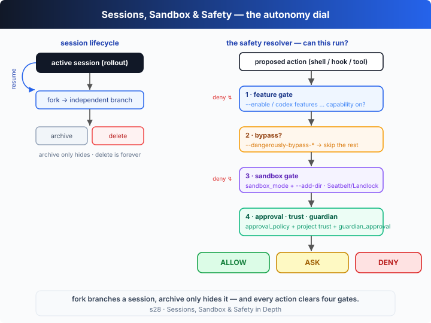

# s28: Sessions, Sandbox & Safety in Depth — the lifecycle + the autonomy dial

[中文](README.md) · [English](README.en.md)

`s01` → ... → [s23](../s23_review_ci_cloud/) → ... → [s27](../s27_codex_service_surfaces/) → `s28`
> *"One dial from 'ask me everything' to 'just run it'"* — safety is not a single switch but a "may this run?" decision stacked out of four gates.
>
> **Harness layer**: Codex deep-dive — what changes is not the loop, but "how many gates an action must clear before it may run."

---

## The Problem

In Part I we took the loop apart; across Part II we've come a long way: s21 covered the command surface, s22 parsed every knob in `config.toml`, and s23 showed the loop running unattended in review, CI, and the cloud. But two questions have been hanging:

1. **Where do sessions go when they end?** The session you left half-finished at midnight, the experiment you abandoned last week — they didn't vanish; they're all rollouts persisted to disk. The question is: how do you pick one back up (`resume`)? How do you branch off a good state to try something risky without wrecking the original (`fork`)? How do you put the seldom-used ones away without deleting them (`archive`)? When do you actually delete (`delete`)? Without a clear lifecycle model, dozens of sessions quickly become a tangled mess.

2. **Is "letting it run" one act, or a chain of decisions?** On one end is total caution — approving every command by hand; on the other is `--dangerously-bypass-approvals-and-sandbox` — ask nothing, and skip the sandbox too. In between lies a wide spectrum: a read-only sandbox, a writable workspace, `--add-dir` for extra room, whether to enable experimental features, whether this project is trusted, whether to add a guardian re-review. **Real Codex collapses this continuum into "one action + one set of config → one allow / ask / deny" verdict.** The question is: in what order do these gates — feature flag, bypass, sandbox, approval/trust — stack, and how do they combine into a single decision?

These two questions are really one: **autonomy is not on-or-off, it's a dial.** The session lifecycle governs "which conversation lives on"; the safety resolver governs "may this action run." This chapter teaches both.

---

## The Solution



**First: the session lifecycle.** Every run is a persisted rollout (the `.jsonl` of s09), and the CLI gives it a set of management commands. The key distinctions: `fork` **branches** (the source session is untouched, the copy evolves independently), `archive` only **hides** (the rollout stays on disk, still visible via `--all`), and only `delete` is **permanent**.

| Command | What it does | Key point |
|---------|--------------|-----------|
| `codex resume [--last\|<SESSION>] [PROMPT]` | Reload a session and continue | Picker by default; `--last` continues the most recent; `--all` disables cwd filtering |
| `codex fork [--last\|<SESSION>] [PROMPT]` | **Branch** a session | Copies a new session with full history, `parentId` pointing at the source; the source is unaffected |
| `codex archive <SESSION>` | Archive (hide) | Just sets a flag, hides it from the default picker; **does not delete data** |
| `codex unarchive <SESSION>` | Unarchive | Makes it visible again |
| `codex delete <SESSION>` | **Permanently delete** | The only irreversible operation |
| The `<SESSION>` arg | UUID or session name | **UUID takes precedence**: if it parses as a UUID it matches by id, else by name |

**Second: the safety resolver.** Before it executes, every action (shell command / hook / tool call) clears four gates **in a fixed order**; any gate can `deny` outright, and only after all pass does "must a human say yes?" come into play:

| Gate | Controlled by | Real switch | If not satisfied |
|------|---------------|-------------|-------------------|
| 0 · hook trust | Project trust / persisted hook trust | `[projects."<path>"]` · `--dangerously-bypass-hook-trust` | `deny` (a hook is code from config; it needs trust first) |
| 1 · feature gate | Whether the feature is in effect | `--enable/--disable <FEATURE>` · `codex features enable\|disable` | `deny` (the capability is off) |
| 2 · total bypass | One flag to skip sandbox+approval | `--dangerously-bypass-approvals-and-sandbox` | If set, `allow` directly (extremely dangerous) |
| 3 · sandbox gate | Physical FS/network boundary | `-s, --sandbox <MODE>` · `--add-dir <DIR>` | `deny` (out of bounds; physically refused) |
| 4 · approval/trust/guardian | Must a human say yes | `-a, --ask-for-approval <POLICY>` · project trust · `guardian_approval` | `ask` (escalate) or `allow` |

**The three `sandbox_mode`s (`-s, --sandbox`)** (the real backend is Seatbelt on macOS / Landlock on Linux, see s04):

| Mode | Writes | Network | In one line |
|------|--------|---------|-------------|
| `read-only` | all refused | refused | look but don't touch |
| `workspace-write` | allowed inside the workspace + `--add-dir` roots | off by default | the default working mode |
| `danger-full-access` | unbounded | unbounded | no sandbox boundary |

**`approval_policy` (`-a, --ask-for-approval`)**: the CLI's `-a` accepts `untrusted` / `on-request` / `never`; the `approval_policy` in `config.toml` adds `on-failure`.

| Policy | Meaning |
|--------|---------|
| `untrusted` | Only "trusted" read-only commands (`ls`/`cat`/`sed`…) run without asking; anything the model proposes beyond that escalates to the user |
| `on-request` | The model decides when to ask for approval |
| `on-failure` | Run first, ask only **on failure** (config file only) |
| `never` | Never ask; execution failures are returned to the model immediately |

**The two `dangerously` bypasses (why they're dangerous)**: they are not "more convenient" — they **tear down guardrails the harness built for you**, and should only be used where "the external environment is already sandboxed" (an ephemeral container, a CI runner).

| Flag | What it skips | Real warning text |
|------|---------------|-------------------|
| `--dangerously-bypass-approvals-and-sandbox` | all confirmation prompts + the sandbox | "Skip all confirmation prompts and execute commands without sandboxing. EXTREMELY DANGEROUS. Intended solely for running in environments that are externally sandboxed." |
| `--dangerously-bypass-hook-trust` | the persisted-trust requirement for hooks | "Run enabled hooks without requiring persisted hook trust for this invocation. DANGEROUS." |

**`guardian_approval` (an extra approval layer)**: this is a stable feature (`guardian_approval = stable, true` in `codex features list`). It adds a **second reviewer** on top of the approval policy — even if `approval_policy=never` would have allowed it, a risky action is still forced back to `ask`.

**Feature flags are the master switch for experimental capabilities**: `codex features list` shows each feature's "stage + effective state"; `codex features enable/disable <FEATURE>` writes it into `config.toml` (equivalent to `-c features.<name>=true/false`, and to the CLI's `--enable/--disable <FEATURE>`). Verified on v0.144.6: `browser_use`, `computer_use`, `image_generation`, `goals`, `hooks`, `guardian_approval`, `fast_mode`, `apps`, `code_mode_host` are all `stable`; **`memories` is `experimental` (off by default)**, as are `network_proxy` and `prevent_idle_sleep`; and a batch is `under development`. The earlier the stage, the more explicitly you must opt in.

**Trust comes in two layers**: `[projects."<path>"]` with `trust_level = trusted/untrusted` marks a whole project/worktree (a trusted project also loads project-level `.codex/config.toml`, but that cannot override machine-level provider/auth/telemetry keys); **hook trust** is a separate layer — a hook is code defined in config, so it only runs given project trust or persisted hook trust, else it's refused, and `--dangerously-bypass-hook-trust` skips that temporarily.

---

## How It Works

Let's translate both into TypeScript.

**Step 1**: a session record plus a store that resolves "UUID first, then name." `archived` is just a visibility flag; `parentId` records the fork origin.

```ts
interface SessionRec {
  id: string;             // a UUID in real Codex; a short id stands in here
  name: string; cwd: string; createdAt: number;
  parentId: string | null; // points at the source on fork
  archived: boolean;       // archived = hidden from the picker, not deleted
  turns: string[];         // the rollout: one entry appended per completed turn
}
```

**Step 2**: the lifecycle operations. `fork` copies the full history into an independent copy (the source is untouched); `archive`/`unarchive` only flip a flag; `delete` actually removes it.

```ts
fork(idOrName: string, prompt?: string): SessionRec | undefined {
  const src = this.find(idOrName);
  if (!src) return undefined;
  const copy: SessionRec = {
    id: this.newId(), name: `${src.name}-fork`, cwd: src.cwd, createdAt: Date.now(),
    parentId: src.id, archived: false, turns: [...src.turns], // shared history, then diverge
  };
  if (prompt) copy.turns.push(`user: ${prompt}`);
  this.byId.set(copy.id, copy);
  return copy;
}
// resume appends a turn; setArchived only flips the archived flag; remove is the permanent delete.
```

**Step 3**: the resolver's inputs — a `SafetyConfig` (gathering the switches for all four gates) and an `Action` to judge.

```ts
interface SafetyConfig {
  sandboxMode: SandboxMode;      // -s, --sandbox
  approval: ApprovalPolicy;      // -a, --ask-for-approval (config also allows on-failure)
  projectTrust: Trust;           // [projects."<path>"].trust_level
  hookTrustPersisted: boolean;
  bypassApprovalsAndSandbox: boolean; // --dangerously-bypass-approvals-and-sandbox
  bypassHookTrust: boolean;           // --dangerously-bypass-hook-trust
  guardianApproval: boolean;          // features.guardian_approval — an extra approval layer
  workspace: string; addDirs: string[]; // primary workspace + --add-dir
  features: Record<string, { stage: FeatureStage; enabled: boolean }>;
}
interface Action { kind: "shell" | "hook"; command: string;
  writesTo?: string; network?: boolean; needsFeature?: string; }
```

**Step 4**: `canRun` — the heart of the chapter. Four gates run in order; any `deny` returns immediately; only then do approval/trust/guardian decide `allow` vs `ask`.

```ts
function canRun(cfg: SafetyConfig, a: Action): Decision {
  // Gate 0 · hook trust: --dangerously-bypass-hook-trust allows outright; else need trusted project or persisted trust
  // Gate 1 · feature gate: a.needsFeature not in effect → deny (suggest codex features enable)
  // Gate 2 · total bypass: bypassApprovalsAndSandbox → allow directly (skips sandbox & approval, extremely dangerous)
  // Gate 3 · sandbox gate: read-only refuses all writes/network; workspace-write refuses writes outside workspace+addDirs and network by default; danger-full-access has no boundary
  // Gate 4 · approval/trust: never→allow · on-failure→run first · untrusted→only trusted read-only cmds else ask · on-request→ask if risky
  //   then two layers: guardian_approval forces a risky allow back to ask; an untrusted project never auto-runs a write/network action
}
```

**The core insight**: safety is not a single allow/deny switch but **a prioritized decision pipeline**. Order matters — the feature gate comes first (if the capability is off, the sandbox never even comes up); the total bypass is right after (its whole purpose is to short-circuit everything downstream); the sandbox precedes approval (a physical boundary is harder than "should we ask," so an out-of-bounds write is denied without bothering to ask); approval and trust sit at the bottom (deciding whether to escalate an otherwise-runnable action to a human). guardian_approval and untrusted-project are two "fuses" pinned at the end, ensuring no path lets a risky action through silently. In the offline demo you can watch line by line: the same `tee /etc/hosts` is `deny` by default but `ask` once you add `--add-dir /etc`; the same `rm -rf build` is `allow` under `never` but flips to `ask` the moment guardian is on.

---

## Try It

> **Teaching demo note**: this chapter is purely in-memory — the session store and the safety resolver are simulated in-process. It touches neither your filesystem nor any real command.

**No API key needed**: this chapter's mechanism is deterministic (a store + a policy resolver) and **needs no model**, so it runs fully offline with zero network calls. `main()` is a self-running narrated demo that first walks the five lifecycle operations, then runs a safety-verdict matrix of "same config, different action / same action, different config."

**Setup** (first run):

```sh
npm install
```

**Run**:

```sh
npx tsx s28_sessions_sandbox_safety/code.ts
```

Try these experiments:

1. Just run it and watch Part 1: after `fork` the source's `turns` are unchanged while the copy gains one; after `archive` it disappears from the default list but is still in `list(true)`; after `delete` it's gone even from `--all`.
2. Watch the "same `tee /etc/hosts`" trio in Part 2: `deny` by default → `ask` after adding `--add-dir /etc`. Then contrast "memories off → `deny`" vs "after `enable` → allowed."
3. Edit the `base` config in `code.ts` (e.g. set `approval` to `untrusted`, `sandboxMode` to `read-only`), re-run, and watch which actions drop from `allow` to `ask` and which go straight to `deny`.

What to watch: the `reasons` array returned by `canRun` records, line by line, "which gate, based on which switch" made the call — exactly the explanation real Codex should give you when it refuses or asks.

---

## What's Next

That completes the Part II deep-dives: from s21's command surface, s22's `config.toml`, s23's unattended surface, to this chapter's "session lifecycle + autonomy dial." You've now seen Codex's two faces — **to the user** it's a set of subcommands and slash commands, **to safety** it's a decision pipeline gated at every layer.

If this is your finish line, go back to the start and assemble **your own** agent from s01 through here: take the 30-line loop of [s01](../s01_agent_loop/) as the skeleton, layer on the mechanisms of s02–s20, then aim it at real work with the Part II surfaces (the CLI, `config.toml`, exec/review/cloud, the lifecycle and the safety gates). To re-read that loop, head to [s01](../s01_agent_loop/).

<details>
<summary>Into the Codex source</summary>

> The following is based on the overall architecture of OpenAI's open-source [`openai/codex`](https://github.com/openai/codex) repo (`codex-rs`, a Rust implementation), and on the real `--help` / `features list` output of the locally installed `codex` CLI (v0.144.6). The teaching version's "session store + four-gate resolver" is the minimal skeleton of this surface; the real implementation's complexity lives in engineering details (the rollout's on-disk format, Seatbelt/Landlock syscalls, persisted trust and hooks).

**The teaching `SessionStore` ≈ the real rollout store and lifecycle subcommands; the teaching `canRun` ≈ the real pre-exec "approval + sandbox" adjudication.** Each item below builds on that core.

<details>
<summary>1. Sessions persist as rollouts; lifecycle subcommands only manage "files and the index"</summary>

Real Codex persists each session as a rollout file under `$CODEX_HOME` (default `~/.codex`) — the model from s09. Subcommands like `codex resume` / `fork` / `archive` / `unarchive` / `delete` don't rebuild the agent — they just **index and operate on the persisted rollouts**: `resume` reloads and continues; `fork` copies out a duplicate with a new session id (source untouched); `archive`/`unarchive` move it in/out of the "archived" tier (hidden from the default picker); `delete` actually removes the file. The in-memory `Map` + `archived` flag in the teaching version models exactly this "metadata operation, loop untouched" design. The `<SESSION>` argument's "UUID first, else by name" rule also comes from the real `--help`.

</details>

<details>
<summary>2. The sandbox is enforced by the kernel, not an application-layer if</summary>

The teaching version uses `under(root, path)` to decide "is this write out of bounds." Real `codex-rs` translates `sandbox_mode` into a kernel-level filesystem/network policy using **Seatbelt** (`sandbox-exec`) on macOS and **Landlock** on Linux — refusal happens at the syscall layer, so the process can't bypass it. The `codex sandbox [COMMAND]` subcommand (real `--help`: "Run commands within a Codex-provided sandbox," with the command run "under seatbelt") lets you **manually** run any command inside the same sandbox, fine-tuned with `--sandbox-state-readable-root` (repeatable), `--sandbox-state-disable-network`, `-P/--permission-profile`, and more. `--add-dir <DIR>` adds extra directories to the writable-root set — which the teaching version's `addDirs` array models.

</details>

<details>
<summary>3. The approval policy and the "trusted command set"</summary>

The reason `untrusted` "only runs `ls`/`cat`/`sed` without asking" is that the real implementation maintains a **read-only trusted command set**; any command the model proposes beyond it escalates to the user. `on-request` leaves "when to ask" to the model, `on-failure` runs first and asks only on failure, `never` never asks. The teaching version's `TRUSTED_CMD` regex and four-branch `switch` are the minimal skeleton of this adjudication. In the real implementation approval also stacks with workspace trust, the network toggle, and more; `guardian_approval` (a stable feature) adds an independent review on top — modeled in the teaching version as "a risky allow being forced back to ask," the "extra approver."

</details>

<details>
<summary>4. Feature flags are a staged master switch for capabilities</summary>

Real `codex features list` labels every feature `stable` / `experimental` / `under development` / `deprecated` / `removed` and shows whether it's in effect; `codex features enable/disable <FEATURE>` writes the `[features]` table in `config.toml` (equivalent to `-c features.<name>=true/false` and to `--enable/--disable`). Experimental features (like `memories` in v0.144.6) are off by default and must be enabled explicitly. The teaching version models "capability = the front-most gate" as GATE 1 of `canRun`: if the feature isn't in effect, the later sandbox/approval never come up.

</details>

<details>
<summary>5. The two dangerously bypasses and the "externally sandboxed" precondition</summary>

The real warning text of `--dangerously-bypass-approvals-and-sandbox` names its only legitimate use: "Intended solely for running in environments that are externally sandboxed" — that is, places where **the environment itself is already isolated**, like an ephemeral container or a CI runner. It skips not just "asking" but the kernel-level sandbox, so using it day-to-day on your own machine is running naked. `--dangerously-bypass-hook-trust` is the same idea: a hook is code defined in config and normally requires persisted trust before it runs; this flag skips that trust temporarily — modeled in the teaching version's GATE 0 as "an allow valid only for this invocation."

</details>

**In one line**: neither the session lifecycle nor the safety resolver is a new agent — the former is "file-level" management of persisted rollouts, the latter a "gated-in-order" decision pipeline that runs before execution. The real implementation's hardness is on the engineering side (kernel sandboxes, persisted trust, staged features), while the teaching version conveys the same thing: **autonomy is a dial, not a switch; every gate has a name, and every gate owes you a reason.**

</details>

<!-- translation-sync: zh@v1, en@v1 -->
